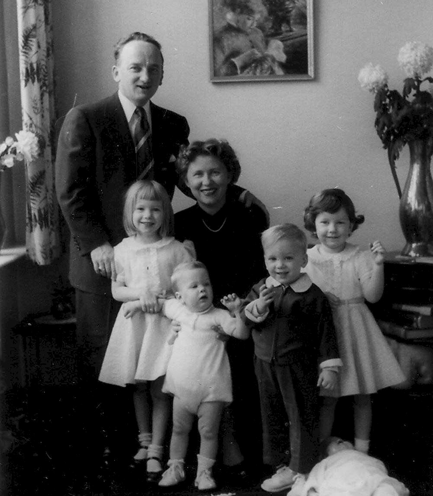
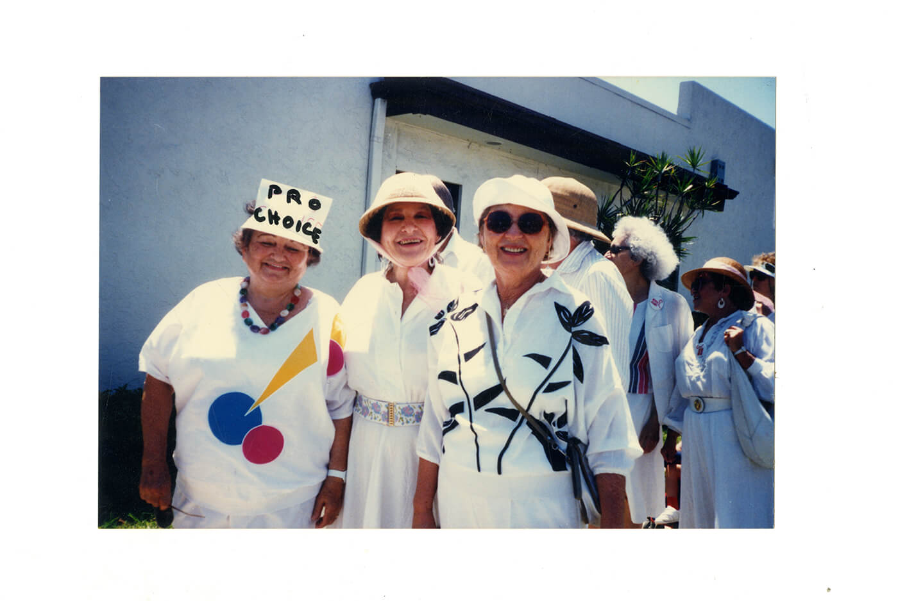
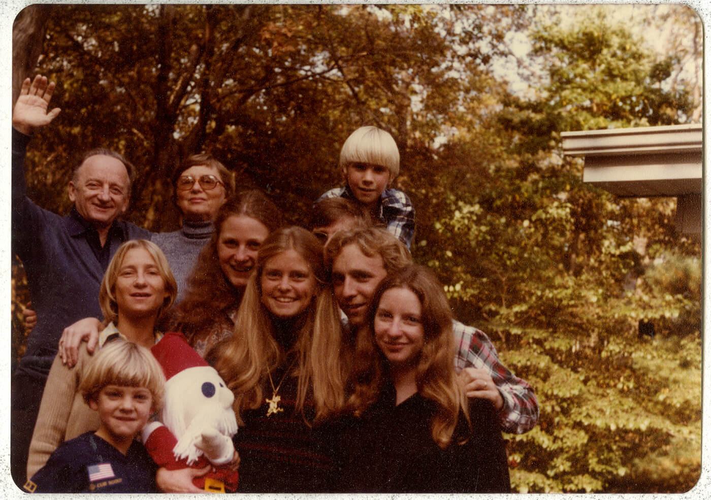

# Introduction

> *Over the past century, Ben has collected stories of family life, national service, legal advocacy, and civic participation.*

My family and friends all called me “Benny.” I was often urged to write down some of the tales I told my children, and others, about different events and adventures that crossed my path. No doubt, some of my experiences and observations have been instructive and even inspirational. Thus, I was finally persuaded to record some “Benny Stories” in the hope that they might offer some entertainment or serve a more useful purpose. My computer became my writing tool. I began to type such tales in the winter of 2003, in the relative tranquility of our small hideaway in Delray Beach, Florida, to which my wife, Gertrude, escapes from the cold winters of our home in New Rochelle, New York. It soon had dozens of such haphazard musings and rambling. I concluded that I should continue writing and arrange the stories in some logical or chronological sequence. My hope is that some of the tales might be uplifting and encourage others to support goals to which my wife and I have dedicated much of our lives.

From the depths of poverty, I managed to get a good education that led to an exciting legal career as well as comic and tragic experiences as a soldier in World War II. I married my childhood sweetheart, we had four children who brought us joy as well as grief. We tried to make it a more humane and peaceful world without Holocausts or aggressive wars. We went from "rags to riches" and lived to a ripe old age. I did what I had to do for reasons I never fully understood and for which I deserve no credit. My good wife always aided my efforts as an eager partner and more. There you have my autobiography in a nutshell.

```{=latex}
\let\oldchapter\chapter
\let\oldsection\section
\renewcommand{\chapter}[1]{\part{#1}}
\renewcommand{\section}[1]{\oldchapter{#1}}
\renewcommand{\subsection}[1]{\oldsection{#1}}
```

# 1920 - 1943

#### From Hell's Kitchen To Harvard {-}

Here you will find a brief extract of some events that may have shaped my life from the time I was born in a little village in Transylvania to my early years in New York. After my parents divorced when I was six, I became a lonely adolescent. For my antics, I was threatened with expulsion from a special high school for “gifted boys.” I managed to earn a diploma from City College and gain admittance and a scholarship to Harvard Law School, where my legal mind was shaped, and I began to see the world in a new light.

## Starting Life in America

It was only by chance, after I had passed my eighty-fourth birthday, that I became aware that I had entered the United States under false pretenses. The records of the immigration authorities on Ellis Island showed that I came into the country from the town of Ciolt, in Romania, on January 29, 1921 as a 4-month-old single female by the name of Bela. The truth is that I am, and always have been, a male. I was at least two-and-a-half-times older than the record stated, and no one has ever called me Bela, although my Jewish name was Berrel. The indication that I was unmarried at that time is probably accurate. I doubt whether even the Immigration and Naturalization Service would treat the errors on the ship’s manifest as valid cause for deportation. I shall always be grateful for the generous immigration policies of the United States at that time.

I was accompanied on the midwinter voyage from Europe by my 27-year old father, my 24-year-old mother, and my three-year-old sister named Pepi, although she was called Perril. We had both been born in the same little peasant cottage in Transylvania. When she was born, Transylvania, inhabited largely by Jews and Gypsies, was part of Hungary. After World War I, parts of Transylvania were ceded to Romania, a country that gained fame as the home of the mythical vampire Count Dracula. Romania was also noted for its persecution of the Jews. Hungary enjoyed a similar reputation. Whether it was called Hungary or Romania, it was a good idea for Jews and Gypsies to leave. The only reason we traveled in third-class steerage across the cold Atlantic in January was that there was no fourth-class. I am told that I kept howling with hunger, cold, or colic all of the time. The oldest of my mother’s five brothers came with us. His name was Leppold, but Americans called him Leopold. He often reminded me in later years that he had saved my life when he stopped my father, who became enraged by my incessant crying, from throwing me overboard. Frankly, I did not recall the event, but I was always grateful nevertheless to my Uncle Leppold, whatever he was called.

Please allow me to set the stage and take you back to my first memories, as faded or jaded as they may be, of my earliest childhood days in this golden land of promise. The Hebrew Immigrant Aid Society (HIAS) provided shelter for my family when we came off the boat. There were some days or weeks sharing crowded space with poor relatives while my father searched in vain for paid employment. For reasons still unknown, my father bore the same name as the Austro-Hungarian Emperor Ferencz Josef. Ferencz is usually a first name, equivalent to Franz, Frank or Francis, but we seemed to be backward people, at least in name. As far as I know, my father was not of royal blood. He was only a one-eyed Jewish shoemaker who couldn’t possibly find a job in America in the vocation to which he was apprenticed.

Despite having lost an eye as a youth, and very limited schooling, he boasted that he could make a pair of boots from a single piece of cowhide. He had lugged his heavy anvils, hammers, and shoemaking tools all the way from his little village to New York City. No one had told him that there weren’t many cows in New York City, and even fewer customers for boots hand-made by a Transylvanian cobbler. He soon learned, to his surprise and sorrow, that Americans wore shoes made by machines he couldn’t operate. At 26 years of age, he had a 23-year old wife and two small children to support. Unable to speak English, barely literate, homeless and penniless, he was happy when a Jewish landlord offered him a job as a janitor tending three apartment houses in the New York district known as Hell’s Kitchen. It was, as I later learned, the highest density crime area in the nation at the time. We were given permission to live in the subterranean cellar. We were happy to have found our new home in the promised land. That’s where my memory of the world begins.

I was about three years old when my mind came out of its cocoon. I recall the our apartment had been partitioned off from the rest of the cellar. Its wood-burning stove was near the large and deep sink that served as a basin for washing mops, clothes, and children. The gas lights had to be lit with a match. There were niches that served as bedrooms for parents, kids, or paying guests (known as boarders). The room that had the two windows facing the alley that led up to the street served as both kitchen and dining room. Hungarian immigrants often came for a home-style meal prepared by my mother for a modest price. A new portable zinc tub could be filled with pails of hot water where adults could take their weekly baths. Other parts of the cellar were frequently occupied by alcoholics or pungent vagrants who came in out of the cold to sleep on beds made of old newspapers taken from a stack by the stone wall. My mother, who normally spoke to me in Yiddish when she was not scolding me in Romanian or Hungarian, regularly warned me to stay away from “the bums.” I learned that “live and let live” was the best policy.

The basement at 346 West 56th Street became my preschool kindergarten. It was there that I learned to muse about life and death, the spirit of free enterprise, business ethics, the perils of gambling and alcoholism, the advantages of law over crime, and similar subjects taught primarily in the school of hard knocks.

Let me begin with what may be my first and perhaps my most profound observation. What can a little child know about life and death? Put yourself into the shoes—or better still the improvised bunk—of a skinny little blonde-haired boy who began to ponder the questions left unanswered by ancient sages. At the foot of my bed, which was regularly shared by my sister or visitors, there was a shelf that framed the opening into the kitchen through which some light and air could pass into the “bedroom.” It was on that shelf that the “Yourtzeit” (literally, Yiddish for “time of year”) glasses were placed. In orthodox Jewish tradition, the memory of deceased loved ones is celebrated by lighting a candle on certain anniversary dates that are recalled on a special calendar. Each candle was set in a glass filled with paraffin that would burn for many hours. They were readily available and no respectable Jewish home would be without them. After the candles were consumed, the memorial vessel became the common drinking glass on Jewish tables.

In response to my incessant inquiries, my mother explained the significance of the fire that flickered in that odd-shaped glass placed on a shelf at the foot of my bed. She told me that it reflected the soul of a dear departed, and it was a way of remembering and communicating with that loved one. I understood what she said but I wasn’t quite convinced. I watched the flames very carefully but I never detected any souls or spirits. The only movement was the flame and some drifting smoke. What was particularly striking was the fact that very often, when it seemed that the fire was about to go out, it would ignite again with a bright flare and continue burning. That might happen several times before the flame finally disappeared in swirling black smoke and then was gone forever. I concluded that the flickering candle was a true reflection of real life. When it looks like there is no hope and the end is near, there may still be life left and it can keep on burning for a while longer. I learned never to blow out the candle of life before its time has come.

## An Enterprising Young Man

My mind has some difficulty distinguishing the timing of events that occurred between the carefree age of three, and the age of six when my parents divorced. From all reports, I was a very tiny but very active child who would never sit still. I think I cried in a Hungarian accent. My mother would place my sister and I out for an airing at the head of the dozen iron steps that led up from our basement apartment. My sister, now called “Pearl,” was an orderly child who would stay put. I would immediately dash off and disappear, much to my sister’s consternation and frustration since she, being eighteen months older than I, was expected to serve as my guardian. Like a stray cat or a puppy, I invariably returned home, usually looking somewhat disheveled or slightly filthy, after having scooted off on some adventurous tour of the forbidden neighborhood.

To keep me out of mischief I was assigned various chores that I could do in the cellar. One of the more significant ones was to help my father collect the garbage. I guess I was perhaps four, or maybe even five, before I qualified for that responsibility. In every kitchen in every apartment there was a small closet-like door that opened onto a shaft that contained the dumbwaiter. At least once a day, the janitor was required to “take the garbage.” A lift, hand-operated via a rope pulley in the basement, was hauled up, and each tenant would deposit trash on the dumbwaiter shelf. There was no refrigeration in those days and you could always smell when the garbage was being collected. The janitor would unload the garbage into a large metal can that he would then carry up the steps to the sidewalk for collection by the city’s garbage collectors. I was occasionally allowed to help my father pull on the ropes. You could say that I was sort of the Assistant Janitor. My first foray into the ranks of a titled, but unpaid, employee was not as much fun as one might think. My father wore gloves but I had none. The twisted fibers were coarse and prickly and hurt my tender hands. As my father kept pushing me out of the way, I didn’t much like the assignment.

In due course, I persuaded my boss to promote me to a more respectable position. I would receive whatever newspapers or bottles were unloaded and arrange them neatly for later recycling. Although I was too young to read, I soon learned that some of the empty milk bottles had an embossed number blown into the glass. If such bottles were returned to the grocer he would give me two cents, and in some cases even three cents, for the empty bottle. Eureka! That is how I started to make my fortune. I became an independent entrepreneur in the environmental conservation business! It was not long after that I decided to expand my operations.

I had noticed in my sojourns around the block that there were a number of boys peddling newspapers on Eighth Avenue. They carried a pile of papers under their arms and shouted “Extra, Extra! Get your papers!” Many of the men hurrying home from work would grab a copy of the Daily News and stick some money into the hands of the screaming vendors. It didn’t look difficult to me so I decided to embark on a career as a newsboy. I had an ample supply of papers I had dutifully assembled in the cellar. I put a batch together neatly, paraded up to the avenue and began to holler, “Getcher papers!” Business was proceeding briskly as pennies kept popping into my hand like manna from heaven. With all profit and no taxes, it might have been a great enterprise but, unfortunately, it didn’t last very long. One fine gentleman glanced at his new purchase and discovered that it wasn’t new at all. With an apologetic smile, I gave him a full two-cents refund. He then gently escorted me back home. Papa gave me a dirty look, promised to chastise me, and took all my dough. That was the end of what could have been a very lucrative career. I learned that not every business venture is bound to succeed—especially if you don’t play by the rules.

More gainful opportunities arose one day when a young artist stopped by the house to speak to my mother. He was looking for a small girl to model for a Christmas drawing he was preparing for the cover of a popular magazine. My long blond hair had been cut by my Mom in the usual flowerpot style. I auditioned wearing my sister’s blouse. I was offered the job. The studio was not far away. I recall posing while holding a large peppermint candy cane. For my efforts I was paid two-dollars and fifty cents in nickels and dimes which I proudly presented to my dear managing agent. Of course my mother also wanted a copy of the picture. I found my way back to the studio and was assured that as soon as the painting was published I would get a reprint; I was invited to return another day. I was glad to visit since I always received some candies. Pretty models in the studio would gush that I was “so cute.” They would further reward me with hugs and kisses. Although I was never offered either a reproduction or additional pay, I must admit that the fringe benefits of my temporary employment were rather gratifying. Money isn’t everything.

A great deal can be accomplished without high financing. Goodwill can be very rewarding. Take, for example, my connection with Tony the shoeshine man. He had a little booth sandwiched between two tall buildings on 56th Street. He was within the bounds of my permissible sojourns, since a visit to his shoeshine parlor did not require me to cross a street. If, in circling the block, I noticed that both of his high customer chairs were empty and he seemed to be lonely, I would stop to bid him good morning. We could chat until a customer arrived. He was learning English interspersed with Yiddish and I was learning to speak with an Italian accent. I may have reminded him of his family back in Italy. I’m sure he welcomed my visits since he always gave me a Tootsie Roll from a box of candies he had on display. Each “Tootsie” cost only a penny, but that usually exceeded my available cash, and so I accepted the chewy chocolate as a gesture of friendship from one immigrant to another.

If, due to circumstances beyond my control, I had been away from home longer than expected, I knew that my mother would be worried and angry with me when I returned. I would make an extra stop at Tony’s to wish him good day and explain my troubles to him. I told him quite honestly how I needed a Tootsie Roll to appease my Mom. When I got back to our basement late, I would be greeted by scowls and shouts in Yiddish or other languages demanding to know where I had been. I replied innocently that I was sorry I was delayed, but I had been busy consoling Tony who missed his family. I would then present my Tootsie Roll with a sweet declaration, “Look what I brought you.” I was very close to my mother’s heart, but throughout the rest of her life, whenever I tried to sweet-talk her, she would say, “Here comes Benny with his Tootsie Roll.” Nevertheless, a kind word turneth away wrath. No cash required.

One of the tenants in our house was an old medical doctor who had lost his sight. He would sit on the stoop for long hours and I would sit with him to keep him company. Occasionally, I would even take him for a walk around the block while he rested his hand on my shoulder and I served as his eyes. We were not of the same generation. He was a very old man and I was a very young child, yet somehow a bond developed between us. Many years later, after he died, I learned that he had named me in his will as the recipient of all of his books, including his old medical texts. They had no real value but I guess he had nothing else to give. Perhaps he thought I would become a doctor. Although I derived no real benefit from his last testament, I have never forgotten his kindness.

## Education on the Sidewalks of New York

Hell’s Kitchen, where I lived before I reached seven years of age, was not a very friendly place. The residents were mainly Irish and Italians who had settled in New York to avoid starvation in their beloved home countries. All the policemen, firemen, and motormen who drove the trolleys or elevated trains were Irish. As far as I could tell, Italians dug ditches or sold vegetables. The numerous offspring of these immigrants seemed primarily intent on beating each other up. I tagged along and got on well with all of them. I was adopted as a mascot by both sides. When they were not fighting gang wars in defense of their neighborhoods, they were busy pilfering. Potatoes roasted on the sidewalk only tasted good if the “Mickeys” were first snitched from a fruit store. Other harmless sidewalk sports included various forms of gambling. I learned about shooting craps from the ground up.

In those days there were no such diversions as television, video games, or cell phones to entertain kids. Adolescents would hang out on the stoops or sidewalks and look for trouble. If they were seen kneeling on the pavement, it was not in prayer—they were tossing dice. The stakes were usually a penny, but occasionally some sport would toss in a nickel bet. When engaging in such high finance, it was prudent to have a sentry posted to protect the players from predators or the police. That’s where I came in. I never gambled. Rather than relying on the toss of the dice, I preferred a sure thing. I served as the lookout man. I stood near the corner and if I saw a cop coming I would have to shout “Cheezit, the cops!” Whereupon, the kneeling gang would jump up and run like hell. The Irish cop would chase after them cursing and swinging his nightstick before returning to pick up the pot for himself. By that time, of course, I had quietly pocketed whatever pennies had been hastily abandoned. All the arm of the law could get from me was an angelic smile. First come first served.

It was a time when the manufacture, sale, or consumption of alcoholic beverages was against the law, but prohibition was rarely observed. My father, known as “Joe the Janitor,” did a little bootlegging on the side. He liked a little nip now and then and he had a certain talent for improvising to meet emergency situations. It was legally permissible to use alcohol for medical or religious purposes. Although he would hardly be mistaken for a medical professional, my father could pass as a fairly pious man. He would take me with him to early morning services in the back room of a nearby store that also served as a synagogue. I could not understand any of the lamentations in Hebrew and I thought the whole thing was quite boring. The concluding service on the Sabbath required that a braided candle be doused with alcohol; obviously, one could not practice the faith without a little booze near the pulpit.

I don’t know where he learned it, but my father was able to convert a mash of boiling potatoes into a plain fiery liquid that dripped from the copper distillery hidden in our basement. I am not suggesting that my Pop was going into competition with Al Capone, but his modest production served a useful and friendly service to the community. The Irish cops who patrolled the beat on foot would often feel weary and stop by for a little refreshment. Some even took along a flask of the whiskey to remind them of home. The honest ones would leave a dollar or two on the table. I always appreciated honest policemen. Because the shiny copper boiler had to be concealed and my father had admonished me not to talk about it, I sensed that something fishy was going on. I can guess that it was my inherent respect for law and order, and for freedom of speech, that prompted me to start speaking openly about my father’s new vocation and friendship with the police. In what may have been my first victory over organized crime, the distillery in our home soon disappeared. I can guess that my Pop sometimes regretted that he hadn’t thrown me overboard.

I was made aware of the evils of drink by various experiences as a very young child. I recall the day that my father confronted a drunk who had been throwing bricks from the roof. In his official capacity as Janitor-in-charge, my Dad ordered him to desist. In defiance, the offender took off his jacket, rolled up his sleeves and, in his best brogue and a stance reminiscent of boxing champion John L. Sullivan, challenged my old man to a fight. Rumanians are not noted for their valor. It is rumored that Rumanian soldiers wore uniforms only on their backs since that’s all the enemy ever saw. My father was no hero and had never heard of the Marquis of Queensbury Rules. When the drunk jabbed with his left, my father pulled the heavy cover off a nearby garbage can and held it up like the shield of a Roman gladiator. After another punch was thrown, the battle was on. My father smashed his opponent squarely in the face with the smelly shield and kept pounding away at the fallen villain’s head as he lay moaning on the ground until rescued by the cop on the beat. I’m sure my father never felt bound by the biblical mandate “an eye for an eye,” but he knew that if attacked you must defend yourself—particularly if there is a garbage cover handy.

Another educational experience involving liquor occurred when I was perhaps 4 years old. It was Passover, a time of celebration when families reunite to remember the escape of the Jews from slavery in Egypt. The prayer ritual requires repeated sips of wine. The kosher purple grape juice was sufficiently fermented and sweet to make it very palatable and I did my religious duty with gusto and glee. I was soon feeling quite happy and even more talkative than usual—much to the amusement of all present. They kept pouring more wine and I kept drinking it. Soon, I was what experts call “drunk as a skunk.” I recall vividly how the room kept spinning round and round while I got sicker and sicker. That was the first time in my life that I ever became inebriated. It was also the last. I had learned the value of moderation in all things.

My sister and I were never left in the care of baby-sitters who expected to be paid. Instead, we were deposited in the nearby movie house, the “Chalona,” on Ninth Avenue. Admission cost only a dime, and kids could be taken in by an adult and left there indefinitely. The movies showed cowboys chasing Indians while the piano player in the front row pounded away with music or noise supposed to reflect the action on the silent screen. There was a lot of shooting and fighting and the good guys all wore white hats while the bad guys wore black hats and usually ended up dead. Indians, who never wore hats, didn’t do so well either. The written text was supposed to explain the wild gesticulation of the actors. Of course, I could not read, nor did I know anybody who could. It was quite exciting nevertheless, and I got the gist of what was going on. On one occasion, when I was deposited as usual, I could not be located when my father came to retrieve me. The management regretted that a search of the house would only be possible after the last show. It was close to midnight when all the customers had left, that I was found sound asleep under a seat in one of the front rows. When the screen is filled with killing and violence, a good sleep can be very refreshing.

On one busy and rainy day, my mother told my sister and I to go to the movies by ourselves. I was no more than six and my sister less than eight. We were instructed never to cross over the wide Ninth Avenue, with its horse-drawn wagons and even automobiles, without help from an adult. The standard routine was for me to wait till a gentleman approached and then ask politely, “Mister, please cross me cross.” At the box office we had to wait for another adult to get us into the theater. Along came a teenager who spotted what we were waiting for and offered to buy our tickets for us. He took the quarter that my sister clutched in her hand, went up to the box office, and then, laughing, spurted away into the distance with our money. We both stood there in the rain and started to bawl as though our hearts would break. Soon, an elderly gentleman came along and asked us why we were crying so bitterly. We tried to explain but it was very difficult through our tears. He finally understood what had happened and told us not to worry. He took out a handkerchief to help dry our tears. He then bought two tickets and escorted us into the theater where he found two seats with a good view. We told him that one of our parents would come to collect us and we thanked him politely as he left. A few minutes later, the stranger returned with an ice-cream cone for each of us. Neither my sister nor I ever forgot that kindness. Not everyone is mean and rotten. The world is not such a bad place after all.

## Growing Up Feeling Lost

Things at home were not going well. My father and mother would spend much time just shouting at each other; which rather disturbed my tranquility. My parents were second cousins who had been betrothed by their parents, as was a common custom in the old country. It soon became clear that Hell’s Kitchen would never qualify as a setting for marriages made in heaven. The poverty and hard work didn’t make things easier. My mother had lost two children through miscarriage before my sister and I were born. The anticipated birth of still another baby added to the tensions. When a new little sister joined us in the dank cellar I looked forward to playing with the cute new playmate. The frail newcomer soon fell seriously ill. To relieve the burdens on my mother, my older sister “Pearl” and I were sent away to join our uncle Leppold and his family on their small farm nearby. He had several children about our age and we all had fun together as we enjoyed the fresh country air of Port Jervis. It didn’t last long.

When I arrived back to my home in the basement, I rushed merrily to the dark room in the rear to rejoin my dear little sister. But there was no trace of her. My mother explained gently that the baby had gone to heaven and would never return. I cried and remembered the flickering candles. To console me, a concerned relative bought me a little red tricycle. I was rather excited to steer it around the basement, but I missed the baby, who had died of pneumonia. After a few days, my new bike also disappeared. It was the only bicycle I have ever owned in my life. I often wondered what kind of a person would steal a toy from a grieving child.

On weekends, the family would sometimes walk to Central Park to hear the Goldman Band playing on the mall. We occasionally went to the Yiddish theater on Avenue B to see a drama about the son who left his poor parents in Poland and then married a “Shiksa” in America. The whole audience bawled at the shame of such ungrateful sacrilege. I didn’t understand why it was so terrible to marry someone who wasn’t Jewish but I regretted the pain he caused his parents. I laughed at the comics singing funny songs in Yiddish. We even bought some of the records to play on our new gramophone at home. As the singer’s voice began to slow to a southern drawl it was my duty to start winding up the machine furiously to accelerate him back to a peppy Yiddish ending.

We also visited my mother’s father, who was the only grandparent I ever knew. He was a small man with a long beard and a longer pipe dangling from his lip. He lived in a lower east side tenement that had been improved to provide a flush toilet on each landing. For five cents cash, a public bath was also available about two blocks away on Rivington Street. I was entrusted to give my grandpa a gift of fifty-cents when we left and sometimes we even delighted him with some cigars that cost a nickel a pack. Since my grandpa had no visible means of support, I was entranced by a story he told of how he had earned some money. Apparently, one of his elderly neighbors, fearing that death was approaching, offered to buy some of my Grandpa’s “Mitvahs,” or good deeds. The theory was that good deeds would help the owner, or bearer, gain admittance to heaven. I didn’t quite grasp how the transfer was made and was somewhat skeptical about its validity. Nevertheless, in later years, when called upon for a favor, I kept a record in a “Mitzvah” file and was even tempted to ask for a receipt for every good deed. You never know what will lie in store on the final Day of Reckoning.

One of the regular boarders in our basement apartment who was especially kind to my sister and I was a Hungarian immigrant named Dave Schwartz. He had left Budapest when Jews were excluded from the universities, and instead had found work in New York as an iron worker. He was an intelligent and hardworking man whose English was intelligible—providing you understood Hungarian. On Sundays, he would take us for a ride on a Fifth Avenue bus with an open upper deck from which we could look down on the fancy shops and people. We were allowed to stay on the bus as long as we liked, without paying any extra fare. Mr. Schwartz would even buy us an ice-cream cone for the trip. We liked Mr. Schwartz. So did my mother.

I was about six-and a-half years old when my parents decided to divorce. My parents’ separation after ten years of unholy acrimony was long overdue. They were simply mismatched. It was a friendly parting of the ways. By amicable agreement, custody of the children was given to my mother. She got my sister and I, and that was all. There was no need for a property settlement, as there was no property to divide. The family had to move out of the cellar, new lodging had to be found, both parents had to figure out some way to keep themselves and the children from going hungry, and there had to be a new beginning. If there was such a thing as “Welfare,” my parents never heard of it. Public grants for child-support were nonexistent, and Social Security had not yet been invented. In times of trouble the prevailing guide was, “The Lord helps those who help themselves.” In fact, there was not much choice.

Fortunately, my mother had an older sister who was married to a tailor and they lived in their own house in Brooklyn. “Tante Fani” and “Uncle Sam” Isaac had two older children of their own. Our Mom arranged for her sister to take in both me and Pearl temporarily. About half a year after filing for divorce, my father married a nice Transylvanian woman named Rose Fried, whose acquaintance he had made via an ad in the local Hungarian newspaper. A few weeks thereafter, my mother was wed to a Hungarian man called—you guessed it—Dave Schwartz. And they all lived happily ever after. They all got along fine with each other once the marital bonds were shifted. When the train is not going in the right direction, it is prudent to change course and take another train.

Life in my aunt’s home was bearable because they had a dog, a German shepherd named “Lightening.” I could hitch him to a sled in the wintertime and he would drag me all over the neighborhood in the snow. My Uncle Sam was a pleasant man who was usually smiling and tipsy. My cousin Sidney would deliver lunch to his father at the tailor shop, and I could ride along on the handlebars of his bike. My uncle even allowed me to jump up and down on the pressing machine and watch the steam pour out. Great fun! Sam made a fair living as a tailor, but since his marriage had been prearranged by his parents, he found his happiness in a bottle. Fani had a boarder, who was a Greek named Albert who cleaned felt hats. I liked Albert. Fani did too.

On Sunday, Tante Fani might take me to nearby Coney Island. We would find a spot on the crowded beach, put down a blanket and dash into the pounding sea. As she pranced up and down in the waves with me in her arms, I was convinced that she was trying to drown me. I recall when she left me on the blanket, saying she would soon return. After a few minutes had passed, I concluded that she had abandoned me. I began to search the beach frantically until I was intercepted by a friendly cop who asked if I was lost. I replied, with my usual truthfulness, that it was my aunt who was lost. He took me to the station house and a loudspeaker began to boom, “Tante Fani. Tante Fani. Please come to the station house and pick up your boy.” When we were reunited, the first thing she did was to give me a slap in the face. Some people are really ungrateful.

I guess I spent a year with my gruff Tante Fani in Brooklyn. I never forgot that she took us in when we didn’t have a roof over our heads, and I treated her with respect as long as she lived. My father had tried to enroll me in a public school in Manhattan when I was six years old, but the principal, noting my unusually small size and the fact that I spoke only Yiddish, would not accept me. When I began school in Brooklyn, I still had problems speaking the language, and I couldn’t read. But if I heard a story once, I could repeat it verbatim. I was once apprehended by the teacher “reading” correctly from the wrong page.

As soon as my mother and Dave could save up enough money to rent a room, I could visit them. When they finally saved up enough to pay a month’s rent for an apartment in the Bronx, my sister and I went home to heaven.

My mother remained on good terms with her cousin, my father, and I would visit or live with him on irregular occasions, depending upon availability and convenience of the parties concerned. I got along fine with my stepmother who was a quiet and kindly lady who, in rapid succession, became the mother of two sons. My stepmother’s name was “Rose” and she was called “Itcha,” because it was easier to pronounce than her Hebrew name, “Rivka.” In summation: my mother had two children, my father’s wife had two children, my father had four children, and my mother’s husband had none. Who says life has to be simple?

There is a period of my life between the ages of about seven to about thirteen that are my lost years. I was growing up in the Bronx and shuttling between my father and my mother, and from apartment to apartment when our inability to pay the rent inspired us to move. In 1929, the crash came. The banks were closed. No one could find work. My Mom worked as a dressmaker or hatmaker, and Dave was employed as a toolmaker or a watchman or whatever he could get to make ends meet. My father became a housepainter when he could find such work. It was a time of deep depression in more ways than one. I hated to go to the U.S. Government “home relief” station where surplus food was given away in the form of two-pound loaves of bread and blocks of frozen butter or American cheese. Once they gave away surplus green woolen sweaters. I was too embarrassed to wear one because all the other kids had the same garment and could recognize the source. My mother assigned chores to keep us busy around the house. My domineering sister served as foreman on the job. Slavery would have been easier.

I attended various public schools in the Bronx, never staying long enough to make real friends. I loved to read and always had a public library card that was well used. My schooling was accelerated when teachers thought I could skip some of the lower classes. My size prevented my participation in popular sports such as basketball, football, or even baseball. Besides, my mother didn’t believe that such violent games were a way for a nice Jewish boy to behave. She objected to my joining the Boy Scouts because she thought it was a military organization. My only “buddy” was my stepmother’s nephew Lou Perlman, who was called “Mutchy,” short for “Mortimer,” which he was never called. [END NOTE 1] His mother and my stepmother were sisters and were very attached. The families always lived close to each other. We spent some happy summer weeks together in the Catskill Mountains where families could rent a room and share a kitchen at very modest cost. Air-conditioning was unheard of. People who couldn’t afford to go to the mountains slept on the roof or the fire-escapes to get some cool air. Vacations on the farm were spent entertaining ourselves and tossing horseshoes. There wasn’t much else to do besides killing hoards of mosquitoes. In short, I was, by inclination, as well as necessity, very much a loner. I don’t recall ever having been a normal adolescent.

During the depression years, no one I knew earned enough money to pay for both food and rent. Many landlords offered “concessions” to new tenants who would move into an apartment that had been suddenly and quietly vacated by the prior occupant. The new residents were allowed to live rent free for a few months. That was an amount we could afford. The family, consisting of my mother, my stepfather, now called “Uncle Dave,” my 12-year old sister and I, moved into a nice brick building in a good neighborhood in the Bronx. Of course, there was no elevator in the five story walk-up. The higher the dwelling, the lower the rent. We were given a vacancy near the roof. My mother would have preferred one higher up—she was a strong believer in fresh air.

The parks around our new home on Bainbridge Avenue made a fine playground. When the hills of Van Cortlandt or Mosholu Park were covered with snow, their slopes were great for sledding—if you had a sled. One wintry day, I was having fun sliding down a long hill in my cardboard box. A boy went racing past on his new Flexible Flyer and careened straight into a big rock on which had been painted, in large white letters, “JESUS SAVES.” Well, his life was saved but they had to carry him off in an ambulance. His twisted sled was abandoned. I dragged it home for repairs. I don’t know who saved the injured boy but I do know that Uncle Dave, the ironworker, saved the sled.

I was never a strong believer in the trappings of religion. When, as a child, my father took me to the local “shule” and hired a non Jew to ignite the gas flame, I thought it was a waste of five cents since I could handle the job for less. My stepfather came from Budapest, which was considered an “enlightened” city, and he did not share the orthodoxy of Jews from the East. We couldn’t afford to send me to Hebrew school except for a few weeks to learn to read, but not understand, the prayers needed for my Bar Mitzvah. We never celebrated any birthdays and my coming of age at thirteen was no big deal. I was familiar with the usual accouterments of orthodoxy, such as the “yarmulke,” the prayer shawl, the phylacteries wrapped around arm and head, but they never impressed me as more than ornaments carried forward from some ancient and mystical traditions. Good deeds on earth seemed more important than unintelligible prayers to an invisible Deity. I dutifully composed a customary Bar Mitzvah speech in praise of my parents and teachers. My Hebrew instructor, understandably, was not satisfied with the paucity of the gift he received for his efforts. He made his dissatisfaction plain in the presence of my classmates. Of course, I was very embarrassed. If that was what being a religious Jew meant, I wanted no part of it.

In my early teens, to earn some pocket money, I held a large variety of positions. My usual title was Delivery Boy. I assembled and delivered the Sunday papers from the local candy store. As compensation, I received a cup of hot chocolate or a milkshake when I arrived at about 6 A.M. I was allowed to keep whatever tips I might get. It was a losing business. On cold winter mornings there might be heavy snow on the ground. I would pile the papers on my newly repaired sled and drag it from house to house. Occasionally, the papers might be scattered by a heavy gust of wind. I would desperately reassemble the wet pages and trudge them to apartments that might be five flights up. I always rang the bell, in hopes of receiving a five cents tip. Instead of a nickel, I usually received a gruff command through the locked door, “Leave it on the floor!” I soon looked for another career.

A more interesting opportunity soon presented itself. I became the Assistant Manager in a Chinese laundry store. The owner spoke practically no English, which matched equally my knowledge of Mandarin. He taught me how to use an abacus and how to curse in Chinese. I would inform customers when the laundry would be finished and how much it would cost. Mr. Lee, which might have been his name, scribbled something in Chinese on a small receipt that had two parts with the same number. I would explain to the customer that if he didn’t present his receipt, he would lose his laundry. If they wanted the clean shirts delivered, they had to pay in advance. I would render that important delivery service, and gratuities would be gratefully received. There weren’t too many occasions to be grateful.

To be perfectly frank, I stayed with Mr. Lee because I was sorry for him. He worked very hard for long hours and slept on a small cot in the back room that contained only a deep tub for washing clothes by hand. Several large sacks of rice seemed to be his only source of nourishment. Each Sunday, he would put on his black suit and take the elevated train to Chinatown to exchange news with friends from home. Japan invaded Manchuria in 1931 and China was at war. My friend was worried about the safety of his family and decided to go home. He asked me to accompany him to Woolworth’s “five-and-ten-cents store” to help him buy some gifts for his family in China. He could not resist the call of family and country. I never saw him again. I often thought of how unfortunate it was that such a hard working man could not live in peace and dignity because of conflicts in another part of the world.

## The Hazards of Being Mickey Mouse

My theatrical career began when I was about twelve. The local movie house ran a special promotional event every Saturday morning, when busy mothers would be happy to see their kids out of the house. Some genius decided to establish a Mickey Mouse Club that would meet in the theater and be treated to an array of cartoons in addition to the regular cowboy movie. Each participant would receive a membership pin showing Mickey Mouse and the name “MICK!” written underneath. Girls would receive a “MINNIE” badge. Wearing it prominently on an outer garment would be a symbol of honor. Before the cartoons were shown, the audience was treated to a medley of Mickey Mouse songs or cheers in which the members were all expected to participate. It was not always in tune but it sure was loud!

Probably because of my small size, the theater management selected me to be the “CHIEF MICKEY.” My “CHIEF MINNIE” was rather shy and skinny. I wasn’t crazy about her. I was expected to lead the noisy audience in such stirring cheers as: “Handy Dandy, sweet as candy, happy kids are we! Eeny-icky, Minnie, Mickey, M O U S E!” As compensation, I could come into the movie house free at any time. I could also wear a badge much larger than the one that adorned the other kids, and mine would say “CHIEF!” The rule was that when Mickey Mice would meet, they would salute each other with the greeting, “Hi Mick” or “Hi Chief!” Furthermore, all participants received a membership card on which a stamp was placed for every attendance. When ten stamps were reached, each lucky participant would be entitled to a free drawing to win a beautiful new bicycle. Who could ask for anything more? “Hi Chief!” resonated in every yard and hallway. I became the most popular kid on the cement campus of Public School Number 80 in the Bronx.

The Mickey Mouse Club was a joy for all concerned. Mothers got rid of their kids for awhile and the little darlings were being safely entertained. Hollywood heroes like Tom Mix and Ken Maynard raced around on horses chasing villains who always got shot or beat up in a saloon full of dirty drunks. Cowboys with white skin went out, in self-defense, to kill all the redskin savages. For nine weeks of such stirring and educational Saturday matinees I was an honored celebrity. Before the tenth week was reached, however, tragedy struck. The company that owned the theater was trapped between two rival unions, both run by gangsters. The theater was shut down. The tickets for the prize were worthless. As every celebrity knows, fame is fleeting and hazardous. I was held accountable by all the Mickey Mice. Instead of the usual friendly greeting from my faithful followers in the club, I heard nothing from the Rats but complaints, outrage, and scorn. Instead of appreciation and the usual clap on the back, all I got was a whack on the head.

## The Happy Man Moves On

It was probably my notoriety as Chief Mickey Mouse that procured for me an invitation to become a member of the Dramatic Club in Public School 80. The teacher in charge recruited me when I was in the seventh grade. She explained that I would have a part in a play that the club would produce. Membership dues would be fifty-cents per week to pay for the costumes. I was assigned a minor role and told to show up for the initial rehearsal the following week.

When I appeared, as scheduled, I remembered the part but I forgot the dues. My mother convinced me that since she could make my costume herself, I did not have to make the payment. The first rehearsal went so well that I saw no need for me to repeat it. When I showed up again, in time for the final performance, I was unceremoniously canned. In no uncertain terms, the irate instructor made plain that my presence as a member of the club was no longer desired. Not only was I delinquent in behavior and attendance but also in the payment of dues. I was out! My unsolicited career as a Thespian came to an abrupt halt. Since I had memorized my part perfectly, and did not yet appreciate the need for cooperative practice by the entire company. I felt that an injustice had been done.

When I was promoted into the eighth grade, another teacher gave me a second chance in the limelight. I was invited to star in the graduation play. No dues were required. The theme of the play was that a powerful but grumpy king always complained about his troubles and his aches and pains. The Crown’s doctors concluded that the only remedy for the ailing sovereign was to wear the shirt of a happy man. His couriers scoured the kingdom but every one they questioned had some sad tale to tell as a reason for his discontent. The searchers were desperate, fearing the wrath of the King if they returned empty-handed. By chance, while wandering over a meadow, the King’s guards heard the merry lilting tones of a flute being played by a young shepherd. When asked if he was happy, the boy looked puzzled by the question, but responded merrily that he found joy in every day. “Quick,” said the King’s man, “you must give us your shirt to save the life of our sovereign.” “But,” replied the flustered and hesitant youth, “I do not have a shirt to my back.” Whereupon, with a flourish, he opened his sheepskin coat and revealed a naked body covered only by a small pair of my black swimming trunks. Of course, I was the merry shepherd. When the apprehensive messengers reported to the King that the only happy person they could find in the kingdom did not even own a shirt, the monarch roared with laughter. He was cured forever. The audience applauded gleefully and I gained lasting fame as “The Happy Man.” I have tried to live up to the role ever since.

Another story during my years at P.S. 80 surely altered the course of my life. My eighth grade teacher was a kindly Irish lady named Mrs. Connelly. She cared about all of her students as though they were her own children. One day, she asked me to bring my parents to school to meet with the Principal. I feared the worst. When I explained that my father was no longer available, we settled on an appearance by my mother. At the appointed hour, my messy hair was combed, my dirty shoes were shined and, hand in hand, my mother and I appeared to meet the Principal and the teacher of my graduating class. They said, slowly and carefully, that they wanted to talk to my mother about the future of her only son. It sounded ominous.

They explained that I was an unusual child—a fact my mother, as well as some of my victims, already suspected. I guess she also expected a lesson on how to discipline unruly children. Much to our pleasant surprise, these splendid teachers wanted to talk to her about sending me to a special school; not for juvenile delinquents, but for “gifted boys.” We didn’t know what a “gifted boy” was, since I was not in the habit of receiving gifts. The terminology came from the official program of a unique educational institution. “Townsend Harris Preparatory School, Preparatory for the College of the City of New York” was the only school of its kind in the country. It offered an accelerated curriculum that, if passed successfully, would ensure automatic admittance to the College of the City of New York. There would be no tuition charges. No one in my parents’ family had ever gone to college. Everyone we knew went to work as soon as they could find a job. To finish high school was regarded as the highest possible academic achievement for immigrants like us. Now my mother was being told that her little boy might go to college and it would cost nothing, which was about all we could afford. Only in America! I have been a grateful patriot ever since.

My mother expressed appreciation and said that she would have to leave it to the teachers to decide what school I should attend. It was a moving meeting. It also meant that we would have to move—again. Townsend Harris High was located on 23rd Street in Manhattan in the building that housed the Business School of City College. If we stayed in the Bronx, I would have to travel alone on the Third Avenue El train for almost an hour to get to school every day. The teachers there were college professors, and the courses were geared to college students. It was expected that the studies would be completed in three years instead of the usual four. How or why I was selected, I do not know. A new door opened new opportunities. The challenge could not be turned down. The family began to look for new lodgings.

129 East 64th Street in Manhattan was a good address in a good neighborhood, and I could get to Townsend Harris by a short bus ride down Lexington Avenue. Of course, we couldn’t afford to live there. My determined and creative mother somehow managed to lease the small brownstone townhouse and rent the ten furnished rooms within as sublets. We lived on the ground floor, in what had been a kitchen, rented out the other rooms, kept the house clean, and in essence carried on the noble traditions of janitoring we had learned in Hell’s Kitchen. Uncle Dave tended the furnace and did repairs when he came home from his job as an ironworker. I was experienced as an Assistant Janitor, and was now on my way to becoming something more.

## No High School Diploma for Me

The first and must important thing I learned at Townsend Harris High School was that if I wanted to pass my courses I had to study. I never knew that before, so it came as a complete surprise when I promptly flunked Algebra and French. Eventually, I passed those, and also geometry, calculus, and advanced trigonometry. If, as they said, the study of mathematics was good for the brain, I never noticed it. To this day, I do not know what a logarithm is, and frankly, I don’t care. I only became interested in French when I reached fourteen and fell in love with Danielle Darrieux. She was an Ingrid-Bergman-type movie star whose films were shown “in living sound” in a nearby arts theater. While listening to her mellifluous French voice, I kept one eye glued on her and one on the large English subtitles. I left the theater looking a bit cockeyed but it was better than hearing my French professor’s incomprehensible explanation of how he had fought the battle of the Marne. Despite my slow linguistic start, during my own later war years, in Normandy, I was a valued interpreter. After the war, I even translated for Rene Cassin, the French Nobel Prize author of the Universal Declaration of Human Rights, when he visited the United States. My high school professors deserve some praise for my ability to speak almost like a Parisian. But frankly, most of the credit belongs to Danielle.

As I was busy studying and working, I didn’t have much time or inclination for romance. I met my buddy Lou regularly and we had long walks and talks together. ”Goils,” as they were called in my neighborhood, were not in our repertoire. A new Hungarian in town moved in with Lou’s family. Gizi, whose name was Americanized as Gertrude, and pronounced Goity, did not impress me. “She sure looks like a greenhorn!” Her reaction to me was, “A silly kid!” Hardly enough to distract me from my studies.

Going to Townsend Harris presented more than a scholastic challenge. There was a nice cafeteria in the building, but it did me little good since I had no money to buy lunch. I devised a method to overcome the financial handicap. I set myself up in business as a promoter of a game of chance that might earn my sustenance. For an investment of ten cents I could buy a punch card that had 100 holes. Each hole contained a slip of rolled-up paper that contained a prediction of things to come - usually favorable. It also indicated whether you were the lucky winner of cash. Winnings could range from one to ten cents. The total of the lucky punches amounted to ninety cents. Using my newly discovered knowledge of calculus, I figured out that by hawking “A penny a punch!” in the locker room, I could collect a maximum of one dollar—which would only allow me to break even. Without a profit I would still go hungry. Recalling that necessity is the mother of invention, and that starvation is unhealthy, I used my creative imagination to solve the problem in ways that would have made my Hell’s Kitchen gang proud.

If I carefully sliced off the top layer of the punchboard, I could remove some of the wining numbers before pasting the top back again. All I needed was a fifteen cent surplus that would buy a hamburger and some mashed potatoes for lunch. Even if I removed some of the “winners,” that would still leave my eager customers with the excitement of the game and the paper prediction of good fortune as consolation for not picking one of the larger prizes. After all, the buyer was only risking a penny and all profits went to feed the poor. As in many borderline business ventures, and as I should have learned as a childhood vendor of old newspapers, there may be unanticipated consequences. The building custodian, noting the slips of paper dropped all over the floor, turned me in. I was summoned to the office of the Dean, a bully named Dr. Chastney. I guess he was respected as a strict disciplinarian. Quivering before him, I was immediately accosted with a fierce demand, “Don’t say a word! I want your father here tomorrow morning! One more word out of you and you’re expelled!” I hadn’t said anything. I didn’t dare mention that I hadn’t seen my father for about a year. I ran for a phone.

I managed to reach my father and begged him to come to the rescue. The last time I had been to school with him they wouldn’t admit me to kindergarten. I explained that I was in danger of being expelled. “What means expelled?” he asked. I explained that it was sort of like being shot. “For what?” I answered that I was only trying to earn my lunch money. “For this they want to shoot you?” Anyway, he came. Dr. Chastney began to work him over in an uninterrupted tirade: he was not running a school for gamblers and crooks! Gambling was illegal! Fathers should train their children to obey the law! He would give me one last chance! God bless America! My bewildered Dad, on my advice, listened quietly and simply nodded. He wondered what the burly man was raving about. We were dismissed by the Dean with the repeated sharp warning that this was my last chance! My father never understood what all the fuss and fuming was about. In times of adversity, people might do things they would later be ashamed of. That was not so clear to me when I was 14 but I concluded nonetheless that it would be prudent to retire from the gaming business and seek my fortune via more lawful pursuits.

Fame can come in unexpected ways. Since only males were admitted as students to Townsend Harris, all users of the High School pool were required to swim in the nude. We also had to pass a Red Cross lifesaving test. I had no problem until the instructor came to test my floating skills. I had to prove that I could float motionless for one minute. I knew I couldn’t do it. When I explained my disability, the instructor assured me that the human body was naturally buoyant and he would prove it. If I would clasp my knees to my chest and roll over face down into the water I would float like a cork. I did as I was told. As I had warned, I sank slowly to the bottom, head first. It was as though I had rocks in my head—an observation I had often heard. The lifeguard signaled me frantically to come up from the deep. He confessed that never before had he encountered such a phenomenon. He was, nevertheless, a man after my own heart. He found a way to turn adversity into opportunity.

He asked me if I liked bananas. Upon receiving a positive response, he explained that we were going to put on a water show at the end of the term and that I could play an unforgettable role. All I had to do was jump into the pool waving a banana, then sink to the bottom, as I had just demonstrated, and there peel the banana, stuff it into my mouth, blow out the chlorinated water, swallow the banana and rise to the surface flaunting the empty banana peel while wearing only a happy smile. At the gala, I performed the impossible stunt and earned the plaudits of the amazed crowd. The impact of my unusual feat was brought home to me about 20 years later as I was having lunch in a little bistro in Paris. A man of about my age, sitting at the other side of the cafe, came up to me and inquired cautiously, “Is your name Benny?” When I answered in the affirmative, he slapped me on the back, saying, “The last time I saw you, you were stark naked, under eight feet of water, eating a banana.” It’s amazing what can make a man memorable.

In addition to spending time in the pool, I spent much time in the gymnasium—almost leading to my downfall. I was an excellent tumbler and could shinny up a rope faster than a monkey. For my stunts on the rings I was known as “The man on the flying trapeze.” Weighing not much more than 100 pounds, I was also much sought after to be top man on the human pyramid. But that wasn’t good enough for Dr. Chastney. Once again, I was summoned to the Dean’s office. He had not forgotten me. He informed me that I had not been attending my gym classes. I explained that my gym classes were scheduled during the only time I had for lunch. I made up for my absences by going to the gym at other times. I assured him that the teachers would all confirm my regular attendance. The bureaucrat Chastney gave me an ultimatum: either I attended the scheduled classes, or I would not graduate and not be allowed to enter City College. And that was that! I didn’t like ultimatums, and I didn’t like bureaucrats. In fact, I didn’t like Chastney either. The wrath of Ferencz was upon him!

The next day, I went up to the City College main campus and asked to speak to the Dean in charge of admissions. I was greeted by a jolly Irishman who asked me my name. “Ferencz,” I replied. “Well, Terrence m’boy” he said, putting his arm around my shoulder, “what can I do for you?” I asked whether I could be admitted from Townsend Harris without having passed gym. “Why, of course, we would admit you Terrence m’boy. We’d be glad to have you.” I thanked him profusely and scooted away before he could discover that my name was Benny and I wasn’t Irish. Then I headed back downtown to confront my Nemesis on 23rd Street. “Sir,” I said, “I have just come from City College and they will admit me without having passed gym. You lied to me!” He turned red, gripped his teeth and snapped, “You’ll get no diploma from this school!” And so it came to pass that I never formally graduated from Townsend Harris. I learned that if you meet an insurmountable obstacle, with a little determination, and justice on your side, you can find ways to walk around it. I was off to City College and later to the greatest law school in the world without ever having received a High School diploma.

## Life at City College and the Beginning of Romance

The College of the City of New York was another unique institution. It charged no tuition. Only academically qualified males who met strict standards could be enrolled. There was no such thing as “open admissions.” Fortunately for me, graduates of Townsend Harris High were automatically accepted—even without a diploma. Many CCNY students came from immigrant homes. They were rough and tough and anything but genteel. For them, college was an opportunity to share the American dream; it was not a place for fun and games. “City” had no football team. Many of its Professors were world renowned. Professor Morris Raphael Cohen was a very distinguished philosopher who challenged conventional wisdom in a Yiddish accent. With the diversity and poverty of its students, City College was known as “the poor man’s Harvard.”

To accommodate my enrollment, of course, our family had to move again. City College, past Harlem Heights, was practically inaccessible from East 64th Street. I was glad to be gone from that so-called fashionable neighborhood. Too many of our tenants in the converted townhouse struck me as pretenders. There was the man who bought twelve pairs of handmade shoes and skipped without paying the bill of the tearful shoemaker who came looking for him. Wouldn’t one pair have been enough? Of course, he didn’t pay his rent either. Another charlatan proudly displayed medals he had in fact ordered for himself. A “lady,” for whom I had built a bookcase, paid me with a two-cent coin she claimed was a valuable family heirloom. My family never feigned to be upper crust and would never have tried to deceive or mistreat others as did some of the “elegant people” who lived near Park Avenue. I was happy when we moved back to the Bronx where there were fewer pretentious people. I could board a streetcar from our new apartment that would take me close to City College. If I missed the trolley, I could run all the way, lugging my books on my back, and still reach my first class almost on time.

After school, I was required to do chores at home under the glaring eye of my older sister Pearl, the manager. I have forgotten the details, but on one occasion she commanded me to do something that I thought was unreasonable and not in my job description. I refused. Venting her ire by slapping or scratching me was getting to be hazardous to her health so she refrained from her usual response and simply complained vociferously to higher authority. She phoned my mother, who was working as a seamstress nearby, and screamed about my transgressions. My mother got me on the phone and said that since my sister was older, I had to obey her and apologize. If I refused, I had to leave the house. I was never one to be intimidated. I packed a small bag, deposited my house key on the kitchen table and departed.

It is always a good rule not to jump off the diving board unless you know there is water in the pool. I knew that my father was legally responsible for the maintenance of his minor children, so I moved in on Pop. I also knew that financial maintenance was beyond his means. It was summertime, there was no school and I had no difficulty in finding gainful employment. I was accustomed to odd jobs, but some were odder than others. One of the neighbors was a paper-hanger with an ugly daughter my age. Her father promptly hired me as his assistant. While at work, he introduced me to his vaunted lovely girl. I preferred to look at the wallpaper in the bathroom. I began to look for other sources of employment.

On the very day that I had left home, my mother appeared at the door as we were finishing dinner in my father’s apartment. She wanted words with me. “Uncle Dave” had been shocked to discover, when he returned from work, that I had departed and turned in my key. It called for an explanation. I always treated my mother with respect and we discussed the situation in quiet detail. I refused to apologize to my sister for not obeying her unreasonable demands. We were at an impasse. I said I would have to think about it. I also began to think about other things. Gertie—referred to theretofore as the “Greener Cousina”—was visiting her aunt, my stepmother, and could not help overhearing the conversation. She was apparently touched by my gentle and persuasive reasoning. I may thereby have won my most important case. It was not too long thereafter that I was impressed by her language skills and knowledge and her determination to go to night school to complete her education. The “Green” began to take on a rosy glow. In fact, I began to notice that she was very pretty. I was in no rush to return to my sister’s domination. I stayed with Pop until school started. Meanwhile Gertie and I began to take long walks, hand in hand. We became close friends. Being a proper Jewish girl, she saw to it that it was not too close.

Gertrude and I started dating. Since neither of us had any money, our favorite recreation was to go to Cooper Union to listen to lectures that were very enlightening—and free. We could afford the subway fare which was only five cents, and we might even “go Dutch” and share the costs. Sometimes I could be a sport and invite her to a hot chocolate at Stubies Ice Cram Parlor on Tremont Avenue. We could also go to the nearby Bronx zoo where we could look at the monkeys for nothing. If we stayed till it was dark we could sit on a park bench until driven away by hungry mosquitoes. There wasn’t too much time for that sort of thing, since Gert worked all day sewing in a clothing factory and then went to night school to continue her interrupted education. She was a very bright student and soon could even speak English without a Hungarian accent. She was eager to pursue a career in social work, and left her job with the Ladies Garment Workers Union to take a lesser-paying post as a social worker at the Bronx Hospital. We found we had much in common and saw each other whenever we could.

For reasons I have never fathomed, I always knew that I wanted to be a lawyer. I never aspired to become a cowboy or a policeman or anything like that. Being distressed by what I saw in Hell’s Kitchen, I looked forward to a career that would enable me to prevent juvenile delinquency. Accordingly, I selected sociology as my major field of study. It was mandatory to also take other courses deemed essential for every well-educated gentleman. One of my choices was between biology, which would compel me to cut open a live frog, or botany, which I assumed would allow me to smell the roses rather than the formaldehyde. The fact that I couldn’t afford the textbook didn’t bother me since I could see that it was mostly written in Latin, a language I couldn’t understand anyway. I shouldn’t have been shocked when the kindly botany Professor whispered in my ear that I was going to flunk. I hastened to borrow a text and, much to everyone’s surprise, I somehow passed the course. The only thing I vaguely remember from my botany class is that a dicotyledonous leaf has two branches whereas a monocotyledonous leaf has only one. There’s nothing quite like a good college education.

During my college years, from 1937 to 1940, the world seemed to be in constant turmoil and on the brink of war. At seventeen, I didn’t realize that the world had always been that way and probably would always remain that way. Japan had recently invaded China; the Russian revolution after World War I had provoked there civil strife as Red Russians were killing White Russians, and the Marxists fighting with the Leninists. Germany was preparing for aggression. Many considered CCNY to be a hotbed of radicalism. One of the courses offered was “Dialectical Materialism.” Since I had not the slightest idea what that meant, and it did not interfere with my lunch schedule, I enrolled. The assigned readings dealt with debates between Bolsheviks and Mensheviks, and correspondence between Bukharin, Zinoviev, and other revolutionaries whose names also meant nothing to me. I dropped the course. Revolutions and revolutionaries was not my thing.

All social problems were being solved, or at least debated, in one of the City College alcoves known as “The Kremlin.” There, “Young Communists” argued fiercely and exchanged fisticuffs with “Young Socialists” about the best way to maintain peace. Since peace was a subject that appealed to me, I joined the debates. As far as I could make out, the primary goal of the communists was to kill the socialists and vice versa. Whatever I said, both sides called me a Trotskyite. I didn’t know that Leon Trotsky was a leading counterrevolutionary whose career ended abruptly when he was murdered with an ice pick by one of Stalin’s agents. Undaunted, I marched with a mob of City College activists who paraded about two miles to Columbia University holding high our banners calling for world peace. When we arrived at the high-brow college, hoping to be joined by hundreds of other intellectuals, we were assaulted with a barrage of chalk and blackboard erasers tossed from windows by Columbia students who declared war on us. I learned that there are differing views about how to run the world, and that trying to maintain peace can be a thankless, and even hazardous, endeavor.

Professor Bonaro Overstreet’s course in philosophy was very safe. All we had to do was read a novel by the noted English essayist Aldous Huxley. His book, Ends and Means, provided the basis for endless philosophical discussions in which I excelled. I believe there I came to the conclusion that lawful ends can only be sought by lawful means, a conclusion which earned me an “A” in the class.

For recreation, I frequently went to the gym. I even tried my hand as a 115 pound bantamweight boxer. I discovered that my tall and skinny opponents had arms that seemed to reach their ankles while mine did not exceed 29 inches. The coach suggested that maybe I might want to slim down to a flyweight. I mentioned this to my mother, but no Jewish mother could ever be persuaded that her child should lose weight. My Mom threatened to give me some boxing lessons I would never forget. That was a risk I wasn’t prepared to take. Maybe, as Marlon Brando said in his great film “On the Waterfront,” “I could have been a contender.” My boxing career was over.

Not everything I did in college was a waste of time. One of my more useful experiences came from my courses in Criminology. We tried to find a solution to the problem of juvenile truancy by kids who simply refused to go to school. Intuitively, I knew the answer. The teachers and the courses bored them. We devised a program of evening activities to attract the young truants. Those with a record of absences were invited to come voluntarily to participate in popular games and workshop activities. We provided lots of building materials but had a shortage of tools. The idea was to teach the little dears the joys of peaceful cooperation. A job of any size, such as building a rowboat, could only be completed by working together. Occasionally, one kid would try to hit another in the head with a hammer, but that was unusual.

To get to know some full fledged and certified juvenile delinquents, I was recommended for an unpaid summer job, as a counselor at a reform school in Dobbs Ferry, New York. The place of detention was felicitously called “The Children’s Village.” It offered small homes with “cottage parents” to calm the little darlings who had been persistent truants, runaways, thieves, or even murderers. One favorite sport of the misunderstood youngsters was to drop sugar cubes into the gas tanks of visiting guests. The unsuspecting visitors could ride away for a few miles before the entire engine had to be reassembled. I was only a few years older than some of those entrusted to my care. My boxing skills came in handy.

On my day off, I would hitchhike home to the Bronx and return carrying a bag of sweets for the poor dears. Invariably, the sweets were promptly stolen. After a few futile warnings, I set my trap. I returned with a sack of pungent peppermints. The bait was immediately taken. I lined up half a dozen of my suspects and asked them each to exhale forcefully. When the scent of mint could clearly be detected by all, we knew the identity of the thief. I then left it to his bunk buddies to decide on the appropriate response. When I returned half an hour later, the culprit had been tried by a jury of his peers and justice had obviously been done. He might have had trouble sitting, or even standing, for a while, but the crime was never repeated. Experience is often the best teacher. I learned that peace and justice go hand in hand.

My pre-law education included work as a volunteer “intern” in the criminal court system of New York City. My assignment was to arrange the court records of interviews by psychologists, psychiatrists, or social workers who gave written opinions about the felons. I was surprised, and even shocked, to discover that some citizens who appeared quite respectable were capable of the most atrocious crimes. It became clear that some sex offenders were habitual criminals where imprisonment seemed to have no deterrent effect; on the contrary, incarceration only increased their aberrant behavior. No one knew what to do about political criminals, such as bomb-tossing terrorists trying to achieve a particular political or nationalistic goal. The professional habitual criminals were well known to the police and were frequently subjected to coercive techniques deigned to discourage further criminal behavior. It seldom worked, but sometimes it did. It was clear to me that progress toward a more humane and peaceful world would be a slow and difficult process. For many intransigent problems, there are no easy answers.

To earn some money, I became an anonymous “ghostwriter.” Some enterprising and impoverished senior in City College had devised a service to help his fellow man. If a student at another school, such as Brooklyn College or New York University, was in need of a term paper or a dissertation, the CCNY entrepreneur tried to be helpful. He had a stable of needy City students available as subcontractors for any subject. I would accept an assignment in any of the social sciences. (But I wouldn’t touch botany.) By collecting a pile of relevant books from the library, and spreading them out on my bedroom floor over the weekend, I could type out a requested paper for an unknown recipient on any acceptable subject for the sum of one hundred dollars—no questions asked. Not only did it provide me with a means of sustenance, I developed a skill at speed reading and writing, and learned more than I ever absorbed in school. It is not necessary to sit in a classroom to become a learned person, just as not all of those who flaunt academic degrees are well educated.

My grades in college were excellent in subjects in which I was interested. I was in the top of the class in every course given in the sociology department. I had very little interest, or success, in unrelated matters. In 1940, at the age of 20, I received my degree from CCNY as a Bachelor of Social Sciences. I even attended the boring graduation ceremonies. What next? I didn’t know any lawyer and had no idea about law schools. My parents were in no position to help me. I felt that to lift myself out of my humble milieu and be qualified to achieve my goals, I would have to try to become the best student in the best law school in the world. I sent my application only to the Harvard Law School. I never found out how or why I was accepted at the elitist institution, but was admitted as a member of the class of 1943. Harvard here I come!

## Lessons Learned at Harvard Law School

The Dean welcomed the first year class at the Harvard Law School with the following declaration, “Look to the right of you then look to the left. At the end of this semester, one of you three will not be here.” The bottom third of the class would automatically be dropped. With considerable trepidation, I surreptitiously glanced to the right and then to the left. We were all frozen stiff.

The first thing I learned at Harvard was the meaning of fear. One of the professors in particular gloried in the terror he could strike in the hearts of legal neophytes. Professor Edward Warren, who taught Property Law, was always ready to pounce on any errant student. He seemed to have drawn inspiration from the Inquisition and its terrifying “Trials by Ordeal.” At the Law School, final grades were determined solely by the results of the written exam. Nevertheless, “Bull Warren,” as he was generally called, would shout out a grade for every answer received in class from a trembling student. His greatest joy seemed to be to heap scorn and humiliation on his helpless victims. I witnessed when he called one poor classmate forward, handed him a dime, and directed him to phone home and advise his parents that they were wasting their money since he would never become a lawyer. The other classmates howled with laughter and some apprehension. I don’t think Warren intended to be cruel, but I never saw that student in class again. I felt sorry for him and for his parents.

Visitors came to sit in on Warren’s classes to share the merriment of his tortures. There are always some who seem to enjoy the pain of others. Historically, many a victim has been burned at the stake to the cheers of the crowd. I was never one to revel in the misery of others. Even though some of my answers were greeted with a joyous shout, “Atta boy! Atta boy! A for you!” I was saddened to see the pain he inflicted when he responded to some hapless student by moaning, “Am I to breathe the breath of life into this lump of clay?” My disdain was intensified when I too felt the lash of Warren’s whip.

One early morning, I showed up just in time for the Property class, only to discover that the session had been moved to another building. I raced to the new location. I opened the door cautiously. Prof. Warren had started his lecture. Upon spotting me, he stopped in his tracks. Pointing a trembling finger at my startled eyes, he shouted, “You! Get Out! Get Out! Get Out!” Of course, I ran as though being chased by the Devil. At the end of the term, Warren read aloud the “grades” of those he wished to humiliate. Lo, Ben Ferencz’s name led all the rest. I approached him cautiously after class and said there must have been a mistake. I noted that he had often cried out that I had received an “A” and now he announced only “D’s.” “Ah,” he said “you are the one who came in late. I erased all of your “A’s” to teach you a lesson.” I never forgot that lesson. If you ever attend a class run by Professor Ed Warren, remember, “Better never than late.”

I learned something else from my class in Property Law. When I met the Prof in the hall after the final exam, he congratulated me and said he would have given me an “A” but for the fact that I didn’t know the difference between “personalty” and “realty.” He was absolutely right. Since I had never owned any property and had never heard the term “personalty,” I apparently goofed on one of the exam questions. I looked it up immediately, and ever since then I have known that “personalty is any property that is not realty, and realty is any property that is not personalty.” Being permanently endowed with such vital information, I guess one might credit Bull Warren as having taught me something after all. I don’t recall ever having made use of such profound wisdom.

The course in Contracts was taught by a very learned and respected scholar. Professor Lon Fuller was able to dissect every legal problem and split decision to reach the core thoughts that led reasonable men to reach diverse conclusions. To be able to understand the other fellow’s point of view, no matter how much you might disagree, is an invaluable skill that sometimes helps make life bearable. Lon Fuller honed and sharpened my legal mind. The same could be said of Professor Zachariah Chafee, who taught Ethics. He espoused human rights long before Human Rights was taught. From him I learned about tolerance and the need to treat all human beings justly. The most learned scholar of all my teachers was Roscoe Pound, who started his career as a Botanist, of all things, in Nebraska. His ability to categorize all knowledge into legal systems and his prodigious memory was truly phenomenal. He taught Jurisprudence, which probed the historical origins of different legal schools of thought. He was an old man when I had him as a teacher and he could hardly see. Reading his old notes, he was a bore. As a legal savant he was incomparable and inspiring. Fuller, Chafee, and Pound all marked me as an “A” student and I was grateful to them as great teachers. They also gave me confidence to believe that, if I put my mind to it, I could match the best of the best.

There were also other Professors who helped to shape my thinking. The course on Business Law taught me that corporate directors were employees hired to run businesses with consideration for the legitimate needs of the public, the employees, and the shareholders who owned the company. Any Chief Executive Officer who failed to be guided by those principles might find himself facing criminal charges for “nonfeasance,” not doing his job, “malfeasance,” doing it badly, or “misfeasance,” which was called “corruption.” We learned that contingent fees paid only upon the success of a case were both immoral and illegal. Encouraging clients to sue could be punishable as the common law crime known as “champerty.” If a lawyer advertised, he would be disbarred. I still cherish these teachings that I absorbed at the Harvard Law School. Unfortunately, they have become eroded or forgotten with the passage of time; the legal profession and the public are the worse for it.

For me, life at Harvard was a grind as well as an opportunity. I knew it was my big chance to make something of myself. Other Jewish boys from City College felt the same way. Some of the non-Jewish students had names that began with an initial and ended with a Roman numeral. They wore argyle socks and brown loafers and belonged to fraternities where they drank cocktails. On Sundays they could be seen punting their little boats on the Charles River. Many of those who came from military or private schools could be identified by the fact that they always said “Sir” to begin and end every sentence. It seemed very odd to me, but I learned that being polite doesn’t hurt, and might even make a good impression. I could see from my attic window that some of my classmates drove fancy red convertibles. If I wanted to go home for a holiday, I had to hitchhike. I was never envious. I considered myself very fortunate. The key to happiness was to be aware of my alternatives. It is a lesson I never forgot.

One of the habits I acquired as an infant was to try to eat regularly—if possible. On Sundays, the Commander Hotel, opposite the Law School, featured a special buffet brunch. For fifty cents, there was no limit to what one could devour. That sumptuous brunch could fill my stomach for a few days. To keep from starving for the remainder of the week, I found work as a busboy in the cafeteria of the nearby Divinity School. Just for clearing the tables after meals, I could eat my choice of leftovers. I was so grateful that, years later, I sent them some money to pay for the repasts I had consumed as an impoverished law student. I’m sure that gained me some blessings from various denominations. They put me on their mailing list for Divinity School Bulletins. After many years of reading their interesting ecumenical articles, I felt I could qualify as a Doctor of Divinity. Food for the mind may be even more important than food for the belly. I still read the Harvard Divinity Bulletins for mental nourishment.

My dream of paradise was to find myself lost in the stacks of the Harvard law library. I found such wonderful books to study and so much wisdom in the decisions of towering Judges like Benjamin Nathan Cardozo, Learned Hand, and Oliver Wendell Holmes, that a new world began to open before my eyes. Years later, in my first law office, I hung portraits of those three inspiring legal giants on the wall above my desk. When a visiting judge remarked that the legal greats looked down on me, I replied, “No, I look up to them.” The rough edges of my earlier education began to wear off as I found inspiration in some of the great jurists I most admired.

One of the things I learned from those studies was that man does not live by bread alone. I had to find some way to raise some real bread, otherwise known as cash. I had been elected to the Board of Student Advisers which paid a stipend for coaching students in brief-writing. I found a Federal program that offered small grants to needy students employed as legal assistants to professors. I promptly offered my services to Roscoe Pound. I had often seen him in the library, wearing his green visor while peering closely into some ancient text. I suggested that I might find and read books for him or do anything else to be helpful. He was kindly in his refusal. He explained that knowledge cannot be transmitted second hand through someone else’s head. I then offered my services to Professor Sheldon Glueck, who taught criminology. He and his wife had gained a reputation for their studies of juvenile delinquency. That was my chosen field and I could also point to the fact that I had won a scholarship based on my criminal law exam. I stressed that since the Federal program would pay me for being his assistant, there would be no cost to him. In short, I could be good for nothing. I got the job. Since Glueck was considering writing a book on German aggression and atrocities, my first assignment was to summarize every book in the Harvard library that related to war crimes. That course probably changed the course of my life.

# 1943 - 1946

#### Preparing For War and The War Years {-}

When Japan attacked the U.S. at Pearl Harbor in 1941, I tried to enter military service where I might do the most good. 15 months later, having graduated from the Harvard Law School, the U.S. army accepted me as a Private in the artillery being trained for the invasion of France. My military career was distinctive without distinction; my travails in the army are here described.

My war years were a combination of bizarre comedy mixed with gruesome tragedy. It was only when we were entering Germany that my experience as a lawyer and expert on war crimes was put to use. Some incidents described herein will indicate what it was really like to be a war crimes investigator in World War Two. After three terrible years, under circumstances that were rather unusual, I was honorably discharged as a Sergeant of Infantry, and awarded five battle stars on the day after Christmas 1945.

## Getting Into The Army

On Sunday, December 7, 1941, “a day that will live in infamy,” I was sitting at my desk in a small attic room that I shared with another Harvard Law School student in Cambridge, Massachusetts. We were stunned by the radio report that Japan had launched a massive attack against the United States at Pearl Harbor. Almost immediately, students from all over the University assembled in Harvard Yard in a rally of solidarity and support for our government. Everyone I met was ready to enlist in defense of our country.

Hitler had already conquered most of Europe. His murderous blitzkrieg had spread eastward as he and his allies declared war against the United States. I wrote to the War Department and suggested that I might most effectively be used in the intelligence services. Since my French was pretty good, I thought I might be dropped behind the lines in France. I could probably get by on my skills in Hungarian, Yiddish, and possibly German, and had gotten a 98 on my high school final exam in Spanish, which embarrassed my teacher at Townsend Harris who had wanted to flunk me. Soon the disappointing reply came back from Washington saying that no one could serve in the intelligence services who had not been a U.S. citizen for at least 15 years. My citizenship was derived from my father’s papers issued in 1933. An inquiry with the army paratroopers was brushed aside with the observation that because of my size and Bantam weight I might more likely go up than down. As subsequent events would prove, the army never did recognize my hidden talents as a parachutist.

It was near the end of the first semester and I had won a scholarship for the excellence of my exam in criminal law. The Dean, James Landis, addressed a letter to my draft board noting that I was a student of promise and requesting that I be allowed to finish the term. I presented the letter to the Clerk of the Draft board in the Bronx where I had been registered. He queried me briefly and said there would be no problem in deferring my induction. When the term was over, I packed up my books and went home, expecting to enter the military service shortly. But the summer passed and there was no call. My mother strongly urged me to go back to school to continue my education. I didn’t want to reject her earnest appeal. I was her only son. “If they need you,” she said, “they’ll call you.” Her logic was impeccable. I went back to school.

Back in Cambridge, I continued my efforts to enlist in a military service of my choice. My roommate, Austin Graham, was accepted as an Ensign by the Navy. Although I had qualified as a Red Cross lifeguard, despite my inability to float, the idea of drowning at sea did not particularly appeal to me. Because of my size, I was sure the Marines wouldn’t take me. Joining the army lost its attraction when I considered the war wounds described in Eric Remarque’s great book All Quiet in the Western Front, which had made quite a profound impression on me. The Air Corps, on the other hand, had great appeal. The uniforms were nice, and as a popular song said, I would “wear a pair of silver wings.” Most attractive was their slogan, “Your first mistake will be your last!” That was a nice, quick, and clean way to go.

My love affair with the Air Corps was not mutual. No matter how I tried, they wouldn’t have me. First, I was too short to become a pilot—they said I wouldn’t reach the pedals. For similar reasons, they wouldn’t even take me as a navigator. That was very fortunate for them since I have a terrible sense of direction and if they ordered me to bomb Tokyo I might have been lost over Berlin. When they later lowered the height requirements, I still couldn’t qualify. One of my eyes missed one of the letters on the 20/20 line. An optometrist suggested that I try eye exercises such as following the point of a moving pencil for hours. When my classmates observed my peculiar gyrations in class, some wondered whether I had been studying too hard and had gone out of my mind. The exercises didn’t help; on my next physical exam for an assignment for pilot training, my left eye missed two letters rather than one.

Noting my disappointment, one of the examiners offered me the name of someone at the Boston airfield who could help me become a pilot. I found the gentleman and sure enough, he said he could fix it. He pulled out some papers and said, “Just sign here!” Now, if there is one thing you learn at Harvard, it is not to sign anything without reading it first. The paper would sign me up for training as a Glider Pilot. I didn’t know what a Glider Pilot was. When he explained, I respectfully declined his kind offer. I consider myself a patriot, but if I am going to fly, I want a machine that can go up and not merely down. When, on D-day, I watched from the beaches at Lands-End in England and saw the hoards of little gliders being pulled by aircraft to be dropped over the Normandy beaches, my admiration for glider pilots was unlimited. But, very frankly, I was glad I wasn’t one of them. About 70% of them became war casualties.

My studies during the last two years at law school suffered from the anticipation that I would have to leave at any moment. I didn’t even buy the expensive law books that I couldn’t afford. My primary focus was on trying to get into military service where I could do the most good. I was not a militarist but I was eager to do my share in the war. The thought that others might risk their lives for me, while I remained at home, was not something I could live with. I was waiting for the draft call that never came. My mother kept up her reassurances, “If they want you, they’ll call you.”

As soon as I graduated from Law School, I went back to my draft board in the Bronx. I explained that I had been given a brief deferment to complete the semester and I hadn’t heard anything since. The clerk, who looked familiar, said he would send me my induction notice the next day. I thanked him and left the room. When he followed me toward the elevator, I got a bit apprehensive. “Ferencz,” he said, “How did you do in law school?” I replied that I had done all right. “Do you want some more time to take your bar exam?” he asked. I was really uncomfortable. I noted that I could take the exam while I was in the army. Then, as we stood alone in the hallway, he explained. He told me that he had been a Yale Law Student when World War I broke out. He had enlisted in the air corps and had been a bit of hero, but had lost a leg in combat. I had barely noticed his limp. He told me that he had never been able to return to his legal studies and had regretted that all of his life. When he saw me come in to the draft office and saw the letter from the Harvard dean, he decided that he would not let happen to me what had happened to him. So he had held my file until I became a lawyer. I expressed my appreciation, and never saw him again. The stranger who had quietly taken me under his wing certainly changed the course of my life. Was Fate saving me for something else?

## Basic Training

No sooner had I graduated from the Harvard Law School than the U.S. Army, in its infinite wisdom, made me a buck private in the artillery. I was assigned to be a typist in the supply room of a battalion being trained for the invasion of France. I never did learn how to type or how to fire a cannon. My prior education had taught me that “All men are created equal. They are endowed by their Creator with certain inalienable rights, including among these are the rights to life, liberty and the pursuit of happiness.” This sacred declaration seems to have escaped the attention of the War Department. American officers paraded under a different banner, “Rank has its privileges!” My military career was distinguished primarily by my determined drive to defend the principles enshrined in the U.S. Constitution. In defense of equal rights and the pursuit of happiness, my primary adversary was not the German army, but the U.S. Army bureaucracy.

From March to September 1943, I was a guest of my country in Camp Davis, North Carolina. It appeared that the basic lesson of basic training was to teach adults how to distinguish the right foot from the left. We were required to spend hour after hour marching around in the hot sun listening to a stupid Master Sergeant bellowing, again and again, “Turn right, turn left, column right, column left....” I decided to assert my endowed right to liberty and refused to march. I explained to the drillmaster, a massive brute from Texas who boasted of beating his wife, that close order drill was invented by the Romans for a reason that was valid in medieval times. Those on the right of a marching unit carried their shields on their right arm, those on the left carried shields on their left and those in the middle held their shields overhead. Thus, like a modern tank, they were protected on all sides against the spears that might be thrown from an enemy on a hill. I pointed out that we were not likely to encounter spears thrown from a hill. A solid block of American footsoldiers approaching the machine guns of an entrenched enemy position would be mowed down if we did what he was training us to do. The “Sarge” listened with obvious contempt and retaliated by declaring war on me!

He stuck a pencil on the top of my head and screamed, “Your (expletive) hair is too (expletive) long. No higher than one inch, soldier!” Being an obedient fellow, I promptly went to the barber and ordered that my head be shaved clean. I then went to the medics and inquired whether I could risk marching around in the hot sun with a completely bald scalp. I noted, truthfully, that I had tried that once as a teenager and the result was that my cranium swelled up like a pudgy balloon. The doctor, a Captain, agreed that marching under such conditions might cause a fatal sunstroke. At my request he wrote out an order that I was not permitted to march outdoors until I recovered a full head of protective hair. I thanked him profusely for his great medical acumen and marched out singing in loud military cadence, “Left right, left, right... left, right....”

The next morning, when we were summoned to our usual “parade of the wooden soldiers,” I brandished the medical captain’s prescription in the face of the blustering Sergeant. “OK you (expletive) wise guy,” came the shouted retort, “I’ll fix your (expletive) wagon!” Since I didn’t have a wagon and it didn’t need repair, I guessed that the burly bully had something else in mind. In short order, I was subjected to a special assortment of tortures designed, I guess, to make a good soldier out of me. I brushed the wooden barrack floor with a toothbrush, wiped out the toilets, stepped into and cleaned the stinking greasepits, and scrubbed the pots and pans for the officer’s mess. When I was through it really earned the name “mess.” The utensils were even more grimy and greasy than when I started. I explained, apologetically, that my hands were not used to near-boiling water and my tender skin could only tolerate lukewarm immersion. I was relieved from duty as an incompetent dishwasher. Since they couldn’t fire me, a host of worse chores became my daily bread. As long as it was work that was useful and necessary, no matter how dirty the job and how malicious the assignment, I served my country without complaint. But things like chopping down trees and planting them around the sandy barracks and tearing them up again as soon as an inspection by a commanding officer was over was the type of revolting stupidity that encouraged me to revolt.

Fortunately, some relief was at hand. As a supply clerk, one of my more useful army duties, surprisingly, was to order supplies. One of my first requisitions was for the official rubber stamps needed to authenticate every military action. I was directed to request one such seal for the battalion commander and one for the company commander. Since it was such a vital instrument, I thought it might be prudent to request an extra one as a reserve. For safekeeping, I kept it in my own pocket. I would sooner have parted with my rifle. The official stamp and an extra book of blank passes became an instrument of justice. When all the officers and the Sergeant had left the camp for the weekend, a line formed around my bunk. My buddies knew that a pass from Benny, validated with the official seal, would get them past all of the MPs. I was simply demonstrating the equality of all men as guaranteed by our noble constitution. There was no limit to my patriotism. I also tried to be kind and charitable whenever it appeared that those virtues were being neglected by the U.S. military or justice was being unfairly denied.

Part of our basic training required us to jump over a big hole filled with mud. One guy from the Bronx, “Prince the Klutz,” landed in the muck every time. He was given three minutes to reappear in clean uniform and try again. How he was expected to improve during that interval escaped me. Each time, Prince tripped. He finally collapsed on his face in the mud. The sadist Sergeant laughed with glee at the helpless and exhausted private. For appearing in a soiled uniform, the “Sarge” directed that his victim be confined to barracks until he could perform the feat that physically he was simply unable to perform. There was a risk that he would be shipped out to war without any chance to see his family again. The extra official seal and pass book made it possible to assert the principles of fairness and justice that made America great. I saw to it that Private Prince got back to the Bronx in time to say good-bye to his dear mother.

My battalion, along with many others, was being trained to make a landing on the beach of a secret foreign shore. We were transported by truck to a barren coast near Carolina where our mission was explained. We were expected to go ashore under enemy fire and could expect enemy tanks to descend upon us and try to drive us from the beachhead. We were to defend ourselves by digging a deep hole in the sand and jumping into it so that we could not be seen by the gunners on the tank. We were reassured that the treads of the wide tanks would pass right over the hole and we would remain safe from harm. We were informed that the underbelly of tanks carried no armor so we could blow them up from below with a hand grenade that we were all expected to carry. I must admit that the idea of training to become a suicide bomber on the sands of Carolina was not particularly appealing.

Infantrymen carried a small shovel but I was expected to dig my hole using only the aluminum plate of my mess kit. I never learned how a dig a hole in law school and I was really no good at it. I had dug only a shallow grave when I could hear the rumbling of the training tanks that were descending upon us. I don’t think I am a coward but I recalled that “retreat is the better part of valor.” Under the circumstances, I concluded that it would be prudent to just stick a big branch that I found on the beach, into the unfinished hole and run like hell. From a safe distance, hiding behind some hedges, I observed what would happen to my branch. Sure enough, the tanks came rolling and one ran right over my spot. It stopped as if to look for me and then turned slowly grinding its treads into the soft surf. My branch was buried forever. If I had stayed there, as instructed, there would have been be no more Benny.

You may ask, “Where was poor ole Prince, the Klutz?” Well, he was with us when we were being trained to board the big ships that had to carry us to the foreign shore and then unload us into small landing craft that would dump us on the beach, where we were expected to dig a hole and pray. A big rope net, thrown down the side of the heaving ship, was to serve as the ladder to the bobbing landing craft below. My anxious friend was near me as we descended the ropes, carrying all our gear. As might have been expected, Prince couldn’t hold on. If he had landed in the water he would have sunk like a rock. He probably couldn’t swim either. He was lucky to have landed on his back in the tiny landing craft. I later learned that he survived and received a medical discharge. Justice triumphed again.

Of course, as soon as I found myself in the artillery, I applied for admission into Officers Candidate School. When I was summoned to appear before the OCS Board, I was surprised to see that its Presiding Officer was an old friend who had sat next to me at Harvard. He was then known as Major Hickman, a West Point graduate who was sent to law school by the army. In those days we exchanged notes. He was now on his way to becoming the Judge Advocate General. We expressed mutual joy at finding each other again. He assured me immediately that my application would be approved. I heard nothing further until we were ready to sail off to war.

One day when I was on leave, thanks to my own official pass, I visited an army detention center. I was not trying to survey my future home, but merely keeping up with my studies on crime prevention. Based on my observations, I wrote an article on “Rehabilitating Army Offenders” that appeared in the prestigious Journal of Criminal Law and Criminology on November 1943. The author was identified as Corporal Benjamin Ferencz, 115th AAA Gun Battalion, U.S. Army. The commandant of the Detention Center sent a request to my Battalion Commander asking if I could be transferred to his unit where expert help was badly needed. I learned of the request and the answer at the same time as I received news about my application to go to Officers Training School.

It was December 1943 when the sadistic Master Sergeant called me into his office with a happy sneer. “Well,” he said, “we’ve finally received orders to ship overseas. I’ve been holding some papers here that may interest you. I see you want to be an officer. I also see that a request has been made to transfer you to another outfit. All transfers are now prohibited.” He tore up both papers before my eyes and tossed them into the trashcan with a flourish. “The only way you’ll get out of this outfit is in a box!” A few days later, we sailed off to war.

## Mutiny on the HMS Strathnaver

The name of the ship was the Strathnaver and before being conscripted for war service as a troop transport, she had sailed the Indian oceans as a passenger liner. Now she was commanded by British naval officers and staffed by an Indian crew. Cabins above deck were reserved for officers. The rest of the ship was jammed with Yanks being transported to an unnamed secret destination. The 115th AAA Battalion, assigned to the galley area far below deck, was allowed up for air for one hour a day. The rest of the time was spent crouched on the floor of the galley, sitting on hammocks that were unfurled at night to serve as sleeping quarters. The mesh nets were hooked to supports that enabled five or six hammocks to be stacked from floor to ceiling - one man per hammock. If the soldier in the net above was heavy, some part of his anatomy was bound to rest on the man below. I scurried for the hammock on top.

A row of long tables served as eating space when the hammocks above it were not in use. The food was quite interesting. I had never seen anything quite like it before. The usual repast of frankfurters had an olive green color to match our uniforms. I don’t think they were really moldy, they just looked and tasted as if they were. A bucket full of them was placed on each table to be divided among about a dozen GIs. There was a canteen on board where soldiers could buy a coke or American candy bars. That source of nourishment ran dry after about two days at sea. Crates of wholesome food could be seen through the locked gates of the storeroom near the galley. But that was “off limits” and reserved for the officers. Enlisted men who could afford it turned to the black market run by the cook. A baked potato would go for only a quarter but an apple pie cost as much as five dollars.

Our First Sergeant, it turned out, was not cut out to be a sailor. After a day of bobbing in stormy seas he turned a sickly green to match the frankfurters. He lay on the floor moaning and leaning his head into a bucket before him. Every time the ship heaved, so did he. I am not one to bear a grudge; it’s true that I hated him for his mean and vicious tricks but it nearly (but not quite) broke my heart to watch his agony. So, out of my spirit of loving kindness, I offered to get him some more frankfurters, or maybe even a plate of nice greasy pork chops. Each time I mentioned food he seemed to retch some more. So I kept mentioning different delicacies, like baked reptiles or Chinese fried dog, to see if I could find one that might tempt him. No luck. After a while, as I was nearly running out of my list of exotic edibles, he slowly raised his head and snarled, “You little (expletive), I swear I’m going to kill you!” No matter how hard you try, there is just no pleasing some people.

During our hour-long daily march on deck we could peer into the officer’s mess. Since “rank has its privileges,” the British naval officers and U.S. commanders of the American units on board were dining on fresh fruit, salmon, and steaks. This crass discrimination soon gave rise to rumbling in the ranks. The discontent about the food began to spread. We had on board members of the 101st Airborne Division, known as some of the toughest men in the army. They were used to real American food, not British cooking, and they were men of action. One late afternoon, the 101st took flight and landed in the galley. As one of the ship’s half-naked Indian crew members was carrying a crate of oranges on his shoulder up the ladder, a paratrooper was waiting at the top. “I’ll take that,” said the husky soldier, pushing the Indian down the steps with his paratrooper boot. That was the signal. Paratroopers swooped down like the screaming eagles on their insignia. The doors to the storerooms were broken open. Crates of oranges and apples were lifted wholesale and hauled away. Within minutes, everything edible had disappeared. The mutiny on the Strathnaver was over without firing a shot.

As a Harvard lawyer, I of course knew that mutiny was a crime and that pirates and their accomplices usually walked the plank. In fact, the British and American officers didn’t know how to react. They were responsible for the food and for an accounting of what happened to it. An investigation would reveal the abuses to which the enlisted men were subjected daily. Hanging Americans from the yardarm might make a bad impression. So they decided that it would be best if they absorbed the cost and remained silent. One might conclude that justice triumphed or that justice did not triumph, depending upon the eye of the beholder. That’s what makes the legal profession so fascinating. My own view was, and is, that the rule of law must be upheld. My only complaint was that I found it quite difficult to sleep in my hammock which was filled with apples and oranges of mysterious origin.

Our ship was part of a convoy of many ships being escorted across the Atlantic. We were being tracked and followed by German submarines. Naval escort vessels kept circling our ships as we zigzagged slowly across the vast sea. Each night, guards were posted all over each ship to keep an eye out for German periscopes or lights. Guard duty usually lasted four hours. The old guard was then replaced by fresh soldiers covering the same vantage point. By the time we sailed, I had been promoted to corporal and my elevated rank imposed certain duties that I was able to avoid as a private. When my turn came as Corporal of the Guard to post the new sentinels, the corporal who had posted the prior guards accompanied me to be sure that each of his men would be properly replaced. As every good soldier knows, leaving your post without being relieved is punishable by death. Well, I may have mentioned before that I have a very bad sense of direction; on a ship it’s even worse. I didn’t know my starboard from my port or that in the navy, the head was a toilet. They didn’t teach me that at Harvard. It was a stormy night and my men had been placed in every nook and cranny of the rolling ship. I posted 24 men but when I returned with the new replacements all I could locate were about 15. For all I know, the missing guards may still be waiting for me impatiently on the Strathnaver. I guess I just wasn’t cut out to be a sailor.

## England as a Staging Area

As night was falling on December 16, 1943, the HMS Strathnaver pulled into port. We soon learned, to our surprise, that we were in Liverpool, England. We disembarked and boarded a train that took us to Manchester. We left the train in darkness with each man carrying all of his equipment on his back. After dragging a mile or two that seemed like ten, we plodded through the entrance of what had been a large amusement park. By the dawn’s early light I could make out a large marquee saying “Bellevue.” I immediately recalled the hospital in New York by that name, which specialized in treating the insane. I felt homesick. We had come to the right place.

Our accommodations were rather improvised. Soldiers in British uniforms directed us to our new abode. It had previously been the elephant house; the prior residents had left us some evidence of their presence. The floor was covered with piles of straw, mostly clean. The British, speaking a foreign tongue they called English, pointed to the straw and seemed to be saying something obscene. It was only when they handed out empty sacks that I understood where we were expected to stuff the straw.

As far as I could figure out, our mission in the Manchester staging area was to wait. We were well trained to do nothing. There was no prohibition against the pursuit of happiness. Bellevue’s surroundings included several pubs and a dance hall. The lovely lassies of Manchester, whose husbands were serving overseas, had been encouraged to raise the morale of the visiting “Yonks.” They performed their patriotic duties in a variety of ways. There were dances every night and morale was high, even if morals were low. A major problem soon arose. The British girls had never known about racial discrimination. White soldiers from the South had heard that “all men are created equal” but they insisted that some were more equal than others. If an English girl started to dance with a black soldier a violent brawl was sure to erupt. It got so bad that blacks, who were segregated in separate companies, were confined to barracks on those days that only whites were allowed to go into town. Before leaving barracks, every man was searched to see if he carried a hidden knife or bayonet. I didn’t realize when I joined the army that the first war I would witness would be between black and white American soldiers.

One evening, I was assigned to do routine Military Police duty at the Bellevue pub. I was given a brassard with the letters MP that I could wrap around my arm. I was assured that it was just a formality since nothing ever happened. I was sitting quietly at the pub when all hell broke loose. It looked like a scene from a John Wayne movie. Chairs and bottles were flying in all directions. Two burly American soldiers were punching each other furiously while a crowd of other inebriates jumped into the fray. Being the military authority in charge, I immediately retreated to the adjacent Ladies Room (not to be confused with the WC) and hid under a table. The two drunks who started the fracas were thrown into the back yard to sleep it off, and things simmered down. I was never one to shirk my duty, and I approached them cautiously and managed to get their names. When my tour as temporary MP was over, I wrote a detailed report on how I had heroically quelled a riot in the Bellevue pub. I thought I might get a bronze star or maybe even a silver star. But I was only a corporal, so I got nothing.

Manchester, like all of England, was completely blacked out at night to avoid being targeted by German planes. The V-2 rockets being perfected by Hitler’s prodigy Werner von Braun (who later was treated as an American hero) had not yet been able to reach much past London. Our antiaircraft guns were useless. But American soldiers are noted for their ingenuity as well as their patriotism and they figured out something that might help win the war. They would work hard to raise the morale of the suffering British public. Unfortunately, most British men were serving overseas. The forlorn females were home alone, in the dark, and in need of consolation. I was consoled by letters and photos from my pinup girl Gertrude, back home in the Bronx, who anxiously awaited my return. Bellevue was surrounded by a tall brick wall. Every night, by moonlight, one could detect that every few yards, pressed along that wall, was an American soldier wearing a heavy woolen coat wrapped around someone to shelter them from the cold. Lonely ladies of Manchester were being consoled. For obvious reasons, they all hated to leave the friendly people of Manchester.

Our next move was south toward Salisbury—much closer to the French coast we were expected to attack. The flat plain seemed a good place to assemble the countless tanks and armored vehicles that would be needed for an invasion of Europe. My tent was literally pitched against one of the famous prehistoric rocks at Stonehenge. One morning at daybreak, I was awakened to find my tent surrounded by a circle of people chanting in white robes. It looked more like the Ku Klux Klan than the German army, but I grabbed my rifle anyway. It turned out that they were harmless pilgrims come to celebrate at what they believed was an ancient religious shrine.

The accommodations there had not been renovated since the stone age. No lights, no heat, no running water—no nothing. The plain was made of solid chalk, as I can attest from the latrines I dug there. I recall the resourcefulness of a G.I. who had an open trailer attached to his jeep. He had pinched a spigot from a brewery somewhere and he plugged it into a hole he bored in the bottom of his trailer. He collected rainwater in the trailer and then lit a fire under it. The genius had invented a way to have a hot bath where there was no plumbing. Hot water on tap! Since he was a friend of mine, he allowed me to put my helmet under the beer spout and he would fill it with “slightly used” hot water. Sometimes he gave me a pint even before he had taken his bath. The warm water was always good for a sponge bath and even for washing socks. Getting the sequence right was important.

In the distance stood the magnificent Salisbury Cathedral, which I visited repeatedly to study its beautiful architecture. Not far away was an old English nobleman’s castle. I don’t remember his name but he was noble in spirit as well as title, and I shall never forget his kindness. In the basement of the castle he had built a row of about 6 bathtubs. He would invite the Yanks to come by truck and “have a wash.” Since fuel and water were limited, only a few inches of water were available for each tub. Praise the Lord—whatever his name was. He was a real English gentleman!

One day, while doing my routine filing of army regulations, I came upon an announcement that a special club was being formed to allow distinguished English gentlemen and American gentlemen to come together socially and thereby strengthen relations between the two armies. “The Churchill Club” would meet in the Dean’s Yard of Westminster Abbey in London. Since no American could get into London without having a confirmed place to stay, I immediately applied for membership in the Club. Upon seeing my application, my company Captain also applied and then the battalion Colonel, who had to approve the applications, did the same. I soon received my membership card. Neither the Captain nor the Colonel received any reply. I volunteered to go to my Club in London and find out the cause of the unfortunate and inexplicable delay. I received a legitimate three-day pass to enter the forbidden city.

There were about a million Yanks in London at that time. The common joke among British men was that “the trouble with the Yanks is that they are overpaid, overfed, over sexed, and over here.” I proceeded to “My Club” where I presented my membership card and was greeted with the icy stare of a British doorman. The luxurious surroundings, tapestries and old paintings on the walls, fine rugs, and paneled walls were just like in the movies. I never saw such opulence before; not even at home in The States. I was escorted to the bar where a number of high ranking British and American officers were strengthening relations. No one spoke to me until a British Colonel with a flowing mustache, and a swagger stick under his arm, asked contemptuously, “Corporal, where is your officer?” I said that I was there alone. In England, every college graduate is automatically entitled to officer’s rank. In both the English and American armies fraternization between officers and enlisted men is prohibited. I was the only enlisted-man visible. No officer in the Churchill Club ever deigned to engage me in conversation. I thought of the American Declaration of Independence that it was self-evident that all men are created equal. Obviously, that does not apply when one puts on a military uniform. I was not cowed or impressed by high-ranking snobs. I left and never visited the Churchill Club again.

## Preparing for War

My brief sojourn in London was not a happy one. I wandered around the rainy streets trying to identify landmarks described in a little guidebook I carried in my pocket. I visited the criminal court, but the judges and bailiffs, in contrast to the bellowing heard in New York tribunals, spoke in such a whisper and such a strange tongue that I understood practically nothing. A brief trip to see the nearby beach at Brighton was even more depressing. The beach was completely covered with barbed wire and steel barricades designed to thwart any possible German invasion. When I bounced a ball back to a little girl playing near the strand, her mother pulled her away quickly. I guess she feared I was a German spy. If I approached a young lady with a request for directions, she reacted as though she was being targeted for an imminent attack. I finally found shelter in a building run by the Red Cross where I was allowed to sleep on a blanket on the floor of a crowded gymnasium. After my London sojourn, I was almost eager to get back to the greater hospitality of my barren stones at Stonehenge.

The men of the 115th were assembled on the Salisbury Plain, and a General explained our mission. We would hit the beach after the engineers had cleared the mines and barriers under the water. A battery of men would go ashore with barrage balloons that would be released with hanging cables to intercept low flying enemy craft. Our battalion would go ashore and set up its guns to shoot down high flying German airplanes that were expected to attack the men on the beach. Not to worry. Our secret radar would see the planes coming and our new remote control devices would automatically fire and destroy all enemy aircraft as soon as they came within range. In fact, as we later discovered, it didn’t quite work out that way. The Germans had better radar, and they dropped aluminum foil and silver covered pigeons from their incoming planes to blur detection by our radar and targeting by our guns. Those on the beach were like sitting ducks. But that was to be known only later. Sorry about that, boys.

The 115th was designated as a “mobile” battalion. Within 15 minutes, the whole outfit, guns and all, had to be able to start rolling. We frequently moved from one staging area to another, closer to our planned point of embarkation. This gave me an opportunity to see different parts of England, since I could explain that I needed to travel to a distant depot to pick up battalion supplies. (Which was usually true.) Since I had to drive on the wrong side of the road (as was the British practice), and all road signs had been removed to foil invaders, it was always a hazardous undertaking for me. Occasionally, I must admit, in the course of my duties I would go astray. Attribute this to my poor sense of direction.

One day, my former roommate at Harvard, who had become an Ensign in the Navy, got word to me that he wanted me as his best man. His wedding was to take place in a few days in the port city of Plymouth. How could I refuse the request of a naval officer about to go off to war? Of course, I got lost along the way. When I asked for directions, the typical response was, “Oh, that’s simple. You go to the turnabout at the bottom of the hill till you see an elm tree next to a big oak, and then you turn two miles before the church. You can’t miss it!” They underestimated me. When I finally reached Portsmouth, my buddy had already been wed and was called back to his ship in the harbor. I didn’t miss much. His bride was a beauty who, it soon turned out, wanted either a widow’s pension or a passport to America. He survived the war and they were promptly divorced in New York. The beauteous bride went off to Hollywood as she had planned. My roommate was one of many soldiers who learned to their sorrow that marriage in heat or haste can be a hazard of war.

It was not that I neglected my official duties as a supply sergeant to go sight-seeing around England—quite the contrary. I was known as a guy who could always get the job done. When, for example, practically all of the battalion field stoves failed to function, I discovered that it was usually only one particular part that was defective. The manufacturer, no doubt with connections to his congressman, was located near Kentucky. All broken stoves had to be shipped back there for repairs. It was estimated that it might take six months. I tracked down the freight cars full of broken field stoves waiting on a siding in England. With the use of a screwdriver, I quickly cannibalized the broken stoves, collected bags full of useable replacement parts, and returned to base in triumph. Without a functioning stove there could have been no hot meals on the battlefield. To think—they didn’t even give me a medal.

My most heroic achievement was when I was responsible for “wiping out” a whole battalion. It is not modesty but delicacy that gives me pause in telling the story. Since we were ready to invade France, and that was on the other side of the English Channel, the army figured out that we would have to cross a body of water. Being very meticulous and cautious planners, they concluded that all needed supplies had to be sealed in waterproof containers. That was done. There was no problem until we ran out of vital supplies and we were still on shore. In short, when the invasion was delayed, we desperately needed toilet paper. But it was all safely packed up, sealed, and stored in the bottom of the boats waiting in the harbors. What to do?

Calls to all the warehouses and supply depots in England were to no avail. No toilet paper on hand anywhere. Even the Stars and Stripes, the army newspaper (not the flag, thank God), were all gone down the clogged drains. The situation called for creative imagination. My superior officers told me a thousand times that I was not supposed to think. They insisted that I was in the army. All I had to do was to obey. Nevertheless, the evolutionary urge to use my little gray cells could no longer be repressed. This was urgent, this was an emergency, this was WAR!

From my vast army experience as an unskilled typist, I knew that the army would never run out of typing paper. The second sheets, disguised under the name of “manifold,” were used for carbon copies. Their thin and delicate texture was also suitable for other purposes. There were plenty of manifolds around and I raced out to get them. Then I found a butcher company that had big cleavers. I persuaded a few husky butchers to demonstrate their skill and they hacked each pack of manifolds into four squares with two strong whacks of a meat cleaver. With a truckload of improved toilet tissue, I returned to base in triumph. My whole battalion was saved from a fate worse than death. My rank wasn’t high enough for me to qualify for any special commendation.

Gradually we moved closer to the beach. At the very tip of England, at a place called Land’s End, our battalion was standing by for the long awaited invasion. I recall the early morning hours of June 6, 1944 that would become famous as D Day. I was on guard duty, as usual. I watched the sky turn black with planes. Many of them dragged one or two gliders behind them. I knew that the ships that I had seen clogging the harbors all along the British coast had set sail for the beaches of France. The tension of the waiting, the excitement of what was happening, and the knowledge that we were finally engaging a hated enemy caused a surprising sensation to rise in my breast. I let out a loud cheer. I wanted to be with the invading force.

## The Liberation of France

The time finally came for the 115th to shove off for France. The new headquarters company commander was an engineer from New York. He was one of those “seven-week-wonders” who had been rushed through Officer Candidates School to emerge as a Lieutenant. He inspected his company before boarding ship. He took a few of us aside. We were ordered to remain behind. To me he said, “We won’t be needing typists for a while. We’ll call you when we need you.” Those were the exact sentiments expressed by my dear mother when she urged me not to enlist.

Several days passed before I was notified in the holding area that I was to rejoin my outfit. I boarded the crowded landing craft and we zigzagged along the English coastline before starting a dash across the choppy channel heading for France. When we neared the French coast, the boat circled around and around in the turbulent seas. The vessel was navigated by an English sailor. The passengers were a bunch of seasick Americans in full battle gear. When the order to land finally came, the small craft raced toward the shore of what we later learned was “Omaha Beach.” The steel ramp at the bow was dropped into the water’s edge and the men tumbled out. For most, the water came no higher than their knees. For me, it came to my waist.

It so happened that at just about that time, the skies opened up in pouring rain. It was as though the heavens were weeping. The beach was fairly cleared by that time. There were plenty of sunken vessels around, but no bodies visible on the sand or in the water. I learned that the 115th was encamped on top of a ridge overlooking the sea. I made my way up the slippery hillside and reported for duty. I was immediately seized by a friend of mine, a HQ sergeant named “Starchy” North who was in a large hole manning a .50 caliber machine gun. “Boy, am I glad to see you,” he said, “I’ve been manning this (expletive) gun all by myself, and I need help.” So I jumped into the hole next to him, and we peered out together over the surrounding pile of sand that had been dug from the hole. “The Krauts may try a counterattack from the sea,” he said, “Watch out for them. I’m going back into that field to check out the farm houses for snipers.” He left, and I looked at the gun, and I looked at the sea.

Now, I must admit that I had never in my life fired a .50 caliber machine gun. I thought it might be prudent to figure out how it worked. The big bullets were already strung into the breech, and I managed to locate what seemed to be the trigger. I pointed the weapon toward the sea and fired. A fiery arc reached across the ocean and I could see the mark of the tracer bullets hitting the water. I knew that I could defend the mainland if the Germans attacked in a row boat. If their guns could outreach our .50 cal’s, I would be a dead duck. Fortunately, I spotted “Starchy” coming back. He wobbled a bit, but seemed cheery. In his hand he waved the remains of a bottle of Calvados, a local brew that looks like water and acts like rocket fuel. Suddenly, “Starchy” snapped to rigid attention, his heels clicking together, and his body falling like a felled tree, face down into the dirt. I wondered if he had been hit by a sniper’s bullet and was killed. I rolled him over. He was not dead—only dead drunk! The perils of war.

One of the most gratifying experiences of my life was to feel the gratitude and warmth of the French people who were liberated from German occupation by American troops. They cried and cheered when U.S. tanks rolled into town. They raced after every vehicle handing out flowers and wine to every soldier they could touch. In return, the doughboys tossed packs of cigarettes and candies to the welcoming crowds. It was a heartwarming and emotional demonstration of the value of freedom—which Americans as well as others too often take for granted. I have never forgotten it.

An illustration of that spirit can be found in the story of what happened in Luneville, a small city southwest of Paris. General Patton’s tanks had entered the town and the German army had retreated to the nearby woods. Their “Panzers” had a grater range than the American guns and they continued to fire into the town with impunity. I was posted to guard a bridge near the center of town and to stop civilians from trying to cross under enemy fire. Suddenly, a girl of about 20 appeared on a bicycle. I stopped her and warned her that the bridge was under attack and was not passable. Despite shells falling all around, she ignored the danger and tore away, saying she had to get home. By chance, I met her again the next day.

We were billeted in a barrack that had just been evacuated by the German army. Directly across from our Kaserne was a small building that doubled as a school house and residence. The girl taught kindergarten there, and lived with her father, a professor at the University of Nancy. When she passed by my post as a guard at the gate of the Kaserne, I recognized her and scolded her for having run such risks the day before. She apologized and, since I spoke French, she invited me to celebrate “liberation day” with her family.

The following evening, I came as their guest, carrying as many delicacies as I could borrow from the company kitchen. I was puzzled by the large hole that went right through the house. The father explained that as the German army was retreating, he fired at them with an old rusty machine gun he had hidden in the cellar. The “Boche” took a dim view of that and fired back with the artillery shell that missed his head but pierced his home. That explained the unusual ventilation.

“Luneville Liberation Day” was a festive occasion. “Papa” had caught a rabbit and even had two eggs. There were flowers and wine and fruits and my U.S. army rations for the hosts. We sang French songs and offered toasts for the Allied armies. As we neared the end of festivities, the Professor went down to the basement with a shovel. He dug up two boxes. One was filled with French coins. The Germans had ordered all metal to be turned in to be melted down for munitions. The Professor had collected as many coins as he could. Instead of turning them in, he had buried them in his cellar. His act of sabotage cost him his money and might have cost him his life.

The second box contained two bottles of champagne. We went back upstairs and broke open one of the bottles. We drank a toast to the Americans and to the liberation of France. The second bottle, he said, would be put back in the box and returned to the cellar. It would only be opened when, and if, “le petit Benjamin” came back after the war. Of course, I returned and we all shared the last bottle of champagne together. It touched my heart.

Not every story had such a happy ending. I recall the breakout from the beachhead at Normandy after the American army was pinned down for weeks. We had control of the air, but the Germans were strongly dug in at St. Lo, where all roads crossed. No advance would be possible without breaching that strongly fortified barrier. One day, the 115th was ordered to move to the outskirts of St. Lo and be ready to roll. Soon, the sky was darkened by long waves of our “Flying Fortress” bombers as far as the eye could see. The massive bombs fell like heavy hail soaking the city below. Although I must have been several kilometers away, the ground shook so fiercely that I could not stand. We all lay flat and watched as St. Lo was pummeled into ruin. When the order came to “Start rolling!” our trucks and guns could find no road; and no house or building was left standing. The French city of St. Lo was reduced to a pile of rubble. I still wonder how many innocent human beings lay buried beneath those smoldering ruins.

On one of my trips around the countryside, I visited the Chateau at Blois, featured in one of my guidebooks. While admiring the grandeur of the building, I heard shots being fired in the courtyard. I peered around a wall cautiously and saw what appeared to be German soldiers firing rifles toward a field. A closer look revealed that beneath those German helmets were civilian Frenchmen, wearing FFI brassards identifying themselves as members of the resistance French Forces. They had donned helmets taken from Germans and were firing at a distant German artillery encampment. It was obvious, even to me, that the Germans were outside the range of the old rifles held by the courageous resistance fighters. Meanwhile German mortar shells kept exploding in the courtyard where they were hiding and where I was studying the architecture. Fortunately, some American jeeps were patrolling the area. I alerted them to the situation. They signaled the air corps and it didn’t take long before the problem was solved. It was Auf Wiedersehen to the German gunners!

## Advancing Into Germany

If young men are to be trained to kill on command they must first by taught not to think. Countless times, when I politely let it be known to my army superiors that I thought a military mandate was particularly stupid, I was screamed at with the warning, “You’re not supposed to think!” I must confess that I found that very difficult to do. It was not that I was trying to outsmart anyone, it was all a matter of self-defense. A rational human being whose mind is under assault can be expected to react to retain his freedom of thought, if not his sanity. The first article of the Bill of Rights guarantees the right of every citizen to “petition for a redress of grievances”—my right to complain is protected by the U.S. Constitution! He who commands me not to think is challenging my rights as a citizen and should beware.

There were many times in my undistinguished army career that my patriotic fervor was aroused. The usual official response to my effort to improve the army was, “Let’s court martial the (expletive)!” Since my commanding officers in the artillery usually lacked the rudiments of legal education or human intelligence, they never succeeded in their ambition to send me to prison forever. A few examples will illustrate my point.

It is well known that the U.S. Army is not the greatest haberdasher in the world. Raincoats start at size “Extra Tall.” My body ends at size “Extra Short.” For me, this actually turned out to be an advantage. One rainy day, I was standing guard and reading one of the Pocket Books distributed by the Red Cross to keep soldiers from going mad. Along came a vehicle clearly marked as a General’s staff car. It might have been the mighty Patton himself. I quickly waived him through into the camp area. I even remembered to salute. I was therefore surprised when, shortly thereafter, I was summoned to appear and answer the charge that I had been seen sitting on duty in violation of sacred army regulations. No threat was made that I would face a firing squad but a court martial was assured. Calling upon my legal acumen, I demonstrated, beyond reasonable doubt, that while I was wearing my army raincoat it was utterly impossible for anyone in a passing vehicle to detect whether I was sitting or standing. Case dismissed!

That raincoat proved very handy on other occasions. I recall a time when I was required to stand guard duty on the German border in the freezing cold. I can think of more entertaining things than crouching immobile for four hours in the snow on a dark and stormy night peering into the darkness for any sign of enemy movement or to see if I could spot someone trying to kill me. I wore every bit of clothing the army supplied. I also carried a canteen and wore a cartridge belt. Using an old ration can containing some gasoline, I started a fire in the can on which I placed my canteen cup half filled with water. From my cartridge belt I withdrew not a bullet that could take life, but something to save a life—especially mine. Half of my cartridge belt was loaded with bullion cubes borrowed from the kitchen. Drop the cube into the water and what have you got? Hot chicken soup! As far as I know, there is no army regulation that prohibits drinking hot soup when you are freezing. Lighting a fire on a dark night in face of the enemy is another story. For that you can get shot from both sides. My good old army raincoat came to the rescue. I wrapped it around myself and around the can of burning fuel. No one could possibly detect any sign of life or light. I certainly would never have done anything to endanger my comrades. Since no one was the wiser, I was not even threatened with a firing squad. If I had not acted in my own self-defense, I probably would have turned into an icicle.

One day we were surprised to receive an unusual shipment of Scotch. The commandant declared that each officer was entitled to one bottle. Each enlisted man was rationed to one tablespoon poured into his mess cup. When one of the officers, a friendly chap, Captain Sloop of North Carolina, accidentally shot himself in the toe, all further distribution of liquor to the enlisted men was immediately halted. This failure to provide equal treatment so violated my sense of justice that I promptly sought ways to correct the imbalance.

We were encamped not far from a town where I had noticed an ice cream parlor. I had located the owner who explained that he couldn’t produce ice cream because he lacked the necessary sugar and vanilla bean extract. I recalled that our supply room had boxes of genuine “Imitation Vanilla Flavor,” and one tablet could produce a gallon. We had plenty of sugar. I borrowed an adequate supply of both and made a deal with the dealer. I gave him the missing supplies in exchange for which he could keep half of what he produced. I wanted enough to feed a battalion of 1500 men. In due course, I loaded a truck and delivered gallons of delicious sweet vanilla ice cream to each of the four companies of the 115th. It was a very welcomed touch of home. My instruction to the cooks was that every enlisted man would first get a good portion of the treat and the rest could then go to the officers—one tablespoon at a time.

I was not a man to be soon forgotten. To maintain the morale of the troops, the bulletin board carried an announcement that Good Conduct medals had been awarded to the men. The list of those so decorated was the complete roster of every man in the battalion. Only one name was crossed out, in bright red ink. It was mine! It was my proudest moment. I was curious to know what I had done to earn such a rare distinction. I called upon the captain and told him that I was flattered to be singled out, but I would be grateful for an explanation. His reply was, “The Colonel remembered the incident with the cooking.”

You see, not too long before the posting of the awards, the colonel had posted a different bulletin on the board. “There shall be no more individual cooking in the area!” That mandate had been prompted by the fact that many soldiers had, from time to time, managed to acquire some fresh eggs from local French farmers. Like my ice cream, it was a relief from the canned goods and powdered stuff that passed for army food. In due course, the bivouac area was intermittently strewn with egg shells. But, after all, we were at war, we were a rapidly advancing outfit, and the shells were biodegradable. The Colonel may have wanted to impress General Patton with his neatness but he sure didn’t impress me. So I exercised my constitutional rights to “life, liberty, and the pursuit of happiness.”

I persuaded some French friends to get me a raw chicken in exchange for more glamorous edibles. I borrowed potatoes and pots from the kitchen, set them up on a field stove in the supply tent and began to cook a chicken supper to which I invited three of my enlisted men friends. The meal was almost ready when the captain passed through the tent but said nothing. A few minutes later, he came back and said we were all to report immediately to the colonel. No sooner did we appear, salute and line up before the commanding officer than he began his tirade. “Did you men see that sign about individual cooking?” Realizing what caused us to appear, I promptly said, “Sir, these men were my guests. They had nothing to do with it. The responsibility is all mine.” “Good” he said, “the rest of you are dismissed.”

Then he began to work me over. “Do you know what it means, soldier, to disobey an order in time of war?” “Yes, Sir” came my meek reply. “I’m going to make an example of you, soldier! You have defied my orders for the last time.” I began to wonder if he planned to shoot me. “I am going to have you court-martialed to teach you what it means to disobey a commanding officer in time of war!” I replied softly, “I wouldn’t do that, Sir, if I were you.” “Why not?” he bellowed. “Well, Sir,” I replied gently,” I would never disobey your order at any time. The order said ‘No individual cooking.’ You could see from my guests, who would be witnesses, that it was group cooking—and that was not prohibited.” There was silence. He seemed to be thinking over what I said. It finally sank in. He turned red, then white, then blue. A real patriot. Then he screamed at the top of his voice, “Get out of here! Get out! Get out!” I ran. And that’s how I lost my Good Conduct medal.

## Farewell Artillery, Hello General Patton

During combat, the army did not have much use for lawyers. They didn’t quite know what to do with me, even after they had studied all of their manuals on how to torture the enemy. This gave rise to a relationship that was not known as mutual love. It would more appropriately be described as mutual hate.

Let me make clear at the outset that I much admired the ingenuity of the American GI. When we landed on the beaches in Normandy, our Sherman tanks were stopped in their tracks as they tried to mount the high hedgerows. The unarmed underbelly of the tank was thereby exposed to the Germans concealed and waiting on the other side of the earthen mound. Many a tank crew was roasted before some inventive farm boy, who was used to tractors, came to the rescue. By welding segments of steel railroad tracks along the sides and front of a tank it was converted into a big pitchfork on wheels. It cut through the massive mounds as easily as picking up a pork chop. Another farm boy attached long steel chains alongside of the front wheels of a tank. As the armored vehicles rolled forward, the chains lashed forward and beat the ground ahead of it. Hidden land mines were thereby exploded in front of, rather than under, the tank, and we could advance. God bless Americans!

This is not to suggest that everything done by the U.S. Military was a product of pure genius. The opposite was often the case. I do not know how many German planes were shot down by the .90 mm cannons of the 115th Gun Battalion, but I do know that when our gunners hit a plane, it was usually British or American. Of course, the Air Corps had devised a foolproof system to prevent that from happening. Allied planes were supposedly all equipped with modern techniques to identify friend from foe. By pressing the daily code into the “IFF” system (for some mysterious reason the Pentagon always prefers to talk in acronyms), a signal was sent to the ground to show that it was not an enemy plane. As might have been anticipated, the new secret system didn’t work very well. Either someone forgot the code, or entered the wrong numbers, or forgot to activate the defensive gadget, or it was rendered nonfunctional because the plane was limping home from a mission where it was hit, or any of many other similar accidents that might have been anticipated. I learned that anyone who relies on a “foolproof system” is a fool.

When a plane came within reach of our radar, our gun batteries automatically went into “remote control.” The Germans had learned to fool that foolproof system by dropping strips of aluminum foil. Our radar and guns would pick up the decoy and shoot in all directions—except at the target. An unsuspecting allied plane had no such complicated defenses as a piece of aluminum paper. They were like sitting ducks as our guns fired as they had been programmed to do. Allied aircraft, often returning still carrying bombs or ammunition, were blown to smithereens. Our tracer bullets reaching for the planes, and the ensuing “fireworks” that exploded into the sky left a painful image in my mind.

Those of us who were not manning the guns fanned out over the terrain desperately and hopelessly searching for survivors. I carried a cardboard carton into which I sadly placed pieces of a finger or a clump of hair that might help to identify a human body so we could notify the next of kin. I don’t want to be considered unpatriotic and I hope I will be forgiven, but “the rockets red glare, the bombs bursting in air” evoke memories I would rather forget. Like many veterans of war, I never go to any celebrations where fireworks are featured.

I do not really believe that all army officers are ignorant, mean, and rotten. But a Warrant Officer named Harvey Bligh, temporarily assigned to our HQ, fully deserved all of those titles. Our first encounter was when he mistook me for his personal valet. He directed me to find a cleaner for his trousers whose front had been badly stained during his previous night’s festivities. I told him politely that it was not in my job description. He later ordered me to dig a foxhole for him, get his bedroll off the truck, and assemble his tent. I replied, “Yes, Sir.” What I was thinking was even more succinct. I found his heavy bedroll and unfurled the wide strap that held it together. I gently pulled it off the truck and dropped it in the mud. Could I help it if the ground was soft and covered with grease from the guns and vehicles? I then dragged the heavy load to the hole I had dug. I upholstered the mess with a layer of soft mud and then pushed the grease covered pack into the morass. When the Warrant Officer returned he let out a wild scream and began to curse me furiously. I explained quietly that the bag was too heavy for me to carry but I always tried my best to carry out his orders.

Mr. Bligh sought his revenge soon enough. One night he was on duty in the HQ barrack and I was the orderly. “O.K. soldier,” he said, “sweep the floor.” I did. “Do it again!” came the command. I did. “You’re a Harvard man,” he said, “you can do better than that.” I did it again. “OK, Jew Boy, do it again!” After repeated goading I had about reached the limit of my endurance. I was sorely tempted to use the broomstick in ways he never intended or desired.

In the next letter home to my sweetheart, I reported in detail about my heroic restraint. I knew that the mail would be censored and I waited to deposit it in the outgoing box until there would be a Captain on duty whom I knew to be a decent chap. The Captain, named Klatte, copied the address of my “intended” and sent her a letter. When she received an official communication from an unknown Captain of the 115th, she feared it was the standard notification that I had been killed in action. She wrote to me that she nearly fainted. She was relieved that it was not condolences over my demise but only condolence for the abuse I had so bravely taken without striking back. The kind and considerate Captain was truly an officer and a gentleman; he left the 115th by volunteering to command a battalion of black soldiers.

By the time we approached the German border, reports of German atrocities were widespread. President Roosevelt, Prime Minister Churchill, and Marshal Stalin issued joint declarations promising that the Nazi leaders responsible for these terrible crimes against humanity would have to stand trial before an allied court. One day, much to my surprise, I was called in and handed an order saying that Corporal Ferencz was being transferred out of the 115th AAA Gun Battalion and assigned to the Judge Advocate Section of General Patton’s Third Army HQ. I was very happy to say goodbye to the artillery. What brought about this sudden attack of sanity on the part of the army, I may never know.

I suspect that following the Allied Leaders Declaration, the army brass in Washington turned to a Harvard professor for help. Professor Sheldon Glueck was the most eminent criminologist in America. He was writing a book on war crimes, and when I was his research assistant in 1942, I had summarized every book in the Harvard Law Library that related to war crimes. We remained in contact, and I believe that he gave my name to the army when they turned to him for help.

En route to my new assignment, I spent some days in a town near Luxembourg. I was billeted on Adolf Hitler Strasse, and the army canteen was right across the street. Crowds of hungry looking kids carrying tin cans would wait outside and beg for food. The GIs customarily poured their coffee and uneaten food into a garbage can for burial. I arranged to have the children come with two clean cans for leftovers. The soldiers readily agreed to pour leftover coffee into one can and leftover food into the other. The hungry children were able to take some food home for parents who had just been freed from Nazi domination and who were too proud to beg. An easy way to “win the hearts and minds….”

When I reported to the Judge Advocate Section of Third Army in Luxembourg around December 1944, I was greeted by a Lt. Colonel Joseph who confirmed that my name had been forwarded by Washington. He said that they had received orders to set up a war crimes branch. In the course of his normal military duties, the kindly officer had never been trained to deal with foreign persecutions and similar crimes against humanity. He asked in all seriousness, “Tell me Corporal, what is a war crime?” My hour had finally come!

## An Entertaining Tale

It is axiomatic that the dirtiest jobs in the army are assigned to the man of lowest rank. "Rank has it's privileges" is a sacred slogan. Since the Judge Advocate Section of the US army is populated by officers and I was only a lowly corporal, it was inevitable that the honor of cleaning the officer's toilets was granted to me. Let me be clear; I never objected to doing any job that I knew had to be done by someone but I also sought means to convert adversity to opportunity. And so it was when I encountered Marlene Dietrich.

We had fought our way into Germany and General Patton's Headquarters was located in a large building on the outskirts of Munich. Troop morale was sustained by occasional visits from famous Hollywood performers who came to cheer up the boys at the front. One morning, I was surprised to learn that Marlene Dietrich was to pay us such a visit. When she appeared on the floor where I was doing valued latrine duty, she was shown to a room that had a real bathtub . I was instructed to see that her bath was not disturbed. After waiting a reasonable time,- to be sure that she was at least in the tub- and eager to do my duty, I simply walked into the room where she sat calmly immersed only in her splendor, "Oh, pardon me Sir", I said, as I beat a hasty retreat.

I stood guard at the door until she came out. I apologized for the intrusion. She smiled and said she enjoyed my calling her "Sir". We both laughed and she asked where I was from etc. When I explained that I was a Harvard lawyer she was amazed at my assignment as an orderly and invited me to join her at the luncheon planned by the officers. Since fraternization between officers and enlisted personnel was prohibited in the US and British army I suggested that she might describe me as an old friend from her home town (Europe) and insist that I accompany her. And so she did. My legal training came in handy.

I sat opposite her at lunch an she gave me her calling card which also bore the title of her latest film DESTRY RIDE AGAIN! She rather hinted that she would rather chat with me than with the dozen officers who sat around the table. But when the lunch was over, she went to the end of the table to thank General Patton who then escorted her away.. "Rank has its privileges."

## Trials by U.S. Military Commissions

Christmas, 1944, was celebrated at General Patton’s HQ in Luxembourg, and of course, we received the mandatory Christmas rations for the boys overseas. As we shaped up on the chow line, our mess plates were filled with slabs of cold turkey. That introductory repast was immediately buried to keep it warm under a pile of cool mashed potatoes. The yellow sweet yams were smothered in cranberry sauce. The entire mound was then drowned in a brown substance called gravy, into which was thrown a generous mixture of hard candies and assorted nuts. The nutritious and supposedly delicious pyramid was then crowned with a big cigar plunged into the top of the pile. The army would go to any lengths to make us feel at home.

The Germans were not quite as festive. Much to the surprise of the Allied commanders, the Nazis had launched a major counter assault through the Ardennes forest, hoping to cut off all access to our supply ports in Belgium. German soldiers wearing U.S. uniforms had misdirected U.S. forces and soon units of the 101st Airborne Division found themselves encircled in a trap at Bastogne in Belgium. When the Germans called upon the U.S. Commander, General McAuliffe, to surrender, he instead acquired world fame with his audacious one word retort, “Nuts!” As should have been expected, the somewhat puzzled Germans continued to hammer the beleaguered American troops. Foul weather prevented our air corps from coming to the rescue. Patton gave the order, “Every man who can carry a gun, get going to Bastogne! Now!!” That included me.

As we raced north to the front, I was jammed into an open truck crowded with other shivering soldiers preparing for what became known as “The Battle of the Bulge.” Bits of paper were stuffed into the barrels of our M 1 rifles to keep out the snow and pouring rain. We were warned not to leave the vehicles since all roads and adjacent areas had been thoroughly mined by the meticulous Krauts. I learned an important lesson: never piss against the wind or you may get it in the face.

Before we could reach our destination, the weather cleared and the air corps went to work. By the time we arrived, Bastogne was totally destroyed. The Belgian inhabitants who survived were dazed and desolate. Their homes were in ruins. German prisoners of war were being transported to the rear. There was total chaos in the battered city. In a bombed-out basement, some of the guys from Patton’s HQ found what they thought were cases of wine. To me it tasted like vinegar. Victory had to be celebrated. A few hungry young Belgian ladies eagerly accepted the invitation to join in the festivities. A party was arranged in the pitch black cellar that was gaily decorated with an American flag on the wall and U.S. army blankets on the floor. The weary soldiers drank the vinegar to lift their spirits, and they did whatever they could to console the ladies in their hour of need.

When we returned to HQ in Luxembourg, we heard rumors that American soldiers captured in the town of Malmedy had been brutally murdered by their Nazi captors. There was no time to delay for legal considerations. With our flank secured, Patton’s tanks continued their relentless drive eastward in pursuit of German forces retreating back to their homeland. Intelligence sources reported to HQ that Allied flyers that were shot down, or who parachuted into German territory were being systematically murdered on the ground. That was clearly a crime in violation of the laws and customs of war. It was time for the U.S. to respond to the breach of international law.

The Judge Advocate Section of Third Army Headquarters at that time consisted of about five Lt. Colonels led by Colonel Charles Cheever, who was required to have legal training. Their normal duties consisted of sitting in judgment at courts martial when U.S. soldiers were accused of violating the military manual proscribing impermissible conduct. The typical charge was desertion, absence without leave (AWOL), attempted rape, robbery, insubordination, and similar offenses. Officers could be charged with “conduct unbecoming an officer,” the exact meaning of which was unspecified and officers were usually acquitted. Judges, Prosecutors, and Defense Counsel were all officers appointed by the Commanding Officer. Such proceedings frequently lasted no more than a few minutes.

I soon made it clear to my Lt. Col. that if we were to cope with the incoming reports of war crimes, it would be necessary to find men who had more familiarity with law and the type of crimes that were being committed against American soldiers. It did not take long before reinforcements arrived. I was in my office when a soldier appeared and saluted. He was completely covered with mud and had a rifle slung over his back. “Private Jack Nowitz, reporting Sir,” he said. “Sit down, soldier,” I said, “I’m only a Corporal, and you don’t have to salute me. Who are you?” It turned out that he was a Yale law graduate, had practiced law in Connecticut, and spoke several languages. He was told to be under my direct command, and I was the only on who had any idea about what he was supposed to do. His past military service had focused on digging ditches for the Corps of Engineers.

As reports began to pour in about the murder of allied flyers by civilians on the ground, Corporal Ferencz, assisted by his able comrade Private Nowitz, sprang into action. After some initial joint investigations, we each took different routes. A typical investigation began with an intelligence report that a U.S. flyer or flyers had been captured on the ground and had then been beaten to death by a German mob. I would proceed by jeep to the scene of the crime, summon the Burgermeister, or police chief, if one was around, and order that all civilians within a hundred yards of the scene be assembled. The only authority I had was the .45 caliber gun around my waist and the fact that the U.S. Army was swarming all over town. Under such circumstances, Germans are very obedient, and I do not recall ever encountering any resistance.

In a typical easy case, the assembled witnesses would be told, with help of a commandeered “interpreter” that they were to sit down and write out an exact report of what had happened. The form I had prepared began with a declaration, in German, that the witness swore to tell the whole truth under penalty of death. (This became known as “the Ferencz Miranda Rule.”) After listening to the English translation of a dozen or more of such affidavits, there emerged a clear picture of the event. I knew exactly by whom, when, and where the crime had been committed and usually where the dead bodies might be found. I would then return to HQ and write a full report. It gave a complete description of the crime, the laws of war that were violated, the name and addresses of the important witnesses (whom I had placed under “house arrest”), and the name of the criminal suspects whose names were put on a list of persons wanted for immediate apprehension and trial. But cases weren’t always that simple.

If I knew where the body was, it would be important to get photos and positive identification. The victim would often be in a shallow grave. I was never any good at digging. I did not dare to use a pickax lest I be unable to distinguish it from a stab wound or bullet hole. So I devised my own technique. If I could locate the cadaver by digging with my hands, and tie a rope around at least one ankle, I could attach the other end to the jeep and slowly extract the body with fingerprints intact for positive identification by the Quartermaster corps that was summoned to remove the dead soldier. Under these very difficult circumstances I tried to treat the deceased with every possible respect. This somber duty has always laid heavy on my mind, and I was always grateful that I was only the investigator, and not the victim.

Sometimes the results of my investigations were surprising. I recall the case of three flyers shot down and killed on the ground by a mob. The criminals had the usual excuse that they were acting under orders from Berlin to treat all bombardiers as war criminals. I tracked down the names and identification numbers from Gestapo records in the area where the crimes occurred. I then discovered that the flyers had been dumped in a hole at the edge of the local cemetery. I had to threaten the warder with having him dig up the entire cemetery before he would reveal the burial site. I washed the bodies down with pails of water and found the ID numbers of two of them on the inside of their fatigues, as required by the army. The third person was completely naked. He had a crew cut and looked like a typical American boy. I reported to the Adjutant General that he could notify the next of kin that the three men had been murdered and their bodies found.

Several months later, when the perpetrators of those crimes were on trial before a Third U.S. Army Military Commission, I learned by chance that the dead flyer who was naked with no ID, was in fact, alive and well in the United States. I suggested that he be interrogated to see if he had some clue regarding the misidentified third man. I never found out the answer. It taught me to never again rely on circumstantial evidence—and I never did.

It was spring of 1944 and the German army was on the run. The front was moving very rapidly. Patton’s tanks kept rolling as Allied troops kept battering their way toward Berlin from all sides. The freezing German army had surrendered at Stalingrad. It must have been obvious to all Germans that the war was lost, yet they fought on, frantically hoping their Fuhrer would save them. “My country, right or wrong” was a recipe for disaster. The day of reckoning was rapidly approaching.

At Third Army HQ, reinforcements began to arrive for the new War Crimes Section of the Judge Advocate’s Office. Three qualified enlisted men, none above the rank of Corporal, joined Private Nowitz and I. A Warrant Officer, Morris Wright, who had been a good lawyer in Atlanta before he entered the army as a Private, also joined the staff. Two Dutchmen, Jan Fenijn and Jan Black, were to serve as interpreters. Five new officers, Majors and Lt. Colonels, were also assigned. Almost all had been tank commanders, and now were suffering from what appeared to me to be alcoholism or shell-shock. They were sent to the JAG non-fighting unit as a substitute for standard “R&R” (Recreation and Rehabilitation). Some of them were usually sober enough to sign the reports prepared by the enlisted men.

A message was received from the CIC (Counter Intelligence Corps) that a captured American airman had been killed on the ground by an enraged mob in the town of Gross Gerau near Frankfurt. I was assigned to investigate. It was a typical “murder of Allied flyer” case. Two days after an Allied bombing raid, an American plane had been hit, and one of the crewmen who parachuted out was captured and then bludgeoned to death. One of the witnesses described how her own daughter had repeatedly beaten the flyer on the head with a shoe. She said she had tried unsuccessfully to call off her daughter, since that was no way for a German girl to behave. I located the daughter. She was an attractive young woman who explained through her tears that during the bombing raid her two children had been killed. She admitted that in her grief and rage she had joined the mob. It seemed that the fatal blow had been struck by a local fireman using a crowbar. Since the woman seemed remorseful, I simply placed her under house arrest. The truth is, I felt sorry for her. Then I went out to get the fireman who had boasted to the crowd that he loved being covered with American blood.

When I banged on the door of the fireman’s home, a woman answered. Her husband, she said, was not there and she didn’t know where he was. I searched the house. He was gone. “Do you do his laundry?” I asked. “Of course,” came the proud reply. She admitted that she had washed the shirt soaked with American blood. I took her sworn statement and the shirt as evidence. Several months later, as I was preparing to leave the army, I dropped in at the Gross-Gerau war crimes trial being conducted by a Third Army Military Commission. Among perhaps a dozen defendants, I recognized both the fireman and the pretty young mother whose children had been killed in the raid. The fireman was sentenced to death. When the young woman’s sentence of two years imprisonment was announced, she fainted in the prisoner’s dock. I asked the medic who came to her aid whether she was OK. He said she was fine, but she was pregnant from one of the U.S. solders assigned to guard her. Strange things happen in times of war.

Not every German deserved to be treated as a criminal. It was raining when we entered the bombed out city of Frankfurt. My jeep skidded on a pile of rubble and brushed against an old woman who jumped out of the way. She was moaning bitterly as I picked her up. There was no apparent injury and I asked her, in broken German, whether she was hurt. She dusted herself off but her tears continued to flow. I asked her gently if I could help. “I cannot find my husband,” said the old lady. She explained desperately that they had been together when the bombs hit and she feared he might be buried under the rubble. I put her in the jeep and took her to the military government office where a “missing persons” list was being compiled—they might have some information. I left her in the long line of other anxious old ladies also waiting and searching. Whether she ever found her husband I will never know.

Intelligence reports had started to come in that some of the advancing troops were running into large groups of starving people being guarded by the SS. When I reported to Lt. Colonel Joseph, I was surprised to see that he wore a brand new set of shining eagles on his epaulets. “Corporal,” he said to me, pointing proudly to his shoulder, “I know that my promotion is due largely to your work. In appreciation, I am promoting you to Sergeant!” He then reached across his desk and handed me a set of three new stripes. The Colonel had come up in the army the hard way, and for him it was a crowning moment. Being promoted meant nothing to me. “Sir,” I said, “I’m sorry, but as you know, I have been trying to do my job without wearing any insignia or reference to rank. If it be known that I am only a sergeant, I will be unable to do the things that must be done. My only wish now is to get into the concentration camps that our army is liberating. Major war crimes are occurring and I know how to prove it. These stripes would only be a handicap.” At that point I slowly dropped his gift into the wastepaper basket. I could see that he was stunned. After some reflection, he promised to give me a free hand to pursue my goal. I’m sure that he never forgave me. I don’t blame him. I owe him an apology.

A large war map on my wall tracked the advances of our army and the location of known Nazi concentration camps. My assignment was to get into the camps as soon as possible and assemble whatever evidence was needed to prove beyond doubt the nature and extent of the atrocities committed. I knew that I would have to rely on help from the advancing troops. I therefore typed out an official authorization saying that I was entitled to interrogate any suspects, enter any premises, and do all things necessary to carry out a war crimes assignment. All units and commanders were directed to give me every possible assistance. It was signed “On behalf of the Commanding General” well known to all as the ferocious Patton. I then found an officer to sign it. I think he was sober at the time. To make it even more impressive, I stamped “Secret” at the top and bottom. Officially classified as a Jeep driver, I had the front of my vehicle painted in bold letters with the German words “IMMER ALLEIN,” meaning “always alone,” as I prepared to pursue Nazi criminals single-handed like the Lone Ranger.

## Investigating Nazi Concentration Camps

Nazi camps were identified by the name of their location and the nature of their mission. Official correspondence was filed under a code that identified both the town and function. Some were work camps (Arbeitslager), some were general concentration camps (KZs or Konzentrationslager). To make sure there was no mistaking their function, some were clearly labeled “Extermination Camps” (Vernichtungslager). Orders to all camps came from the Reich Security Main Office in Berlin.

It must have been around April 1944 when Third Army HQ War Crimes Section received a report that a tank battalion had stumbled upon a scene of horror. It was in a small town called Ohrdruf. Hundreds of dead bodies, naked or clad only in tattered rags that looked like pajamas, had been found in a large area encircled by barbed wire. Many others seemed to be on the verge of starvation or death. I hopped into my jeep and raced to the scene. Signal Corps photographers were already there. A medical unit was administering first aid. I collected photographic evidence from the signal corps and continued to search for more proof of what had happened. Very few of the survivors were in condition to report coherently. The SS guards had fled before the advancing American army. I learned that Ohrdruf was only one of many Nazi slave labor camps in the area that were controlled by the main camp at Buchenwald. I took off for Buchenwald, near Weimar.

The Buchenwald concentration camp was a charnel house of indescribable horrors. General Eisenhower himself had shown up to view the incredible scene of death and inhumanity deliberately imposed by the Nazis on helpless civilians. He noted that American soldiers could now see why they had to leave home to fight in Germany. These scenes have been adequately depicted in media reports and histories, and do not need painful repeating here. There is no doubt that I was indelibly traumatized by my experiences as a war crimes investigator of Nazi extermination centers. I still try not to talk or think about the details.

I went on to investigate many concentration camps, and they were all basically similar: dead bodies strewn across the camp grounds, piles of skin and bones cadavers piled up like cordwood before the burning crematoria, helpless skeletons with diarrhea, dysentery, typhus, TB, pneumonia, and other ailments, retching in their louse ridden bunks or on the ground with only their pathetic eyes pleading for help. Few had enough strength to muster a smile of gratitude. My mind would not accept what my eyes saw. It built a protective barrier to enable me to go on with my work in what seemed an incredible nightmare. I had peered into Hell.

My first target on entering a Concentration Camp was always to secure the records of the camp. In the “Schreibstube,” the camp office, I located the “Totenbucher,” the death registries recording the names of inmates who had perished in the camp. After each name, a date and cause of death was given. The reasons stated were obviously fictitious. There would be pages listing the same excuses: typhoid, or the popular “auf den flucht erschosssen”—shot while trying to escape. The most accurate English translation of the causes of death would have been just plain “murdered.”

Correspondence between Berlin and the KZ auxiliary camps showed how many prisoners had arrived on which transports, from which countries, where they had been re-routed for labor, and how many had been returned to Buchenwald or Auschwitz to be “eliminated” when they were no longer fit for work. There was plenty of evidence available to prove beyond doubt that atrocious war crimes and crimes against humanity had been committed in the camp. Lamp shades made of human skin, to please the SS Commandant’s wife, Ilsa Koch (later tried and convicted as “The Bitch of Buchenwald”), was only a sample. I took back with me two small black shrunken heads with full manes of human hair still on the scalp. The press, of course, widely distributed the photos, reporting that they had been prisoners in Buchenwald, whose shrunken heads were kept by SS officers as ornaments. Proof that crimes had occurred was only the beginning of my task. To prosecute the offenders, you must know the identity of the perpetrator and he must also be in custody. There must be a court competent to try the accused. Until all of these vital components are in place, you cannot have justice. All you have is endless rage and sorrow.

One of the inmates who worked in the Schreibstube at Buchenwald, approached me soon after I entered the camp. I believe he was a French national who had fought in the Spanish civil war. “I’ve been waiting for you,” he said. He then led me to a spot near the electrified fence that surrounded the KZ. He dug up a small wooden box, which he handed to me. The SS men in the camp had formed a club where they could come and drink their beer and frolic. Each had a membership folder showing his photo, date of birth, home address, and similar personal particulars. Every attendance at the club was marked by placing a stamp on the back page. When the folder was filled, a replacement had to be issued. My anonymous inmate friend had to prepare the new identity document. Instead of destroying the old ones, as directed, he secretly hid each one. He must have known that every time he did so he was risking his life. His “gift” to me was priceless evidence in identifying perpetrators and accomplices. His outstanding courage marked the faith, shared by many other suffering victims, that there would one day be a day of reckoning when justice would be done.

On my way to the next liberated camp, I met some advance units of the Red Army that had occupied a German house. Soviet troops were closing in on Weimar in Eastern Germany. I was immediately embraced and pushed into a celebration already in progress. A glass of what I suppose was Vodka, or gasoline, was thrust into my hand. Everyone was stomping and dancing joyfully. A burly Soviet soldier, with pants stuffed into big black boots, grabbed me, lifted me off my feet and started swinging me around the room. It was only when I was put down that I realized that my dancing partner was a woman. The Soviet Army included females as well as males, but it was sometimes hard to tell which was which. One of the Russian soldiers asked me what I did in the American army. I told him I was a war crimes investigator. I explained that I tried to get evidence of what the SS did. “Don’t you know what they did?” he asked. I said that, of course, I did. “So why are you asking them?” he said quizzically. “Just shoot them!” In later years, when it became clear that we could never try more than a very small sampling of the criminals, and that almost all would escape punishment, I often thought of the advice I got from the simple Russian soldier. Being a lawman, I couldn’t accept it, but I often wondered if he was right.

German resistance was now crumbing. The British were moving down from the North, the Americans from the West, and the Soviets from the East. Patton’s forces swept South to Bavaria and set up Headquarters in Munich. I was running back and forth from the field to deliver my reports to the JAG office; and would then rush off toward other concentration camps that were being liberated. From time to time, I would follow a trail of inmates’ bodies in the woods—those who had been hounded out of the camps and killed along the way when they could not keep up with the forced escape march. On May 1, 1945, I found myself witnessing a celebration in a Nazi concentration camp. I think it was at Flossenberg near the Czech border. A big wooden tribune had been erected in the center, with painted portraits of Truman, Churchill, and Stalin. The liberated inmates were all lined up in national groups to march in a traditional May Day parade. There were Czech flags and Polish flags and Russian flags and French flags, but I noticed one particularly emaciated group assembling without any flag. I asked one of the inmates who they were. “Oh,” he said, “those are the Jews.” Jewish inmates, who had no national flag, were segregated out—even in liberated concentration camps.

The camp at Mauthausen in Austria was particularly brutal. Slave laborers were being worked to death in a large quarry. Those who could no longer carry the heavy stones were simply thrown over the cliff onto the rocks below, where piles of human bones were drying in the sun. Disease was so rampant that it was always dangerous for me to spend a night in a camp. I drove to nearby Linz, a beautiful city on the Danube. I found an apartment that I learned was inhabited by a Nazi family and ordered the occupants to get out. I moved in with a few buddies. The dresser drawers still concealed old Nazi flags and song books. A portrait of Adolf Hitler adorned the walls—but not for long.

The next morning, before returning to the camp, I emptied all of the clothing in the closets of our now partly demolished apartment and put them in my jeep to deliver them to near-naked Mauthausen inmates. That evening a young woman who had been the previous tenant came knocking at the door. She wanted to know if she could take out some of her clothing. I said “Help yourself!” When she looked at the empty closet she began to howl in German, “All of my clothing has been stolen! My clothing has been stolen!” I was in no mood to be called a thief by any German. I told her she could go with me and we could get her clothing back. I grabbed her by the wrist and half dragged her down to my jeep. I told her that I had taken her clothing to Mauthausen and distributed them to ragged and starving females who worked in that death camp. She could come with me and ask them to give her back her clothes. Her howls were even louder than before. I said I would only release her if she told me that her clothing was her gift to the camp survivors. It didn’t take her long to agree that it was a gift and not a theft. With a brusk word of thanks, I drove off to another camp.

In another nearby camp at Ebensee, slaves were used to dig large chambers out of the granite mountain as underground workshops for the aircraft industry. I directed a group of passing Germans to help bury the bodies of inmates strewn along the campgrounds. There, some inmates caught one of the SS guards as he was trying to flee—judging by the violence of the assault, he may have been the camp commandant. First he was beaten mercilessly. Then the mob tied him to one of the metal trays used to slide bodies into the crematorium. There he was slowly roasted alive, taking him in and out of the oven several times. I watched it happen and did nothing. It was not my duty to stop it, even if I could have, and frankly, I was not inclined to try. There seemed to be no limit to human brutality in wartime. I headed back to Munich to write my reports. They would serve as the basis for later war crimes prosecutions. I was grateful that the war was coming to an end. I learned that there never has been, and never will be, a war without atrocities. The only way to prevent such cruel crimes was to prevent war itself.

## Looking for Hitler and Looted Art

My next target would be the principle criminal, Adolf Hitler, who was suspected to be hiding in his “Eagles Nest” on top of the heavily fortified and unreachable Alps in Berchtesgaden. Before embarking on my somewhat far-fetched trip from Munich to apprehend the German Fuhrer, I thought it prudent to equip myself with a trailer to carry my equipment and provisions. I had noted that the army Chaplain had a two-wheeled trailer that was seldom used. I called upon him and explained that I was about to embark on an important secret mission and the loan of his unused cart for about a week would be much appreciated. After some hesitation, he gave me his blessings. I hooked the trailer, clearly marked with two crosses on the mudguards, to the back of my jeep, and rode away cheerfully. My first stop was a courtesy visit to the concentration camp at nearby Dachau. That charnel house had been liberated by the Seventh army and was outside my jurisdiction. I did not tarry long but simply observed the chaos and suffering. I had bigger fish to catch.

The war was not quite over, and U.S. sentries were posted at various points along the highways. By waving a piece of paper at the guards, my jeep was always allowed to pass without question. I stopped in several small towns where I thought it would be useful to collect cameras, binoculars, guns, radios, helmets, daggers, and similar paraphernalia that the Germans were required to turn in for security reasons. I piled these carefully into my borrowed trailer and covered them with a tarpaulin. Law enforcement was, after all, my thing.

Berchtesgaden lies a few miles south of Salzburg. It is nestled amid high mountains that seem to reach the sky. The Berchtesgadener Hof was the elegant hotel frequently used by Hitler and his guests. Towering above the town is the Zugspitz, the highest mountain in the region. It was there that the SS built an impregnable fortress for their Fuehrer. The “Eagles’ Nest,” as it was nicknamed, could only be reached via a steep and heavily guarded winding road. The 101st Airborne didn’t bother using the road. They just pounded the whole mountain and then dropped in by parachute. They beat me to the punch by a few days.

I began my ascent up the long, winding road, heavily pock-marked with deep bomb craters. When I had borrowed the Chaplain’s trailer, I had not mentioned that I had no experience whatsoever in driving with a two-wheeled carriage behind my jeep. En route to pay Hitler a surprise visit, I was surprised to learn that when I wanted the trailer to go to the left I had to turn my steering wheel to the right. And vice versa, or something. I never could get the darned thing to behave. Being a man of considerable ingenuity, I solved the problem. I unhooked the trailer and pushed it into the woods adjoining the road, then instructed the American sentry standing nearby to keep an eye on it. With my jeep liberated, I quickly reached the top of the mountain where Hitler was reported to have his hideout. All I got was a magnificent view. Peering out of the Fuehrer’s verandah was like looking down on the world. I could understand why a person standing on the Zugspitz could be overcome by an attack of megalomania.

My job here was to find documents and other evidence of crime. I began to search the many file cabinets around, and quickly learned that the creative GIs of the 101st had been using the second drawer up from the bottom of the cabinets as very convenient toilet seats. The files within were now unusable as evidence of Nazi crime. The SS guardhouses in the woods had also been thoroughly vandalized. There was nothing left for me but to descend the mountain and report my failure to HQ. When I reached the point in the road where I had left my borrowed trailer, it was gone. I inquired of the sentry, who explained that some of the boys from the 101st had spotted the unguarded cart and had taken it with them. There is no limit on how sacrilegious some people can be. The Chaplain’s trailer had disappeared, along with all of my loot and equipment. What next?

I returned to base and sought out the friendly Chaplain. Father, I said, “I need guidance.” “What is it my son?” came the kindly reply. I explained that I had been out on a mission and I had lost my rifle. “That can happen” said the Padre paternalistically. I told him that I had also lost all of the souvenirs that I was bringing home to share with my comrades. He assured me they would understand. Then, even without entering a confessional, I confessed: “Father, I also lost your trailer.” Suddenly the milk of human kindness seemed to dry up in his bones. My Chaplain was no longer the forgiving type.

Charges were prepared accusing me, of all people, of losing or stealing government property. Before the legal proceedings could begin, I pointed out that I could prove beyond reasonable doubt that the property in question had belonged to the U.S. Government when I had it, and that it belonged to the U.S. Government when the 101st took it. There was no showing that it had left the hands of U.S. Government at any time, or that it had ceased to be property under the control of the U.S. Government or its agents. If the sentry was negligent in allowing the trailer to be removed, it was all the fault of the sentry and his superior officers who had command responsibility. They might be court-martialled for dereliction of duty. In the face of such awesome Harvard logic, the charges were dropped.

We received reports that Hitler had committed suicide in Berlin. Someone must have tipped off Hitler that I was after him; or the Russian troops pounding on his bunker door may have had something to do with it. I regret therefore that I cannot report my personal victory against Germany’s Fuehrer, and must settle instead for a tale about a missing trailer.

A more interesting assignment concerned Nazi plunder of the leading art treasures of Europe. We had received a report that a major war crimes suspect had been apprehended and was being held in the German prison at Wurzburg. His name had been listed in the Central Registry of War Crimes and Security Suspects. The CROWCAS list had been assembled by refugee lawyers who had escaped to London but maintained contact with the underground resistance in the countries overrun by the Nazis. The name of the suspect was Karl Haberstock, an art dealer alleged to have been the main culprit in what was probably the biggest planned looting in history. My orders were, “Go get him!”

Wurzburg sits in a valley, and as I approached in my Jeep, I could see and smell the smoke of the still-burning city. It seemed that the tall apartment houses in the center were still standing, but as I got closer, it took on a ghostly appearance. I could see right through the windows in the heavy stone walls. When the city had been surrounded by U.S. tanks, the Nazi Gauleiter was ordered to surrender. He replied defiantly, “We will fight to the last man!” The Air Corps was summoned. Being obliging fellows, they plastered the city with incendiary bombs. Every roof that was hit exploded into flames. The hot phosphate fire then moved down each flight, burning everything until it reached the ground. Anyone left in the buildings was roasted.

I located Haberstock in the basement of the still-smoking city jail. The Gauleiter had disappeared. Ironically, Haberstock’s villa on the hill was untouched. I declared the villa to be an Investigation Center, and moved in with my prisoner. I knew it was the Nazi leader’s home when, in the garden, I found a fresh grave marked with his son’s name and the inscription “Fallen on the Russian front.” I respected the gravesite. I filled my jeep with supplies from the nearest quartermaster depot; a local winery added crates of sweet “Bocksbeutel” wine, for which I promised the U.S. would pay. I validated the receipt with the most trusted American name—George Washington. A friendly Fraulein who spoke English was stopped on her bike and hired as a typist/translator. I picked up the chef from Wurzburg’s most prominent hotel. When I reported to HQ, they said they would send over a Major to take charge. He was a nice fellow, but the only thing he took charge of was the pretty secretary. Rank has its privileges.

Haberstock turned out to be a grandfatherly type. He talked proudly about having been chosen by Hitler himself to select only the finest works of art suitable for a new museum that was planned, in Linz, Austria, to honor the Fuehrer. He could describe fine paintings in all the private galleries and museums in France. He admitted that he had taken the best paintings, but pointed out that they had all been paid for by checks drawn on the Bank of France. It was almost as good as signing “George Washington.” To encourage him to talk, I plied him with that sweet Wurzburg wine. I sipped along until I lost consciousness. It reminded me of my Passover in Hell’s Kitchen. He was slapping me gently on the cheek as I lay under the table. We resumed the interrogation the next day. He gave me the names of others involved in the art transfers. They were hiding out, along with Haberstock and his wife, in a little village in Bavaria. I closed shop in Wurzburg, got into my trusty Jeep and headed for the castle of the Baron von Poelnitz, tucked in the woods in Amberg, not far from the city of Bamberg.

As we drove through the rusty castle gate, a cry went up, “He’s here! He’s here! He’s alive!” The jubilation was not for me, but for the sight of their dear Karl who had left for Wurzburg on business about two weeks earlier and hadn’t been heard from since. Learning of the total devastation of that city, they had reason to believe that he had been killed. His old wife burst into tears of joy when she spotted her smiling husband. After the initial celebration had stopped, my prisoner pointed to me with pride. “This man,” he announced, “saved my life. He took me from a burning prison, fed me with foods we had not seen in years, and now has returned me to my family and friends.” Thereupon, the well wishers pounced on me with wild hand pumping and back slapping. His wife grabbed me and gave me a big hug and a kiss. I tried to beat them off, shouting for them to remember that I was the Siegermacht, the conqueror, and they were the defeated enemy and they should behave as such. They were so overjoyed that I don’t think they believed me.

I checked out the premises that had once been a nobleman’s castle. The best room in the crowded home was the master bedroom that I immediately requisitioned for myself. The master, the “Herr Baron,” was out. I knew that he had been a Major in the SS and an accomplice to shipping paintings out of Paris. In his closet I uncovered a hunting rifle. I also found a prosthesis for one leg. I soon located the limping Baron, and placed him under arrest. Hidden weapons were prohibited. I took him to the prison in Bamberg to be held pending further investigation. When I offered him a cigarette, he scornfully declined. German royalty does not accept cigarettes from American soldiers, especially one who looks like a Jew. I told the jail-keeper that if the Baron was not there when I returned, the jailor would take his place. I never returned.

Life in the Schloss was rather unique. Mornings were spent questioning those who had been in the art “business.” Afternoons were spent searching places where they might have hidden stolen paintings. At tea time, we assembled in the dining room where we sat around a large table while old “Tanta Thea,” who had been a Baroness, poured tea from a samovar. Since food was rather scarce, I managed to scrounge a big box of U.S. army hot dogs that was very well received in the land that gave us the frankfurter. Much to my chagrin, I was referred to as “Our dear American God.” My mother would have been proud; providing I didn’t tell her that my fans were all German.

My investigations didn’t amount to much. Haberstock was only an accomplice, and the others in the Schloss were even less important. No big fish, as far as I could see. Several weeks later, I was summoned by my Colonel and ordered to proceed to Alt Aussee in Austria as a follow up on my investigations. The Major who had been with me in Wurzburg led our team. The U.S. Army had located a salt mine filled with art treasures stolen from all the occupied countries of Europe, and we were to check it out.

A safe house had been set up by the area commander in a villa owned by the German tobacco tycoon Reemtsma. I was one of the first to arrive. I found a small room and tossed my duffle bag on the bed as a sign of possession. I surveyed the house and when I returned to my room, I found that my bag had been put in the hall and a seaman’s bag had been put in its place on the bed. Being a lawman who believes in justice, I thereupon removed the seaman’s bag and dumped it in the hall. Pretty soon, I was accosted by an officer in naval uniform. I learned later that he was a Commander assigned to the OSS (Office of Strategic Services). He had been a curator at the Fogg Museum in Boston and was considered a great art expert. Standing on a landing several steps above me, he glowered down at me and said, “Soldier, get your bag out of there! That room belongs to my ensign!” Now, any man who tries to bully me is a man looking for trouble. “Sir,” I said sweetly, “I am here to help carry out a policy proclaimed by the President of the United States. I was in that room first and I intend to stay there.” “That’s an order!” barked the naval Commander, as he put his hand on the pistol attached to his belt. “Sir,” I said slowly and with less sweetness, “I do not obey illegal orders. And certainly not from the Navy. If you want to give me an order, just send it up the chain of command to the Secretary of the Navy, and then down via the Army, and I’ll consider it. And, Sir, you’d better take your hand off that gun.” I then snapped opened the holster on my .45. I hadn’t attended all those cowboy movies for nothing! The Commander was completely flustered. He found the Major, who had been my buddy in Wurzberg, and complained. The Major advised him to follow my advice. I think I found another room for the ensign, or might even have shared my room with him. I just didn’t like being pushed around.

Alt Aussee is one of those beautiful little Austrian villages, surrounded by lakes, green trees, and snow covered mountains. It also has an old salt mine that provided sustenance for many of its citizens. The cold and moisture of a functioning salt mine is ideal for storing paintings—particularly if there is a war in the neighborhood, or they happen to be stolen. Five big caverns in the mine were filled with priceless art stored on rows of wooden shelves. Hitler had given the order that if Allied forces approached the mine, it was to be blown up, paintings and all. It was clear that Der Fuehrer was a real art lover!

Fortunately, the Austrian engineer who ran the mine was not enthusiastic about losing his livelihood and maybe his life. He secretly arranged to defuse the large bombs that had been placed in each of the caverns. When an American tank column approached, he sent word alerting them to the priceless cache hidden in the town. The paintings were saved. The naval officer was supposed to figure out who the owners were so the paintings could be returned. I was supposed to figure out who the thieves were so they could be tried.

I had entered the Army in order to do my part. I heard the war was over. We had won. All I wanted now was to go home.

## Getting Home as a Stowaway

When I returned to the War Crimes Section from Alt Aussee, I found that Colonel Joseph, who had handed me my Sergeant stripes, had been shipped home. I reported to his replacement, a new Lt. Col. He seemed a nice enough fellow until he informed me that, as his last act, Col. Joseph had left strict orders to have me busted back to Private. I guess that my old Colonel never forgave me for having dropped my new Sgt. stripes into his waste paper basket. “On what grounds, Sir?” I inquired. “You’ll be charged with being AWOL.” “Sir,” I replied. “I admit that I have been Absent Without Leave many times, but during the week in question, I was on assignment in the field and then I had to take care of my vehicle, my laundry, and other approved responsibilities. And I can prove it.” “Very well,” said the new Lt. Col. “I guess I’ll have to make it an Administrative Reduction.” I noted that he couldn’t do that without a hearing before a Board of Officers. He was very accommodating. He summoned two Majors sitting in the next room, informed them that I was being reduced to Private and asked if they agreed. In the army you don’t disagree with an officer of higher rank.

The wrath of Ferencz was upon him. “That may pass for an Administrative Hearing here,” I said, “but it will never stand up on appeal. I will show that this war crimes section is staffed by officers who are totally incompetent to do the duties required of them. I was given a free hand to investigate war crimes and the officers simply put their names to my reports. I don’t care about rank but I am prepared to fight for truth and justice.” The Lt. Col. looked disturbed. Slowly, he put the papers back in his desk drawer and said he would look into it.

Then a very strange thing happened. The finger of Fate that had repeatedly been pointed in my direction started to act again. It reminded me of the days when the draft board held my file until I finished law school, and again when I was ordered to wait on the British shore while my artillery outfit was landing in Normandy. Now I received a personal letter addressed to Sergeant Ferencz, and signed by General Betts, the Commanding Officer in charge of all war crimes matters. He said he knew of my work and would arrange for my transfer to higher HQ if I wished. Army regulations prescribe that all official communications must go through channels in the chain of command. Being a very law abiding soldier, I promptly arranged to have the missive placed in the mailbox of the new Lt. Col.

I was soon summoned to appear before the Lt. Col. He handed the letter to me. I opened it casually and read it quietly. “Well,” he asked,” “what are you going to do?” I answered his question with a question. “What about that Administrative Reduction?” “Oh, that,” he said, “forget it!” He took the papers from his drawer and tore them up. “Well, Sir,” I said, “the truth is that I am no more eager to do higher HQ’s work than I am to do yours. It is now December: the war ended half a year ago. I have earned enough combat points to be discharged. All I want now is a few days leave and I want to go home.” He thought for a while then replied, “Put in for your leave.” I refused the offer to be made a commissioned officer. (My pal, Corporal Nowitz, accepted a similar offer, and two years passed before he got out as a Captain. We remained friends nevertheless.) Before my leave papers could come through, I was transferred to a staging area near Paris where soldiers were being assembled for shipment home.

There was no telling how long it would take to deactivate millions of soldiers. Crowded tents were loaded with impatient GIs lying around in a massive field outside of Paris waiting and waiting. The only recreation was to listen to loudspeakers blaring Bing Crosby singing “I’ll be Home for Christmas” and “There’s No Place Like Home for the Holidays!” It was a real provocation. The final blow to my morale came when it was announced that officers who had not taken their leave would be paid for it. Enlisted men would get nothing. “T.S.” was the abbreviation for the unmentionable army expression confirming that it was a Tough Situation. I remembered my constitutional right to fight for equality and the pursuit of happiness—I decided to take my leave and then go home.

I devised a foolproof plan. Acting on the implied authority of my Lt. Col., who told me to put in for my leave, and with the help of my personal official stamp, I presented the required document. I figured that if I should be accused of being AWOL, I could show that all of my absent time was covered by official orders. Being a cautious person, I had a fallback position. Officers who would have to testify against me would be discouraged by my making plain to them that their own departures might be indefinitely delayed. I was confident that justice would prevail, even if the army might take a different view. What could go wrong? I soon found out!

My vacation in Switzerland was great. Having filled my enormous raincoat pockets with bags of U.S. army sugar that was thoughtfully placed on our mess tables for use by the GIs, I was able to barter the scarce commodity for Swiss francs. I was 25 years old and had never visited Europe outside of my army experience that, as far as I could tell, was never intended to be a tourist vacation. I hitchhiked around Switzerland, slept in the overhead luggage rack of a train heading for Italy with a gang of smugglers, sent picture postcards home, and generally did things designed to help me forget the war before I returned to what I hoped would be a happier life. After 10 days, I headed back to the camp outside of Paris to await my transfer home. When I got there, I discovered only warm coals in the stove of what had been my tent. The unit to which I had been attached for demobilization was gone.

My army experience had taught me that under such circumstances, all unclaimed equipment would have to be turned in to the Quartermaster. I found the officer in charge and told him, with my usual truthfulness, that I had been on leave and my unit had left unexpectedly. “Is your name Ferencz?” he asked. With some hesitation, I replied “Yes, Sir.” “Some GIs who shipped out yesterday brought in a duffle bag filled with stuff and said you’d probably be back. It’s there in the corner.” I thanked him and asked if he could provide me with a jeep so that I could catch up with the missing unit. He said he couldn’t do that but he knew that the outfit was scheduled to sail out of Cherbourg on the Queen Mary. I grabbed my recovered bag and hit the road. As I was hitchhiking my way toward the French port I learned that the Queen Mary had sailed. That’s the army for you —they didn’t even wait for me! On further reflection, it occurred to me that it might not be such a good idea for me to proceed to Cherbourg. Someone might have left word to have me arrested on sight, since I happened to be AWOL.

Being a flexible person, and not wanting to inconvenience the officers in Cherbourg, I immediately shifted course and headed in another direction. The nearest port that I thought might be more accommodating was Antwerp, in Belgium. I hitchhiked there without too much trouble. Being a law abiding soldier, I promptly reported to the commanding officer. I explained, in my usual forthright and honest way, that I had been on leave in Switzerland when my unit departed unexpectedly and they had sailed off on the Queen Mary without me. Could he help me rejoin my outfit? “No problem,” said the officer, a man after my own heart, “just get on board.” So I mounted the gangplank of a battered Liberty Ship called the Fitzhugh Lee as it embarked for the good old U.S. of A.

The embarkation officer who had authorized me to board the Fitzhugh Lee even put my name on the passenger list. I therefore would not qualify as a genuine stowaway. Sneaking aboard an army troop transport would be illegal, and I certainly would not want to do anything unlawful. Since no one on the “Liberty Ship” knew my identity, the sea voyage back to America offered a rare opportunity for me to exercise the liberty I had been denied since I set foot in the American Army. I found a quiet and comfortable bunk near an unused stairwell and settled down to recover from my three years of travail in the service of my country. Every 20 minutes there was an announcement on the ship’s loudspeaker: “Sergeant Ferencz please report to the orderly room.” I didn’t feel any compelling need to respond. No one would doubt that my duties in the artillery impaired my hearing. But I am not a slacker, so I procured a broom that I could swing into action in case any officer came along to disturb my tranquility. If I saw anyone coming, I swept the floor furiously. Fortunately, that was not very frequent. Not wanting to wear out the paint, I settled down to study Leo Tolstoy’s famous tome War and Peace. I felt I owed it to my country and the world.

Others on board occupied themselves with such educational pursuits as playing craps and cards, or betting on which player would win. I learned in Hell’s Kitchen never to gamble. Yet, infected by my entrepreneurial spirit, I took some time out to earn some money to supplement the generous army pay that kept me impoverished. In my youth, I had taken up magic as a hobby. When I practiced my legerdemain on my mother, she was very impressed. Her invariable retort was, “You should make money with such tricks.” A boy should always listen to his mother. The time had come.

One of my sleight of hand feats was to shuffle a deck of cards and then tell the viewer to tell me when to stop. Looking only at the back of the deck, I would immediately identify which of the 52 cards it was. Being a professorial type, I offered to teach other soldiers how to do this trick if they would swear never to reveal the secret. I noted that the performer would then be able to bet with suckers that he could call the card. He could get rich. No previous experience was required. Even idiots could learn how to perform this miracle of magic. In fact, idiots were preferred. My charge, for revealing this priceless feat and giving the necessary instruction, was a modest \$50 cash. I sold the trick to as many idiots as I could find. There was no shortage in the army. (If you want to know how this trick was done, please send a certified check to my home address.) By the time we approached New York, most of the soldiers on board were broke. A few were rich. I didn’t do too badly.

I knew we were approaching port when new uniforms were distributed to all. The old ones were piled up neatly and dumped overboard. I wouldn’t be surprised if someone caught a shark wearing a U.S. Army jacket.

The New York Times regularly reported the arrival of troop transports with the names of all soldiers on board. When the Queen Mary, on which I had originally been scheduled to sail, came into New York harbor, all members of my unit were listed—but no Benny. It was not unreasonable to fear that I was dead. Fortunately, a day earlier, my sweetie (to whom I have been married for over six decades so far) received my postcard saying that if she didn’t hear from me for 10 days not to worry since I was on leave in Switzerland. If she didn’t hear from me for 10 years, not to worry since it meant I was in jail. What was she to think through her tears of anguish, but the worst? But it seemed that Santa Claus was coming to town—a few days before Christmas 1945, the Fitzhugh Lee landed. I had sent a cable announcing my arrival. My mother, stepfather, and sweetheart were waiting to greet me in joyful reunion at the pier.

The men from my troop transport were assembled in Fort Dix, New Jersey. They were arranged in packets of 100 to be processed for their discharges. We were told that there would be no work on the Christmas holiday and that my packet would get out on December 26th. Reinforced by my faithful “official” stamp and pass book, I promptly took off for home. I didn’t want to bother the army with burdensome formalities. We had a very joyful reunion at home. December 26, the day after Christmas, I returned to Fort Dix to be released as promised. I learned that the packet to which I had been assigned had been discharged on Christmas Day. The army is sometimes not very reliable. I persuaded the authorities to process me as a “Packet of 1”—something previously unheard of. After checking my tonsils and other parts, I was declared physically fit to leave. There was one little problem. None of my personal files were on hand. They probably were waiting for me in Cherbourg.

I managed to explain to the army officers in charge that I was obviously an American soldier. They cross-examined me and I guess they concluded that it would be in the interest of the United States Army to get rid of me. The main discrepancy regarded my Good Conduct medal. They refused to believe the truth that I was the only one in my battalion who was stricken from the list. They insisted on showing it as an award. I received an Honorable Discharge as a Sergeant of Infantry. The certificate bore the disclaimer, “Soldier discharged on his own affidavit. No records available.” The paper listed the battles I participated in, from the beaches of Normandy, though the Maginot and Siegfried Lines, across the Rhine at the Remagen Bridge, and the final “Battle of the Bulge” at Bastogne. I was awarded five battle stars pinned on a ribbon. A letter signed by the President of the United States was part of the farewell package. The facsimile signature of Harry Truman assured me that “a grateful nation” appreciated my service to my country. I was glad that I had been able to do my share. I was never able to accept commands I knew were unreasonable or to allow my mind or spirit to be broken by blind obedience. The truth is that the three years I spent in the U.S. Army in World War Two was the most miserable experience of my life. Never again did I want to witness such horrors. My determination to try to prevent war became inexorably embedded in my psyche.

## Starting a New Life

The war was over. It was time for me to try to seek a new life. By that time, Gert and I had known each other for about ten years. Having been raised in poverty and having endured the divorce of my poor parents, I always felt that I could not ask anyone to marry me until I was able to support a family. There were about ten million soldiers recently arrived back in the United States, and they were all looking for a job. I was one of them. I had a Harvard law degree and was admitted to practice law in New York, but for the previous three years of my life, I had done nothing to prepare me for any useful civilian role in the field of law. One day, while strolling along Fifth Avenue in New York City, I had a chance encounter of an old Harvard Law School friend, Murray Gartner, who, on graduation, had obtained an appointment as a Law Clerk to Justice Robert M. Jackson of the U.S. Supreme Court. Jackson had taken leave to serve as Chief U.S. Prosecutor at Nuremberg. In the conversation, I described my army experiences working on war crimes, and thought no more of the subject.

It came as a surprise when, shortly thereafter, I received a telegram from the Pentagon which began with “Dear Sir.” No one in the army had ever called me “Sir” before. I was invited to come to Washington, at government expense, to be interviewed for possible employment. Was it fate at work?

When I arrived at the War Department, I was greeted by a feisty Lt. Colonel named David Marcus, who said, cheerfully, “Call me Mickey.” There was an acute shortage of lawyers who knew anything about war crimes trials, and the army was desperate. “Benny,” he said earnestly, “we want you to go back to Germany. We’ll make you a Colonel.” I thought he was kidding. I replied that the only time I would go back under military command would be if our country declared war on Germany again and we were losing. Mickey made a counter-offer. He offered me a “simulated rank” equivalent to a full Colonel with all of its privileges, yet I could remain a civilian employee who could quit at any time. He was a good salesman.

The only “girlfriend” I had was Gertrude, and I felt strongly that we had much in common and she would make a fine partner. I knew her father, Sam Fried, who was the brother of my stepmother, whom he frequently visited. Sam, formerly known as Shulem Fried, was Jewish tailor from Transylvania. Around 1923, he had scraped up enough money to buy one ticket to the United States to seek his fortune in “Der Goldene Medina”—the golden land of promise. In 1936, Shulem came back to visit his family in Satu-Mare, Romania. His cautious and religious wife was not ready to uproot herself and her two children to depart for a strange and distant land. On his wife’s urging, Shulem took his 16-year old daughter Gizi and they sailed to New York together, hoping that the other family members would soon follow. They disembarked from an old Polish liner, the “Batory” which docked on August 1, 1936. Shulem was now called Sam, which was an abbreviation of Samuel, which may have been a transliteration from his Yiddish name. Gizi, being a child of superior intelligence, simply called him Papa.

As soon as I had been employed by the War Department, I phoned Gertrude, who had been patiently waiting for me all these years, and asked her how she would like to go to Europe for a brief honeymoon. “Oh,” she exclaimed, “this is so sudden. I’d love it!” I took the job. We were married in Tanta Chava’s living room. Only a few family members were present. (The rabbi who performed the ceremony also happened to be the Chaplain for Sing Sing Prison.) I saw the Army’s offer as a chance to celebrate a joyous honeymoon and balance some of the injustices of having been abused for three years by officers who insisted that “rank has its privileges.” I would discover, as I often did in life, that things don’t always work out as planned. My wife and I would return from our “European honeymoon” some ten years later with our four children born in Nuremberg. But that’s another story.

# 1946 - 1949

#### Nuremberg Trials and Tribulations {-}

In the spring of 1946, I was recruited by the Pentagon to return to Germany to assist in additional war crimes prosecutions at Nuremberg. As soon as I was gainfully employed, I married my childhood sweetheart, Gertrude, who had been waiting patiently for me for many years. My first assignment was to collect evidence in Berlin that would support a dozen planned trials once the proceedings against Nazi Field Marshal Goering and cohorts was over. My new bride joined me in what we expected would be a brief honeymoon.

When secret files were discovered that showed the deliberate massacre of over a million Jews and Gypsies by special SS extermination squads, I was made the Chief Prosecutor of “the biggest murder trial in history.” All 22 defendants were convicted, and 13 were sentenced to death. I was 27 years old and it was my first (and last) criminal case. Some of the details of the trials and life in Germany between 1946 and 1948 are here recorded.

## Detained for Impersonating an Officer

It was not immediately clear to me where my new official assignment for the War Department would take me. The International Military Tribunal trial in Nuremberg against Goering and leading Nazi defendants had started with Robert Jackson’s opening statement on November 20, 1945. At that time, I was already on my way back to the States, following a slightly unauthorized detour to Switzerland. I knew very little about the IMT trial; but I knew a great deal about the U.S. Army War Crimes Commissions at Dachau where German prisoners of war were being hastily condemned. I had no idea that Col. Telford Taylor, one of Jackson’s chief assistants, was about to be promoted to Brigadier General and begin a dozen proceedings in Nuremberg designed to expose the entire panorama of Nazi criminality. By March 1946, with the IMT trial well under way, Taylor was in Washington trying to hire staff to help with his unprecedented new responsibilities. He called on Mickey Marcus to help with the recruitment.

Marcus was born in Brooklyn and received a free West Point military college education. He had been a boxer and was known as a shrewd and tough cookie—my kind of guy. “Benny,” he said, “you’ve been there, you’ve seen it—you’ve got to go back.” Marcus suggested that I have a word with Taylor.

Of course, I first checked on Taylor’s background. I learned that he was a Harvard Law graduate with a distinguished career in public service. It was no surprise that he had also checked on my credentials. He referred to a letter of recommendation from Harvard Professor Sheldon Glueck, for whom I had served as research assistant, and who was regularly consulted by the War Department as an expert on war crimes. Taylor had also uncovered some of my military records that, understandably, caused him some concern. He noted that my army file indicated that I was occasionally insubordinate. “That is not correct, Sir,” I replied.” I am not occasionally insubordinate. I am usually insubordinate.” I explained that I did not obey orders that I know were manifestly stupid or illegal. I remarked that I had been checking up on him too and I didn’t anticipate that he would give such orders. Taylor tried to conceal a smile. “You come with me,” he said, firmly. By March, 1946, I was on my way to Nuremberg.

The official tailor in the Pentagon outfitted me with my new uniform that the War Department required be worn by all Americans serving in occupied Germany. It was the standard U.S. Army officers garb with green gabardine jacket and pink trousers. Of course, it had to be shortened to fit me. Four small golden stripes were sewn on the sleeve, as required, to show that I had served two years in combat. Instead of metal bars on the shoulders to indicate rank, the uniforms for Taylor’s staff had a cloth patch sewn on the arm to identify them as members of OCCWC—the new Office of the Chief of Counsel for War Crimes. No one in Germany had ever seen such an insignia.

About two dozen new OCCWC recruits set sail from New York harbor with tearful wives and girlfriends waving at the pier. The journey on the U.S. troop transport was uneventful. The OCCWC rookies who were not busy throwing up became fast friends starting on a new and challenging adventure. Once disembarked, we all proceeded by train from Bremerhaven to our destination.

Nuremberg had been a picturesque city. Courtesy of the allied air forces, it had been converted into a pile of rubble. Part of the old stone courthouse had been repaired for use by the International Military Tribunal where Jackson and Goering would soon be sparring. The Grand Hotel had been partially reconstructed for use by transient officers. It was there that we were lodged to await further instructions.

Not one to sit around doing nothing, I soon decided to explore what was left of the town. Dressed in my new uniform, I hopped on a rickety street car, and crossed the bombed-out city to the suburb of Fuerth and began my walking tour. I had not gone far before being halted by a Military Police jeep occupied by a Lieutenant and driver. “Let me see your pass!” demanded the officer. I explained that I had none. He eyed me suspiciously. Then came the order, “Get in, you’re under arrest!” I was happy to oblige since I was tired of walking and I anticipated some merriment. At M.P. Headquarters, a Captain told me that I was being charged with the crime of impersonating an officer. That was more than ridiculous, it was an insult! I suggested, firmly but gently, that the Captain phone the Nuremberg area commander, who had welcomed the group on our arrival, and inform him that an arrest had been made and Benny Ferencz was in custody. He did so with some pride. Almost immediately, the dazed Captain began to sputter frantically. All I could hear was, “Yes, Sir; yes, Sir; yes, Sir; sorry, Sir. Sorry, Sir.” The embarrassed Captain personally escorted me back to the hotel, apologizing all the way. Some people, when given power, seem to forget about the presumption of innocence. In the army, the higher the rank, the stronger is the presumption of guilt.

## How to Gain Fame in Nuremburg

After a few days of temporary residence in the Grand Hotel, about half a dozen OCCWC lawyers were moved into what was euphemistically termed “Bachelor’s Quarters.” We were lodged in a nice little villa complete with housekeeper. The house had been “requisitioned” by the U.S. Army, which is a polite way of saying that the former owners had been kicked out. Krieg ist Krieg! War is hell! The house was located in Fuerth about ten miles from the Nuremberg court and would have been ideal except for the fact that we were not supplied with food. We also lacked any means of transportation to get back to the hotel, which was the only place that meals might be had. These minor technicalities of food and transport had apparently escaped the minds of Congressional budget planners. The other five lawyers, noting that I was the only one accustomed to dealing with supply problems, elected me to find a solution. I accepted the challenge thrust upon me with such confidence by my so-called friends.

I first phoned the motor pool and ordered that a jeep be sent immediately to rescue six members of the OCCWC. The Corporal in charge explained apologetically that he had no authority to dispatch vehicles for such purposes. After I threatened that the death through starvation of General Taylor’s staff would be on his head, he consented to risk an exception. I was sworn to secrecy. When a jeep and driver arrived, I directed that he take me to the quartermaster depot. There I was greeted by a friendly sergeant who told me his name and where he was from. I told him that I too had been a sergeant and we got rather friendly as he told me about his life back in Kalamzoo, or wherever it was, and I explained the problem back in Fuerth. Nothing in the army gets done without filling out lots of forms in many copies. Most of them are incomprehensible. My new “friend,” I shall call him Bill, produced the forms needed to authorize distribution of food to a new mess hall. One of the questions asked was the number of persons to be served. I, being an honest man, replied that it might vary but six were there now. “Sorry, Buddy” said my ex-friend Bill, handing me the uncompleted forms, “There has to be a minimum of twenty-five. I can’t help you.” I thanked him for his effort. After some further casual conversation, I elicited that Bill would be going off duty in half an hour to be replaced by a Corporal named Joe, from Texas. I thanked Bill again, wished him well and departed.

After driving around for half an hour, I returned to greet Corporal Joe with a big Hello, telling him that I had heard about him from my old pal, Sergeant Bill, who had to go off duty before completing the forms I held in my hand. I said I was confident that Joe could handle it. He proudly agreed. A little flattery can go a long way, especially with a G.I. from Texas. When he came to the question about how many men were to be fed, I replied, with my usual honesty: “Well it’s a new mess and the number varies. Let’s take the minimum of twenty-five and if I need more, I’ll come back and talk to Bill.” No problem. I was now assured of sufficient surpluses to be able to trade with nearby farmers, offering real American canned goods in exchange for fresh fruits, vegetables, and eggs, which in Germany in the spring of 1946, was a luxury. My mother often told me that a varied diet of fresh foods is essential to health, and I was willing to sacrifice our surplus rations to improve the health of my endangered housemates.

Another minor inconvenience had to be overcome. My dear friend Joe from Texas apologized that the beer ration would have to be picked up directly from the local Nuremberg brewery. When I assured him that I would take care of it, he agreed that I was doing him a great favor. My need for regular transportation became more acute than ever. I headed for the nearest army motor pool. I explained to the Sergeant on duty that OCCWC was on an important mission authorized by the President of the United States and we could not function without additional transport. The Sergeant did not come from Texas. He pointed out bluntly that the table of organization contained no vehicles for civilians employed by OCCWC. Period. I then spotted a German command car parked at the back of the motor pool. It looked like an oversized jeep that could hold about nine passengers or enough food for an army of twenty-five. When I inquired to whom that vehicle was assigned, I was informed that it was captured booty and couldn’t be assigned to any U.S. soldier. I noted that I was a civilian and I would be willing to take the heap off his hands and forgo other demands. With some relief, he agreed. I thanked him for his ingenuity and drove off in my new Nazi command car.

I still had the little problem of how to handle the beer ration that had just been approved by my dear friend Joe of Texas. I don’t recall precisely how many barrels of beer were authorized for consumption by twenty-five soldiers, but if that amount were ever consumed by only six civilians, they would soon realize why an army kitchen is called a mess. Beer, along with most foodstuffs, was strictly rationed. My authorization for beer had to be presented to the Nuremberg brewery that had to account for all distributions. It was an enormous plant, with heavy horses pulling heavy loads of heavy beer being unloaded by heavy men. There was no way I could dispose of so much beer without help. I learned that the brewery wagons delivered its barrels to all the local Beer Gardens. The bars would usually serve fresh draft beer but they also had glass bottles with attached snap-on-rubber caps for those who preferred to have their drinks at home. I located the Bierstube closest to our quarters on the Lindenstrasse and made a deal with the owner. I would instruct the brewery to drop off my kegs at the local bar. In turn, the bartender would put the beer into bottles that would be kept on ice pending my pickup. In appreciation, he could keep half for himself. It was an offer no respectable bartender could refuse.

In the meantime, work at the OCCWC offices in the courthouse consisted of planning and preparing for the subsequent trials. General Taylor, with the help of some knowledgeable friends in Washington, had outlined a number of potential trials against German doctors who performed medical experiments, industrialists, bankers, lawyers, generals, diplomats, and others who had made it possible for Hitler’s machine to carry on their murderous activities. Most of the new staff had neither experience nor knowledge of such matters. The staff could spend time studying documents that had been assembled by Jackson’s staff, meeting in conferences, or lounging in the courtroom listening to the IMT trial that, after a few days, was getting boring. Fraternization with Germans was prohibited, but enforcement was impossible.

The monotony was broken by lots of partying within the Nuremberg colony. Jackson’s staff and Taylor’s staff knew that we had won the war, and that alone would be cause for rejoicing. Hard liquor could be had for fifty cents a bottle at the Post Exchange. But there never seemed to be enough beer to satisfy the thirst of the victors. The Benny Beer Distribution System was ready to meet any emergency. If any of my friends, or friends of my friends, or friends of friends of my friends urgently needed a few cases of beer, all they had to do was phone me. Once I was convinced that it was in the interest of my country to meet the demand, I phoned my partner at the local bistro and authorized him to hand over a set number of cases of beer to the applicant who would identify himself by the code words, “ Benny sent me!” This sharing of the wealth, so to speak, also helped prevent me from being surrounded by a bunch of drunken lawyers. The system worked reasonably well. Soon I had a great reputation. My initial fame came not for my skill as a lawyer but for my mysterious ability to provide unlimited quantities of free beer to the legal staff and their friends.

## Life in Berlin 1946

I shipped out to Germany without my dear spouse. At the time, except for a few of the highest-ranking people, no wives were allowed to accompany their husbands overseas. As soon as I sailed, Gertrude applied for a job with the War Department to work in Nuremberg. She was promptly hired as a secretary, but as soon as it was discovered that her husband was stationed in Germany, her employment was cancelled. The honeymoon would have to wait. My wife remained stranded in New York for several months while I was working very hard in the rubble of Berlin searching for evidence of war crimes. The Army bureaucrats were conquered by a stronger army—no force can stop outraged American women eager to rejoin their husbands. In due course, Army regulations changed. Dependents, including women and children, could finally be reunited with loved ones serving their country overseas.

My wife was on the first army transport of wives scheduled to sail from New York to Germany. Before the ship could leave port, it broke down. Departure was delayed for a week of repairs. No sooner had they set out to sea than fire broke out on board. Despite such minor incidents and ailments, the ship managed to reach harbor in September 1946, with its cargo of frustrated females. Unable to stop wives from reaching their husbands, the army counterattacked with its usual brilliance. They issued a new regulation—husbands would not be allowed to reach their wives! It was announced to all concerned that under no circumstances would husbands be allowed to come near the ship when it docked. They were ordered to wait patiently until the missing spouse was safely delivered to her husband in the designated, approved new living quarters somewhere in Germany. I considered such restraints as an unlawful assault on the sanctity of marriage. Duty called.

It was a real emergency. No sooner had my wife boarded ship than I was ordered to leave Nuremberg to set up the OCCWC office in Berlin. There was no way to communicate to my wife that I had been transferred. My plan of action was simple. With my usual respect for military authority, I obtained Berlin Military Command orders for me to proceed to Bremerhaven with authorization to arrest any war crimes suspects. I had no difficulty driving onto the dock. Military Police had set up a barrier and checkpoint. I explained my mission and waited patiently while a special security pass was prepared. I was asked my name, office, purpose, and the name of the suspect to be removed from the ship. When the name of the passenger happened to coincide with my own, the clerk raised an eyebrow. I said it was a secret operation and it was OK. The pass was issued. The ship was tied to the pier as I sauntered toward the gangplank. Suddenly a shout went out from a crowd of eager ladies leaning over the rail, “It’s Benny! It’s Benny!” I smiled and waived. They cheered.

I found out later that my dear wife had assured the 40 companions who shared her compartment five decks below sea-level, that her husband Benny would be at the dock. Her shipmates were waiting anxiously to see if she was right. I galloped up the gangplank amid hurrahs and slaps and hugs from all the ladies. Gertrude was rushing to meet me at the gangway. It was there that we embraced, amid laughter, tears, and kisses—until spotted in amorous embrace by the Captain of the ship. “Who let that man on board?” he bellowed. I presented my Berlin papers and the MP pass. “That’s not worth the paper it’s written on,” he screamed. “Get that man off my ship!” With two glowering MP giants hovering over me, I went quietly, as I was always wont to do under such circumstances. I did manage to warn my wife not to go to Nuremberg, and that I would meet her at the Bahnhof in Berlin. As I stood on the pier to wave goodbye to all the ladies, they bombarded me with slips of paper giving me names, addresses, or phone numbers of their husbands. I promised to contact them all, and I did. At least part of my mission was accomplished.

As for Gertrude, all I could do was return to Berlin and hope for the best. The Berlin Command had prepared a special celebration for the first arrival of wives. The station was decorated with American flags and every soldier awaiting his wife or family was assigned a car and driver to help the new arrivals. A military band was poised to break into welcoming music as soon as the train pulled into the station. As Military Command failed to provide me with the benefits given to all the others, I was assured, after they had checked the manifest, that my wife would not be on the train. Despite my protests, they had confirmed, with true military precision, that she and her luggage were safely en route to Nuremberg. I stood on the platform sadly as the train rolled in slowly and the band blared loudly. My head kept turning like a spectator at a tennis match as the windows of each car came and drifted by. Suddenly, to my surprise and delight, there was Gertrude standing in the train’s doorway, shouting, and waving furiously. I took her home to our little villa in Dahlem. The luggage was delivered the next day. Finally, our honeymoon began.

It was an unreal world. On the train en route from Bremerhaven to Berlin, Gertrude saw the devastation and destruction and had cried all the way. She knew that the Germans caused the war, but her sympathy for the innocent civilian victims moved her deeply. Russian troops that had conquered Berlin had fought fiercely for every house. In the horrors of war, some soldiers took rape as a reward for conquest. German currency, the Reichsmark, was worthless. Food for Germans was rationed, and in small supply. American cigarettes became the currency of choice, along with American soap and coffee. The black market flourished. The bomb-scarred Opera House in the Soviet Sector was quickly restored, and singers and dancers from the Bolshoi came to Berlin to show that Russian artists had more “Kultur” to offer than the murderous Nazis. Gertrude and I spent many happy evenings watching splendid Soviet opera and ballet that we could never have afforded in New York. The audience included high-ranking French, British, Soviet, and American officers. Some tickets were also reserved for Germans, who could be seen in the cold hall during intermission munching pieces of bread. They all recognized that it’s bad to lose a war; nations should consider the consequences before they start one.

The assessment of German responsibility posed difficult legal and moral problems. After Chief U.S. Prosecutor Jackson and the Prosecutors for the British, French, and Soviet Union had made their final arguments before the International Military Tribunal, most of their staff were eagerly heading for home. General Telford Taylor, as the newly designated Chief of Counsel for War Crimes, was now swinging into high gear. His assignment was to indict the supporting industrialists, politicians, and others who enabled the Nazi leaders to commit massive international crimes. His fresh crew of inexperienced lawyers would have to prove the violation of existing international laws. Time was of the essence. My job, as organizer and Chief of the Berlin Branch, was to scour the official German records in the Nazi capital to supplement evidence previously assembled in Paris and Frankfurt. It kept me and the supporting staff of researches and investigators hopping. My dear wife had been led to believe that our sojourn in Germany would only be a vacation. One learns often in life that sometimes compromises are necessary—even when one expects an overdue honeymoon.

Our staff needed all the help we could get. I kept tight watch on the work produced by each employee, and maintained close liaison with the lawyers in Nuremberg. Taylor was pushing the trials forward as desired by the Pentagon. The Berlin office had to deduce what evidence might be persuasive. Incriminating documents had to be found and rushed to eager attorneys preparing the “Subsequent Proceedings.” When one of our researchers quit, I managed to replace her with another woman who had studied German, and who was diligent and reliable and could fulfill a variety of essential tasks. Besides, she was pretty, and was also my wife. For some strange reason however, Gertrude seemed to resent having to ride to work in a cold open truck with other staff members while I was driven in a chauffeured limousine. She was disinclined to recognize that it might look bad if the boss showed favoritism to one staff member just because she happened to be his spouse. I learned that the army slogan “Rank has its privilege” may work in the military, but it’s not particularly suitable for domestic tranquility. My wife was a firm believer in equal justice for all.

From time to time, my dear Gertrude would interrupt my hectic schedule to remind me gently that we were supposed to be on a honeymoon. I decided that we should take an official vacation from the rigors of the cold Berlin winds of 1946, and we set out to see the world. Fortunately, we were able to benefit from many guided tours arranged for U.S. troops stationed in Germany. Accompanied by a busload of American army wives and schoolteachers, we visited the beautiful recreational centers in Garmish and Berchtesgaden, and took a tour through Switzerland’s most scenic cities. In Milan, we stopped to visit its famous opera house, and photographed the gas station where, when Italy was liberated, the Italian Dictator Mussolini had been left hanging from the rafters by his heels. The Resistance fighters also hanged his mistress at his side. I guess it added a certain romantic touch.

We looked forward to attending midnight mass on Christmas Eve in the Vatican in 1946. It was nightfall when our traveling group was unloaded at the Excelsior Hotel in Rome where, presumably, the Army had made reservations. The concierge expressed shock and regret that all the rooms were already taken. There were about 50 helpless women sitting on their luggage and weeping. It took me quite some time and effort to finally arrange lodging for all of them and for ourselves. We landed in a fleabag hotel with a solitary light bulb hanging over the bed. Since we were exhausted by the ordeal, and it was only 10 PM, we decided to rest before heading for the holy midnight celebration. We did not shut off the light and we kept our clothes on since there was no heat. Soon, I was awakened by my wife’s anguished cry, “It’s 2 A.M. Oh, my God!” That was as close as we came to prayer that night. We had missed the midnight mass. There was nothing left to do but go to sleep and blame it on Divine providence. The Pope is a kindly man, and I hope we will be forgiven. It took us a few days back in Berlin to recover from the stress of our recreational joy.

## The Case of the Missing Maybach

The car assigned to me for official use was a beautiful convertable Maybach limousine, of Rolls Royce caliber, cherished by Hitler’s top henchmen. I mounted a small American flag on each front fender. When I settled down in the plush leather passenger seat, the top of my head was barely visible. When the car suddenly disappeared New Year’s Eve, my beloved Maybach got me into hot water.

An accomplice, Eugene Klein, of the OCCWC staff, was a Hungarian refugee who had served in the U.S. Air Corps and he knew his way around. He managed to get tickets for a gala 1946 New Years Eve celebration that would take place at Berlin’s leading cabaret, the Cafe Wien on the Kurfurstendam. Of course, it was illegal at that time for Americans to be caught frolicking in German bars. However, this night, like Passover, was different from all other nights. We had a distinguished visitor from Nuremberg, Patty Bull, who was writing something about the Nuremberg trials and whose father happened to be Chairman of the Joint Chiefs of Staff at the Pentagon. I felt it my patriotic duty to be hospitable. I invited Lt. Col. Bill Wuest to escort our distinguished guest in his staff car and meet us at the cafe. Gene Klein, my wife, and I came along in my impressive Maybach, driven by my German chauffeur, an elderly gent named Barrs, who always wore the black cap from his old uniform. When we all arrived at the raucous cafe, the champagne was waiting on our reserved table.

Of course, I knew that official cars were to be used only for official purposes and German drivers were prohibited from leaving their vehicles unattended. But it was freezing cold outside, and being a man of tender heart, I invited old Barrs to come in to warm himself and have a beer. The elaborate cabaret festivities had hardly begun when Barrs came rushing toward me in a panic. The Maybach was gone! He had parked it carefully on the sidewalk right in front of the entrance, practically resting on the cafe door, and when he went out to check on it, it had disappeared. We were in the British sector, but I suspected that Russian agents had snatched the conspicuous vehicle. Lt. Col. Wuest kept moaning to himself, “My commission is at stake. My commission is at stake.” I told him to drop me off at the nearest British MP station and I would search for my missing Maybach. He was ordered to take all the other guests back home with instructions to forget that they had ever left their hearth that night. He did as he was told. The British MPs raced with me all around the Soviet sector border but my beloved car was nowhere to be found. The MPs expressed regret and took me home.

The next morning I received a phone call from the Military Police in the American sector. My Maybach had been found, and was now located in the MP vehicle compound, but the car was no longer in useable condition. And my driver was in jail. Have a nice day! The Maybach had been found exactly where my driver had left it. It appeared that someone had come from the café, driven the car somewhere, and then returned it. According to the police, the thief’s poor driving skills had stripped the gears. Since the thief had been able to bring the vehicle back to the scene of the crime, my investigative instincts told me that the MPs wrecked it when getting it to the yard. I offered to have the car repaired—which I could have done for a few cartons of cigarettes distributed at the factory in East Germany—but the offer was refused. The car was well known as a gas-guzzler that the motor pool was eager to abandon.

A few days went by before I could obtain the release of my driver by pulling rank and claiming “superior orders” as his defense—without acknowledging that I was the superior who gave the order. It was not too long thereafter when a young Lieutenant appeared at my office and informed me sheepishly that charges had been filed against me. I, of all people, was accused, among other things, of using a military vehicle for an unauthorized purpose, illegally frequenting German premises that were off limits, and causing damage to government property valued at several thousand dollars that I was expected to repay. As required, the Lieutenant asked whether I was familiar with the Articles of War. I said I was. He pulled out a fat folder that seemed crammed with affidavits from MPs, mechanics at the motor pool, witnesses at Cafe Wien, and others. He asked me to sign a statement admitting the facts. I refused, noting that all of the charges were completely unfounded. I reminded him that it was my right under the Articles to remain silent. However, if he would leave his file with me, I would study the charges carefully and give him a detailed written reply. I didn’t say when. He thanked me, handed me his entire folder, and departed.

I studied the documents carefully. What struck me most was the fact that the file had eight copies of everything. From my days as a clerk in the artillery and with the Judge Advocates, I knew that every such file had to have eight copies; no less and no more. The friendly Lieutenant had left his entire case in my hands. I really liked that fellow. Since the file was too thick to fit in the shallow center drawer of my desk, I carefully deposited the entire folder for safekeeping in the spacious wastepaper basket. About ten days went by before I received a call from my Lieutenant friend. I apologized for being too busy trying to get evidence against major war criminals that I just couldn’t be diverted by unjustified trivia. I promised to get to it as soon as I could. Being a very honest man, I still didn’t say when. About two weeks later when the Lieutenant called again, I said I could no longer find the file and I hoped he had received it back in the mail. The poor fellow was beginning to panic. He said he could not possibly duplicate the affidavits of all of the witnesses since many were no longer in Berlin. I expressed my regrets and best wishes. In pursuing criminals, one must be very cautious. I did not learn of the conclusion of the case until a later date, but that’s another story.

## Kidnapping Germany’s Greatest Surgeon

January 1947 was freezing cold in Berlin. Coal was rationed for everyone, and even the Americans suffered. Early one snowy Sunday morning, I was awakened by a phone call from the U.S. Consul General in Bern, Switzerland. He reported that a member of my staff, Alfred Booth, had fallen ill while on vacation and was in a Swiss hospital in Zurich dying of cancer. The only one who could possibly save him, according to the Swiss physicians, was Dr. Ferdinand Sauerbruch, Germany’s most famous surgeon. Frankly, I didn’t know Sauerbruch from sauerkraut but I did know Alfred Booth. He was an intellectual who had been forced to flee Germany as a political opponent of the Nazis. He had found work as a bricklayer in New York and was glad when he was able to return to Germany after the war to help prosecute Nazi industrialists. He was an excellent researcher and I valued his friendship. I would do whatever I could to try to save his life.

All I needed was to locate Sauerbruch, wherever he was; persuade him to undertake the operation; get permission to move the prominent surgeon, who was a war crimes suspect, out of East Germany; transport him as quickly as possible from his present location to the hospital in Switzerland where Alfred Booth lay dying; arrange the fastest transport humanly possible from Berlin to Switzerland; get the Swiss government to permit Sauerbruch to enter; transport the physician to the patient; have the Swiss hospital permit the German doctor to operate on the dying American; get him safely back to Berlin; and then hope for the best. The last part was easy. The rest was impossible. So I grabbed the phone and went to work. No problem.

The first mission, as I learned in the artillery, was to locate the target. I phoned the telephone operator for information. In my best broken German, I flashed the name General Taylor, and explained that it was a matter of life or death. I had to locate Prof. Dr. Ferdinand Sauerbruch immediately. Within a minute, I had the professor’s wife on the line. Yes, she knew where her husband was. He was operating on someone in Lichterfelder. Where’s Lichterfelder? About 20 miles outside of Berlin—in the Russian zone. I told her to get him on the phone and tell him to get ready to leave for Switzerland immediately for an emergency operation on an important American. Then, to make sure she would do as told, I explained that I would try to arrange for her to accompany her husband on the trip. That did it. No German citizens were allowed to leave the country without consent from the quadripartite Kommandatura, which would never have agreed. The prospect of a visit to Switzerland suddenly turned Frau Professor Dr. Sauerbruch from an enemy to a friend. A carrot can have more power than a stick—especially if it’s accompanied by a good Swiss meal.

The next step was to call up the reserves. I got my aide, Eugene Klein, on the phone, told him it was an emergency, and ordered him to get three military sedans from our motor pool and show up at my home immediately. I then phoned Lt. Col. Wuest, my staff army liaison man, who was just returning from church. I explained the situation briefly and told him I needed official orders authorizing a German doctor named Sauerbruch and his nurse to be transported to Switzerland on a U.S. rescue mission. “Why does everything have to happen on Sunday?” he moaned. “Do it now!” I replied. Illness knows no Sabbath. He was to report back and stand by for further orders. Rail travel through several borders would be too slow and too late. I needed an airplane. I phoned Templehof airport which was under U.S. military control. I reached the person in charge. It turned out to be a female sergeant on duty on Sunday. She confirmed that there was an empty plane on the tarmac but she had no authority to do anything, and the officer-in-charge was nowhere be found. I explained the situation, stressed that I was acting for General Taylor and we needed a plane immediately to save an American in Switzerland. “His life is in your hands.” I said. I assured her that General Taylor would vouch for her. “Count me in!” she said. She promised to find a pilot.

I still needed permission from the Swiss and some way to get Sauerbruch out of the Russian zone. Snow was on the ground and more was coming down. I phoned the Swiss Consulate in Berlin and managed to get the home phone of the Consul. His wife told me he was skiing in Berlin’s Grunewald park. Gene Klein pulled up with his fleet of three sedans. I briefed him and instructed him to find the Consul in the woods and bring him in. Then I called back to Mrs. Sauerbruch to see if she had been able to contact her famous husband. She confirmed that she had spoken to him and he was eager to accept the assignment—on condition, of course, that she could go with him. There was one slight obstacle, however. The road between Lichterfelder and Berlin was blocked by snow. There appeared to be no way we could get the doctor out.

I contacted the MPs and explained the situation to the sergeant in charge. He responded immediately. He would get a fleet of snowplows out on the road to rescue the stranded surgeon. I phoned back to Mrs. Sauerbruch. Meanwhile, her husband had phoned saying he was hitching a ride on a Russian army truck that would get him back to his hospital—which was in the Russian sector. The airport reported that because of foul weather, they might need a “command pilot” qualified to fly in a snowstorm. Lt. Col. Wuest reported that he had obtained the needed military orders. I told him to proceed to the airport. Klein called to say that he had located the Consul in the woods but no visa could be issued without the official seal so they were heading for the Consulate to pick it up. I asked him to find one of our Swiss staff members so that he would be available to help when the plane landed in Zurich. He was also to pick up Mrs. Sauerbruch on the way. We would all rendezvous at Sauerbruch’s hospital, known as the Charite, in East Berlin. I hopped into my waiting sedan and raced for our agreed assembly point.

The scene at the hospital was memorable. The doctor had just arrived, still dressed in his white medical gown. The Swiss Consul was carrying his skis in one hand and an official seal in the other. Mrs. Sauerbruch, who remembered to bring their passports with the big swastika on the cover, was busy stuffing clothes into a suitcase. A crowd of German nurses swarmed around their idol in excitement that he was going to get out of Berlin. Some cried and some cheered as I gave the order, “Let’s roll!” Our convoy, with the Stars and Stripes flying from my front fender, sped past the Russian sentries at the gate as they stood at attention and saluted. We were on the way to the U.S. airport at Templehof.

The snow was falling. The pilot was warming up the engines. I hugged the sergeant who had authorized the flight. The passengers and luggage were put on board. The flight captain asked to see the orders. Lt. Col. Wuest handed them to me. There it was: The official U.S. ARMY BERLIN HQ letterhead over a TRAVEL AUTHORIZATION. The typed in portion said that a German national named Sauerbruch and his wife were authorized to proceed by rail to Frankfurt! I thought I was going to die. I had requested flight authorization to Switzerland. Wuest explained apologetically that it was the best he could do. I folded the paper in half so that only the Letterhead and the TRAVEL AUTHORIZATION was visible. I passed it quickly under the pilot’s nose and then stuffed it into his pocket saying the snow was getting heavier, night was falling, and there was no time for delay. He agreed, and the plane took off.

It would be nice to have a happy ending to this story. But alas, life isn’t always so accommodating. Soon after the operation, Booth passed away. Sauerbruch said he had come too late. But Mr. and Mrs. Sauerbruch remained in the fanciest hotel in Zurich and lived it up for a week. If I didn’t get them back to Berlin soon, there would be a major diplomatic incident. As far as I was concerned, the Sauerbruch’s could come back by mule train. But that and rail travel was also out of the question when the French refused to grant a suspected war criminal a laissez-passer through their zone. If I didn’t get them back to Berlin soon, there might be more onerous unforeseen consequences. As a good American citizen, I did not wish to see my Government embroiled in any imbroglios—particularly if I would probably be the first victim. I therefore personally paid for the private airline tickets to bring the Sauerbruchs from Zurich to Frankfurt, and then I arranged for them to be taken by military aircraft back to Berlin.

Professor Dr. Sauerbruch was so grateful that he promptly sent a letter of appreciation to the Commanding General of the Berlin Command. He expressed regret that he had not been able to save the life of Alfred Booth who worked for the OCCWC, and he would therefore waive his normal fee for the surgery. He would however appreciate it if the U.S. Army, that had been so accommodating by providing him with a private military plane, would kindly pay his hotel bill, including the cost of several silk shirts, which amounted to about \$1000. The General’s response, when he phoned me, was, “What the (expletive) is this about?” I explained that there must be some mistake and he was not to worry about it. Since it involved an OCCWC staff member, I would take care of everything. I already had pending charges for a missing Maybach limo. I didn’t need any more charges about a misappropriated airplane and a war crimes suspect snatched from under the Russians’ noses in violation of Kommandatura decrees. What next?

Even in times of adversity and sorrow, one can find a happy ending. After its passengers had been deposited in Zurich, the army plane was ordered to depart. They were back in Berlin before they were missed. A brief story in the Army paper Stars and Stripes referred to a mercy mission by the Air Force; I hoped the Air Force command hadn’t read it. Mrs. Booth, who was in New York while these events took place, was grateful for what we had tried to do to save her husband. She insisted on paying the Sauerbruch’s hotel bill, and even reimbursed me for their flight tickets back to Frankfurt. The Commanding General heard no more about the incident, and therefore neither did I. It was deliberately forgotten. What remained unforgettable for me was the fact that when a human life was at stake, everyone I approached, from the sergeant at Templehof who took it upon herself to release an army plane, to the MPs who sent snowplows out to rescue a stranded German doctor, to the pilot who was ready to fly into a storm, to the phone operators, and the staff and others, all were prepared to do whatever they could in an effort to save one human life. This true reflection of the finest in human character is worth remembering.

## Sliding Off the Alps

In the early postwar years in battered Germany, private transportation was practically nonexistent. During the periods that the Court was in recess, it was possible for Gertrude and I to take some time off so that I could fulfill my promise of a honeymoon vacation. It was more than a subtle reminder when, even though she could not yet drive, she acquired for us a new, practically unused, Mercedes sedan of about 1938 vintage. That was a very good year. I learned that the vehicle had been found in a Berlin garage where it had been stored on blocks during the war years when gas was unobtainable. It had been “liberated” by a G.I. who, being the usual honest American, paid the Nazi owner with a pair of slightly used paratrooper boots. The U.S. soldier then resold the war booty to my wife for \$1,400 cash. I suspect he was raised in Hell’s Kitchen in New York. For our vacations, everything under communist control was “Off Limits,” but we did a pretty good job of seeing the rest of Europe.

One of our early goals was to pay our respects to the memory of those who had been killed in combat. We visited U.S. Military cemeteries whenever we could. In Belgium we paused at the grave of General George Patton, who had been my commander during the race from the beaches of Normandy across the Rhine on to the final battle at Bastogne. We visited many war monuments during our travels, but always came away wondering why we didn’t put a sign at every gate or memorial asking, “Was This Really Necessary?”

In 1947, as winter approached, we drove our faithful Mercedes to various army resorts around Bavaria where lodging cost one dollar per day. We could afford that. Private accommodations in Czechoslovakia, Switzerland, and Italy cost a little more. The dollar was king. We checked out of our hotel in Merano, Italy, heading toward Munich in Germany. There was one little difficulty. The Italian Alps were between us and our destination, and the Brenner pass through the mountain was closed. Now, I am not a man to be daunted by a little obstacle like the Alps. My military map clearly showed a very thin red line leading from where we were to where we wanted to go. The topography was not indicated. Demonstrating my true grit, determination and leadership qualities, I declared, “No problem!” We drove off merrily into the wild blue yonder.

The view was magnificent as we headed for the village of San Leonardo, the last Italian town marked on the map. We stopped to take photographs of the dense forests that covered the mountains. As we continued our climb, the road kept getting narrower. We began to encounter foresters who shouted at us, “Retournato! Retournato!” which I took to be cowardly Italian remonstrances that underestimated the power of the American spirit to stay the course. We pushed our trusted Mercedes onward, despite Gertrude’s repeated pleas to turn back. Soon, patches of snow began to appear on the ever-narrowing path. We had almost reached the pinnacle when the car suddenly skidded toward the edge of the road. A few more inches, and it would have gone over the side; it might have been found years later in the forests 10,000 feet below—if we were lucky. Fortunately, the vehicle became mired in the snow.

Gertrude, peering down into the abyss, was speechless and trembling, with tears in her eyes. There was no way that we could make the top of the ridge. The weather was getting colder. The nearest town was at least 20 miles behind us. We would probably freeze if we tried to walk back. No person and no lights were in sight. Our only hope was to get the car out of the snow and get back to town.

In the darkness, Gertrude slipped out of the car to act as my guide. I put the car in reverse and carefully edged it away from the cliff, fearing all the while that it might slide over the side. Just as it returned to the safety of the roadway, it skidded further into a ditch alongside the mountain wall. My efforts to rock the car out of its trap were in vain.

I concluded that it would take a magician to get us out. As a teenager I had studied magic and was familiar with the tricks a young Hungarian Jewish boy named Harry Weiss from Budapest. He went by the name of Houdini, and gained world renown with his ability to escape from any locked box. The trick was performed by concealing a small jack on his person and using the jack to press the nails out of the side of the box to make his escape. I recalled that the Mercedes had a small jack that could lift the car to repair flat tires. I slid under the car and placed one side of the jack against the mountain and the other against the hubcap. By slithering under the car from front to back for about two hours, jacking it inch by inch, I was able to move the car back on to the road. Hocus Pocus!

The rest was relatively easy. After some time, I was able to swing the car around so that we were facing forward rather than rolling backward. In due course, we reached the foot of the mountain and were able to limp back to the hotel in Merano that we had left about 12 hours earlier. The room clerk was frightened to see this apparition covered with mud from head to toe asking if he could get his room back. We got a good night’s sleep, had the car repaired, and then continued our journey, via the Gotthard pass, that was a much longer but a much safer ride. We were glad to get back home alive. We had learned an important lesson. Even at the risk of seeming irresolute or lacking in leadership, if you find that you are on the wrong road, it is better to turn back. A persistent driver that ignores the truth and continues doggedly in the wrong direction may take you over the cliff.

## Unplanned Parachuting Into Berlin

Please allow me to jump ahead of my story to tell you a story about jumping. In March 1948, while waiting for the Judges to decide one of the cases, myself, General Taylor, his Deputy James McHaney, and our wives, had a rather memorable experience. We all faced sudden death together. We were flying from Berlin back to Nuremberg on an old C-47 propeller aircraft with two engines. Army regulations prescribed that all passengers be strapped in a harness with two large rings in the front. That was where a parachute could be attached in an emergency. We were also required to sign a waiver of all possible claims. No one paid much attention to such bureaucratic nonsense; not even Mary Taylor, who was five months pregnant. When we assembled for the flight from Berlin to Nuremberg, the weather was miserable—it was cold and windy and raining hard. Visibility was poor. No civilian aircraft would have been allowed to fly. My dear wife, Gertrude, told me that she had dreamt of dead pigeons the night before. I jokingly warned the pilot, a cheerful young Lieutenant, Tom Squires of Texas, “Be careful, the life you save may be my own.”

With help from a crew member, we climbed into our harnesses. When my wife complained that the straps were too loose, I replied, in my usual jocular manner, that she probably wouldn’t fall out. I am sometimes noted for my bad jokes. We had been aloft for only a few minutes Taylor noticed that the right engine was spewing oil. Within moments, a stream of smoke poured along the fuselage and the engine began to backfire, rocking the plane with its explosions. The pilot immediately shut down the engine. The old workhorse was supposed to fly on one engine—it didn’t.

The drag from the dead engine (if I may use the term) was pulling us down. The aircraft dropped from about 6,500 feet to about 2,500 feet and was falling fast. There was danger of fire or explosion or that the second engine would stall. The navigator, Captain James Moore of New York, quickly hooked a parachute pack to the harness of each passenger. He reminded us to count to ten before pulling the ripcord to avoid being impaled on a wing. Suddenly the order came, “Everybody out!” Below us were the ruins of the city of Berlin.

Gertrude took her official army identification card from her purse and put it into her pocket so that her body could be identified. I grabbed her hand and we rushed to the rear. Crew members were struggling to get the door open. The door was supposed to drop off when a lever was pulled. It didn’t. The wind pressure kept pushing the door back. I managed to get my left knee outside. The rest of me was still inside. Suddenly the door opened wider and I fell out into the clouds. I could see the plane continuing downward out of sight. I had no idea when I would hit the ground, but I felt it might not be advisable for me to count too slowly. I preferred a hasty, “One, two, ten!” and yanked the ripcord.

A large billowing parachute exploded above me as I swayed wildly with the wind. My first reaction was of relief that I was out of the aircraft and not lying in pieces on the ground. Then came the realization that my wife and my friends were trapped in a plane that was about to explode or crash. It was such a horrible feeling of guilt that I felt like climbing back to join and be killed with the others. When I broke through the clouds I could see that I was dropping fast into the ruins below and I might not have many options. A survival instinct must have taken over. Suddenly, I slammed into the ground. I was in the middle of a soccer field. I was unhurt and promptly unhooked my parachute. During the war, I had applied for assignment as a paratrooper, but the army rejected me on the theory that I might go up instead of down. They never did recognize my talents.

As soon as I caught my breath, I called out to some astounded youngsters nearby to get me to a phone. They ran with me to a house where, after some difficulties I managed to contact the control tower at Tempelhof. After becoming exasperated by the routine questions, such as my name, rank, and serial number, I shouted that the General’s plane was crashing, damn it, and search parties and ambulances should be dispatched immediately. I gave them my location, which, I learned, was in the Soviet sector of Berlin. I was relieved when informed by the tower that the C-47, with one pilot and copilot had just been guided to an emergency landing at Gatow airport in the British sector. What happened to any others on board was unknown.

I phoned the local German police station which promptly sent a squad car to pick me up. No sooner had I arrived at the precinct than another squad car arrived and a policeman reported that an American woman had jumped off a roof nearby and was injured. I asked for a description. He replied that she was wearing a checkered jacket. “That’s my wife,” I screamed in German, “Let’s go!” We piled into the Police Volkswagen with its horns blaring and raced to a tall apartment house where a crowd was milling about. I galloped up two flights of stairs while tenants kept pointing the way. There, in a small apartment, I found Gertrude stretched out on an old couch. Her hair was disheveled, and her head and legs were wrapped in white rags. I was very relieved and happy to see her in any condition. When she saw me, she burst into hysterical crying. When she had witnessed my fall from the plane, she concluded that I would surely be killed. No one before had ever been so shocked and happy to see that I was still alive.

Gertrude, who had followed me out of the plane, later explained that she must have lost consciousness and forgot to pull the ripcord. Fortunately, the wind brought her back to her senses and she remembered that she had to pull the ring to which the cord was attached. She did so, and the little string came out in her hand. The army never told us that it was supposed to break off that way. Gertrude was convinced that the parachute, like the engine and the door, was also defective and that her end had come. In a moment, the main parachute flew open and she began to think she might be saved. She also felt that, if she survived, I too would probably be safe.

Her shoes had flown off on their own during Gertrude’s unscheduled flight outside the aircraft. The wind blew her to a five story building with a sloping tile roof, which she slid down slowly. There was still some air in the chute and she landed in the bushes on the ground below. En route, she floated past a window from which a frightened tenant was peering with a petrified gaze, as if the Russians were again about to attack. Gertrude didn’t much resemble a Russian paratrooper and she was picked up by a few kindly neighbors and taken in to the upstairs apartment. She had enough presence of mind to ask someone to call our Berlin Office and the airport. Gertrude’s thighs were bruised by the sudden jerk of the loose straps on the harness and her leg was cut on the tiles when she slid off the roof, but in her shocked condition, she was unable to judge the severity of her injuries. That’s when I rushed in for the cheerful and tearful reunion.

We were reminded by some of the German tenants that we were in the Soviet sector and it would be best for all concerned if we left as quickly as possible. Relations between the Soviets and its former allies had been cooling rapidly. We were on the verge of a cold war that might turn hot at any moment. Soon, a U.S. Army ambulance arrived on the scene. Two American medics rushed in and delivered first aid. No sooner were we ready to depart than we were surrounded by Jeeps filled with Russian soldiers. An interpreter made clear that we were to follow them. We were accompanied by one Soviet jeep in front and one in back—just to make sure that we didn’t get lost. Our first stop was at a Red Army hospital. Gertrude was taken in on a stretcher that was placed on the floor. They insisted that she stay. The others should get back in the ambulance. When I refused to leave my wife, some burly Red soldiers, each grabbing me under one arm, made plain that I had no choice. We could not resist Soviet hospitality.

I was back in the ambulance when the search convoy of American troops surrounded the Soviet Jeeps. The commander of the unit was an American Captain who served as a liaison officer. I explained to the commander that my frightened wife was injured and lying on the floor of a Soviet hospital where no one spoke anything but Russian. He promised to send the ambulance that was in his convoy to rescue her. Meanwhile, I was to proceed to the Kommandatura or Soviet Headquarters for interrogation. There, a fat Russian Major asked me a number of stupid questions and I replied in kind. I told him that we were Nuremberg prosecutors out to convict 24 leading Nazis of murdering over a million Soviet citizens. Did he really think my wife and I were planning an aerial attack on the Soviet Union? It didn’t take too long to convince him that it was in his best interest to let me go.

Sergeant Dudley, our crew chief, was also there for interrogation. He had dislocated his shoulder trying to keep the C-47 door open. From the Kommndatura, we were both taken to the American army hospital in Berlin, where all survivors of the jump were being assembled. General Taylor had suffered painful back injuries when he landed on a concrete intersection in the Russian sector. German civilians had whisked him away directly to the U.S. Army’s 279th General Hospital. As soon as I arrived at the American hospital I inquired about the others and hastened to the bedside of my Chief. The General was worried about the other passengers and crew, and particularly about his pregnant wife. I reported that she was safe and sound. She had also landed on a roof and fallen three stories to the street, in the French sector. She was taken to what was known as The Jewish Hospital, before being transported by taxi to the 279th. Aside from a few bruises and a black eye she seemed to be in excellent condition. A few months later she gave birth to a handsome baby boy named John.

Jim and Marilyn McHaney soon arrived from the French sector where they made their unscheduled landing. Marilyn was last seen on the plane with her head buried in her hands; she and Jimmy were refusing to jump. How they left the plane I cannot say since I was busy elsewhere at the time. Marilyn had landed on the banks of a stream and suffered only a sprained ankle. Jim had landed unhurt on a flat roof and descended by climbing through the skylight. Finally, Gertrude arrived in an American ambulance to report happily that she had been interrogated, but was treated well at the Russian Military Hospital.

The only serious injury was sustained by the radio operator, who had a compound skull fracture. He lay in a coma for several days before being tenderly restored to health by a German nurse. He later married the German girl who had brought him back from the brink of death. The day after our jump, I went back to the Kommandatura to retrieve my parachute which the Russians had taken from me. I explained that it was property of the U.S. Government and they had better hand it over. I safeguarded it for the government for many years, and it became a favored tent when we celebrated family parties in my garden back home. We returned to Nuremberg on the last train out of Berlin. All air traffic between Berlin and western Germany was blocked starting that day—the cold war was on.

## The Making of a Prosecutor

As tensions between the U.S. and its former ally the USSR mounted, there was increased pressure to find evidence in the official Berlin archives to help convict the important German leaders awaiting or on trial in the Nuremberg courthouse. German doctors accused of barbaric medical experiments and euthanasia were denying all charges. Prosecutors needed overwhelming evidence to prove that industrialists were responsible for the seizure of foreign assets and the inhumanities committed against slave laborers. Ministry of Justice leaders were being charged with abusing their offices by persecuting, executing, or imprisoning political opponents. Generals and high-ranking SS officers faced accusations of responsibility for war crimes and crimes against humanity. Diplomats who paved the way for Hitler’s wars of aggression were called to account. Almost without exception, all defendants responded to the Nuremberg charges with the standard reply: “Not guilty!” There could be no convictions without proof of guilt beyond reasonable doubt. The dozens of researchers methodically combing the ruins of Berlin knew that documentary evidence was vital if justice was to be done.[^0]

It must have been the spring of 1947 when one of our many diligent researchers, Fred Burin, burst excitedly into my office. He had come upon some German files while searching through a Foreign Ministry annex located near the Tempelhof airport. He had found a nearly complete set of secret reports that had been sent by the Gestapo office in Berlin to perhaps a hundred top officials of the Nazi regime. Many Generals were on the distribution list, along with high-ranking leaders of the Third Reich. The recipients were among those very many Germans who always denied any knowledge of Nazi criminality.

The reports described the daily activities of special SS units bearing nondescriptly called “Einsatzgruppen”—roughly translated as “Special Action Groups.” They were organized in four units ranging from about 500 to 800 men each. Their secret reports bore an innocuous title, which translated as “Report of Events in the Soviet Union.” The Einsatzgruppen (EG) Reports covered a period of about two years, starting immediately following the Wehrmacht’s assault against the Soviet Union on June 22, 1941. The EG Commanders reported in meticulous detail how many innocent civilians they had deliberately killed as part of Hitler’s “total war.” All Jews and Gypsies were marked for extermination, together with others who might be perceived as enemies or potential enemies of the Reich. On a little adding machine, I added up the numbers murdered. When I passed the figure of one million, I stopped adding. That was quite enough for me. I grabbed the next plane down to Nuremberg to report the findings to General Telford Taylor.

Taylor, as Chief of Counsel, recognized the importance of the evidence, but he faced an administrative problem. The program for a limited number of prosecutions had been fixed and approved by the Pentagon. Public support for German war crimes trials was on the wane. The prospect of getting additional appropriations for more lawyers or trials was bleak. I countered that we had in our hands clear cut evidence of genocide on a massive scale and a trial of the leading criminals could be completed quickly. It would be unforgivable if we allowed the perpetrators to escape justice. In desperation, I suggested that if no one else was available, I could do the job myself. He asked if I could handle it in addition to my other responsibilities. I assured him that I could. “OK,” he said. “You’ve got it.” And so I became the Chief Prosecutor in what was certain to be the biggest murder trial in human history. I was 27 years old, and it was my first case. I had no idea it would make history.

As soon as General Taylor agreed that Einsatzgruppen commanders should be prosecuted, I began the move from Berlin to Nuremberg. My wife stayed behind to close out the house and await news that new quarters had been found. Lt. Col. Bill Wuest agreed to take charge of administration and call me if he ran into any trouble. In May 1947, we moved to Nuremberg where we found a small house that had been requisitioned by the army. My rank entitled me to a much grander residence, but the home in Fuerth bordered on a large meadow with the River Pegnitz flowing in the background and the little villa had a very neat garden where I learned all I needed to know about gardening. The plot was tended by an old German gardener named Ludwig who spoke with an unintelligible Bavarian dialect. It was only fair that I didn’t understand him since he could not understand me, either. Every evening Ludwig peddled up on his rusty bicycle, fetched a few cans of rainwater from an old bathtub near the potting shed, and sprinkled the little seeds that he had stuck into the ground. To a boy raised on the sidewalks of New York, the end product looked like a miracle.

Under Ludwig’s tender ministrations, there soon appeared neat rows of every conceivable vegetable. Our deal was that we could take whatever we needed and Ludwig could keep the rest. I tried to cut out the middleman by planting some tomato seeds and some lettuce seeds around a tree that Ludwig watered regularly. I’m not crazy about broccoli, spinach, and stuff like that, but I figured that a little lettuce and tomato is a good thing to add to a cheese sandwich. When Ludwig noticed the sprouting of little green sprigs that were the sole product of my labors, he smiled. He somehow made clear that it wasn’t going to work. He was quite right. The most important thing I learned was that, in times of adversity, what Ludwig knew about gardening was more useful than anything I had learned at Harvard. I concluded that I had better stick to the law.

[^0]: Ossip Flectheim was one of the scholars in the Berlin Branch. Like many other staffers, he was a refugee from Nazi Germany. He was assigned to a team scouring the files of the German Foreign Ministry. Ossip was studious, diligent, and well-informed, but I noticed that he was falling behind in his work. I suspected that he was also working on something else. I decided to shut my eyes and say nothing. The wisdom of my decision became apparent years later. After the Nuremberg trials were over, Flechtheim remained in Berlin and became a very respected Professor at the Free University. I was a frequent guest at his home in Dahlem. On his bookshelf, I noted a copy of his Ph.D. thesis dealing with the history of political life in Germany. I remarked that I was pleased to see that his work at the Berlin Branch had been so productive. “I didn’t think you knew,” he said, as we both laughed. He inscribed one of his books on world peace to me. I guess he was grateful that I didn’t fire him. So was I. Sometimes looking away in silence is the best policy.

## Preparing for Trial

One of the first steps taken in preparing for the Einsatzgruppen tribunal was to safeguard the looseleaf binders containing the secret daily reports of the murders committed on the Eastern front by the SS extermination squads. The files were locked in a U.S. Postal sack and placed under guard at the Berlin Document Center commanded by U.S. Lt. Col. Helms. It may be recalled that Helms’s brother was an SS officer, but that posed no risk since he was already safely in the bag as a Prisoner of War. The next step was to match the evidence of the crimes with the known perpetrators who were in custody. To have one without the other would lead to more frustrations than convictions.

There were about 3,000 members of the Einsatzgruppen who spent practically every day on the Eastern front murdering innocent men, women, and children. Since the days when merchant vessels first crossed the seven seas, it has been established law that he who sails on a pirate ship, knowing the purpose of the voyage, shall, when apprehended, walk the plank or be hanged from a yardarm. As tempting as the idea might be, there was no way the U.S. Navy could sail into landlocked Nuremberg with planks from which 3,000 men could be shoved gently into the sea. Who of these 3,000 would be selected for the honor of being tried in a Nuremberg court of law depended upon other considerations, which, to most rational people, might appear slightly stupid.

We were able to put together a fairly complete roster of EG officers. The lists were sent around to all Allied POW camps with requests to extradite the suspects to the Nuremberg prison. Those SS leaders who were already held in the Nuremberg jail as potential witnesses would be given priority as defendants. As their hosts, we owed them that measure of hospitality. The total number of mass killers to be tried depended upon finances and furniture. No Nuremberg tribunal could try more than 24 defendants in the same trial. The reason was that there were only 24 seats in the dock. Historians may not believe it, but it’s true. It really wouldn’t look nice to have to jam killers together or to have some of them sitting around on the floor during the trial. It was unfortunately inevitable that some fish, including big ones, might escape the net completely. Justice is always imperfect. Nuremberg never sought to try more than a small sampling of major offenders. We did not use a lottery to select the chosen 24, though it might have been almost as good. We had to select from those whose names appeared prominently in the captured documents and who were already imprisoned and competent to stand trial.

Having been a former combat sergeant, I decided that no enlisted man would be prosecuted. The traditional U.S. military practice, and probably the same is true for all militaries, is to exonerate the higher-ups and stick it to those at the bottom. I believed then, and now, that responsibility starts at the top. Our primary targets for prosecution were the highest ranking officers and the most educated killers we could lay our hands on. They were given a legal presumption of innocence, even though, given the evidence, such a presumption was rather absurd. As the Chief Prosecutor, I accepted the challenge to prove beyond doubt that every one of the 24 SS officers chosen for prosecution was guilty beyond doubt of the crimes charged.

I do not wish to imply that I handled the trial completely by myself. All Chief Prosecutors were aided by an array of lawyers, translators, researchers, interrogators, secretaries, and administrative assistants. General Taylor, as Chief of Counsel, was an outstanding jurist of impeccable character, eloquence, and skill. One of his Deputies, James McHaney of Little Rock, Arkansas, was in charge of other cases against high- ranking officers of the SS. I gladly consulted with both of them on all policy matters and benefited from their advice. We became fast friends. Our friendships were further bonded, as you can imagine, as the three of us and our wives, had to parachute out of a plane falling over the ruins of Berlin. But that was another story.

It was clear that if I was to convict 24 defendants I would need additional legal help. Every individual accused was entitled to a fair trial on the merits and his personal guilt had to be established beyond reasonable doubt. When he gave me the assignment, Taylor had stipulated that no new staff could be hired, and time was of the essence. I canvassed the other trial teams that were busy prosecuting industrialists, Foreign Ministers, doctors, lawyers, and leading SS functionaries and some of the other Chief Prosecutors were eager to be of assistance—it was easier to assign someone to a new trial than it was to fire him. I thus managed to assemble four lawyers from other trials: Arnost Horlik-Hochwald, a Czech, Peter Walton from Georgia, John Glancy from New York, and James Heath from Virginia. Heath was older than most of us, and spoke with a soft drawl reflecting his southern upbringing. He was a handsome gentleman who, despite his mature age, had served as an enlisted man in the war. He was also an alcoholic who had difficulty focusing on any assigned task. For Heath’s non-performance on other cases, Taylor felt he should be fired. Heath and I had shared the same quarters when we first arrived in Nuremberg and he had become my pal. I persuaded Taylor to let me try my luck with him. It sometimes pays to give a man a break when he is down; it’s always worth the effort.

The Defense Counsel arrayed against us was formidable. Each defendant was entitled to be represented by a lawyer of his choice, plus one assistant counsel. After the trial, in 1948, I wrote an article in the Journal of Criminal Law and Criminology on “Nuremberg Trial Procedure and the Rights of the Accused.” I pointed out the complete fairness of the proceedings. In fact, as the trial was about to open, I thought it was quite unfair—to the prosecution! The 24 defendants could be supported by 48 German lawyers, almost all of whom had been members of the Nazi Party and who knew the facts much better than the five War Department recruits representing the prosecution. The German lawyers were given special rations, and their pay came from occupation funds. At least 30 days before trial, they received copies of every document the prosecution intended to use in evidence. They had ample time to prepare for trial.

I was frequently asked, after the trial started, whether as a totally inexperienced young lawyer, I was nervous about facing Germany’s mass killers, including six SS Generals, who would have shot me on sight. No, I was not nervous. They were nervous. I didn’t murder anyone. They did. And I would prove it. I would convict the accused on their own official records.

There were three judges assigned to hear the “Einsatzgruppen Case,” as it was officially called. Judge Richard S. Dixon had been a Judge of the Superior Court of the State of North Carolina. Judge John J. Speight was a prominent member of the Alabama bar. The Presiding Judge was Michael A. Musmanno, who had been with the Court of Common Pleas in Pennsylvania. He had been a Captain in the U.S. Navy during the war, and proudly wore his naval uniform beneath his black judicial robes. It was Musmanno who dominated the whole trial. The other two judges were the silent type. I don’t recall that they said anything during the trial or, if they did, that it was worth remembering. When the defendants were arraigned on September 15, 1947, to enter their pleas of guilty or not guilty, Judge Musmanno asked each one to confirm that he had received and understood the indictment and that he was represented by Counsel. When he called the name of Emil Hausmann, I rose to explain that the defendant died subsequent to the filing of the indictment. Two days after receiving the indictment, Hausmann had committed suicide. The case against him was dropped. That left 23 to go.

Some defendants created special problems. As I was reading the indictment, one defendant, Eduard Strauch, suddenly stood up in the dock and then disappeared from my view. The military guards jumped forward with their clubs raised as he lay writhing on the floor. It appeared that he was having an epileptic fit. He was removed from the room and my reading of the charges continued.

Strauch was arraigned a few days later with Otto Rasch, who had been temporarily excused by the Court when his Counsel stated that he was too ill to understand the pleadings. I vividly recall when Rasch’s German lawyer, Dr. Hans Surholt came to my office with a request that the case against his client be dropped because of illness. When I asked what ailed his client, he replied that it was Parkinson’s disease, which caused Rasch’s s body to tremble. I stated that if I had killed as many people as he had, I too would be shaking. “Is he breathing?” I asked his Nazi lawyer. “If so, I am going to indict the son-of-a-bitch.”

Rasch, who held two doctorate degrees, had been the commander of an Einsatz unit that boasted it had slaughtered 33,771 Jews in “Babi Yar,” a ravine near Kiev. The two-day massacre began on September 29, 1941, a day when Jews assembled to celebrate their holiest religious holiday, Rosh Hashona. The genocide, which was immortalized in a poem by the famous Soviet poet Yevtushenko, may have set a world record for deliberately concentrated mass murder. I was not going to drop a case that was provable by the defendant’s own top-secret reports. When Dr. Rasch, General of the SS, was brought in on a stretcher, he acknowledged that he understood the proceedings and pleaded alike with the others, “Not guilty!” A two-week recess was declared. On September 29, 1947, the Prosecution was ready to proceed with the presentation of its case against 23 defendants. It was the fifth anniversary of the infamous Babi Yar massacre.

## The Biggest Murder Trial in History

“The Einsatzgruppen Case” opened in the main courtroom of the partially restored Palace of Justice in the partially destroyed city of Nuremberg, Germany. Twenty-two somber defendants, closely guarded by American soldiers, entered the paneled chamber via a lift that took them from the prison below the courtroom directly into the dock. These very ordinary looking men were Hitler’s eager executioners accused of “the murder of more than one million persons, tortures, atrocities, and other inhumane acts.” Arranged before them sat rows of former Nazi Party members chosen by the prisoners as their defense counsel. To their right stood tables reserved for members of the prosecution. Behind them were rows of visitors of varied nationalities who had come to see justice in action. Facing the accused was a raised tribune for the three American judges clad in black robes. Translators were poised for the novel rendition of simultaneous translation into the earphones at every seat. The trial was about to begin. The Associated Press called it “The biggest murder trial in history.”

As I was preparing my opening statement, there was never any doubt in my mind that all of the defendants deserved to be convicted. Nearly 200 contemporaneous secret reports, backed up by dozens of affidavits given by the accused themselves when they were first arrested, were incontrovertible. At the same time, I was keenly aware that there was no way for the scales of justice to balance the murder of more than a million innocent human beings against the lives of two dozen of their executioners. It was my hope that the trial would serve a more useful and enduring purpose; that it might somehow help to deter the repetition of such horrors in the future. I was determined to do whatever I could to help lay a foundation for a more humane world than the one that had indelibly traumatized me during World War Two.

When Presiding Judge Michael A. Musmanno called upon the prosecution to make its Opening Statement, I began by noting that it was “with sorrow and with hope” that we were about to disclose the deliberate slaughter that was the tragic fulfillment of the Nazi program of intolerance and arrogance. Vengeance was not our goal, nor did we seek merely a just retribution. The victims had been killed solely because they did not share the race or ideology of their killers. We asked the Court to affirm the legal right of all human beings to live in peace and dignity, regardless of their race or creed. “The case we present is a plea of humanity to law.” That theme, of trying to use international law for the protection of the most fundamental rights of human beings everywhere, has guided me throughout my life.

The Opening Statement for the Prosecution that detailed the crimes of each defendant had been carefully prepared by the EG team and approved by General Taylor. The genocide perpetrated against Jews and Gypsies had been crimes against humanity and war crimes in violation of existing international law. We promised to show that every man in the dock committed those horrendous crimes with full knowledge and intent. I concluded, “The defendants in the dock were the cruel executioners whose terror wrote the blackest page in human history. Death was their tool and life their toy. If these men be immune, then law has lost its meaning and man must live in fear.” Little did I realize that these words spoken in the Nuremberg courthouse in September 1947 would resonate across the world again half a century later. They were quoted by Professor Antonio Cassese, President of the new UN special Tribunals for crimes in Yugoslavia and Rwanda, in his September 1997 annual report to the United Nations. I must admit that I was deeply touched that the words I had uttered as a young man of 27 had not been completely lost in the wind.

The Defense Counsel took their turns in making Opening Statements on behalf of each Nazi client. Whatever arguments could conceivably be made or invented were put forth. Defendants challenged the authenticity of their own official secret reports. They denied that atrocities had been committed. If abuses had occurred, it was not while they were in command. Besides, killing all those people, who were enemies of the Reich, was quite legal—it was self-defense against Bolshevism. Those “eliminated” were partisans who had been convicted by German military courts. Of course, they never used the term “murder;” that would be crude. Jews were “resettled,” or “eliminated,” or “liquidated,” or simply, “the Jewish problem was solved.” Whatever euphemism was used, the conclusion was always the same: the Jews were all killed. The same applied to the Gypsies. The judges listened attentively. Presiding Judge Musmanno announced: “The Prosecution may now proceed with its case.”

I did not intend to call a single witness. I knew that every survivor of a concentration camp would be eager to testify that any one of the defendants was responsible for the murder of his or her family. But I also knew that witness testimony can be fallible, and I did not have to risk it. I would rely upon the captured official German documents to prove the guilt of each defendant. A typical EG Report, for example, said, “In the city of Minsk, about 10,000 Jews were liquidated on 28 and 29 July (1941), 6,500 of whom were Russian Jews—mainly old people, women, and children—the remainder consisted of Jews unfit for work….” We knew which unit made the report and who was in command. And we had hundreds of such statements, including totals for each unit that added up to more than a million executions. When the report said only that the area was “cleansed of all Jews” and no numbers were given, I took a count of only one. I believed in being very fair to the accused, especially since I had over a million more murders to hang around their necks. Despite constant intrusions by defense counsel objecting to the translation or some other technicality, the Prosecution submitted its evidence and rested its case after two days. I suppose that the Guinness Book of World Records might have noted it as the fastest prosecution in a trial of such magnitude. The next move was up to the defendants.

## Mass Murderers Seek to Justify Genocide

The Prosecution’s documentary evidence against the 24 leaders of the Einsatzgruppen was presented in only two days. The defense consumed 136 trial days, during which time they presented their objections, alibis, excuses, and justifications for mass murder of Jews, Gypsies, and other presumed opponents of the Nazi regime. Prosecutors could afford to be accommodating. They held the trump cards that revealed the truth. When, for example, a defense lawyer objected vehemently that a Prosecution exhibit was only a photostatic copy, he was invited to inspect the original in my office and I promised to correct any error. Some of the accused argued that their own self-incriminating reports were a pack of lies designed to please the Nazi higher-ups. The suggestion that the SS Commanders would deliberately lie to the dreaded SS Chief Himmler but not to the Nuremberg tribunal may have been flattering to the American judges, but it was not particularly persuasive.

When defendants insisted that they knew nothing about the murderous plans of the EG, we introduced a September 21, 1939 order from the Chief of the Security Police, Reinhardt Heydrich, to all EG units describing in detail how Jews were to be rounded up for annihilation. Among many other such revelations, we produced the July 31, 1941, instruction from Reich Marshal Hermann Goering, who had ordered the Security Police to carry out “a complete solution of the Jewish question.” The efficient Germans could not resist the temptation to brag about their achievements and to leave an impressive written record of their accomplishments. They weren’t so proud when they faced a war crimes court and their own murderous chronicles were submitted for scrutiny by international or American jurists.

Count One of the Indictment against the Einsatz leaders charged the defendants with being principles and accessories in a “systematic program of genocide,” the details of which were spelled out in the charges. The term “genocide” had not appeared in the indictment against Goering and cohorts by the International Military Tribunal since it was a term then unknown in criminal law. It was a newly-coined word invented by a Polish refugee lawyer named Rafael Lemkin. I had met Lemkin in the halls of the Nuremberg courthouse. He had fled from his homeland after his entire family had been murdered by the Nazis. Like the Ancient Mariner of Coleridge’s poem, he collared anyone he could, to tell them the story of how his family had been destroyed by Germans. Jews were killed just because they were Jews. He invented a special name for the efforts to destroy groups of people solely because of their race, religion, or nationality. He called it “Genocide,” and insisted that it be treated as a very special international crime.

The somewhat lost and bedraggled fellow with the wild and pained look in his eyes had written a book describing Axis Rule in Occupied Europe, which he thrust into my hands. It was my tribute and respect for him, and to the validity of his argument, that I deliberately used the term “genocide” in my opening statement to describe the activities of the EG. Today, there is worldwide recognition, based on a universally accepted United Nations Convention, that genocide is a crime that must be condemned and punished wherever it occurs. Lemkin proved that one determined individual, in persistent pursuit of a just cause, can make a difference. As an American, a veteran, and a human being, I feel a bit ashamed that it took the United States forty years to ratify the 1948 Genocide Convention that was hailed worldwide—except among isolationist and conservatives who tried to block it in the U.S. Senate.

One of the more interesting, and repulsive, arguments in defense of genocide was put forward by the lead defendant, SS General Otto Ohlendorf. He was a fairly handsome man, father of five children, and had earned a degree in economics. He was distinguished by the fact that Einsatzgroup D, the unit under his direct command, reported that they had killed 90,000 Jews. Of course, he denied any culpability. I would have loved to cross-examine Ohlendorf myself, but I decided to assign the role to James Heath, whose mature stately manner and southern drawl might make a better impression on the Germans, and avoid any taint of Jewish vengeance. Jim knew that he was on the verge of being fired because of his incapacitating alcoholism. It would be his last chance, and we went over the questions and possible answers carefully. My confidence in him had not been misplaced. He lived up to my expectations and even Telford Taylor, who wanted him fired, agreed that Heath did a fine job of grilling the Nazi General.

When Ohlendorf was asked to verify that his unit had murdered 90,000 Jews, the SS General began to quibble. He said he couldn’t confirm it. The reason given was that sometimes his men exaggerated the body count. “Would the General care to venture an estimate?” “No.” “Was it perhaps 80,000 or only 70,000?” “That was possible.” “Or perhaps 100,000?” “Maybe.” “And were there many Jewish children among those who were killed?” “Yes, of course.” But, added Ohlendorf, he never allowed his men to do as some other units did. He told his men never to use infants for target practice nor smash their heads against a tree. He ordered his men to allow the mother to hold her infant to her breast and to aim for her heart. That would avoid screaming and would allow the shooter to kill both mother and child with one bullet. It saved ammunition. Ohlendorf said he refused to use the gas vans that were assigned to his companies. He found that when the mobile killing vehicles arrived at their destination, where they were supposed to dump their asphyxiated human cargo into a waiting ditch, some of the captives were still alive and had to be unloaded by hand. His troops had to drag out corpses amid vomit and excrement and that was very hard on his men.

Judge Musmanno seemed to be fascinated by Ohlendorf’s testimony. He elicited the confirmation that all captured Jews were shot simply because they were Jews. Ohlendorf explained, like a school teacher, that those with Gypsy blood were unreliable and might help the enemy and therefore they too had to be killed. When asked by Heath and the Judge why Jewish children were slaughtered, Ohlendorf explained patiently that if the children learned that their parents had been killed, they would grow up to become enemies of Germany. He was interested in long-range security for his country. Hence killing all Jewish men, women, and children was a military necessity. Isn’t that clear?

Another outrageous Ohlendorf argument was that killings by the Einsatzgruppen were in self-defense. According to Hitler’s reasoning, with which Ohlendoirf agreed, Germany was threatened by Communism. Jews were known to be bearers of Bolshevism, and Gypsies could not be trusted. Both groups posed a potential threat to the security of the German State. It followed, logically, that all such opponents had to be destroyed. In total war, humanitarian rules are suspended by all sides—he recalled the Allied bombing of Dresden and the U.S. atomic bomb dropped on Hiroshima. He did not seem to notice that it was the one who struck the first blow who should expect legal retaliation.

Ohlendorf argued that even if Hitler was mistaken in his belief that the Bolsheviks, Jews, Gypsies, and others posed a mortal threat to Germany, the “executive measures” by the Einsatzgruppen were justified as anticipatory self-defense. The defendant insisted that he was in no position to second-guess the Head of State. Accepting Hitler’s orders without question showed the absence of any criminal intent. If the accused believes in good faith that anticipatory self-defense is lawful, the criminal intent required for conviction is lacking. Hence Ohlendorf, admitted killer of about 90,000 innocent people, should be acquitted—despite his assurance that he would do it again. Ohlendorf’s reasoning struck me as a recipe for world catastrophe.

## Judgment Day for Mass Murderers

Throughout the Einsatzgruppen trial, both the prosecution and the judges were determined to be absolutely fair to every defendant. I frequently doubted that equal consideration was being given to the Prosecutors. To be sure, it was a fault we could tolerate better than the accused since, for us, it did not risk fatal consequences. It was annoying, however, when the court regularly accepted evidence, such as remote hearsay, obviously falsified documents, or biased witnesses that should have been excluded. Well-founded objections by the prosecution were systematically overruled. Finally, Judge Musmanno made his position clear, as he laid down what came to be known as “The Penguin Rule.” He informed the Prosecutors that he would admit anything offered in evidence by the defendants, “up to, and including the sex life of a penguin.” I was, of course, quite annoyed. What I didn’t quite realize, and discovered only later, was that the learned judge could afford to be tolerant because he wanted to give the accused every possible right. He was confident that he would not be deceived by spurious submissions, and that in the end, the court would have the last word.

The defendants submitted what Prosecutors called “affidavits by the bushel” to provide an alibi or justification for their evil deeds. It was not uncommon, when a defendant swore that he was nowhere near the scene of the crime, that our investigative division uncovered letters bragging about how many Jews he had just “eliminated.” We should not have been surprised that Nazis who would be willing to die for their country would also be willing to lie for their country.

After all the evidence was submitted, every defendant was invited to make a Final Statement. There were no surprises. Most of the glum looking men in the dock simply summed up previous arguments made by attorneys or in briefs submitted on their behalf. Several of the accused men decided it might be better to remain silent. The cat and mouse game had gone on for several months. The Prosecutors were patient. After all, we were the cats. Four and a half months after the trial began, Chief of Counsel, Brigadier General Telford Taylor, who had not previously taken the floor, made the Closing Statement for the Prosecution. He summarized the evidence and the arguments in his usual elegant way.

Taylor noted that obedience to orders that were obviously criminal was illegal. Under German as well as international law, it had long been held “that one is not legally authorized to kill defenseless people.” Responsibility for the atrocities of “total war” rests not on those who finish the war but on those who start it. “The laws of war develop by common observance, so they are not changed merely because one country breaches them.” He compared the defendant’s contention, that they were only acting to protect Germany, to the argument of a burglar who breaks into a house, shoots the owner, and then claims it was necessary “self-defense.” He stressed that racial killing was always a prime objective of Hitler’s war. He asked the judges to protect international law and counseled “firmness rather than leniency to those adjudged guilty of this terrible crime against humanity.”

The judges ordered a recess for almost two months to weigh the evidence and arguments and to study the copious briefs submitted by Counsel. It was April 8, 1948 when the Court reconvened to render its Opinion and Judgment in open court. It took the judges two days of reciting in tandem to conclude reading the 175 printed pages. Every argument raised by any defendant was carefully analyzed and compared to the evidence. The authenticity of the EG Reports was confirmed and illustrative extracts showed the basis for the Court’s conclusions. The judgment noted that Jews were sometimes killed by working them to death rather than shooting, or by leaving the executions to local Ukrainians who could be incited to conduct pogroms under SS supervision. Jewish prisoners-of-war were systematically annihilated by the EG after all fighting had ceased. The Court described various sadistic means of execution by the EG, including the camouflaged gas vans that carried the aged, infirm, and children on a free ride to their unmarked graves.

The most comprehensive portions of the Judgment were the fifty-five pages analyzing the validity and interpretation of the applicable law. Every defense argument regarding jurisdiction, self-defense and necessity, superior orders, and non-involvement was put under the judicial microscope and systematically rejected. The decisions reached by the International Military Tribunal on September 30, 1946 were reaffirmed and upheld. The war crimes trials were not victor’s justice or an arbitrary exercise of power, but instead the expression and upholding of existing international law. Every German soldier carried a paybook which included the phrase, “The civilian populations should not be injured.” “Certainly no one can claim,” wrote the EG judges, “that there is any taint of ex post factoism in the law of murder.” Murder was not a crime invented retroactively by the prosecution.

The court gave detailed consideration to the defense argument that the accused were acting in self-defense of their country that was threatened by Bolshevism, Gypsies, and Jews. The Tribunal was astounded that such a proposition could be advanced in all seriousness, since it failed to recognize the distinction between patriotism and murder. Jews were killed because they were Jews, even if they posed no threat to anyone. Nazi rulers started an aggressive war—not the other way round. The argument that the Jews constituted an aggressive menace to Germany was dismissed as untenable and “opposed to all facts, all logic, and all law.”

Judge Musmanno felt strongly that “where law exists a court will rise.” He saw an international criminal court as a means of the diminishing crimes against humanity and combating hatred and violence between ideologies. He expressed the hope that mankind, with intelligence and will, would be able “to maintain a tribunal holding inviolable the law of humanity, and by doing so, preserve the human race itself.” The basis for each individual judgment was spelled out. I suddenly developed a much greater respect and affection for Judge Michael Musmanno. When the trials were over, I relayed my admiration of Naval Captain Musmanno in a letter of appreciation to the U.S. Secretary of the Navy.

## Death by Hanging

When I entered and took my seat at the Prosecutor’s table on the day of sentencing, the courtroom was empty. It was April 10, 1948, and the past two days had been spent listening to the three Judges read their massive judgment that rejected all arguments put forth for the defendants. I knew it would be a grim day—especially for those accused of the cold-blooded murder of more than a million innocent men, women, and children. Slowly, the room filled with German defense counsel, members of the prosecution staff, translators, clerks, and a smattering of visitors in the gallery. The assemblage was called to order as the Judges filed in wearing their black robes over their civilian clothes. The defendant’s dock was empty. No defendant was in sight. Soon, the dark paneled door, leading into the center of the dock from the prison below, slid open. SS General Otto Ohlendorf stepped out. He was flanked by two very tall black guards in crisp U.S. Army uniforms. Their white batons were gripped in both hands on the ready in front of them. Ohlendorf glanced at the guards and the judges and slowly put on the earphones that were handed to him.

Judge Musmanno spoke, “Defendant Otto Ohlendorf, on the counts of the indictment on which you have been convicted, the Tribunal sentences you to death by hanging.” The condemned man stood erect, took off his earphones, and without any expression, nodded and stepped back into the small lift that then slowly descended, as if into Hell. The next prisoner was brought in. “Defendant Erich Naumann, on the counts of the indictment on which you have been convicted, the Tribunal sentences you to death by hanging.” Other prisoners followed, one at a time. And so it went, down the line. Defendants Paul Blobel, Walter Blume, Martin Sandberger, Willy Seibert, Eugen Steimle, Ernst Biberstein, Werner Braune, Walter Haensch, Adolf Ott, Waldemar Klingelhofer, Heinz Schubert, and Eduard Strauch were all convicted of being mass killers. All fourteen were sentenced to be hanged by the neck until dead.

Several of the defendants had been Generals in the SS. Almost all the rest were high-ranking commanders. Some were sentenced to life imprisonment or long prison terms. They were not ordinary criminals. In civilian life, several had earned degrees in law or economics before joining the Nazi Party and taking positions as Gestapo leaders. One of the defendants had been an opera singer, and another a Lutheran clergyman. One thing they all had in common was a fervent desire to serve their Fuehrer, even if that meant killing enormous numbers of innocent men, women, and children. Another thing they had in common was that despite their denials, there was no doubt that each one was responsible for Crimes Against Humanity, War Crimes, and Membership in Criminal Organizations—as charged in the indictment. The time had come to answer for their crimes.

Strange as it may seem, listening to the sentences was a grueling experience, not merely for the defendants but also for the Presiding Judge and the Chief Prosecutor. I knew that Michael Musmanno was a devout Catholic. For about a week before the sentencing he had retreated to a monastery to consult with his priest and with his conscience. The levity he had displayed during the trial, much to my annoyance, had completely disappeared as the Judgment and Sentences were read slowly and somberly. It is not an easy thing to condemn another human being to be hanged. As the Judge read each sentence I checked off the name on a list I had before me in which I had noted what I thought might be the penalty. Musmanno was much more severe than what I had expected. Each time he said “Death by hanging” it was like a hammer blow that shocked my brain. When any of the Nuremberg trials was brought to a close, it was customary for the Chief Prosecutor to invite his staff to his home to celebrate the event. I asked to be excused from my own party.

I had never asked for the death penalty, although such a recommendation from the Prosecutor was widely expected and it was surely deserved by these unrepentant mass murderers. I felt that it might trivialize the magnitude of the crimes by suggesting that it could be settled, and perhaps then forgotten, by executing a handful of genocidal killers. We owed it to the millions of victims to try to give their deaths some greater significance. Perhaps by revealing the depths of their suffering, and demonstrating that law would not condone such atrocities, the cry “Never Again” might become a reality. I had made it clear when I began my Opening Statement, at the end of September 1947, that mine was not a demand for vengeance but “a plea of humanity to law.” General Telford Taylor, in making the Closing Statement for the Prosecution, had only called for “firmness rather than leniency” when judging the perpetrators of these terrible crimes. At the beginning of April 1948, when the long legal Judgment was read, I felt vindicated. Our pleas to protect humanity by the rule of law had been upheld.

It has always been clear to me that the documentary evidence against the perpetrators of over a million murders was so overwhelming that nothing more would be needed to convict them. I made a special point of never seeing any of my defendants until they appeared in the courtroom. I didn’t want my views to be tainted by any personal considerations that might diminish my determination to hold the killers to legal account for their malicious deeds. After the sentences were read and I was convinced that Ohlendorf was sure to hang, I decided to pay him a visit in the prison beneath the courtroom.

I knew that Ohlendorf was the father of five children and that he was an intelligent and relatively honest man. Perhaps there was something that I could do for him before he died, such as telling his family that he loved them. We met in a small cubicle with a strong glass partition through which we could speak. I asked him, in German, whether there was anything I could do for him. Some small favor perhaps? His bitter reply was that the Jews in America would suffer for what I had done. I was stunned by his answer. The man had learned nothing, and regretted nothing. I looked him in the eye, stood up and said slowly, in English, “Goodbye, Mr. Ohlendorf.” I never saw him again.

One of the rules governing the subsequent Nuremberg trials was that each case had to be reviewed by the U.S. Military Governor, who had power to reduce but not increase any of the penalties. It was March 1949 before the review was completed by General Lucius D. Clay, the respected Military Governor. After due deliberation, he confirmed all of the sentences. Petitions to the U.S. Supreme Court were rejected on May 2, 1949. Our rules stipulated that no death sentence could be carried out until confirmed by the Governor in writing. Some imaginative defense lawyers had filed new appeals in various courts. General Clay, a West-Pointer who was not a lawyer, decided to leave the little chore of signing death warrants to his successor. Mr. John J. McCloy, a distinguished Wall Street lawyer and former Assistant Secretary of the Army, replaced Clay in 1949 and received the new title of U.S. High Commissioner. There was a new and independent West German government. The cold war was heating up and the winds were beginning to change. The Nuremberg murderers would benefit from the cooling breeze.

While waiting for legal formalities to be completed, the convicted prisoners were cooling their heels in a U.S. Army War Crimes Prison in the town of Landsberg in Bavaria, where, years before, Hitler had written “Mein Kampf.” In 1949, the West German Government abolished the death penalty. Various religious and political groups began beseeching McCloy to spare their former heroes. He appointed a Board of three qualified American civilians to advise him. He gave them secret instructions that they were not to challenge any of the Nuremberg findings of fact or conclusions of law. They were only to consider personal circumstances, such as grave illness or inequities in sentences that might justify humanitarian considerations. The Board spent the summer of 1950 deliberating in the pleasant environs around Munich. When I offered to be of assistance, they declined, saying it was not a judicial review or an appellate proceeding but merely a panel that could only recommend clemency. The final decision was up to McCloy.

McCloy didn’t have to worry about Dr. Rasch, who, as you recall, had been hauled into the arraignment on a stretcher. He did “the Babi Yar job” where 33,771 Jews were murdered in two days in 1941. He died before I could prove him to be one of the biggest mass-killers in human history. I was consoled only by the fact that he would be judged by an authority higher than the High Commissioner. Another one of the EG defendants, Eduard Strauch, who managed to kill over 10,000 Jews in Riga while he was an EG Commander, also slipped the noose. He was extradited to the British after being sentenced to death by the Americans. That left McCloy with only thirteen EG defendants who had been condemned to death who were awaiting his decision.

McCloy, whom I had gotten to know as a kind and intelligent man, confirmed the death penalty for only four of the thirteen EG leaders. The crimes committed by Otto Ohlendorf, Paul Blobel, Werner Braune, and Erich Naumann, said McCloy, “placed clemency out of reason.” McCloy varied some of the recommendations of his Clemency Panel. He was not just rubber-stamping or passing the buck. Many, including Telford Taylor, accused McCloy of being politically motivated and seeking to curry favor with the new German military. In his conclusion explaining his decision, the High Commissioner affirmed that everyone must respect the rule of law, and explained that he had tried “to temper justice with mercy.” It seemed to me that some of his decisions showed more mercy than justice.

On June 7, 1951, Ohlendorf and the other three EG commanders were hanged from the gallows at Landsberg Prison.[^1] As political and humanitarian pressures mounted, the others convicted in the subsequent Nuremberg trials, as well as by the U.S. Military Commissions, were quietly given their freedom. Industrialists convicted of slave labor abuse, doctors who performed medical experiments, SS and Wehrmacht officers, as well as Foreign Ministry officials condemned for massive crimes against humanity, were all quietly allowed to go home. By May 5, 1958, all of the prisoners still detained at War Crimes Prison Number 1 in Landsberg had been released. While the releases may be seen as a perversion of justice, the Nuremberg trials set an enduring precedent that “never again” would crimes against humanity be tolerated.

[^1]: I recall a German newspaper clipping of a memorial service showing a large crowd giving Ohlendorf a Nazi salute as a final tribute. Years later, I received a copy of a German TV film showing the actual hanging of the Einsatzgruppen defendants, the medical reports showing the minutes elapsed before death was pronounced, and a photo of SS General Otto Ohlendorf, neatly dressed in a black suit, lying dead in his coffin.

## Closing Down the Nuremberg Trials

When the Einsatzgruppen case was completed, General Taylor appointed me to be his Executive Counsel with administrative responsibilities for the remaining trials. I received a promotion from the simulated rank of “Colonel” to the civilian equivalent of a “Brigadier General.” Since the War Department had discharged me as a sergeant of infantry when the war ended, my meteoric rise in rank may have set an army record. At a height of 5 feet 1/2 inches, I may also have been the shortest “General” since Napoleon Bonaparte.

One of my wrap-up functions was to turn over to the appropriate German authorities all incriminating evidence regarding suspects who, because of time, financial, or other policy constraints, had never faced the Nuremberg judges. The new Bavarian Minister of Justice, Camille Sachs, a survivor of Nazi concentration camps, and his son, Hans, were entrusted with seeking additional prosecutions where such action was indicated. A “de-nazification” process run by the local governments sought out early supporters of the Hitler regime to impose civil or monetary penalties according to the degree of their complicity. Years later, the German Federal Government created a Central Office in Ludwigsburg to bring other German war crimes suspects to justice, but as many former Nazis were not willing to incriminate their colleagues, it grew increasingly difficult to obtain convictions in the German courts. The meager Nuremberg sampling remained the guiding light for the development of international criminal law.

One day I received a frantic call from Lt. Col. Wuest, who had been left in charge of our Berlin Branch. The Colonel responsible for the Berlin motor pool had directed Wuest to turn in all ten vehicles that still were assigned to our office. I telephoned the Colonel immediately and introduced myself as the Executive to GENERAL Taylor, with emphasis on the rank. He defended his order by noting that since the trials were ending he saw no need for further investigations or vehicles. He also could not refrain from expressing his pent up indignation that the former head of our Berlin office, “some guy by the name of Ferencz” had wrecked one of their finest sedans, a Maybach, and should have been court-martialed but got away with it.

Obviously, the officer on the line did not realize that he was talking to the man he was castigating. As the case had been dropped, I assured the Colonel that he could count on me to be fully cooperative. I would instruct our office to surrender three jeeps immediately and release the remaining seven as soon as feasible. With a volley of “Yes Sirs,” the Colonel thanked me profusely for my understanding. I inadvertently failed to mention that we could probably manage well with only five vehicles instead of seven.

One of my responsibilities as Executive Counsel was to deal with intransigent personnel problems. Collaboration among staff members and attorneys was very important, since newly discovered evidence might be vital to rebut alibis and lies offered by the defense. One of our able researchers, named Von Eckert, discovered the minutes of a conference that took place on January 20, 1942, when Nazi leaders met and agreed upon the detailed plan for “The Final Solution of the Jewish Problem.” In short, the Jews in Europe, estimated at some twelve million people, were all to be systematically murdered. Ordinarily, such powerful evidence would immediately be shared by all the Prosecutors. It wasn’t done.

The minutes of the meeting that became famous as “The Wannsee Protocol” was given to Robert M.W. Kempner, who was in charge of “The Ministries Case.” He had been a Prussian police official before fleeing to America. One of the participants in the murderous conspiracy was a lead defendant in “The Justice Case” headed by a feisty attorney, Charles M. LaFollette, of Minnesota. Of course, Kempner should have shared the evidence with LaFollette. But he didn’t. Perhaps he wanted it kept secret for use in rebuttal or perhaps he planned, at some opportune moment, to reveal it to the press with which he was very friendly. When Von Eckart learned that the document was not being shared, he blew the whistle. Very shortly thereafter, the enraged LaFollette stormed into my office to put me on notice that he was going to murder Kempner.

I didn’t think that killing the Chief Prosecutor of the Ministries Case was such a good idea since good replacements were hard to come by. I managed to straighten it out by finally coaxing Kempner to hand over the document from his locked drawer and by presenting it personally to LaFollette with apologies. Bob Kempner and I remained friends long after Nuremberg. I think he appreciated the fact that I had saved his life—or at least, his job.

In the 1990’s, the German government converted the villa at Wannsee into a museum that displays in shocking detail the original minutes of the Wannsee Protocol and the biography of all the murderous participants. No one, other than a liar and a fool, who sees those documents and the records of the Einsatzgruppen case, could ever doubt, or dare deny, the authenticity and horrors of the Holocaust. Nuremberg’s preservation of the historical record of incredible deeds may be its most lasting contribution.

Before closing shop in Nuremberg, over 150 tons of official Nuremberg trial records had to be assembled for shipment to Washington. Duplicates, in English and German, were to go to various educational institutions. Representatives of the Prosecution, Defense Counsel, and Court supervised the preparation of accurate and objective summaries of each of the twelve trials. I briefly served as first Editor of what became known as the “Green Series.” The publication was intended to record the historical truth and lay a foundation for the future development of international penal law.

General Taylor sent me to Washington to coordinate the transfer of records to the Judge Advocate Division of the War Department where a Colonel Young was to offer assistance. Since I have a terrible sense of direction, a good part of each morning was spent wandering through the maze in search of my office in the Pentagon. In due course, fifteen volumes were published in English by the U.S. Government Printing Office. An identical text was prepared in German. Unfortunately, it was never published, and since seems to have been lost. The U.S. Berlin command argued that there was an insufficient supply of paper and no further editions were needed. High-ranking army officers, with no legal training, failed to recognize that advancing the rule of law internationally was a means for preserving the peace and thereby protecting the lives of military personnel.

The historical value of the Nuremberg trials was hardly perceived by those who were involved in the process. Most of us were very young, enjoying the euphoria of victory, and the excitement of new adventures. Germany was in ruins, money had no value, we were victors in a land whose beaten inhabitants were primarily concerned with their own survival. We were constantly aware of the visible residue of the terrible war and its many innocent victims. The highest price had been paid by those who had barely survived the German concentration camps. Their only desire was to find the remnants of their families and to leave the cursed and blood drenched land as soon as humanly possible.

Concentration camp survivors did not understand why they were still alive. “Why me? Why me?” was the plaintive cry heard over and over again, as if there were some rational explanation for their unearned feelings of guilt. What hand guided them to safety and why? My wife and I frequently asked ourselves what strange happenstance had brought us to Germany. Our stay had been interesting and fruitful but Gertrude and I were eager to return home to start a normal life. After barely escaping death by plummeting off the Alps and later parachuting from a burning plane over the ruins of Berlin, perhaps it would be reasonable to wonder if Fate had something else in store for us? We would soon find out.

# 1948 - 1956

#### Seeking Redress For Hitler's Victims {-}

To avoid revenge and retaliation, victims of oppression must know that their oppressors have been brought to justice; and efforts must be made to heal the wounds of those who have suffered. There were no precedents for adequately coping with the Holocaust. New legal concepts and new laws would be required.

Restitution of expropriated property was only a beginning. Injuries had to be compensated and new organizations were needed to help victims prove their claims. The programs of restitution, compensation, and legal assistance were all intertwined. Starting in 1948, I was deeply involved in all of these endeavors. Concentration camp victims who had survived with only their tattoos and scarred memories needed help urgently and desperately. The complexity of problems, and their solutions, could hardly be imagined.

## Restitution of Confiscated Property

My administrative work in wrapping up the Office of the Chief of Counsel for War Crimes was almost over when my wife and I prepared to return home to a normal life. But I was unexpectedly recruited for a new assignment by a representative of the world’s leading Jewish organizations. Military Government law provided that properties seized by the Nazis in the U.S. zone of occupation should be returned to the rightful owners. If no owners or heirs could be found, the assets could be claimed by a charitable organization pledging to use the proceeds to benefit survivors of persecution. A consortium of prominent Jewish organizations formed the “Jewish Restitution Successor Organization” (JRSO) and they needed someone to set up and manage such a challenging endeavor. They didn’t really think anything much would come of it, and they were not prepared to invest their limited charitable funds into such an uncertain enterprise. Nevertheless, they felt it was their moral duty to try. They concluded that I was the right man to do the trying.

Before offering me the job, their representative, an American lawyer named Joel Fischer, came to Nuremberg from the office of the American Jewish Joint Distribution Committee, a respected philanthropic organization, then headquartered in Paris. Before he approached me, he wisely talked to my wife who was packing our bags to return to New York. The “Joint” wanted a two-year commitment. Gertrude, knowing my tempo and temperament, thought it would only take me a year to complete the assignment. Although she had eagerly joined me for our honeymoon in Germany in 1946, she never felt comfortable in Germany. Yet, the moral imperative of possibly being able to help Holocaust survivors (including some of her own relatives) could not be turned down. In August 1948, I accepted the job and designated myself the “Director-General” of the JRSO, knowing that Germans would be impressed by someone who was both a Director and a General. We did not imagine that ten years would pass from the time we left home before we could return to America—together with our four children, all born in Nuremberg. Some honeymoon!

The Military Government law under which the JRSO was to operate stipulated that all claims had to be filed by the end of 1948, only four months away. It seemed impossible, within that brief period of a few months, to get organized, find and train staff, and identify and claim all the properties that had been unlawfully seized. I promptly called on the U.S. Military Governor, General Lucius Clay, with a request to extend the deadline. The General’s main concern at that time was that Soviet troops might try to take over all of Berlin and possibly all of Germany. (U.S. personnel were required to keep provisions in the trunk of their cars at that time, in case emergency evacuation was ordered.) Clay explained that the sooner the restitution program was out of the way the better. He was, understandably, opposed to any extension.

I argued that a massive search-and-claim operation would require immediate cash for German staff and equipment, and it was not morally justifiable to ask Jewish charities to put up their scarce dollar resources to pay local German personnel when the outcome was so uncertain. I asked for a grant from “occupation funds” to enable me to meet the rigid goal set in the military law. He noted that the German currency, which the occupying allied forces used to pay their own local expenses in Germany, were all under combined control of the four victorious powers. He was sure that the Soviets would never agree to such a use since they didn’t believe in private ownership of property anyway. He doubted if the British or French would agree either, since they had not yet enacted similar restitution laws for their zones. It looked rather hopeless.

When confronting a hopeless situation, it is advisable to find a better solution. I turned to my fallback position. I promised Clay that I would do my very best to meet the short filing deadline if I were given the tools to do the job. I proposed that instead of the grant, which would not meet with quadripartite approval, that he give me a loan of German Marks from the U.S. share of occupation funds. That did not require the consent of the others, and I could repay the loan when restitution funds were recovered. He asked if that could be done legally. I replied that I had in my pocket a memorandum that said it could. The sizeable sum of one million marks was promptly advanced, and I raced away to get started.

Under supervision of a small cadre of refugee Jewish lawyers, German staff was hired and sent to scour every real-estate registry for every property transfer after 1933 by anyone with a name that sounded Jewish. Military Government law required persons who acquired Jewish property during the Hitler years to report the transfer. I requisitioned a large hall that had been used as a recreational center by Baltic nationals, many of whom had been Nazi collaborators. A large pool of JRSO typists worked 24 hours round the clock to hammer out the claims that poured in from the investigators in the field. On the final day of the deadline, at the final hours of the deadline, the JRSO packed full a U.S. Army Ambulance with over 163,000 claims that were rushed off to the official filing center. I was satisfied that nothing had been missed. I phoned General Clay to tell him that no extension was necessary. I think I gained his confidence on all restitution problems thereafter. I don’t think I gained many friends among the Balts.

There is a sequel to this story that occurred years later, but perhaps should be recited here. The million mark loan approved by General Clay, although a considerable sum at the time, was soon spent. Shortly thereafter, East Berlin and East Germany were politically severed from the West—the cold war was on. General Clay was replaced by a Harvard-trained lawyer named John J. McCloy.

McCloy’s assignment was to tie West Germany firmly into the fold of democratic nations. He recognized that what Germany did in the field of restitution would play an important role in her acceptance back into the family of nations. He was an important influence over German Chancellor Konrad Adenauer and others in the West German government in persuading them to go as far as possible to meet the compensation demands of Israel and Nazi victims. It was logical that I should turn to McCloy for help when I needed more funds for the JRSO.

I explained to McCloy that the money advanced by General Clay’s authority had already been spent in carrying out the complicated restitution mandates. I confessed that some money was coming in and was being distributed to the victims of Nazi persecution. I noted that concentration camp survivors still in Germany needed help desperately to enable them to move out of the Displaced Persons camps, a goal shared by both Germans and Americans. It would be politically and morally untenable, I argued, to give priority to the wrongdoers by returning borrowed funds to the now prospering German State while its victims remained in such desperate need. Agreeing, McCloy approved the loan to the JRSO of another million marks.

The same moral arguments prevailed yet again when the loan was renewed for 3 million marks. Then came a moment of truth and opportunity. Among the defendants convicted as war criminals in Nuremberg was the industrialist Alfried Krupp. He had been found guilty of seizure of foreign properties and inhumane treatment of concentration camp inmates as slave laborers. He was sentenced to forfeit all of his property, and to be imprisoned for 12 years. In 1958, as part of the overall humanitarian review of all of the Nuremberg sentences, Krupp’s sentence was reduced to time served, and all of his property was restored by order of McCloy. During my frequent contact with the High Commissioner, I resisted the pressures of the Jewish organization to try to influence McCloy’s clemency considerations. I respected McCloy and recognized that he was struggling with a difficult matter of personal conscience. Now I could no longer remain silent.

After McCloy’s Krupp clemency decision, I went to his office in Bonn with a request. I reminded him of the JSRO loans of three million marks to carry out restitution responsibilities. If he insisted, I would repay those loans in full. “But,” I said, “I think that would be morally wrong. It should not be the victims who bear the expense of recovering only a portion of what was stolen from them. It should be at the expense of the wrongdoers.” As he had just given back to a convicted war criminal assets worth probably more than three billion marks, I asked him to cancel the debt “owed” by the victims of Nazi persecution. McCloy listened somberly and paused. “Can I do that legally?” I replied, “I have a memo in my pocket that says you can.” McCloy looked up and said, “The debt is cancelled.”

Years later, when McCloy had passed his 90th birthday and was recording his memoirs, we were having lunch at the Harvard Club in New York and I reminded him of the JRSO debt cancellation story. The next day he phoned me from home and said, “Ben, you know I might have gone to jail for that!” “I know,” I replied, “but I would have gone with you.” We both laughed, knowing we had done the right thing.

## Retrieving Sacred Treasures

Hitler’s anti-Semitic “intellectual” Minister Alfred Rosenberg was responsible for assembling and preserving Jewish cultural objects that could prove the perfidy of the Jewish race, religion and ideology. In the Eastern territories overrun by Germany, the “Einsatzstab Rosenberg” collected Jewish torahs, religious ceremonial decorations, prayer books, and other sacred texts and objects. Much of this material was eventually stored in a large warehouse in Wiesbaden that came under control of U.S. Military Government. The Jewish Restitution Successor Organization was entrusted with responsibility for the legal and equitable distribution of the captured booty. Of course, I had no experience whatsoever with the disposition of such artifacts.

It was obvious that stolen assets should be returned to their former owners. But that was easier said than done. In most cases, the former owners had been murdered by Nazi extermination programs and the Jewish congregations were no longer in existence. What to do? We concluded that we would do the best we could under the circumstances. But to those who viewed these materials as holy, that may not have been good enough. It posed challenges of faith versus reason that could have stumped even Solomon or Maimonides who wrote a famous book to guide the perplexed.

Dispatching the Torahs was relatively easy. Many of them could be identified as coming from well known synagogues in Poland, Lithuania, Latvia, Estonia, Ukraine, and other centers of Jewish learning. Where there was still a functioning synagogue in a particular area, the Torahs, or as many as could be put to good use, were shipped back to their former congregations. But that was rare. Most Jewish communities in the East had been totally destroyed. Most survivors had sought a new life in Israel where the Ministry of Religion was happy to distribute the needed scrolls. A refugee community starting a new congregation in a strange land also received the rescued tablets of Jewish law.

Many of the Torahs, however, were damaged. I soon learned that a damaged Torah cannot be used in prayer. If the name of the Lord, as printed on the sacred parchment, has been damaged in any way, no repair is permissible. The Torah must be sent to Israel for burial in accordance with ancient Hebrew rituals. Other repairs are possible, but only by orthodox Jewish scribes. So we arranged to have a group of scribes come from Israel to work under the supervision of the respected American Joint Distribution Committee (“The Joint”) offices in Paris. In one of my frequent visits to the Paris office, I encountered another problem that was rather perplexing.

We maintained strict inventory controls. Torahs were valuable. Every Torah coming in and going out had to be accounted for. Unfortunately, there was no computerized accounting available at that time, and security was not as tight as it should have been. I thought I detected a discrepancy in the number of Torahs we shipped to Paris and the number distributed or on hand. To ascertain the facts and confirm my suspicions would require a detailed examination—particularly of the orthodox scribes who had access to the sacred scrolls. That could prove to be very embarrassing. Besides, what would we do if we found that an old rabbi from Israel had pinched a Torah or two?

So I turned to the learned rabbi in charge of the operation (who was not completely beyond suspicion) and told him that I had a problem. I said I suspected that some of the Torahs may have disappeared, and I didn’t know whether purloining a Torah was a blessed act or a criminal offense. I asked, “Do I have to look up to heaven or down to the Devil to find the culprit?” He replied in Yiddish, “Do not look up or down—take my advice — kik vek!” (Look away!) I learned from that rabbi that sometimes the best thing to do may be to do nothing. That guiding advice has been very valuable to me throughout my life.

Not all rabbis adopt so benign an approach. When dealing with the captured ceremonial objects such as candelabra, silver plates, wine goblets, Torah crowns, and all of the related paraphernalia used in a variety of Jewish rituals and holidays, we followed the same basic principles. Wherever possible, we tried to identify and locate the former owner and return the property. Where the property was damaged, we tried to repair it. This was sometimes even more difficult than repairing a scroll. Missing parts of ceremonial objects could be scattered among several different boxes. The experts we brought from Israel’s Bezalel Museum, two fine gentlemen named Shunami and Narkiss, searched long and diligently, trying to restore every object. In the end there were many broken pieces, including table silver and broken candlesticks, which were beyond repair and had to be considered as scrap metal. After long deliberation, in which other members of my executive staff participated, we found what seemed a good solution.

We shipped these broken bits of scrap silver to England where there was a well-reputed smelting company run by the Jewish Goldsmith family. They were instructed to melt down the objects so that the proceeds to be distributed by “The Joint” and the Jewish Agency for Israel to the most needy Nazi survivors. Soon thereafter, I sailed for New York to make my annual report to the JRSO Board of Directors. I was confident that I might receive their praise and possibly also their blessing. I learned that one should not count his blessings too soon.

I proudly reported to the Board about the work done in recovering Jewish properties, homes, businesses, art works, Torah scrolls, and silver ceremonial objects that had been returned to owners or made available to needy congregations. Board members smiled happily at the thought that, by listening to my report, they had vicariously participated in such noble work. I then detailed what had been done with the smelted scrap silver. Before I was quite through, a hand was being waved furiously by Rabbi Isaac Lewin, the respected head of the orthodox Union of American Hebrew Congregations. He rose slowly, glowered at me fiercely, and said in a trembling voice, “Do my ears believe me? Did I hear you say that you took these sacred Jewish objects, the last remnant of our murdered ancestors, and you sent them to a CREM-A-TORRIUM??” There was silence. Stunned, I stuttered that we had done the best we could under the circumstances. It was only many years later that I felt I had been forgiven by the Rabbi.

I recall another incident regarding sacred treasures. General Lucius Clay, the U.S. Military Governor in Germany, summoned me to Berlin. It appeared that a Jewish U.S. Army Chaplain, (I believe it was Captain Phillip Bernstein) had raided the warehouse in which the Germans had stored the most valuable Jewish religious books. Being a man who obviously believed in restitution, the Captain backed an army ambulance up to the warehouse and filled it with Nazi loot. He arranged to ship it to Israel on a refugee ship—probably also illegal—as a brave gesture of retaliatory justice.

It turned out that many of the volumes had belonged to an anti-Nazi Christian sect (I believe it was the Templars) who had acquired the sacred tomes lawfully long before the Nazis came to power. They wanted their property back. General Clay gave me an order that since I was in charge of Jewish restitution, I had better get those ancient books restituted back to their rightful non-Jewish anti-Nazi owners. He gave me a long list of the missing volumes. I promised to do the best I could.

On my next trip to Israel, I raised the restitution question with the appropriate government representatives. They were apologetic and promised to restore what had been erroneously taken, but unfortunately, the books had already been sent to the Hebrew University on Mt. Scopus, and even more unfortunately, that territory was in Arab hands. They promised to correct the error as soon as the military situation allowed. I reported the facts to General Clay. Nothing more could be done. What finally happened to the books, I do not know. I hope they were restored. I “kik vek!” I don’t ask!

## Reclaiming Cemeteries

It came about that, beginning around 1949, I became the custodian of several hundred Jewish cemeteries located throughout the Federal Republic of Germany. I did not own them personally, of course, but they fell into the category of properties previously owned by Jewish congregations that had been dissolved by Nazi decree. By virtue of the U.S. Military Government restitution law, the Jewish Restitution Successor Organization became the lawful title holder. The truth is that, never having been an occupant thereof, I knew very little about the management of cemeteries. Cognizant of my ignorance in this delicate field, I was relieved when I managed to persuade a committee of three distinguished rabbinical scholars, including the Chief Rabbi of Israel, to advise me on all religious practices and prohibitions concerning such holy plots.

Little did I realize what lay in store, if I may use such terminology. First, it was essential to learn precisely what was permissible or impermissible regarding the ancient burial grounds for religious congregations that no longer existed. It was not something taught in my Property class at Harvard, as unfortunately, the Talmud was not assigned reading. My rabbinical council made clear that very special rules apply: once a cemetery, always a cemetery; no flowers can be placed on the casket or grave; if a tombstone falls, it must be left lying where it fell; nothing can ever be done to profane the bodies or memory of the deceased. Honoring these ancient traditions seemed simple enough, but it soon became apparent that dealing with the dead can make life quite complicated for the living.

The ancient German city of Fulda is noted for its large Benedictine Abbey that for centuries helped spread Christianity throughout the land. Catholic Bishops met there regularly to honor the memory of St. Boniface who is buried in its beautiful baroque cathedral. Although Jews had lived in Fulda for many generations, their burial grounds were not nearly as impressive. Soon after the Nazis came to power in Germany in 1933, they completely desecrated the old Jewish cemetery. Following the defeat of Adolf Hitler, a new Jewish community, composed mostly of a handful of refugees from Eastern Europe, again took root there. Mortuary records revealed that a sizeable area of the cemetery had never been used. Since it seemed most unlikely that it would ever be needed by the few Jewish settlers in the Fulda area, the question arose whether the unused grounds could be sold to raise funds for needy survivors of Hitler’s persecutions.

Of course, I referred the question to the rabbinical council. The answer came back that an area that never contained any bodies could not be considered a cemetery. If a wall could be erected to enclose the former burial grounds then the unoccupied portion outside the wall might be sold, providing it was not used for any profane purpose. As the former victims needed money desperately, we were pleased when the local government expressed an interest in purchasing the unused land adjacent to the old Jewish cemetery. To erect an office building to be used by their customs authorities, the Zollamt, city officials were easily persuaded to also build a little park on the site that had been desecrated and to add a plaque to commemorate those who had perished.

Hardly a year had passed when I received an alarming telegram while attending a JRSO Board meeting in New York. A story had appeared in the German press that, while digging the foundation for the parking lot for the new custom house in Fulda, a number of bones, presumed to be from the bodies of Jews, had been disinterred. I cabled my office to seek an immediate injunction to stop all construction. I took the next plane back to Germany. At a meeting with the local Jewish community leaders and the officials of the city of Fulda, it was pointed out that the terms of the sales contract had been clearly violated. Having recently prosecuted SS leaders who had murdered over a million Jews, I was in no mood to tolerate the desecration of Jewish graves by any Germans. I demanded that the building, which was already five stories high and near completion, be torn down immediately and the area restored.

The leaders of the new Jewish community in Fulda asked to speak with me privately. They implored me not to take such a harsh position. They noted that they had to live in Fulda, that the city officials were anti-Nazis who had been most accommodating to the new Jewish settlers, that it was only a small area that had been trespassed, and there was even no certainty that the bones that had been dug up belonged to humans. They argued that their lives in Fulda would be made unbearable if I forced the city to tear down the expensive building. I reluctantly agreed to refer the entire file to the rabbinical council in Jerusalem for its recommendation.

The three learned scholars cited the provisions of the Talmud about respecting the memory and body of the dead and noting particularly that no building of any kind could be placed on top of a Jewish cemetery. Trying to be helpful, they suggested that it would be acceptable if the building could be elevated so that it did not touch the holy ground. How that was to be done was not made clear. It was obvious that the Talmud did not teach engineering. Since no one knew how to raise a five story building, a second opinion seemed called for. To this day, I do not know which brilliant mind gave birth to a solution to our grave problem.

The genius who found the solution noted that only one type of structure was permissible on a Jewish cemetery: a chapel where prayers for the dead could be said. There was apparently nothing in the Talmud that prohibited any structure from being built on top of such a chapel. If therefore, it would be possible to build a chapel under the corner of the building that trespassed on the old cemetery, that corner of the building would not be resting on the cemetery itself, but only on the roof of the newly constructed little synagogue in the cellar. Since that would be Kosher—so to speak—that’s exactly what we did.

Under a tip of the Zollamt, we arranged for the construction of a dignified triangular room no larger than about 15 feet in any direction. A Hebrew inscription, composed in Israel, adorns the wall. Small stained glass windows near the ceiling provide a strained glimpse of the parking lot. Above it stands a monumental five-story office building. None of the drivers who park their cars on the corner of the parking lot has any idea that they are placing their vehicle on the roof of a holy place of eternal worship.

About 10 years later, while traveling in the area, I decided to see what had happened to our rather unique chapel. I found the customs house with no trouble. I walked up to the reception window and asked the young receptionist if I could see the synagogue. She replied politely that the Jewish synagogue was located about two blocks down the road, turn right. I explained that I meant the synagogue in the building. “You must be mistaken” she replied, “this is the Zollamt.” I replied rudely that there had better be a chapel in their cellar or there would be real trouble. The rather startled young lady phoned the building superintendent and reported that an American was at her window insisting that he wanted to visit a Jewish synagogue in the basement. The superintendent said he’d be right down.

Shortly thereafter, an elderly gent came down jangling a bunch of keys. He introduced himself and explained that he had been there when the building was constructed. Yes, there was indeed a Jewish prayer room in the cellar. He led me out to the parking lot, and then down some steps.... He kicked away some cardboard cartons blocking the entrance and unlocked the heavy door. Lo and behold—there was my little synagogue, a bit dusty but quite intact. I asked him if anyone had every visited the room since it was built. “Not to my knowledge,” he said.

If you ever visit Fulda, ask for the old Zollamt. Beneath a large office building that was the old custom house you may find the smallest and most unknown and unused Jewish prayer house in the world. It shall remain in perpetuity as a tribute to Jewish creativity or ingenuity—or something.

While I am on the deadly subject of cemeteries, allow me to interject another story that I hope may be sufficiently morbid to justify the intrusion. It relates to a few small bones that I picked up while visiting the Auschwitz concentration camp in Poland around 1958. I was invited to visit that charnel house by the Polish Government and the Polish Red Cross as their token of appreciation for my assistance in obtaining compensation for young Polish Catholic women who had been victims of Nazi medical experiments. It was a heartwarming moment when my plane touched down in Warsaw. A small group of young Polish women had been waiting at the airport in pouring rain to present me with a bouquet of drenched flowers. It was their way of saying “Thank you.” It was more precious to me than gold.

As a former Nuremberg Prosecutor, I was provided with a car and driver and accorded every courtesy. I asked only to be allowed to pay my respects at the Nazi death camp at Auschwitz/Birkenau that had been liberated by the Red Army. What was left of the Auschwitz camp was preserved as a museum. The Museum’s Director, K. Smolen, was a non-Jewish survivor of the camp with a typical Polish unpronounceable and unforgettable first name that I can’t remember. He gave me a detailed tour of the grounds and exhibits, and showed me secret documents that were helpful to the Claims Conference negotiation with the IG Farben company that had built Auschwitz as an unlimited source of expendable slave labor. We walked together along the ramp leading from the freight trains that had once been jammed with helpless prisoners on their last journey. Those who looked strong and healthy had been selected by Nazi doctors, such as Kurt Mengele, to be worked there to death. (As a war crimes investigator at Nuremberg I had pursued the escaped Mengele in vain.) Those who appeared unfit for hard labor—the old, the children and infirm—were hounded directly into the waiting gas chambers. Behind the adjacent crematorium was a large grassy knoll composed of the ashes from the burned bodies, which first had the fat drained off for use as soap marked with the letter “J” for “Jew.”

I wandered alone across the field and wet the ground with my tears. In my anger and despair, I kicked over a large clump of wild grass. In the shallow hole, I noticed a number of small bones that might have come from the fingers of babies. I scooped up the cluster and put it in my pocket. I wanted that gruesome remnant to be a close and constant reminder of why I had to continue the work I was doing. For several years, I carried those little bones with me, in an envelope taken from the luxurious hotel Frankfurter Hof. I did not know that these few unidentified bones would one day prove to be of great value.

Not too long thereafter, I attended a meeting in Bonn with representatives of the West German Finance Ministry and the Ministry of Social Affairs. I was joined by Dr. Ernst Katzenstein, one of my deputies, who was a friendly and jovial person who enjoyed an excellent reputation with the German authorities. The main item on the agenda was to reach an accord regarding the care and maintenance of unused Jewish cemeteries.

Municipalities in Germany traditionally provide burial plots for their local inhabitants in a municipal cemetery. Every citizen has the right to be buried there and to have a tombstone of limited size over the grave. Municipal burials take place next to each other in chronological sequence. After 20 years, the stone must be removed and the same plot is made available for newcomers. This seems quite a sensible arrangement since it serves to limit the mourning period and make effective use of limited space. As far as I know, there have been no complaints from the inhabitants. Jewish burial practices are more sentimental, less orderly, and more enduring. It might have been anticipated that these differences would lead to a clash.

When discussions commenced, the German negotiators were polite and friendly. They readily acknowledged that their predecessor government was responsible for the fact that Jewish cemeteries were burned and desecrated, and that many of the small Jewish communities that had existed in Germany for centuries had disappeared. Sorry about that. They were prepared, within their means as a divided nation that had been impoverished and ruined by war, to see that the grass was cut and the Jewish graves tended in areas where the Jews were all gone. They would receive the same benefits and rights that were accorded to their own German gravesites. Obviously, they had never read the Talmud.

Katzenstein expressed appreciation for their willingness to respect the memory of the dear departed Jewish residents. I explained, as politely as I could, that their offer was understandable and I was grateful for their efforts to reinstate the conditions that would have existed had the wrong not occurred. I noted, however, that the Jewish tradition that had to be respected called for the maintenance of a Jewish cemetery not only for 20 years, but in perpetuity. They rebutted quietly with the argument that we couldn’t really expect the German taxpayers to assume an indefinite burden for Jews that they didn’t even give to their own German citizens. That did it. I exploded! The wrath of Ferencz was upon them!

I shouted at them that if they hadn’t murdered the Jews and driven them out, they would not have any problem with Jewish cemeteries. It was only because of the horrendous Nazi crimes that the subject had to be discussed. I pulled from my pocket the small packet of bones I had picked up at Auschwitz and slammed them on the table. Shaking with anger, I screamed, “Who shall pay? Shall these pay? Then you go and ask them!” Katzenstein, fearing that we would come to blows, ran from the room. The Chairman called a recess and also left the room. I cannot recall any other time in my life when I gave way to such an outburst of anger. It was unjustified. Our negotiating partners were not the ones who committed the crimes, and I regretfully do not recall that I even offered an apology. When the parties reassembled, some 20 minutes later, the German representatives quietly said that they would accept the obligation to honor the Jewish traditions. That meant that the former Jewish cemeteries would be cared for and maintained at German government’s expense forever.

But that’s not quite the end of the story. When I passed the age of 75, I began to suspect that I was probably not immortal. My home in New Rochelle was filled with files and books dealing with my experiences as a war-crimes investigator during the war, as a Nuremberg Prosecutor thereafter, and many hundreds of books and articles covering my years in search of a more humane and peaceful world. Rather than having my heirs deposit this somewhat messy mass into the nearest dumpster, I decided to organize it a bit and donate much of it to the U.S. Holocaust Museum in Washington to be part of the official archives of the U.S. government.

The archivists were delighted and promptly designated some of the files as “national treasures.” I did not consider a few old and unidentified bones to be a treasure--even though they may have played an important role in saving a fortune for Jewish communities. So I threw them in with my other materials; with a brief explanation. I was aware that collecting Jewish bones was not the way for a nice Jewish boy to behave, but I have described the unusual circumstances and the outcome and hope I will be forgiven by whoever makes such judgments. Strict adherence to Jewish ritual was mandatory at the Holocaust Museum. One day I received a letter asking my permission to dispose of the digits. I replied immediately that all of my rights had been given away and they could do with “my bones” whatever they thought was right. And so, much to my unhappy consternation, my precious bones were sent back to the former concentration camp at Auschwitz where they were reburied. I hope they will rest in peace forever. Amen!

## Bulk Settlements for Property Claims

The world is so filled with tragedy that it is important to seek some cause for levity to avoid going completely insane. When crying on the inside, if possible, seek a balance by trying to laugh on the outside. That may not be an easy thing to do, but it can be done if you try hard enough. I know. Let us return to a scene in Germany, around 1950, when we were struggling to settle restitution claims quickly to raise money to meet the desperate needs of those who had barely survived the Nazi persecutions. Normally, it was not what one would consider a laughing matter.

A main reason for creation of an outside organization to handle restitution was to prevent the wrongdoing German State from benefiting from its own wrongful deeds. Millions of Jews had been dispossessed and murdered by the Nazis. All Jewish properties had been transferred to Aryan hands. Money received from sales made under duress were seized through special discriminatory taxes. Normally, unclaimed assets for which there are no known heirs revert to the local government. It was unthinkable to allow any German entity to benefit from these illegal confiscations or to retain the fruits of such crimes. The JSRO often cited the injunction: “Thou shalt not kill and be allowed to retain the possessions of your victim.”

Recovering stolen Jewish assets as prescribed by the Military Government law was a complicated legal process. Wherever possible, JSRO lawyers would seek a quick cash settlement with the possessor of property subject to restitution. But that was rarely possible. In the absence of a negotiated amicable accord, the claim would be decided by a special panel of German judges, almost all of whom had been members of the Nazi Party. Their decision could be appealed to a regular German court, then to a superior German tribunal, and from there to the final Supreme Restitution Court then composed of American judges. Those who were ordered to surrender properties they acquired from Jews during the Nazi period were lawfully entitled to get back what they had paid—but there was a problem. The original Reichsmark that had been paid were now worthless. A new currency reform law proclaimed that one new Deutsche mark would be valued as the equivalent of ten of the old Reichmark. The acquirers of Jewish property wanted to get back one Deutsche mark for every Reichmark they had paid. Who should bear the loss caused by the devaluation of the currency was a hotly debated legal and moral issue.

The “Aryanizers” of Jewish property almost invariably argued that they had paid a fair price, had paid off mortgages, had made many repairs, or were purchasers in good faith. They felt they were being unfairly hounded by this strange American-Jewish organization and its Director-General. Old anti-Semitic roots were being watered. Although we won every case in the Court of Restitution Appeals, it became clear that we needed to find a more expeditious and less contentious way to achieve our goals.

We hit upon a plan that might get us out of our difficult and time-consuming dilemma. If the German State governments could be persuaded to “buy” all of the Jewish Restitution Successor Organization claims for a fair price, there would be no unjust enrichment on their part and we would have immediate cash on hand to carry out our urgent charitable obligations. The German authorities could then take their time and make whatever concessions to their citizens that they felt were equitable. It took long negotiations to persuade state governments to accept the principle of a “global settlement.” Difficult appraisals had to be made regarding the fair value of thousands of properties before agreement could be reached. Since the plan offered benefits to all parties concerned, a deal was finally struck. It was a most novel and creative solution to a difficult political problem.

The first state government to agree to accept the arrangement for a quick cash payment was the state of Hesse. They would pay the Jewish successor organization twenty-five million marks in cash. That was a lot of money at that time. Arrangements were made to have the formal contract signing in a splendid royal house situated in the midst of a beautiful park in the state capital at Wiesbaden. This would be the first time that any post-Hitler official was to enter into a settlement of claims with an organization representing the “world Jewry” that Hitler sought to destroy. Other States were expected to follow the example. It was to be a solemn and momentous occasion, symbolic of a new relationship between Germany and the Jews.

I asked my Deputy, Dr. Ernst Katzenstein, to join me for the signing ceremonies. He had fled from Germany to England and Israel before joining the JSRO. I packed the heap of legal papers into a new attaché case I had recently bought in the U.S. Army PX. It was a neat box bound in beautiful red leather and carrying it made me feel like a British Prime Minister. Katzenstein, was so impressed with the beauty and reasonable cost of the case, that he proceeded to the PX and acquired an identical one for himself. He agreed to join me and to stay over in Wiesbaden to do some work at our regional office in the area. We would proceed together by car to the Royal Palace for the auspicious historical event.

When we arrived there, we were greeted by a welcoming party. Our driver handed me the beautiful red attaché case that he took from the trunk compartment. I brandished it conspicuously as I placed it near the center of the large round table in the pompous conference room. The Minister President made the first speech, noting the importance of the special occasion. The Finance Minister and the Justice Minister also made appropriate remarks heralding the event. Then it was my turn. I made some observations about how happy I was that we had finally reached the point of signing such a historic and important document on behalf of Nazi victims. I then reached for the contract in my beautiful red attaché case. I snapped it open with verve. Out popped Katzenstein’s pajamas!

## A Treaty to Compensate Victims

By the time the war ended in 1945, the Jews of Europe had been decimated. Roma and Sinti, whom the Germans pejoratively called “gypsies,” had all been targets of annihilation. Millions of people had been worked or starved to death because they did not share the race, religion, or ideology of their German executioners. Hitler’s proclaimed “Thousand Years Reich” had been brought to its knees in a dozen years. Defeated Deutschland was in ruins and destitute. How what method and means does one begin to heal the wounds of those who bore the brunt of the crimes perpetrated by the vicious Hitler regime?

Early in 1951, the new State of Israel called upon the four Occupying Powers to seek compensation for victims of Nazi oppression. There was no response from the Allies or the Germans. West Germany’s Chancellor, Konrad Adenauer, was eager to restore his country to the family of civilized nations. He was a devout Catholic whom the Nazis had driven out of office as the Mayor of Cologne. He had escaped further persecution with the help of a Jewish friend. Mindful of Israel’s appeal, Adenauer publicly acknowledged that unspeakable crimes had been committed in the name of the German people, and that imposed on them an obligation to make amends. The President of the World Jewish Congress, Nahum Goldmann, formerly of Berlin, responded to Adenauer’s overture by calling a conference in New York of the world’s leading Jewish organizations. I was invited to attend an “expert,” which Goldmann defined as “one who knows everything, but nothing else.”

The conference took place in a large New York hotel. Representatives of all the major national and international Jewish groups were present. What was scheduled as a meeting to discuss reconciliation soon turned into a battleground. The doors were forced open and a large group of young men, many with flowing curls under their skull caps, stormed into the room. They brandished placards and shouted at the delegates to disperse since they were disgracing Jewish honor by talking about taking blood money from murderers. I thought of the parable of Jesus chasing his money-changing brethren from the synagogue. I recall one of the delegates, a rabbi, cringing under a table. There was no need for him to fear. With the help of a few Irish cops, the intruders were firmly escorted from the room.

The very idea of sitting down with Germans to discuss money in connection with the Holocaust understandably gave rise to emotional outbursts on all sides. The Israel Parliament in Jerusalem was stoned when the subject was raised. Many Knesset members were convinced that negotiating with Germans would lead only to more betrayals. Ben Gurion, Israel’s Prime Minister, passed the hot potato to Goldmann. In the end, all agreed that it would be immoral and unwise to reject Adenauer’s overture and expression of repentance.

What emerged was a new Jewish non-profit organization, incorporated in New York under the peculiar title “The Conference on Jewish Material Claims Against Germany (“Claims Conference.”)” There was general agreement that no agreement would be reached without the partnership of Israel, which had given refuge to so many of Hitler’s victims. A later meeting in London set the agenda for the negotiations between the new German government and representatives of the Jewish organizations. I was one of a handful of “experts” invited to join the group.

For a full week, we labored in the Grovesnor House drafting opening statements and formulating proposals. Moses Leavitt, Executive of the respected American Joint Distribution Committee played a leading role. The negotiations were very difficult and painful. Does one ask for compensation for the six million Jews murdered? How much is one human life worth? How do you measure or prove degrees of fear, or pain, or suffering? I never found such questions in my law books at Harvard. None of us was prepared to put a price tag on any human life.

We finally reached agreements on the outlines of what could be presented as valid legal claims. Incarceration in a concentration camp, for example, was illegal deprivation of liberty—its duration could be measured and verified. Physical disability caused by persecution could also be translated into measurable financial terms. Other economic losses could also be calculated. Compensation would be demanded for three distinct categories of claims: first and foremost for still-undefined personal injuries; next would be a global sum to the State of Israel to reimburse the costs of rehabilitating survivors; lastly, a sum would have to be given to the Claims Conference for ongoing relief of Nazi victims outside of Israel.

Because of antipathy among many Jews to anything German, and the tension furthered by militant Jewish groups, it was agreed that negotiations should not take place in Germany, and should be kept secret. It was “leaked” that the Claims Conference delegation would fly by special plane to a meeting in Brussels. That posed a special problem for me. Not too long before, my wife and I had bailed out of a disabled plane over the ruins of Berlin. The trauma of that parachuting incident left my wife gravely concerned every time I had to get into a plane. My colleagues were aware of the problem. Israeli Security agents responsible for our safety informed me to follow instructions that I would receive in a sealed envelope when I checked out of the London hotel. In the cab, I opened the envelope, which read: “Proceed to Hoek van Holland. You’ll be met.”

I got to the English coast as soon as I could, and took the channel ferry to “The Hook.” When I presented my passport, I was scrutinized carefully and asked to wait. Soon, a man in a dark suit appeared and asked me to step into a black Buick sedan. He whisked me off into the darkness. As dawn was breaking, I asked him who he was and where he was taking me. He replied politely that he was with the Dutch Security Police and was taking me to the meeting site. I relaxed and tried to doze until I noticed that the car had turned into some small roads and was proceeding very slowly. Half-awake, I was suddenly startled to find the car surrounded by what I thought were uniformed SS men with dogs. My memory flashed back to the concentration camps where I had last seen such guards, and my heart pounded in fear that I had fallen into an SS trap. Then I noticed, as the car pulled through the gate, that the men in black uniforms with black boots did not have the SS Death Head insignia on their collar. The Dutch Police uniforms were remarkably similar to that worn by the German SS—my fears were unjustified.

During the course of the meetings, we were being carefully guarded by the Dutch and Israeli Security Services. We were warned not to open any suspicious parcels or envelopes. A letter bomb had been sent to Professor Franz Boehm, the head of the German delegation. It had been intercepted and defused. Earlier, a bomb placed in a hollowed-out German encyclopedia addressed to Chancellor Adenauer had killed two policemen in Munich. A plane carrying two delegates from Israel exploded on landing at Frankfurt airport. We learned that a gang of Jewish “terrorists” had entered Holland with plans to kill all those who disgraced Jewish honor. Menachin Begin, who later became Prime Minister, was reportedly the leader of one of the terrorist gangs.

One day, while in the midst of negotiation, an Israeli Security agent came up behind me and whispered that I was wanted outside. I excused myself and another Security guard gingerly showed me a soiled envelope. He handed it to me gently and asked if I recognized the handwriting of the sender. I said, “of course,” as I ripped it open and the guards jumped away. It was a letter from my wife in Nuremberg. She enclosed two strips of antacid pills to help ease my tensions and it also contained two rows of film taken of our two infant children. Security had detected the powders and the strips of celluloid and concluded that it might be a letter-bomb. They soaked it in oil or did some other mysterious thing before they dared hand it to me. Instead of being blown up, we all had a needed laugh.

After about six months of difficult negotiations, a final agreement was reached. The signing ceremony was scheduled to take place in Luxembourg, where Chancellor Adenauer had scheduled other meetings. First, the accord had to be initialed by the heads of the German and Claims Conference delegations. I picked up Professor Franz Boehm, and my driver drove us from Frankfurt to The Hague where Leavitt, who was ailing, initialed for the Claims Conference. We proceeded immediately toward Luxembourg, planning to drive all night. Our route took us through Bastogne in Belgium that I had last seen during the Battle of the Bulge when the town was almost completely destroyed. I guessed we could find a cafe open. In the middle of the night we stopped at an inn for coffee. I told the Belgian owner that I had been one of the U.S. soldiers that had liberated the town from the Germans. Now we were escorting a German official trying to reach out for reconciliation with Nazi victims and Israel. The Belgian café owner absolutely refused to accept any payment for the refreshments.

The Reparations Treaty was signed in Luxembourg on the morning of September 10, 1952. Chancellor Adenauer, who was to sign first, discovered that his pen had run out of ink. A bad omen? I handed Goldmann a pen that my wife had given to me when I graduated from law school in 1943. It was an old Watermann with a lifetime guarantee. Whose life was guaranteed, it didn’t say. She gave it to me as a good luck charm with a promise that I would return with it after the war. I had carried it with me safely through every campaign. Goldmann handed it across the table to Adenauer and said he would be honored if the Chancellor signed with “his” pen. I demanded restitution from Goldmann after the meeting. That historic pen will join my archives at the U.S. Holocaust Museum in Washington.

While in Luxembourg, I recalled the last time I saw that lovely city. It was when the city was liberated during the war. I was billeted in a bank building where I slept on a cold stone floor. While on patrol, I met a young lady who asked me escort her home during the blackout. When she opened he door to her apartment, I was surprised to be introduced to her husband and their small baby boy. As often as I could, I would steal away from my army quarters to visit the Schneider family and bring them some much-appreciated American goodies. The friendship continued after the war as I sent welcomed “care packages” from New York.

After the Luxembourg Treaty ceremony and a few hours sleep, I thought it would be a nice surprise if I dropped in on my old friends. I found their apartment house with no trouble and I was pleased to see their name still among the bells. I wanted to surprise them so I walked up the two flights and knocked gently on the door. It flew open and a cheer went up from a flock of neighbors who crowded the apartment. The living room was filled and decorated with balloons and signs saying “Benny Welcome!” The morning papers had carried a story of the signing of the reparations treaty, and my photo was included with the article. The Schneiders had alerted all of their neighbors that the GI who slept on their carpet during the war would surely show up. I didn’t disappoint them. I was the one, however, who was the most surprised. It was a touching and memorable conclusion to a historical event.

## Seeking Fair Compensation - A Mission Impossible

The treaty that was signed on September 10, 1952 was frequently referred to as a “Reparations Agreement,” which it wasn’t. That term usually applies to nations that have been at war. It was also known as the “Hague Agreement,” though it was signed in Luxembourg. Some called it the “Luxembourg Agreement,” but Luxembourg had nothing to do with it. The Israelis referred to it as the “Shilumim Agreement,” which no one understood if they didn’t speak Hebrew. In fact, none of the signatories had any reasonable conception of the magnitude of the obligations involved in the treaty they had just solemnly signed. It was the product of political considerations cloaked in moral garb, and heralded as a solution to some profound human and legal problems that, in fact, could never be resolved.

Negotiations for compensation would not have started without prior secret assurances, given by Konrad Adenauer to Nahum Goldman, that Germany was prepared to make a significant payment. A billion was a nice round minimum figure that Goldman liked, even though it was never quite certain whether he had in mind dollars or German marks that were worth only half as much. It did not take very long for West Germany to agree to pay Israel one and a half billion dollars—but they didn’t have the money. Instead of cash, payments would be spread out over 10 to 12 years and would be in the form of German goods. That ingenious arrangement would serve to prime the German economic pump while enabling Israel to use or sell the goods. It was an ironic twist of fate that railroad trains and taxicabs, as well as many other necessities for the first Jewish State, came from the country that sought to annihilate the Jews.

The parties further agreed that another half-billion dollars in goods would be supplied to the Claims Conference to carry out its relief work for Nazi victims outside of Israel. The most important part of the deal was the cash compensation that would be made directly to those individuals who had personally endured the brunt of Nazi persecution. Since there were no provisions in the normal German law, or the law of any other country, to deal with payments for such atrocities, special legislation would be required to achieve the stated goals. What was needed was a new Federal Indemnification Law that would pass muster by both the upper and lower houses of the German Bundestag, and be supported by the German public. The responsibility for negotiating the details of this legislation with the German government was assigned to a Claims Conference Legal Committee, of which I was a part. No one present had any experience in such matters and none of us had any idea how it would turn out.

The most serious losses and injuries never came within the purview of the new law. About six million Jews had been murdered in cold blood by Hitler’s eager executioners. Gypsies suffered a similar fate, as did many other opponents of the Hitler regime, including many Germans. No one on the Jewish side ever suggested that any payment should be requested, or accepted, for this senseless genocide. When this issue was first discussed at our preparatory meetings in London, it was recognized that we should not try to place any monetary value on a human life. It was just too painful to consider whether papa was more valuable than grandma or a baby sister. Most of us had tears in our eyes when we discussed it. Nor could we measure the pain of a survivor who saw his family being murdered, or the constant fear of camp inmates who had been threatened with imminent beatings and death. Such sufferings were beyond the reach of specification, comprehension, or compensation. The Claims Conference title referred only to “material claims.” We were trying to fit into a legal frame some measure of redress based on concepts developed among civilized people accustomed to civilized behavior. The crimes of the Holocaust could not be pressed into such a mold. Blinded by outrage and the desperate needs of impoverished survivors who cried out for justice, we embarked on a mission impossible.

## Implementing Compensation Agreements

Many of the committee members, who were expected to protect overall Jewish interests, seemed to focus primarily on serving their own constituents. Those who had been employees of the pre-Hitler civil service demanded reinstatements of all their lost entitlements. Those who had resettled in Germany wanted support for the new communities. Yiddish-speaking Jews from Eastern Europe were viewed as interlopers by some of their “enlightened” German brethren. Even those who had escaped from behind the Iron Curtain showed little concern for those who had been left behind. Since I had no personal ax to grind, I was often forced into the role of mediator among our own so-called “legal experts,” in order to present to the world a picture of unity among the disunited Jewish representatives.

As to the German negotiators, many who were carryovers from the former regime did not feel any moral or legal obligation to impose onerous costs on patriotic German taxpayers who had loyally supported their government. That’s what all good citizens are expected to do in time of war, isn’t it? The conservative Finance Minister, Fritz Schaeffer, relied heavily upon the simple argument that Jewish demands exceeded Germany’s capacity to pay. Powerful holders of bonds issued by the Third Reich demanded priority payment, insisting that there could be no economic recovery without restoring Germany’s credit. Beneficiaries competed for a bigger slice of the meager pie. Vague compromises were hammered out in a hurry. The new Federal Indemnification Law—the Bundesentschedigungsgesetz (BEG), which non-Germans could neither spell nor pronounce—was enacted in October, 1953. It stipulated that the program for compensating Nazi victims would be completed within ten years. (Fifty years later, after \$50 billion dollars had been paid out to more than 500,000 survivors, a reunited Germany was planning a new foundation to wrap up their indemnification responsibilities.)

As soon as the West German government enacted the new indemnification law, all victims of Nazi persecution became entitled to claim compensation for a large variety of injuries and losses. It was clear to me that claimants would need legal assistance to submit and prove the validity of their claims. The Jewish Restitution Successor Organization dealt only with the recovery of heirless properties. The Claims Conference was responsible for negotiating the details of new German compensation laws. But who would help the victims file and prove the validity of their unprecedented claims? Jewish claimant could not be expected to turn to a former Nazi lawyer for help or be able to pay for legal assistance.

Moses Leavitt, executive head of “The Joint,” recognized that a new organization was needed to help the claimants. After all, if camp survivors received compensation, their need for charitable help would be diminished. “Moe” Leavitt was better known as “No Leavitt” because of his tight-fisted monetary controls. Since I was already head of the JRSO and Claims Conference offices in Germany, he concluded that I was just the right man to organize and direct a United Restitution Organization (URO) to provide legal aid to needy claimants. All the reins would then be in one hand and that would ensure uniformity of policies. No increase in my meager salary was considered necessary.

To provide legal assistance to claimants for a modest contingent fee, URO offices were opened wherever there were large numbers of former Nazi victims who might need help in submitting claims. Eventually, there were URO branches in 19 countries, and offices in the major cities of Germany where special Finance Ministry agencies dealt with the indemnification claims. Hundreds of thousands of claims poured in. Each one had to be accompanied by persuasive evidence. Medical examinations had to be translated and verified. The German agencies were swamped with literally millions of claims from Jews as well as non-Jews. German nationals and non-Jews were also among Hitler’s victims and they all benefited from the legislation pushed by the Claims Conference.

In many cases, it was almost impossible to prove the direct causal connection between the alleged injury and the persecution. Despite the best efforts of a URO staff of over 1,000 persons, including 250 carefully screened German lawyers, practically all of the claimants had one thing in common: they all felt that whatever they got was too little and too late. With angry complaints, they blamed the URO. A common complaint was that everybody else had already been paid, or had received more for the same injuries. What claimants did not realize was that a reasonably competent and underpaid staff was working very hard to get as much as possible for them. Some German agencies were sympathetic, but many were antagonistic. They were required by law to be meticulous and there was no way to deal with so many complicated claims in a short period of time. Protracted litigation was often unavoidable.

I recall the head of the URO office in Stockholm phoning me in a panic about the clients rioting in the office. I told him to convene a meeting of all the complainers in the main synagogue and I would be there on the next plane. I took off my jacket when I addressed the unruly crowd. I took their complaints in English, German, French, Hungarian, and Yiddish. Then I invited anyone who felt he could get better service elsewhere to please come to the office in the morning and we would be happy to give him or her back their file with our best wishes. Of course, not a single complainer showed up.

One of the loudest complaints by the Displaced Persons (DP’s) who remained in Germany was that the directors of the Jewish restitution organizations traveled in American sedans. “Look at them riding around in big cars with “unser gelt”—“our money!” What the disgruntled complainers did not know was that originally I obtained cars, and maintenance, without charge from the U.S. military. When that dried up, I purchased cars from soldiers who were being transferred back to the U.S.A. The vehicles would later be sold, and usually at a profit. Transportation by car was the most efficient and cheapest way to get around to the scattered restitution offices. Rather than being a spendthrift at the expense of the survivors, the Director-General often found himself in the role of a used car salesman.

Many DP’s fleeing anti-semitism in Poland and other Eastern countries fled to Germany where they took up residence. They argued that the former Jewish communal property like synagogues, schools, or old-age homes, now belonged to them. The issue of ownership of the communal properties, and properties of organizations that had been dissolved by Nazi decree, finally came before the U.S. Court of Restitution Appeals. The legal arguments took place in the courthouse at Nuremberg where the war crimes trials had been held. I told the American judges sadly that I had stood on the same spot when I prosecuted Nazi murderers of the Jews, and I never thought that I would stand there again to argue against a Jewish congregation. My legal responsibilities under the restitution law were not merely to aid those now in Germany, but also the majority who had been forced to flee. The judges agreed. The landmark decision did not make me very popular with the new Jewish Communities, even though the JSRO had given the local Jewish communities everything reasonably needed for their survival and growth.

One flamboyant German official, Philip Auerbach, in charge of compensation claims in Bavaria, was quite a bizarre figure. It was rumored that he had been interned by the Nazis because he was tainted by Jewish blood. It was known that he paid little attention to formalities. I always considered him neurotic. On several occasions he sought me out for a donation from the JRSO for some strange scheme he concocted. I always refused. I recall a detailed plan he had for shipping Hitler’s stolen art works to the United States for exhibitions in museums that would pay well for the privilege. The money would then go back to the compensation fund. He had the name of the ship, the museums, and the amounts payable. I was not really surprised when, after I checked it out, I learned that it was all a figment of his imagination. When he and the head of a local Jewish community announced that they were establishing a Jewish Restitution Bank to receive deposits from concentration camp victims, I immediately cabled Jewish organizations throughout the world to beware. Exactly one year later, the police closed down the so-called bank; the finances of the Auerbach office were under investigation, and he committed suicide. It was a crazy time with crazy people doing crazy things.

## Some Unanticipated Consequences

The variety and unpredictability of the work in which we were engaged was unimaginable. All religious congregations in Germany are treated as official government entities. They are supported by income taxes levied on those who declare their religious affiliations. Nazi laws decreed that all Jewish organizations be dissolved, and their assets forfeited to the Reich. Rabbis, teachers, social workers, and even those responsible for circumcisions, had to flee for their lives. During the course of the negotiations in The Hague, the question arose about who was to pay for the lost pensions of those Jewish officials. The German negotiators balked, saying they had no way to confirm which officials would have been entitled to what pension. Wearing my Claims Conference hat, I proposed that we cap the obligation at 30 million marks. They still refused. We countered with a proposal to set up a committee to certify each claim and if the Social Ministry did not agree, no payment need be made. That was so reasonable that they dropped their objections. Then the fun began.

We set up a Pensions Advisory Board in a small office in Bonn in a rickety old building that was inexpensive because the landlord rented rooms by the hour. Our sole staff member, a very meticulous German Jew, E. G. Lowenthal, received the applications from former Jewish officials and, based on his own extensive knowledge and investigations, prepared the initial recommendations. The other Advisory Board members consisted of knowledgeable persons drawn from the JRSO, URO, and Claims Conference. I was Chairman, and my knowledge of the subject was practically nonexistent. Fortunately, the files were clear and comprehensive and many claims could be rejected or approved with little discussion. In case there was a tie vote, I would always give the benefit of the doubt to the claimant. My ignorance was no excuse for rejecting an application.

Sometimes it was a very close judgment. I recall a case where it appeared that a particular rabbi was on the verge of being fired for cause—such as his occasional failure to appear at funerals because he may have been busy privately consoling the widow. Instead of a pension, his congregants were getting ready to give the rabbinical Romeo the boot. There were several cases where the negative decision of the Advisory Board was overruled by the Social Ministry that insisted on paying the claimant. In such cases, I felt that our Board had been too strict and I felt better about approving the request of the loving rabbi whose congregation may not have been so forgiving. My greatest satisfaction came when it became apparent that the pensions program cost the German government at least ten times more than the 30 million marks I had offered to settle all pension claims. The only thing dumber than my proposal was Germany’s rejection of it.

I should also mention the unsuccessful struggle to obtain compensation for Nazi victims from the communist government of the German Democratic Republic (GDR). For about 10 years, starting around 1974, as attorney for the Claims Conference, I conducted secret negotiations with representatives of the GDR in East Berlin. The U.S. State Department was fully informed, and even offered to intervene if my efforts failed. I would pass through the border controls at Checkpoint Charley and proceed on foot to the U.S. Embassy in East Berlin. Then I would meet the Antifascist Resistance Fighters, a front for the communist government. To be safe, I never took the taxi that was usually parked at the East German side of the divide. I always walked in the center of the street, facing the traffic, and avoided coming close to any doorways where someone might be lurking. I remembered by friend Charley Jordan of The Joint who was on a charitable mission in communist Prague and was later found floating in the river. His murderers were never apprehended.

On one of my semiannual visits, I planned to go swimming in the nearby West German Olympic swimming pool. I carried only my swimming trunks and, because it looked like it might rain, I took along a pair of rubber overshoes. When I tried to leave East Germany, the female uniformed GDR border guard asked me, in German, what I had in the briefcase under my arm. I opened it wide so she could look inside. “What is that?” she asked, pointing to the plastic bag that held my swimsuit. I took it out slowly and held it up without saying a word. She looked very puzzled. “And what is that?” she said, pointing to the other plastic bag. Again, I opened the bag and this time took out my rubber overshoes. That’s all I had with me. (I never took any papers with me when I entered East Germany.) I could see her consternation as she began to try to divine what this strange little American was up to. Was he planning to escape by swimming across the river, as some had done? “These are overshoes,” I said, “as protection against the rain.” She looked up at the sky—the sun was shining. I could contain myself no longer—I burst into loud laughter as I explained that I was planning to go swimming and I thought it might rain later. She hastily passed me through and was glad to be rid of me. I wonder how she explained that to her husband when she got home that night.

Some events were less hilarious. Negotiations with the communist GDR were usually polite, but tense. My East German counterpart was a communist who had been interned in the Nazi concentration camp at Mauthausen. I had been with the American army when the camp was liberated. I told him that we were both acting as representatives of others, but since I had risked my life to save his, I hoped we could at least be honest with each other. He agreed.

The leaders of the GDR, having themselves been persecuted, felt no legal or moral obligation to compensate any other victim. After many sharp and often unpleasant meetings, I detected that the GDR was planning to do something. They requested the bank account number of the Claims Conference. I stalled and reported back to base. Goldmann sent word to call him in Paris if anything developed. The next day, as I entered the negotiation room in November 1976, there were liquor bottles and glasses on the table, and cameramen in the room. The GDR representative read a statement in the name of their “Head of State,” the gist of which was that the GDR was making a donation of one million dollars to the Claims Conference to benefit the needy Jews in the United States. They offered a toast. I replied that I would relay the message. I walked the half-mile back to the U.S. Embassy, and from there, phoned Goldmann in Paris. I suggested that we thank them for this first installment, and continue the talks. Goldmann replied that it was like “throwing the dog a bone.” He called a press conference and blasted the GDR. I got out of East Berlin as quickly as I could. It was rather a unique historic occasion when, about a week later, the Claims Conference sent a million dollar check back to the GDR.

No one anticipated that the initial indemnification law that was called for by the Reparations Agreement of September 1952, which led to the Indemnification Law of October 1953, would have to be expanded repeatedly over time. Additional special agreements were later reached with West Germany to close some of the undeniable holes in the compensation net. No one expected that communist East Germany would collapse as the cold war ended, and that there would be a unified Germany with complete independence from the former occupiers. By that time, my interest had moved away from seeking compensation for the Holocaust to trying to prevent another Holocaust. But that’s another story.

# 1956 - 1970

#### Practicing Law In New York {-}

I had graduated from law school in 1943. When I returned to New York in 1956, after having served in World War II and in post-war Germany, I found that practically all of my professional connections to the homeland had been severed. I was just another unemployed lawyer looking for a job. My experience as a war crimes prosecutor and expert in obtaining compensation for impoverished survivors of Nazi persecution did not attract New York law firms. What developed instead was a rather interesting and unique practice.

## Returning to New York in 1956

When, in the spring of 1946, I had accepted the War Department assignment to return to Germany, all I had in mind was to go to Europe for a brief honeymoon. I considered such a vacation to be a just reward for the three years I had endured in “combat”-against the U.S. Army bureaucracy. Ten years later, my wife and I decided that it was time for the family, including our four children born in Nuremberg, to return to the United States. We didn’t want any of our offspring to start school in the land that held so many nightmares.

On one of my frequent trips to report to my Board of Directors in New York, I gave them due notice of my decision to resign from my various positions in Germany. They offered me a slight increase in salary if I remained, but I declined their kind and ungenerous offer. It was too little and too late. They advertised for a replacement at double my salary, but without success. I recommended that Dr. Katzenstein become head of the JRSO, Dr. Schoenfeldt advance to head of the Claims Conference Office, and Dr. May take charge of the URO. Thus, with all three competent men promoted, I was content to begin my search for a new career and a suitable new home. My wife’s only requests were that it be in America, in a house small enough for her to manage without help, and without fear of anti-Semitism. We hoped that our combined life savings might be adequate to meet those modest requirements. I looked forward to finally starting to earn my living as a New York lawyer.

After diligent search, which took into account the rising tensions with the Soviets and the possibility that a nuclear bomb might be dropped in the middle of Central Park, I found a little house in the suburbs. With the help of a low-interest mortgage available to war veterans, I was able to acquire a modest abode, and planned to move my family from 14 Liliencronstrasse, Frankfurt to 14 Bayberry Lane, New Rochelle on the first day of spring 1956. When we sailed into New York harbor on the SS United States, expecting to be greeted by singing birds and sun-drenched flowers, we found the port completely shrouded in 18 inches of snow. God bless America! We were happy to be home.

We spent the night sleeping on my sister’s apartment floor in the Bronx before striking out for New Rochelle where a charitable neighbor had left a shovel in the snow. In due course, we settled in and began to contemplate the possibility of a normal life. As an accommodation to my former employers, and to protect my family from early starvation, I agreed to serve as an advisor to both the Claims Conference and the United Restitution Organization, and to continue to guide them regarding the many ongoing problems I had dealt with in the past. I welcomed their modest retainers and the opportunity to seek more remunerative legal employment elsewhere.

Those Board Members with whom I had worked in Germany, including prominent lawyers and industrialists, who had been so effusive with their praise, seemed to have no use for my private legal talents once I was back in New York. It was the same with some of the large law firms. They wanted to know how many clients I could bring with me. Since I had made up my mind that I would not take any fees from former concentration camp inmates, the attractiveness of my Harvard degree was rather diminished. I was assured, however, that if the big law firms had to prosecute mass murderers or cope with masses of claims for Nazi victims, they would be happy to consult me.

I had gone from law school directly into the army. The decade spent in Germany prosecuting war criminals and then seeking redress for their victims had severed ties to classmates and the legal profession in New York. With limited employment opportunities, I accepted a beginner’s salary with a small law firm that included Jewish organizations among its clients. I occasionally handled a smattering of their unimportant matters, and soon discovered that the practice of law in New York’s lower courts was definitely not to my liking. I found the coarse and greedy clerks and the crowded and unruly dockets to be particularly distasteful. It was, to put it mildly, a very far cry from the lofty ideals taught at Harvard. I decided to strike out on my own and seek new directions.

For a while, I struggled with every case that came along. I handled a few divorce cases but it always pained me to see how love could sometimes turn to hate. Particularly when children were involved, I urged reconciliation or at least a civilized separation. I recommended against getting lawyers involved in the contest if it could be avoided. Exaggerated negligence claims left me cold, and real estate closings were a total bore. I never charged for drawing a will, and gave the original to the client so that he could change it at any time without being bound to return to me for help. I made it clear to any potential client that my legal experience was limited and specialized. My wife suspected that I was trying to frighten away all paying clients. I could have written a play on “How Not to Succeed Without Really Trying.”

My former Chief at Nuremberg, General Telford Taylor, possibly the best lawyer I had ever met, had also discovered when he returned that being away from the United States is not a good way to develop a paying legal clientele. Upon his return from Nuremberg around 1948, he had entered a large prestigious law firm, but after a few years, he left and set up a small office with his brother-in-law, James Landis. Landis, a distinguished public servant, was Dean at the Harvard Law School when I received my diploma there in 1943. I had kept in touch with Taylor over the years, and on my many trips to the United States, had visited with him and his family. When Landis died suddenly around 1964, Taylor invited me to come into the firm. I was happy to accept the desk that Landis had previously occupied.

Taylor was an expert on appellate work. One day, he was requested to file an appeal for a notorious mobster who had been convicted of murder and was out on bail. Taylor was a great authority on constitutional law, but I was the one who had studied criminology. When we consulted about whether the firm should take the case, I cautioned, among other things, that the fee should be paid in advance. Taylor appreciated the advice, particularly when his client was shot dead in a barber’s chair before the appeal could be heard.

## Creative Approach to Law Practice

A hungry lawyer welcomes every challenge. Although I had resigned from my positions as Director of the different restitution programs in 1956, I could not walk away from some of the issues that had engaged my personal attention for many years. I agreed to remain as Legal Advisor to the URO and the Claims Conference for a modest retainer. It required frequent visits to URO offices abroad, and continuing involvement in resolving difficult problems. It was in that capacity that I became a driving force in the strenuous and long-lasting attempts to obtain compensation from German industrial corporations like IG Farben and Krupp, that had worked concentration camp inmates to death. The details are all contained in my book, Less Than Slaves, which won national prizes as the best book on the Holocaust at that time. After much litigation, I thought the problems had been laid to rest. Since my restitution organizational retainers required me to travel abroad very frequently, I eventually built up a practice related to international claims.

In the absence of regular employment opportunities in a legal firm, I began to acquire a reputation as a private lawyer who would consider hopeless matters. Many of my clients only came to me after their cases had been lost or rejected by other attorneys. They were willing to pay a small contingent fee if I could snatch victory from defeat. Much of my practice revolved around weak cases that were morally justifiable. One example of such a case involved the world’s oldest and probably most renowned Jewish social organization, The International Order of B’nai B’rith, which boasted more than half a million members and occupied a large white building in the nation’s capital.

The B’nai B’rith had over a hundred lodges in Germany that were dissolved when Hitler came to power. In my capacity as Director of the JRSO, and therefore as the lawful custodian of dissolved Jewish organizations, I was responsible for the distribution of properties and funds to be used for the benefit of all surviving Nazi victims. Just as the JRSO gave the new congregations whatever they required from the former communal properties, the Supreme Lodge in Washington had been given the proceeds derived from the sale of their former German branches. My relations remained cordial with the B’nai B’rith leadership, and they were receptive when I approached them with an idea that, even though it may take years, would prove to their advantage.

The U.S. Government, as was customary, had seized all assets owned by nationals of countries with which we were at war. The sale of such enemy assets by the Alien Property Custodian provided funds that the U.S. Treasury could use to reimburse American citizens whose properties in Germany had been taken by the Reich. The B’nai B’rith was an American legal entity. If it could be shown that it was the owner of properties confiscated by Hitler, they might qualify to share in the war claims fund.

The President of B’nai B’rith was Philip Klutznick, a lawyer and astute real estate developer from Chicago. (He was later appointed Secretary of Commerce.) He recognized that retaining me to present a claim for the lodges might be good business. He was right. Of course, it was not easy to prove that a hundred different lodges registered as owners in a hundred different cities in Germany were not really the German owners, since the property belonged to the Supreme Lodge in Washington.

The judges in the War Claims Commission were very impressed with the creative legal arguments meticulously presented to substantiate the claims. They may also have been receptive to the enclosed photographs of the American Presidents who regularly appeared as keynote speakers at the annual conventions of the Order. After long negotiations, presentations, and appeals, the Foreign Claims Settlement Commission issued a final award in favor of the B’nai B’rith Supreme Lodge in Washington for more than a million dollars. However, that did not mean that the sum would simply be handed over in a check from the U.S. Treasury. If the total amount of the awards for all claimants exceeded the funds available, the payout would have to be prorated among the successful applicants. That could not be known until all awards were issued, totaled, and compared with the assets on hand. That would take time and might significantly diminish the actual payout.

At the same time, with the help of some astute Washington lobbyists, a preference had been written into the War Claims Law that would allocate all of the money to a few privileged corporate clients with very substantial awards. Innocuous sounding clauses disguised as “A Massachusetts Bus Compact” and “The Dutiable Status of Alumina and Hydroxide,” were appended to other bills, and there was a real danger that the B’nai B’rith, and similarly situated charitable organizations, might get nothing. A new amendment was needed to cancel the one that had been slipped past the numbed noses of the Congress. The wrath of Ferencz was upon the culprits!

Foreign Claims awards were matters of public record. As a former war crimes investigator, it was not difficult for me to discover who was being skewered and by whom. Since my adversaries had considerable influence on “The Hill,” I turned to even higher authorities. I decided to mobilize the churches and charities that would be the primary victims of the preferential legislation designed to divest them of their legal and moral entitlements. I invited them to a meeting where a plan of action could be considered. After due deliberation, about twenty of the participants formed “The Coordinating Council of Churches and Charities with War Claims Awards.” On my suggestion, I was invited to serve as Counsel to the Council. In addition to B’nai B’rith, I thus included among my clients Baptists, Protestants, Presbyterians, Episcopalians, Methodists, Seventh Day Adventists, and other religious denominations. The Catholics decided to have their interests protected by Sister Celestine, a lawyer whose cooperation I always welcomed. She was as sweet and gentle a nun as ever held a rosary, and her help was inspired and priceless. Her Order was “The Sisters of Charity,” and she may have benefitted from charity as well as Divine inspiration.

In order to protect the churches and charities, it was necessary for Congress to enact another amendment to the War Claims Bill. It could only be expected to pass if no objections were raised by any member of the House of Representatives or the Senate. I moved into a hotel near the Senate and began to make the rounds. In office after office, I explained to the Congressional aides that two corporations with large assets in East Germany were now trying to empty the church plate for their own advantage. The allegation that they were entitled to preference as a “small business” was a deliberate deception. The politicians were quite impressed by the list of U.S. churches whose parishioners needed protection in all corners of the country. No one dared speak out against the committees of their religious constituents who were organized to call on their congressmen for support.

Despite the merit of the amendment proposed by the churches, and the political pressure of the applicants, there were major obstacles to be overcome. Unless the Judiciary Committee voted for the bill, it could not even be considered by the Senate. I had learned that a leading Committee member was beholden to the lobbyists who were trying to raid the war claims till. Senator Edward Kennedy was also on the Judiciary Committee-and he was not beholden; in fact, one of his sisters was a Sister; by which I mean a nun. Sister Celestine, not related to Kennedy’s sister, accompanied me and other members of our group when we sought help from Senator Kennedy. He was sympathetic, but was stymied by the situation. The time had come to replace the silk gloves with a Crusader’s cross backed up by a Star of David.

I had come to know one of the aides to the Senator who was blocking our bill. The aide was a religious man who was visibly uncomfortable with the position taken by his boss, who was up for reelection. I informed the aide that when the Senator returned to his home state to campaign over the weekend, he would be visited by a committee of church representatives asking for his help. The important responsibility carried by the Senator would be widely advertised in a favorable way. If the Senator thereafter voted against the churches, that too would naturally attract widespread publicity.

When the church group called upon the Senator as had been prearranged, he listened, but made no commitment. He later invited me to join him for a cup of white bean soup in the Senate dining room. He drank sour milk. I guess it matched his mood. I proposed a compromise. His aide was sent scurrying to see if it was possible. After he had contacted the lobbyists, he reported, “No deal.” I continued my round to the honest Congressmen. All parties associated with the “Coordinating Council” were encouraged to contact their representatives. A few days later, obstructionist Senator spotted me in the Senate anteroom and approached me menacingly saying, “Who is putting all this pressure on me?” His face grew redder as he shouted, “I’d like to know who is putting all this pressure on me!” I replied softly, “Senator, you have your responsibilities, and I have mine.” The next day, the Judiciary Committee was scheduled to vote. Sister Celestine and I were waiting in the corridor outside the Committee door. Soon, Senator Kennedy came rushing over to us. “What did you do to that Senator?! I never saw such a flip-flop!” Reason had prevailed. The full Senate vote in favor of the churches was in the bag.

The House of Representatives also had an interesting denouement. The Speaker of the House was John McCormack of Massachusetts--a devout Catholic. His wife was ill and hospitalized in a D.C. hospital. Every evening, Speaker McCormack joined his dear wife for dinner at her bedside. The hospital, as chance, or somebody, would have it, was run by The Sisters of Charity. The nun who carried the evening tray had been briefed by Sister Celestine, my distinguished colleague in law. As the tray was handed to the Congressman, the dear Sister always asked, “And how, pray tell, is our War Claims Bill, coming along?” I was sitting in the balcony of the House when McCormick called up the bill for a vote. Before I knew what was happening, and with no discussion, he slammed down his gavel, and shouted “Passed.” I guess it’s true that “The Lord moves in strange and mysterious ways.”

My fee was 7% of the additional amount gained for my clients. Some of the biggest awards were made to important churches that took the benefits without contributing to me or to the group. The Catholics, with a sizeable award, contributed only the services of dear Sister Celestine, who was worth her weight in gold. I was so pleased with our success that I invited all those who had helped with the negotiations to be my guests at a party at a nice Italian restaurant in Greenwich Village. Sister Celestine arrived in a rickety old car driven by Sister Rosa. Since the waiters were not quite ready, we were invited to have a seat at the bar where the Sisters were served cold Coca Cola. When the owner showed up, he was quite surprised to see two nuns, in full habit, having a drink at his bar. I could see his consternation, until I explained. But it was a good laugh and a fitting celebration to our common efforts in a common and noble cause.

## Reimbursing Good Samaritans

One of the enduring lessons of my life has been that if you are trying to achieve a just goal, even if it is without precedent and appears hopeless, the obstacles can be overcome with patience, perseverance, and persistence. There are four basic rules to follow: Never give up! Never give up! Never give up! Try harder!! Even after unprecedented German laws were enacted to provide some compensation to victims of persecution, and even after they were improved by laws that were labeled “Final,” it was still possible to obtain additional payments to help fill some of the gaps. When you are doing the impossible, it takes somewhat longer and requires much greater effort. To be sure, having clients who pay in advance makes life easier; my law practice was seldom easy.

When the concentration camps were liberated by Allied forces in 1945, many of the inmates were more dead than alive. Tuberculosis, dysentery, diarrhea, typhus, and other diseases had ravaged the emaciated bodies of starving survivors. My goal as a war crimes investigator was to get into the camps as quickly as possible, grab whatever incriminating evidence might be available, and get out of the camp. Army medical teams were on the scene quickly but, if the sick were ever to be restored, long term medical care would be vital. In most cases, complete recovery from invisible traumas would be impossible. Without immediate medical aid, many would perish. During The Hague negotiations in 1952, Germany recognized the legal principle that the cost of caring for Hitler’s victims should be borne by the wrongdoing German State. But they refused to compensate any private welfare agencies that cared for the sick and the dying. That refusal of the wrongdoer to reimburse the “good Samaritan” private organizations seemed to me to be an injustice that called for a remedy.

After long debates, the responsible German officials agreed to consider reimbursement if the individual victim in fact had a legal obligation to repay the charitable organizations that had incurred medical expenses on his behalf. As I would soon find by studying masses of records, this was indeed the case. Many of the Nazi victims had signed hospital paperwork agreeing to assign monies they might receive to pay for incurred costs. This legal obligation on behalf of the Nazi victims could serve as the basis for a claim for compensation. I passed this along to the Jewish organizations that might profit from the information, with a gentle suggestion that they might wish to consider retaining me to represent them on this difficult and uncertain matter.

Not all potential clients were prepared to accept my kind offer. I approached the Canadian Jewish Congress, since many Jewish survivors had found refuge in that country. The President of the Congress was Sam Bronfman, who made a fortune selling liquor. It was even reputed that, during prohibition in the United States, the Bronfman distilleries had been a supplier for the notorious bootlegger Al Capone. We met in Bronfman’s sumptuous office in Montreal. And of course he immediately offered me a drink from his well-stocked bar. I forgot that those who drink don’t usually trust those who don’t. I asked for orange juice, which he didn’t have. Needless to say, I didn’t get the juice and I didn’t get the job.

I had a similar experience with the Jewish Hospital in Denver that had specialized in treating tubercular concentration camp survivors. Their cautious Administrator felt that they could not agree to cover even part of my expenses. After years of effort in assembling evidence and contentious legal negotiations with several German ministries, I succeeded in settling the issue in favor of those clients who had authorized me to proceed on their behalf. I didn’t have the heart to leave the Denver Hospital out in the cold. When I mailed a check with a significant sum to the Denver Hospital, the new Administrator thanked me profusely for what he thought was a very generous personal donation.

It was particularly gratifying to present a sizeable check to the Hebrew Immigrant Aid Society (HIAS) which had given my family and I refuge when we first arrived in America. The New York Association for New Americans (NYANA) was a delighted recipient of unexpected reimbursement from Germany. These agencies had been fully cooperative in gathering the evidence necessary to persuade the Germans to make reimbursement payments, and they were very appreciative of my unusual efforts. Since Sam Bronfman and the Canadian Jewish Congress had instructed me to do nothing on their behalf, that’s what I did, and unfortunately, that’s what they got.

Another drawn out case with medical implications concerned young Catholic women who had been victims of experiments while prisoners at the Nazi concentration camp in Ravensbrueck, Poland. For purely political reasons, West Germany refused to consider any claims from Nazi victims who resided behind the Iron Curtain. The argument was made that since West Germany had no diplomatic relations with Poland or other communist countries, claims from those areas were excluded. I always felt that such irrational discrimination was unjustified, but there was nothing I could do to change it. As far as I knew, no nation was ready to declare war on Germany again.

One day, in 1957, a very nice lady named Caroline Ferriday showed up at my office with an interesting plea. From her association with various anti-Nazi organizations, she had learned about young Polish women who had been shipped to the concentration camp at Ravensbrueck where they were subjected to a host of medical experiments. The record of such cruelties had been spelled out in the Medical Case at Nuremberg and I knew that the Nazis would commit any atrocity in the name of science. Miss Ferriday knew that I had helped Jewish claimants, and she wondered if I would also come to the aid of the Catholic ladies from Poland. My humanitarian concerns were never drawn along religious lines, and I promised to be of assistance.

After the United States dropped a nuclear bomb on Japan, the editor of the prestigious Saturday Review magazine, Norman Cousins, arranged to bring a group of “Hiroshima Maidens” to the U.S. for cosmetic surgery. They were treated by a Jewish surgeon, Dr. Hitzig, in a New York hospital in the hope that the humanitarian gesture might help to heal the wounds in more ways than one. The kindly effort at reconciliation received much favorable publicity. Miss Ferriday approached Norman Cousins with a request that he consider doing the same for the scarred young women of Poland who had been treated as “guinea pigs.” After some deliberation, Cousins created a committee of publicists to deal with it. I was invited to be the pro-bono Counsel. I took it upon myself to try to persuade the West German government to include the victims of medical experiments in their compensation legislation. The Germans absolutely refused to consider it. It didn’t take long for our committee to conclude that we absolutely refused to take “No” for their unkind answer.

“Never give up!” was the battle cry. Cousins arranged for a plane to bring a large group of scarred women from Warsaw to New York, courtesy of Pan American Airlines. The young ladies were greeted at the airport by the press, and were then taken to St. Patrick’s cathedral where the Cardinal made a stirring speech welcoming the once-fair maidens to our fair city. Arrangements were made for the young ladies to attend meetings in Washington with Congressmen who had significant Polish constituencies. All the publicity had the same plaintive song: “See what the Nazis did to these poor girls and the West Germans won’t give them a cent. For shame! For shame!” The German Ambassador in Washington had brushed off my first approaches. After listening to our plaintive melody, which was broadcast on radio all across the country, the embarrassed Ambassador began to change his tune. He showed me a copy of his cable to Bonn saying that it was not a legal matter but a political problem that had better be resolved quickly.

Soon, the West German cabinet held a special meeting to deal with the hot political issue. Trying to overcome the adamant German opposition to any payment, I had proposed that we set a fixed limit on the total cost. I knew I was not the most popular man in town, but I was standing by in the cabinet ante-room in Bonn if negotiations required my presence. The word soon came that the cabinet was willing to make a payment, but not via me. Rumor had it that I was regarded as a communist agitator trying to enrich himself. I wonder why they hated me so? I suggested they bring in the International Committee of the Red Cross. When that seemed agreeable, I flew to Geneva where the Red Cross stated it would accept the responsibility but only if there was no maximum set on the total. They would medically examine each applicant and pay agreed upon sums to three different categories of claimants depending upon the severity of the injuries. The German government, of course, would have to bear all costs. Having gone so far, the cabinet could no longer back out. The deal was sealed.

On June 22, 1960, the German cabinet passed a special resolution authorizing payments to victims of medical experiments, including those from the East. I even arranged that payments would be made in Swiss francs at a favorable rate of exchange, and could be spent by the beneficiaries for medical care in Switzerland. Having created the precedent, the German government was soon flooded with similar claims from medical experiment victims in Hungary, Czechoslovakia, and other eastern countries. A few years later, one of my insider German friends, who handled Finance Ministry statistics, reported to me the amount actually paid out for victims of medical experiments. It was at least ten times more than what I had suggested for a quick global settlement. The unexpected outcome was another illustration that you can never know for sure what will turn out to be good luck. “Just keep trying and do your best” should always be the rule.

One of the health-related clauses which the West German government accepted for inclusion in the indemnification laws was the right of an injured Nazi victim to seek free rehabilitation at a German spa. It was argued that if the disability could be diminished, the compensation might be reduced. Israeli doctors, many of whom came from Germany, were quite accustomed to prescribing several weeks of convalescence in quiet surroundings. The indemnification authorities were happy to grant the request. It couldn’t do any harm, and it might help. Besides, the German spas would prosper. URO Board meeting were often held in such spas. I was always tickled to notice that many of the old ladies promenading through the lovely gardens and drinking the waters spoke to each other in Yiddish.

## The Joy of Practicing Law

One of the joys of the legal profession is the opportunity to engage in a large variety of activities. Before I even began my law practice in New York, I had been a prosecutor of mass murderers, the administrator of innovative new charitable organizations, and the director of what may have been the largest legal aid society in the world. None of those activities qualified me for the traditional careers that embraced my typical Harvard classmates who joined prestigious law partnerships, became bank presidents, and leaders of their churches and communities. I have no regrets. I cringe when I note advertisements by law firms, with hundreds or even thousands of members, proclaiming their abilities to enrich clients through class actions against defendants with deep pockets. Lawyers (like some corporate executives) seem to have forgotten that they are the servants of shareholders, not their masters. Medical specialists, now known as “Providers,” examine who pays before they examine the patient. Releases from all liability are mandatory, and house calls an anomaly. Of course, there are exceptions, but, if you pardon my repetition, they are only exceptions. I long for the day when one doctor could provide a comprehensive diagnosis and one lawyer could be entrusted with all legal problems of his client. I guess I am just old-fashioned.

There were some occasions in my varied practice when lawyers behaved as lawyers should. One day, a woman entered my office with a rather bizarre story. She had been a nurse in Berlin during the pre-Hitler years. She had fallen in love with a Jewish doctor and, after a romantic courtship, they were wed. Three days later, he put her out and sued for divorce, taking the blame on himself. He began to pay the court designated alimony. After Hitler came to power in 1933, no Jew could practice medicine. Her ex-husband fled to France where, he worked surreptitiously as a hospital surgeon. He continued his alimony payments until he disappeared. The divorced wife never remarried, but after the war, she emigrated to New York. While riding on a bus, she spotted her ex-husband standing on the sidewalk. A search of the phone directory revealed his name right under her own. She did nothing until, some years later, she read his obituary in the New York Times. He had apparently prospered in America, had remarried, and had children. The ex-wife wondered if she had any legal rights to his estate.

My search of official records revealed that when the fugitive doctor had applied for his marriage license in New York, he had stated that he had never been previously married. I also located the name of the lawyer handling the probate of the estate. He was a well-known Harvard attorney who had been a respected judge. I invited him to lunch to discuss the case, and we enjoyed a very pleasant meal at the Harvard club. In due course, I noted that there had been no alimony payments for over 30 years, and the false statement on the marriage license application might cast doubt on the validity of the doctor’s second marriage. The judge responded, as I expected he would, that the validity of the second marriage would probably be upheld. I noted in rebuttal that since the Jewish doctor had been driven out of Germany, he was receiving a pension under the German indemnification laws that I had helped negotiate. His widow in New York was entitled to, and was probably receiving, a reduced amount. If I interceded with the German authorities they would, most likely, honor the Berlin divorce decree and turn the New York widow’s pension into an alimony award with retroactive effect. I did not wish to embarrass his client but, of course, I owed it to my client to explore that possibility.

We both agreed that it might prove very distressing to the widow and the doctor’s family to reveal the undisclosed prior marriage. After several private meetings dealing with rates of exchange, accumulated interest, inflation, and other relevant factors, an agreement was reached. The Judge, correctly labeling it a “claim against the estate,” handed me a check in the amount we both felt would be equitable under the circumstances. No legal action had been commenced, and no papers were filed. When I handed the check over to the former 3-day bride, she was very pleasantly surprised. It was a fair gentlemen’s agreement that benefited both his client and mine. It was the way law should be practiced.

The worst way to practice law is to sit in conferences all day with people who love to sit in conferences all day. To some, it may be welcomed as a fitting substitute for work. For me it was a form of torture.

Perhaps worse than attending conferences was the requirement to attend dinners in honor of various people or occasions. I recall when B’nai B’rith invited me to attend the hundredth anniversary of the order. It was a black tie affair in London’s finest hotel. I carefully dusted off my tuxedo for the festive occasion. While getting dressed for the event, I noticed that I had forgotten to include the bow tie. How can one attend a black-tie event without a black tie? I always felt that putting a noose around one's neck and tightening it was both ridiculous and dangerous. I accepted that tribal custom as an unavoidable price to be paid for living in so-called civilized society. So I cut the center out of another dark tie and fashioned a neat bow around my neck. I just created a new style which caused some strange looks in my direction but the British are too polite to notice such things.

I had also forgotten to include any cuff links. First I tried to roll up my sleeves, but the sleeves were too long and my arms were too short. I found a little B’nai B’rith lapel pin, made of silver and diamond chips fashioned as a menorah, that had been given to me for serving as President of my local lodge. That would make a fine cuff link. But I noticed that I had two arms. For the other cuff I used a twisted paper clip. I thought it quite clever, until a very formal English dowager, who sat on my right, noticed the diamond clip and remarked politely that it was such an appropriate and interesting cuff link. I explained that it was really a lapel button. “Did you have two of them?” she asked. I confessed that I had only one and, in response to her quizzical gaze, I showed her my left wrist where my old paper clip could be seen substituting for the diamond pin. She nearly fainted.

Because of my intensive schedule of travels to Claims Conference meetings and the many United Restitution Organization offices throughout the world, I became well known to hotels in London, Paris, Geneva, Israel, and major German cities. I hated them all. I felt it was demeaning to both giver and receiver to have to “tip” for services already amply overpaid for. I also hated hotel food. I did develop a certain affection for the Piccadilly Hotel in London where they told me they were glad to get rid of me. That unusual confession came about as a result of an unusual ailment.

It may have been the winter of 1958 when I arrived in London with an obvious case of the flu. The doctor at the Piccadilly Hotel ordered me confined to bed for at least 10 days. The participants at the conferences I was unable to attend felt obliged to come by the hotel to wish me a speedy recovery. Each one carried a little gift, such as a jar of delicious pigs feet in aspic, gooseberries vinaigrette, and similar English delicacies that might cause any non-British ailing patient to wish he were dead. I groaned politely and motioned for them to leave these savories on the mantelpiece that unfortunately was visible from my bedside. When any of the maids appeared to clean the room I urged them to please take one of the nauseating gifts away, as a token of my appreciation. Soon my room became a daily shrine of hotel employees inquiring about my health. They were happy to take one of those horrible dishes. After all, they were British.

When, at last, I was relieved from my imprisonment, I went to the manager to pay my bill. He asked politely; “How are you feeling now, Mr. Ferencz?” “Fine, just fine,” I replied, knowing that my mantelpiece had been emptied without my having to even taste any of the poisons there assembled. “Well, said the Manager,” I must say, we are happy to see you go.” I inquired apologetically, “Why is that?” His sad reply was “Half of our staff is out with your flu.” I guess it was something they ate.

On one of my sea voyages to the States, I had as a table companion a pleasant young woman from Holland. I noticed that she wore a Star of David on her bracelet and came to the table carrying a book of Jewish studies. I asked her whether she was Jewish and she answered, “No, but I would like to be.” She explained the strange reply by telling me that she was affianced to a young Englishman whom she was going to visit in South America. They were eager to wed, but his orthodox Jewish parents would only give their blessing if she converted to Judaism. The eager couple had been to see his orthodox rabbi in London who counseled her to study all about the Jewish religion. If she could pass his test he would do whatever rabbis do to switch her from one religion to another. He told her to return after three years.

The passions of youth are hard to restrain. She was understandably quite unhappy about the long wait and I promised to see what I could do to help her. When we got to New York, I phoned a Reform rabbi whom I knew to be quite liberal in his thinking. In fact, he was a former German, and the beneficiary of one of those German pensions that I had arranged for Nazi victims. Feeling indebted, he said I could give her his name and he would see what could be done. Several months later, when I had almost forgotten about her plight, a nice plant was delivered to my office. It was accompanied by a letter from my Dutch acquaintance thanking me profusely for my help. She was passing through New York with her fiancée on her way back to London to get married. With the help of my liberal Rabbi in New York, she had quickly qualified as a certified Jewish convert acceptable even to the orthodox parents in England.

I added the accomplishment to my “Mitzvah File” where I recorded all of my good deeds. You may recall that when I was about 6 years old, my pious grandfather had sold his good deeds to a dying friend who wanted to have them on his record when he faced his Maker. That struck me even then as a very promising business. Besides, you never know when it might come in handy to get a receipt for all good deeds. My “Mitzvah File” was among my papers donated to the U.S. Holocaust Memorial Museum, with the story of my playing Cupid among them. It is a story of triumphant love, and the flexibility of the Jewish religion.

## You Can’t Win Them All

The Nuremberg trials could try only a small sampling of major Nazi war criminals. German restitution negotiations were bound to have an unhappy ending, since no payments could possibly erase the harm or painful memories. No problems related to the Holocaust could be resolved quickly or adequately. Nor could they be swept under the carpet and be expected to disappear. When I bid farewell to my staff in 1956 at a party in Kronberg Castle near Frankfurt, I had no idea where Fate might take me. I soon discovered that my traumas of World War Two and the work I had been doing in Germany thereafter could not simply be discarded and forgotten. I was condemned, like Sisyphus of Greek mythology, to push a heavy rock up a very steep hill, not knowing if I would ever reach the top. The ultimate goal, of course, would be a world of justice under law where all could live in peace and human dignity. I tried to live in the real world without losing sight of the dream. It wasn’t always easy.

To avoid starvation, I did the things that lawyers are normally expected to do to gain clients. I became a member of the local reform synagogue and went on “retreats” with my rabbi and congregation. I joined organizations and social groups. I invited acquaintances to lunch and dinner, went to the theater, and made speeches to countless assemblies that could not afford a speaker. At one bible breakfast I was rewarded by being allowed to take home three leftover bagels. Man cannot live by bagels alone. I characterized my efforts to attract paying clients as “indecent exposure.”

I even tried investing in real estate, but soon realized that since there were more tenants than landlords, the “temporary” wartime rent controls would last forever. It was impossible for income to match the expenses. I was disheartened to see whole neighborhoods turn into slums, and the prevailing corruption led me to abandon or dispose of my holdings at any price—which wasn’t much. Small commercial transactions and dubious negligence cases on a contingent fee held no attraction or treasures. It became plain that an admittedly inexperienced and often-absentee lawyer was not in great demand. I decided to stick with the subjects I knew best.

At Nuremberg, we had conducted three trials against German industrialists without whose help Hitler could not have come to power. They had worked concentration camp inmates to death as slave laborers, and had seized factories in German-occupied territories. Around 1953, Norbert Wollheim, a former inmate who had worked for IG Farben in Auschwitz, started a lawsuit against the German company demanding DM 10.000 (then about \$2,500) as compensation. German indemnification laws provided a small payment for his unlawful detention, but nothing whatsoever for the value of the labor or the pain and suffering. The Finance Ministry insisted that it was a private matter between the laborers and the companies that employed them. Wollheim and his German attorney, Henry Ormond, who had served time in Dachau, turned to the Claims Conference for help. Because of my Nuremberg connection, it was natural that I should accept primary responsibility for proceeding against Farben on behalf of all those who had toiled for the firm at Auschwitz and other camps.

Less than 15,000 camp survivors were able to prove their entitlement, and they received payouts that ranged from under \$1,000 up to \$3,000. Every penny received was divided among the entitled survivors. Only a portion of the accumulated interest was used to cover administrative costs. The German companies paid as little as they felt they could get away with. It was often very painful for me to explain gently why some were paid, while others, who had been equally exploited by other companies, had to go away empty handed. All of the parties were dissatisfied with the meager settlements that were made with a few companies. It was the best that could be done under the circumstances. Many on the German side argued that there was no obligation to do anything—“war is war!” Some companies felt that, at best, it was perhaps a moral obligation; survivors insisted it was also a legal one.

The paltry sums eked out for former slave laborers would cost the German firms dearly about thirty years later. That is not my story to tell, since I was not involved in the later proceedings. That the companies would regret their meager payments was predicted by my law partner, Telford Taylor, in his prescient introduction to my 1979 book, Less Than Slaves (Harvard University Press). My own retrospective evaluation appears in the reprint, published in 2002 by Indiana University Press in association with the United States Holocaust Memorial Museum. There is no doubt that the settlement set a historical legal precedent that those who abuse others in their power have an obligation to make amends. That moral principle has become binding international law under the statue for the International Criminal Court created in 2002.

In considering disappointments, we should recall the failure to obtain compensation from the communist government of the East German Democratic Republic (GDR). After the brusk return of a million dollars to the GDR by the Jewish Claims Conference, in November 1976, it took at least a year before the negotiations could be put back on track. The GDR was in no rush; neither was the U.S. government. The negotiations continued for years.

After Nahum Goldmann died in 1982, Rabbi Israel Miller took his place as chairman of the Claims Conference. Negotiations regarding compensation for the Jews continued in secret meetings with the GDR Foreign Minister, Oskar Fischer, when he visited the UN in New York. After years of tough negotiation, an agreement was reached whereby the GDR promised to pay the Claims Conference \$100 million in installments. It wasn’t exactly what we wanted, but it was better than nothing. I drew up the contract with the GDR Ambassador in Washington, and the Claims Conference Board was kept fully informed at all times. The U.S. State Department was also fully informed, and seemed to be overruled when Colin Powell, then National Security Council Advisor, vetoed any agreement with the communist government.

Shortly thereafter, I was surprised to read in The New York Times that the President of the World Jewish Congress, Edgar Bronfman, son of Sam Bronfman, had met with the communist dictator of East Germany, Erik Honnecker. It was announced in East Berlin that the GDR agreed to pay \$100 million to Nazi victims in the U.S. I feared that such a premature announcement might raise false hopes among Nazi victims. It may have enhanced the prestige of the World Jewish Congress and its President, but it was news to me that Bronfman was in any way involved in these negotiations for the previous 10 years. In the end, Honnecker pinned a medal on Bronfman, and the GDR went out of existence and in the end, paid nothing.

But that’s not the conclusion of what seemed like a sad story. When Germany was given back its sovereignty in 1952, it agreed, that in the unlikely event of reunification, they would enact restitutional legislation similar to what they had done in the West. This meant that the Jewish Nazi victims whose assets in East Germany had been seized received infinitely more than they might have gotten from any deal with the defunct German Democratic Republic.

As consolation to Honnecker and Fischer, I shall recall another case that was lost by me and redounded to the benefit of East Germany. On one of my European trips, I was approached by a regal lady known with the majestic title, “The Grand Duchess of Weimar, Saxony, and Eisenach." Her Majesty alleged that some paintings had disappeared from her castle in Weimar, East Germany. The paintings by the renowned artist Albrecht Duerer had apparently been acquired by an art lover who happened to be in the U.S. Army when it occupied Weimar during the war. The “liberated” portraits of a husband and wife next showed up in New York where they were bought by another art connoisseur, a lawyer who balked at the asking price of \$500 and paid only \$450. Of course, the paintings were worth millions. The lawyer said he kept the paintings on display in his living room for 15 years after which, coincidentally, no legal claims could be expected. The Grand Duchess, Her Highness, my client, wanted the paintings back. The East Germans said the palace and the paintings were public property. West Germans also wanted the paintings as national treasures. Who was the real owner was very much in dispute.

I realized, when I agreed to represent her, that the Grand Duchess had a very doubtful case. But I hoped I might induce the communist government to swap the pictures of a Nuremberg banker and his spouse for some fine portraits of Comrade Stalin or Trotsky or similar revolutionary heroes, that might be languishing in the cellar at the Metropolitan or some other U.S. museum. No way! The U.S. District Court in Brooklyn, that had been mulling over the case for about 10 years, concluded that a thief cannot pass good title. The American soldier who removed the paintings from Germany may have been an art lover, but he was also a crook. Those who later bought the painting could not become lawful owners of the stolen objects.

Despite protests by my distinguished client, the evidence indicated that her husband, the Duke, had surrendered the paintings to the State. The two portraits were returned to Weimar where they now hang in the public castle from whence they were taken. I hope that they will be enjoyed by the good citizens of Weimar forever. Her Highness had promised me one of the paintings as my fee. Now, all I can do is look at the photographs and sigh. I was beginning to reach the conclusion that I should look for a new career. My mind began to focus on something simple, like the prevention of another Holocaust.

## A Mélange of Vignettes

My law practice required me to travel regularly to Germany, Israel, England, and many other countries over a period of at least 30 years. During the course of such trips, the costs of which were equitably apportioned among the many clients served, I had a number of varied experiences and encounters which have remained in my memory, even though the time-frames may be a bit scrambled now that my brain is more than 85 years old. Since the tales do not fit neatly within the rubric of subjects previously described, I call them, for want of a more enticing description, “A Mélange of Vignettes,” which, if you’ll pardon my French, simply means a hodgepodge of short stories.

### Vignette One: Vietnam War on Mock Trial

In the midst of the undeclared Vietnam war in the 1960s, many American citizens felt strongly that leaders responsible for what was frequently perceived as illegal aggression and crimes against humanity should be brought to justice in a court of law. It was a time of travail and indecision for many young people. The Nuremberg trials had ended around 1948, and the tribunals had been dissolved.

Unfortunately, there was no new International Criminal Tribunal to take its place. The legal issues revolving around the Vietnam conflict were debated but unresolved. There was an obvious gap in the existing international legal order. Politicians and diplomats seemed unable or unwilling to settle their differences by peaceful means. In England, an unofficial war crimes tribunal was created in the name of Bertrand Russell, a well- known British philosopher and liberal activist. Its declared goal was to reveal the truth. Russell, whose works I admired, was then past 90 years of age, and I was rather skeptical about his personal involvement in such an enterprise. I decided to check it out before responding to their requests for my help.

On my next trip to London, in 1967, I located the small seedy Russell office and asked for more information. Propaganda leaflets, extolling the Soviet Union, were neatly stacked on shelves. On the wall, I noticed a schedule (pronounced shed-yule) of marches that were to erupt spontaneously in various cities to protest against the Vietnam war. Berlin was on the list on a date that I expected to be in that city. Sure enough, on the appointed day, I could see from the balcony of my hotel facing the Kurfurstendam that crowds of young people were gathering, waving anti-war placards. It made me feel right at home. I went down to get a better view. No sooner had they started to march and shout than a number of police and fire trucks appeared and began spraying the protesters with powerful bursts of cold water. I ducked into a doorway to avoid being soaked. It was like a great game with young marchers dashing behind the police vehicles to avoid further immersion. Most of them had only a very vague idea about the issues involved or how the event had been pre-planned. The young people did not realize that they were being manipulated. Soon, the crowd of rioters dispersed, but not before press and media had photographs showing the people of Germany in a “spontaneous uprising” against U.S. aggression. It would have been appropriate to conclude that the rioters were all wet.

The mock trial conducted by the Russell Tribunal remained a mockery. Of course, none of the accused appeared in court. It was a one-sided anti-American show. What a pity that the world community had not yet created an international legal forum that could examine the facts objectively and render respected judgments to uphold the rule of law. I tried to analyze and present the issues objectively in a law review article, “War Crimes Law and the Vietnam War.” (American University, 1968) It appealed for an international tribunal that would have made such mock trials and protest marches unnecessary, and would perhaps have diminished some of the agony that tore America apart.

Following the My Lai massacre by American soldiers in Vietnam, I wrote another article that advocated “Compensating Victims of the Crimes of War” (Virginia Journal of International Law, 1972). Years later, I arranged to meet Hugh Thompson, “The Forgotten Hero of My Lai,” who was the Warrant Officer who rescued Vietnamese civilians in danger of being slaughtered by William Calley, the American Lieutenant subsequently convicted by a U.S. military court for his war crimes. When I first heard the Hugh Thompson story, in a book by Seymour Hersch, I wanted to pin a medal on Thompson for his humanity and heroism in standing up to a higher ranking officer who was violating the rules of war. Unfortunately, Thompson told me, when I met him in New Rochelle years later, that he had never met Seymour Hersch and the book My Lai, written by Hirsch, was full of fabrications and exaggerations. I was pleased to learn, that after much political pressure, Thompson received the Soldier’s Medal for Bravery. It was appropriately awarded at a ceremony at the Vietnam Wall in Washington in March 1998.

### Vignette Two: Priests on Trial in Hawaii

When I was a very young man, I loved to listen to the twanging sound of music played on the Hawaiian guitar. I even took some lessons on that instrument which my mother bought for me in a pawnshop. Since I never had the patience to practice, my playing was so bad and the assault on my ears so unbearable, that I soon gave up in self-defense. Nevertheless, I still retained warm images of beautiful native girls, clad in garlands of flowers, dancing the hula-hula while swaying gently on the sunny beaches of Waikiki. Obviously, I had never actually been to Hawaii. In the summer of 1972, I was very pleasantly surprised to receive a telegram inviting me to come to Honolulu to serve as an attorney on a very urgent and important legal matter. I immediately accepted. My wife said she would accompany me.

When our plane touched down at Honolulu airport, I expected to be greeted by music and song. Instead of native girls with flowery leis around their necks, I was greeted by three Jesuit priests in black cassocks and white collars. They explained that they would have to appear in U.S. Federal Court the very next day to answer criminal charges that they had illegally entered U.S. government premises and destroyed and damaged U.S. government property. The accused priests expected me to plead “the Nuremberg Defense” which, they believed, justified their actions. As a protest against the war, they somehow thought that breaking into the U.S. Air Force air base and pouring something resembling blood all over file cabinets, would prevent continuing aggression and war crimes in Vietnam. They could call, as character witnesses, two Fathers who were actually brothers. The well known Berrigan brothers, who were Catholic priests, had spent time in jail for similar protests. My Fathers, who were not my brothers but my clients, apologized that they could only pay for my personal travel expenses, and that I would have their blessings instead of cash. I promised to do my best. After all, I had learned from my Grandpa that blessings can sometimes be converted into money.

Early the next morning, and for about five days thereafter, I sat in the Federal Courthouse listening to the Prosecutors and witnesses describe the dastardly crimes of my gentle clients. When my turn came, I pulled myself up to my full five-foot almost two inches and, in an address worthy of Demosthenes, I compared the defendants to good Samaritans who, on passing a house in flames, must break down the door to rescue the children cowering on the roof. Surely they lacked any criminal intent, and could not be convicted of a federal crime! The crowd cheered. The Judge sneered. The defendants were so moved that they asked me to cool it. They warned that if I carried on that way, they might be acquitted! They made plain that they really wanted to be sent to jail. I didn’t know whether they wanted to be martyrs or to make me one. The Judge heard their prayers. He ignored my arguments. The defendants were all convicted. I didn’t wait for the sentencing but got out of town without seeing anything of Hawaii. I didn’t file an appeal. I’m sure my clients blessed me.

### Vignette Three: Cracking a Safe in Frankfurt

No one would suspect that once I had been a safe-cracker. Yet, it came about that one of my wealthier clients, who had managed to get out of Germany with much of his fortune intact, had kept a safe-deposit box in a Frankfurt bank. When my client died, the bank sent notice to the heirs that the annual fee for the box had not been paid. That was the first inclination the heirs had that their father ever possessed such a repository. I promised that, on my next Frankfurt trip, I would look into the matter. When I did, I learned that I could look into the matter but not into the box. The bank officers had a key, but it would only work in conjunction with the key held by the depositor. We knew where the depositor was buried but not where he had buried the key. No one had any idea about what he might have stashed away in the box. To unlock the secret, as well as the box, a professional safe-cracker was needed. He worked by appointment only.

In the midst of the next meeting in Frankfurt of the URO Board of Directors, in 1978, I suddenly rose and asked to be excused. I explained, in my usual serious and truthful manner, that I had an appointment to crack open a safe at the nearby bank. They assumed it was one of my usual bad jokes. When I rushed to the bank for the heist, the gang was waiting. Two bank officers stood inside the vault. The locks to hundreds of boxes lined the walls. A short man, armed with a long drill, mounted a tall ladder to reach the top row. As he began to cut away the lock, we all speculated about the possible contents. Balancing himself carefully, he used both hands to slowly withdraw a long metal drawer from the wall. He paused, shook the box, and declared, in German, “It’s not empty!” When the box was opened, the birds began to sing. The box contained nothing but gold coins of various denominations, a heavy gold bracelet and some diamonds. It was not unusual for those who had become refugees to anticipate the possibility of sudden flight. Stashing away some assets that could be easily transported was a form of life insurance. The witnesses certified the contents, and I arranged to have the bank convert the gold into cash and ship the rest to the heirs in the United States. No charge. I wonder if the URO Board ever believed my story.

### Vignette Four: Friends Who Have Made a Difference

From personal observation of dreamers I have had the privilege to know, I learned that very often, the dedication and vision of one individual can make a difference in the world. Fortunately, such individuals do not seem discouraged by awareness that full appreciation may not come until after they are dead. Most visionaries fail to gain recognition during their lifetime. If they get any credit thereafter is a question beyond my competence or comprehension. Many dedicated individuals who come together in a common cause form enduring friendships that last as long as they live. So it was with many fine persons I encountered in the search for a world of peace and humanity under law.

The Universal Declaration of Human Rights, adopted by the United Nations in 1948, recognizes the inherent dignity and the equal and inalienable rights of all members of the human family as the foundation of freedom, justice, and peace in the world. These aspirations were articulated by Rene Cassin, a Jewish lawyer who had fled from Paris with General DeGaulle before the German armies occupied France. Cassin was awarded a Nobel Peace Prize, even though many of his ideals remained unfulfilled during his lifetime. While on one of my European trips in the 1970s, I stopped at the beautiful old city of Strasbourg to meet with Cassin at a Human Rights Institute created there in his honor. He had the appearance of a patriarch, yet his manner was warm and friendly. His quiet demeanor concealed the fact that he was, to large extent, responsible for the beginning of a revolution. The rights of human beings anywhere became the legitimate concern of people everywhere.

Rafael Lemkin was a poor Polish Jewish lawyer who lost his entire family in the Holocaust. He coined the word “Genocide.” Without any official mandate, he stalked the halls of Nuremberg trying to get the Prosecutors to charge that genocide was an international crime. The word did not appear in either the Charter of the International Military Tribunal or the Charter for the Subsequent trials. But I used the term in my opening statement in the Einsatzgruppen Case. Justice Robert Jackson had done the same at the trial before the International Militarty Tribunal. Lemkin pursued his goal at the United Nations, and played a key role in drafting the Genocide Convention. Today, everyone knows what genocide means and condemns it as a most atrocious crime. The fact that it took the U.S. Senate forty years to ratify the Genocide Convention is a stain on the history of the United States.

Nations that had historically been at each other’s throats for centuries formed a European Union, with a Convention on Human Rights that was accepted by all members. A Court of Human Rights was established in Strasbourg to judge whether the treaty had been violated. Like all new international institutions, it developed slowly and cautiously, and its decisions avoided major political confrontations. The remarkable fact about the Human Rights Court is that it exists. I often met members of the Strasbourg court at the Max Planck Institute for Public International Law located in Heidelberg. Most of them were dedicated visionaries who recognized that they were part of a much larger evolutionary movement toward a more humane world order. They were a living example of the progress that was being made toward fulfillment of the Universal Declaration of Human Rights. Today, universities all over the world teach about humanitarian law and human rights; not too long ago, such courses were unheard of and non-existent.

Soon after I began to seek compensation from German firms for the abuse of their slave laborers, I received a letter from a young man named Thomas Buergenthal, who was born in Slovenia in 1934. He wrote that he had been imprisoned by the Nazis as a child and forced to work under inhumane circumstances for the Heinkel aircraft company in the Sachsenhausen concentration camp near Berlin. He wondered if he would be entitled to compensation. The German Supreme Court had ruled in favor of the German companies and there was little I could do to help him. We remained in contact and, in due course, Tom settled in the U.S., acquired law degrees from New York University and Harvard, and began what was to become an outstanding legal career.

In 1972, I lectured to Professor Buergenthal’s class at the New York School of Law in Buffalo. The last time I had been in Buffalo was in 1938, when, at the age of 18, I was arrested by the railroad police for arriving there sitting on a pile of gravel on a freight train. I was released with a warning when I persuaded the cops that I only intended to visit the nearby Niagara Falls but couldn’t afford the train fare. I don’t recall if I told the law class about my illegal escapades. We certainly talked about Nuremberg and crimes against humanity, a subject in which Buergenthal became a renowned expert.

The Buergenthal family had been victims of persecution by the Hitler regime, and Tom was particularly sensitive to the need for protecting human rights. In 1979, he became President of the Inter-American Court of Human Rights and the American Society of International Law. He continued teaching at various universities, and wrote numerous books and articles dealing with the subject. He played a leading role on countless Boards, Committees, Associations, and Foundations seeking to create a more humane legal order. In all of them, he was held in the highest regard, and earned many awards.

In 2002, the United Nations elected Tom Burgenthal to its highest judicial office—the International Court of Justice in The Hague. In 2003, we met in his chambers overlooking the gardens of the Palace of Justice, and reminisced about how our paths had intertwined over the years. We both were pleased to attend the formal swearing-in ceremonies of the Judges for the new International Criminal Court. No official of the United States Government was present. The administration in Washington was showing its opposition to any international tribunal that did not guarantee immunity for U.S. citizens. The International Criminal Court was a permanent institution designed to deter and punish major atrocities against humankind. The absence of any U.S. government representative was another stain on the history of the United States.

### Vignette Five: Peace Advocates Unite

Around 1971, I was invited to a three-day conference on an estate known as “Wingspread” in Racine, Wisconsin. The house had been designed by the famous architect Frank Lloyd Wright. It had been owned by the philanthropic Johnson family that acquired great wealth by selling wax. I was pleased to realize that every time I shined my shoes with Johnson polish I was contributing to the family fortune. The conference, and several similar gatherings in later years, was organized by Robert Woetzel, who had co-authored a book dealing with the feasibility of an international criminal court. He managed to bring together more than a dozen noted international legal experts. Professor Louis Sohn of Harvard was the Chair. His book, World Peace Through World Law, was a classic. We met often at meetings of the American Society for International Law, where he was elected President. Sohn was an outstanding legal scholar who later wrote introductions to four of my books written between 1975 and 1991. We remained friends until his death in 2006, after a long and terrible bout with Alzheimer's disease that drained his gifted mind.

Another participant in the Wingspread meeting, and similar meetings that followed, was a lawyer from Trinidad and Tobago known as A.N.R. Robinson. Since his initials stood for August Napoleon Raymond, we agreed that I could call him “Ray.” He had studied at Oxford and Harvard, and was a very handsome and articulate man. He later became Prime Minister and then President of Trinidad. While in office, he had been shot in the knees by drug traffickers. He called on the General Assembly of the UN to move forward with creating the International Criminal Court, hoping it could end the prevailing impunity of organized criminal gangs who were stronger than national law enforcement authorities. For his important role in advancing the international court, he was deservedly honored. When he was about to leave office in 1999, it was my privilege to pay homage to this unsung hero at his formal farewell dinner in Trinidad. We remain friends to this day.

Professor Ved Nanda of Denver Law School was another Wingspread pioneer. In 1979, I invited him and Professor Otto Triffterer, then teaching in Germany, to join in a panel discussion in Madrid. Otto failed to show. Fortunately, Ved had brought one of his bright students with him. I asked her to serve as a substitute. Although she was a stand-in, I invited her to sit down. She did such a good job that Ved and Kathy were soon wed. They sent me photos of their colorful nuptial celebration in India. I was delighted to visit them in Denver on several occasions, and to observe the growth of their beautiful daughter, Angeli. In 1984, Nanda, Triffterer, and I were among a large group invited to Siracusa in Sicily for a week-long conference organized by the prolific Professor Cherif Bassiouni of De Paul University. When the El Italia plane touched down, we were informed that, regrettably, all the passengers' luggage had departed for some distant and unknown land. Since I only travel with a carry-on suitcase, I promptly prepared a package of shorts and shirt for my short friend Ved. Years later, when I was invited to Denver to lecture to his class, he introduced me as “a man who would give you the shirt off his back.”

Professor Triffterer became my friend for another reason. As relaxation in Siracusa, Cherif organized a game of volley ball. Coming from De Paul University in Chicago, the astute Bassiouni had invited the burly Chicago Chief of Police to the crime conference. He also picked the Chief for the Bassiouni team. I was an expert on the criminal court not the volleyball court, so I stayed out of the game—much to everyone’s relief. Otto should have followed my example. No sooner had he hit the field than he was hit by the Police Chief. Otto hit the ground. I am not sure whether his leg or only his ankle was broken, but I remember pushing his wheelchair when we traveled back to Germany together. When Triffterer became Dean of the Law School in Salzburg, Austria, he arranged summer seminars on international criminal law. I was pleased to be a regular lecturer for my old friend.

A more unusual friendship grew out of correspondence with Dr. Alfred Bauer, a pediatrician and obstetrician from Seattle, Washington. Bauer wrote to me that he required all his patients to read my book Planethood if they were interested in the future health of their babies. He sent me a number of his own publications calling for a more rational world order. When I was lecturing at the University of Arizona at Tempe, we arranged to meet. At breakfast, he explained that he had served in the German army during World War II and he felt so guilty and distressed about what had happened to his country under Hitler that he married a Dutch girl, and they emigrated to the United States.

One of the classes I was to address that morning was a class in psychology. I persuaded the reluctant Alfred to join me. I suggested we explore why we would have killed each other on sight during the war, and what had caused our changes of mind and heart so that now we shared the same goals. The students were spellbound. Bauer compared German Field Marshal von Moltke’s faith in the law of force with the opposite reasoning of Professor Johann Kaspar Bluntschli of Heidelberg, who believed that humankind could only be saved by the force of law. Alfred was quite impressed that I was familiar with those contrasting views, particularly since his support of the Bluntschli position had gotten him into trouble with his Prussian teachers.

Dr. Bauer informed me that he had just retired from his practice of medicine. He objected to the governmental bureaucracy that made it difficult for doctors to give patients the treatment and time they deserved. He considered it the duty of a citizen to protest against misguided governmental actions. He was convinced that advancing the law of peace was the best way to save human life.

Not long thereafter, I was lecturing in Seattle and Dr. Bauer invited my wife and I to join him and his wife at his home for dinner. He showed us a beautiful family album that he had assembled. As he slowly turned the pages, I spotted the photo of a soldier in SS uniform. He noticed my raised eyebrow. He explained that it was his brother, who had died on the Russian front. He went on to elaborate. Their father was a loyal German, veteran of the First World War, who accepted the Nazi doctrine. He was disappointed when his sons failed to respond when the Nazi recruiting officer visited their town. The boys didn’t want to make their father unhappy so, the following day, they ran to the next town to sign on. Alfred landed in the Medical corps, his brother in the SS. Alfred seemed ashamed and apologetic.

As a Prosecutor of leading Nazi criminals, my biggest disappointment was the total absence of any remorse on the part of mass murderers. The only Germans I ever met who expressed any regret were those who had done nothing to be ashamed of. Alfred died shortly after our visit. He had sent me a roll of a thousand stick-on labels saying, “International Law, International Courts, International Enforcement, for the Planethood Age.” I pasted one on each of my outgoing letters for years, and have only a few left as a memento. His wife sent me tapes of the very dignified funeral service. She also told me that her late husband had been very touched when I gave him one of my books, inscribed, “From your friend Ben.” She said he cherished the inscription as though it were an absolution. I was proud to call him my friend.

# 1970 - Present

#### The Search For World Peace {-}

There is no magic formula for achieving world peace quickly. But it can and must be done if humankind is to survive on this little planet. Stimulated by trauma and despair and the prospect of imminent death at the age of fifty, I set about to do whatever I could to help create a more humane and tranquil world.

After prodigious study, I concluded that the framework had to be built around law, courts, and enforcement. I embarked on a new career as an unpaid lobbyist for peace. The UN became my workshop. My weapon was my pen, and my tools were books, articles, public lectures, media interviews, and university courses where I spread my gospel. This is how one individual has tried to change the world.

## Contemplating Life and Death in Puerto Rico

In 1969, on arriving at the airport in San Juan, Puerto Rico, I was carried off a plane on a stretcher on instructions of an unknown doctor who entertained the notion that I might be on the verge of death. It was a rather severe winter and I had promised my wife and our 15 year old daughter Nina that we would take a little vacation. By the time we arrived at New York’s Kennedy airport, the snow was coming down hard. Soon the field was completely closed down. We had a choice of accommodations: we could freeze in the seat of an unheated plane or we could freeze on the airport floor. For two days and nights the new PanAm terminal was jammed with irate passengers sprawled over every available space. No planes or rescue helicopters could land. Soon, all eating facilities were stripped as though by famished vultures. I tramped through deep snow searching the airport for food for my hungry family. When, after three days, the order finally came across the loudspeaker that our plane was ready for takeoff, the passengers would have let out a cheer, if any of them had any strength left.

The flight, loaded with weary passengers, was uneventful until we began a turbulent descent into San Juan. A man in the seat in front of me signaled a stewardess that he was feeling faint. Fortunately a passenger in the adjoining aisle announced that he was a doctor. After a brief examination he concluded that the passenger needed no further attention. Seeing all this, I informed the good Samaritan doctor that I too was not feeling well. He felt my wrist, looked very puzzled, then frantically told the stewardess that he was unable to find my pulse, that I was possibly having a heart attack, and I should be rushed to a hospital as soon as possible. Remembering our descent into Berlin by parachute (that might have been the subliminal cause for my anxiety), I guess I should have been grateful that I didn’t have to jump out the rear door. I had read somewhere that a patient having a heart attack should not move since even the slightest motion might prove fatal. I did not stir a muscle. As soon as the plane touched down, medics rushed in and whisked me into the waiting ambulance. From there on in, my immobility was so precise that it might have been taken as a preview of my next life.

My poor wife and anxious daughter were crowded into the ambulance with me. I provided so much entertainment that no one thought about our luggage. I was soon unloaded at the nearest hospital. I had no reservation. They had no room. The Intensive Care unit was also completely occupied. The best they could do was to put me on a gurney in the hall. They did provide a young Puerto Rican nurse to ensure my presence among the living by keeping her fingers on my pulse. I guess that if it stopped beating she was to make the gurney immediately available for somebody else. It was nightfall. My wife and daughter had no luggage, very little cash, and no place to stay. I had the credit cards. They finally found a small motel nearby, and the only thing left for me to do under the circumstances was to try to get some sleep and hope for the best.

In the morning I was feeling fine. I knew there was a waiting list for the Intensive Care section, so I talked to my attending physician and urged him to release me so that I could rejoin my family who were concerned about my health and their luggage. He finally agreed to release me on parole, but I had to promise to stay close to the hospital in case another emergency should arise. My wife found space in a very nice hotel next door to the hospital. The next two weeks were spent lolling in the sun, chatting with my family, and watching the waves. I spent the time on Candado Beach contemplating life and death, and the possibility that my time had run out; and perhaps I had been given another chance.

The Puerto Rican experience may have been the last straw needed to push me toward a clear conclusion about what I wanted to do with the rest of my life. Perhaps it was just a case of mid-life crisis. I decided that life was too short to spend it doing things that provided no satisfaction. I don’t mean that every moment must be filled with pure joy, but one should look forward to going to work in the morning knowing that the time will be spent productively in pursuit of a worthwhile goal. Despite inevitable and unavoidable frustrations, I mostly enjoyed my work on behalf of the victims of crimes against humanity. Now, having spent over two decades as a pioneer in those endeavors, I felt I should gradually turn the reins over to others. I did not wish to stay on to scrape what seemed to me to be the bottom of the barrel. Our four children had all received a good education and were growing increasingly independent. By living frugally, we had managed to save some money which we had invested cautiously. I had no fear about striking out in a new direction. But what should it be and how to go about launching a new career at age 50?

It seemed to me that I should try to build on what I already knew. I had seen the horrors of war. I learned about the mentality of unrepentant mass murderers who were prepared to kill large numbers of innocent people in order to achieve their own misguided goals. I knew about war crimes trials and the rule of law. I had witnessed the suffering of humankind and I knew something about the new ideas called “Human Rights.” Most important of all, I recognized how inadequate were the means available to curb the evils that continued to dominate human society. I considered it quite hypocritical to condemn genocide and other crimes against humanity as long as there was no court to try the offenders. It seemed an enormous tragedy to denounce war as the supreme international crime, yet allow wars to flourish. If I could harness my experience and my legal training to help fashion a more humane and peaceful world, that would be a goal worth pursuing. Even if the goals could never be attained in my lifetime, it would still be worthwhile if some progress could be made. How does one man begin?

## Starting a New Career

Before embarking upon my new career, it behooved me to discuss my thinking with others who might have some less grandiose and more intelligent thoughts. The idea that wisdom comes with age is something that never dawned on me while I was young, but the thought became more attractive with each passing year. Never having taken a course in international law, it occurred to me that before displaying my ignorance to my elders I should do some exploratory work in a good library. I did not wish to appear like a chick coming out of his shell and announcing that he has discovered the world. Fortunately, there was no shortage of books written by distinguished authors who could find solutions for every problem and problems for every solution. Perusing such volumes convinced me that it would be prudent to focus my attention on subjects that related to work I had already done. I would pick up where Nuremberg left off. I could begin my new endeavors by seeing what needed to be done to establish a permanent international criminal court to hold the leading planners and perpetrators of the supreme international crime—aggressive war—to personal account.

One of the first persons with whom I discussed my new plan was Dr. Jacob Robinson. He was a very distinguished elderly jurist who, among other scholarly pursuits, represented Israel on the Legal Committee of the United Nations. After discussing my thinking, he recognized that what I was seeking was a new calling that could absorb my energies and mind and still serve a useful social purpose. He expressed some regret that I was drawing away from the very useful work I had been doing, but concluded that what I had in mind was a worthwhile goal even if its achievement would be very difficult. He cautioned that while the subject of an international criminal jurisdiction had been on the UN agenda since the organization was founded, it was nowhere near acceptance by the world community. He gave me his blessing and wished me luck.

I also had occasion to meet Rene Cassin, a leading proponent of the Universal Declaration of Human Rights for which he had received a Nobel Peace Prize. Cassin was a distinguished Jewish lawyer who had escaped from Paris with General de Gaulle when German armies invaded France. He was being honored by a luncheon at the Waldorf Astoria in New York, and there, Faut de mieux, I served as his translator. We remained in touch for many years. I admired his persistence and courage, and his example encouraged me in my decision to work for a more humane world. Of course, I also discussed my plans at length with my friend and law partner Telford Taylor. He too had been drifting away from the practice of law in New York and teaching part-time at various universities. He suggested that I consult with Professor Myres McDougal of Yale.

Professor McDougal, of Mississippi, was one of the most outstanding legal scholars in the world. “Mac,” as he was known to his friends, was quite exceptional. His focus was on human rights. Most international law teachers were stodgy ex-diplomats dealing with the law of treaties and the protection of sovereign states. “Human rights” was not in their job description. They seemed to forget that, in a democracy, governments derive their just powers from the consent of the governed. McDougal was part of a new breed of law teachers who recognized that law was not static, but had to adapt to meet the needs of a changing society. Other professorial pioneers included Louis Sohn at Harvard, who wrote the classic World Peace Through World Law, Lou Henkin and Oscar Schachter at Columbia, as well as Tom Franck at New York University. They advocated the revolutionary notion that all human beings were endowed with fundamental rights that should be protected by the rule of law. I liked that idea. I think that a fellow named Thomas Jefferson had liked it too.

In January 1970, I wrote to Professor McDougal, and told him that I wanted to devote the rest of my life to the quest for world peace. He was rather surprised by my particular interest in preventing the crime of aggression and creating an international criminal court. He explained that he, and his co-author of Law and Minimum World Public Order, spent at least a year’s time on their chapter dealing with aggression, that it was their best intellectual work, and that no other reader had ever commented on it. He invited me to visit him at Yale. Since no one but me had noticed the profound analysis by this great professor I began to suspect that my work would not meet with widespread public acclaim. Since I had already concluded that stopping war-making was the most important problem in the world, I would not be not deterred by the anticipated difficulties and indifference.

I do not mean to suggest that I was alone in my determination to seek a more humane world. Quite the contrary, there were countless individuals and organizations concerned with peace and human rights. I wanted to find the most effective way that I could apply my experience in advancing the common goal. At first, I thought it might be best for me to go back to school to learn what I had missed while away fighting the war and setting up restitution programs. McDougal suggested that I had enough education with my Harvard doctorate and that I was probably too old to be accepted for a teaching career. He did not indicate how uneducated or young you had to be to qualify for such positions. Instead, he suggested that I think, read, and write on the subject. I followed the learned professor’s advice. I had already thought about it, but I figured it wouldn’t do much harm if I thought some more. I had already read quite a number of books dealing with related topics, and I was prepared to read many more. I was, however, not prepared to write about anything until I knew more about what I was supposed to be writing about.

My next step was to sink myself in additional studies. I went underground, so to speak. The best source for information about world peace could be found in books stored in the locked basement three stories under the main library of the United Nations. In order to gain access, I managed to get a pass as a member of a Non-Governmental Organization accredited to the UN. The Coordinating Board of Jewish Organizations was happy to list me as one of their representatives. Many agencies are delighted to accept your services if you are willing to work for nothing. Later, I represented the American Society of International Law (ASIL), which was a much more neutral and less provocative affiliation. It did not take long for me to discover the old League of Nations archives. I managed to be entrusted with a key to the vast treasure trove, and the librarians allowed me to remain in the cellar alone studying the dusty archives to my heart’s content. In my long hours of toiling amidst the musty records, I learned what plans were made to maintain peace after about 20 million people had been killed in World War I. I read all the minutes of all the meetings and all the related books and articles I could lay my hands on. It was like being in Paradise—with books instead of apples.

In addition to my intensive research, I attended lectures, meetings, and conferences at the UN and elsewhere dealing with related topics. I joined many organizations dedicated to creating a more peaceful world. Since these were all non-remunerative, I also had to keep up with the paid assignments I had from The Claims Conference and the United Restitution Organization which required me to attend meetings in Europe. At no expense to my old organizational clients, some of my time abroad was also spent studying at the Max Planck Institute in Heidelberg and at UN meetings in Geneva. I justified such diversions by rationalizing that if I could help build a world free of Holocausts, it might be more valuable than trying to squeeze additional reparations from Germany. Some of my former colleagues thought I had gone nuts.

## Getting Aggressive About the Crime of Aggression

At least 40 million people were killed in World War II. It dawned upon those in power in 1945 that perhaps there could be a more peaceful way to manage world affairs. To be sure, the same thought had occurred to world leaders in 1919, after only 20 million were slaughtered in World War I. The fact that twice as many people were killed in the second war as in the first, raised some doubts whether nations were heading in the right direction. It was not very reassuring to note that world wars were being listed by successive Roman numerals. So the wise men whose countries had conquered Germany and Japan put their wise heads together to devise a wise new system to protect future generations “from the scourge of war.” The powerful United States took the lead in devising an improved institution for peace. One of the persons the U.S. turned to for assistance was Sidney Pasvolsky, a man practically unheard of before or since

Pasvolsky was not known as a wise guy. He was a minor official in the U.S. State Department who was assigned to draft a new constitution designed to maintain a more peaceful world. Sidney turned first to the Covenant of the League of Nations as the logical legal precedent to serve as a guide. True, the United States had never joined the League of Nations—ratification had been blocked by a handful of conservative U.S. Senators. To make the new dish more palatable, Sidney used his creative imagination to vary the recipe by changing around some of the important names. Instead of calling the new statute a “Covenant,” he suggested it be called a “Charter.” Instead of calling the controlling body “The Council,” he recommended calling it “The Security Council.” The “Assembly” was renamed “The General Assembly.” The “Permanent Court for International Justice” was simply called the “International Court of Justice.” Some of the new names and stylistic alterations were longer than the old ones--but some were shorter. It sort of balanced out in the end. It still wasn’t a very tasty dish.

The U.S. draft was discussed with the leading victors at a Washington estate called “Dumbarton Oaks.” The fact that the name began with the word “Dumb” was not encouraging. On a garden wall there was a more ominous inscription: “As ye sow, so shall ye reap.” The revised U.S. text contained a few substantive changes, such as calling for the creation of an international military force to safeguard the peace. But that was made contingent upon another agreement being reached among the Great Powers; and so, it never happened. It also called for a review conference within 10 years to consider needed amendments; that was ignored. An encouraging new provision prohibited of the use of armed force—except in very narrowly defined circumstances of self-defense. Under the Covenant, and throughout history, warfare had been perfectly legal. The right to go to war had always been seen as a glorious means of assuring aggrandizement and survival of the fittest. According to the Nuremberg judgments, unauthorized war-making, which had previously been a national right, was condemned as an international crime. Unfortunately, that very significant concept would also be ignored in practice. The draft then came before a conference in San Francisco where all Nations were invited to express their views. They were allowed to sign the Charter on June 26, 1945, pretty much as the U.S. proposed.

The Charter also contained a new provision regarding voting. The League of Nations could act only by unanimous consent of its members. Thus, each one had a veto power. That practically guaranteed paralysis on any significant issue. The Charter for the new organization, misleadingly named “The United Nations,” provided that only the five major victors, the U.S., UK, USSR, China, and France, should have a privileged veto power. Although the Charter affirmed that the Organization was based on “the principle of the sovereign equality of all its Members,” it was obvious that some were more equal than others. It was an unfortunate political reality that unless the U.S. retained a unilateral right to veto any UN enforcement action, the conservatives in the Senate would block ratification, as they had done after World War I. Conservatives, by definition, are slow to accept change. Deliberately ambiguous language proved acceptable if it could be interpreted to suit everyone. So it came about that the effectiveness of the UN Charter as a law binding all nations was doomed from the outset. The public was misled into believing that a new era of peace through law was on the horizon.

The 1945 plan for future peace had two basic components. One was the UN Charter that prescribed humanitarian aspirations to govern the future. The second required a system of enforcing the rule of law as laid down in the Nuremberg Charter. It was like a stool with two legs: the UN structure was inadequate, and the Nuremberg mandates were vague. Other defects were there for all to see. The world organization had no independent financing. It was dependent upon its members for contributions. It had no enforcement mechanism or independent military force as envisaged. It could only act when its self-appointed five “Permanent Members,” with different social and political systems, were all in agreement. Surely, this would not be an effective organization to maintain peace among competing nations. But that’s as far as sovereign states were willing to go at that time. Considering the built-in obstacles, it is quite remarkable that the UN has been able to accomplish anything. The cathedral of peace needed a stronger foundation, but it could only be built one stone at a time. Changing the way most people think and act is not a transformation that can be accomplished quickly or easily. Don’t blame Sidney Pasvolsky. He was only the messenger.

When the first General Assembly of the United Nations convened in New York in 1946, it declared that genocide was an international crime that should be punished. It also affirmed the validity of the Charter and Judgment of the International Military Tribunal at Nuremberg. The most important step forward at Nuremberg was the decision, as a matter of existing international law, that aggression—illegal war-making—was “the supreme international crime.” Nuremberg also made clear that Crimes Against Humanity would “never again” be tolerated, and those responsible for wartime atrocities would be held to account in a court of law. The General Assembly called for the appointment of committees to codify international criminal law, and to move toward the creation of the needed new criminal tribunal. In due course, the desired committees representing various combinations of nations began their meetings. And they talked. And they talked. They were still talking 25 years later.

For almost a quarter of a century, distinguished jurists from nations all over the world were talking about how to define one word—“aggression.” They had halted consideration of a more comprehensive Code of International Crimes because they were unable to agree on a definition of the main crime. If there was no Code, there was no need to work on the creation of an International Criminal Court to interpret the non-existent Code. So they talked some more, and got nowhere. The cold war was the excuse to put all three topics—the definition, Code, and Court—in the deep freeze. Meanwhile, wars were raging all around the globe, and young soldiers and countless civilians were dying while hoping for the more peaceful world they had been promised.

I could not avoid feeling frustrated as I began my regular attendance at various UN aggression committees. The fate of humankind had been entrusted to them, and it was time for me to get aggressive about defining aggression! In addition to collaring diplomats in UN corridors, I began to write memos and law review articles exposing what was happening, and suggesting various ways to get out of the quagmire in which distinguished representatives were wallowing.

Some delegates did not take kindly to my meddling. I recall an incident around 1971 when I was attending Aggression Committee meetings at the UN in Geneva. I was sitting quietly by myself in the balcony when the distinguished delegate of Egypt, then at war with Israel, rose and demanded that I be evicted, since it was a closed meeting.

The Committee Chairman, Bengt Broms of Sweden, was a fine gentleman who knew me well. He seemed rather speechless by the unusual request. The day was saved by Cyprus, whose Ambassador, Zenon Rossides, had always been a strong supporter of an International Criminal Court. Its representative, a chain-smoking Cypriot named Dinos Moushoutus, rose and declared that he was inviting me to come down and join his delegation. After clearing with the U.S. delegate that I would not be violating any laws, I became an unpaid representative of Cyprus for purposes of that meeting. The Egyptian, Ali Teymour, was later promoted, I guess, to be what I called “the Doorman” at the UN. He greeted important guests at the entrance door, escorted them to the General Assembly chamber, and pointed to the seat where they were to sit while waiting to be called to the podium. As far as I could tell, he did that pretty well. I bore him no grudge since he was not responsible for his limited mental capacities. I remained determined to do whatever I could to get over the definitional hurdle that was the pretext for blocking progress toward the establishment of an International Criminal Court.

## Aggression Defined by Consensus

The definition of aggression has played a vital role in world history. Haile Selassie was a man I admired. I never met him but I saw him on film and read his speeches. He was a small man with fiery eyes and was known as “The Lion of Judah.” I can never forget his appearance before the League of Nations in 1935. The Fascist Dictator, Benito Mussolini, invaded Abyssinia (now known as Ethiopia) and claimed it as a province of Italy. It was a clear case of outright aggression. Emperor Selassie addressed the Council of the League of Nations, reminding them that the Covenant pledged all members to maintain the peace by imposing comprehensive sanctions against the aggressor nation. Outlawing aggression by disabling the law-breaker seemed like a workable system—but there was a loophole. There was no definition of aggression. There was also no institution to enforce the obligation.

Under the League Covenant, each nation could decide for itself whether aggression had occurred. France and Great Britain controlled the oil that powered Mussolini’s tanks. If they had cut off the oil supply, as they were pledged to do, the tanks would have been stopped in their tracks. But the self-styled “Great Powers” feared that Italy might strengthen its alliance with Germany, where a re-armed Hitler was busy threatening the world. So the two trusted nations surreptitiously reneged on their pledges. It does happen that, from time to time, diplomats who pretend to be statesmen are guided by Machiavelli’s reference to “nefarious or villainous means.” The rule of law was by-passed for reasons of political expediency. Why risk national security for some far-off African colony? Selassie stood defiant as he put the Council of the League on notice: their failure to stand together to repel the clear case of aggression would be a harbinger of their own demise. It was 1935 when he warned, “One day, you will all be somebody’s Abyssinia.” For their betrayal, France and Great Britain got what they had hoped to avoid: their countries were smashed and the world was plunged into the most devastating war in human history.

Nations should have learned after the first World War that failure to prevent aggression could be bad for their health. Yet, despite the finding of international courts after World War II at Nuremberg, Tokyo, and elsewhere, the delegates who sat on the many UN committees that were supposed to define the crime of aggression did practically nothing. They were under instruction of their own Foreign Ministries to protect their own national interests. The sad truth is, that powerful states were not yet ready to entrust their security to any untested international body. Those who didn’t have the power could not bring about needed changes, while those who did have the power were not ready to give it up. It was the same old story that Thucydides had written about centuries ago. I refused to believe that countries that survived the ravages and barbarities of two world wars would continue, in the nuclear age, to insist upon military might as the main protector of their national destinies. As a former combat soldier and Harvard lawyer, I had an unshakable conviction that law is better than war.

I began to write articles and books designed to outline new legal foundations for the maintenance of world peace. The American Journal of International Law, the Columbia Law Journal, the International and Comparative Law Quarterly, and a host of other highly respected publications carried my pleas for change. I published several compromise proposals to try to help the UN committees carry out their mandates to agree on a definition of the crime of aggression. I distributed copies to all of the delegates and met with many of them with specific suggestions that seemed to be welcomed, particularly by the smaller States. I doubt if it did much good, but I don’t think it did any harm, either. The breakthrough came as the cold war was beginning to thaw. Arguments became less rancorous, and the outlines of possible compromise proposals began to appear.

In 1974, I realized that the Special Committee on Aggression was finally on the verge if reaching agreement. I invited my wife to join me at the UN to witness the auspicious occasion. It was on a Good Friday, which was a good omen. As I anticipated, after the usual speeches of self-praise, the delegates agreed that a definition of aggression, that had been so thoroughly debated for so long, could be spelled out and accepted by consensus. I told my wife to look around at the empty visitor’s gallery. I pointed out that we were the only two persons in the large conference room who were not being paid to be there. When the delegates later assembled for the official photograph of those responsible for the historic achievement, the Chairman invited me to stand with the group. Since I had no official position whatsoever, I was honored to do so. But I had no illusions; the bottom line of the definition, after all those years, was that aggression is whatever the UN Security Council says it is. The five Permanent Members, those most capable of threatening the peace, would decide whether the use of force was criminal or not. The hawks insisted upon being the guardians of the chicken coop. Powerful nations would rather be free to commit aggression than to define it in any legally binding way.

On December 14, 1974, the General Assembly representing 138 States, routinely resolved to accept the consensus definition without a vote. In 1975, I published my two-volume work Defining International Aggression—The Search for World Peace. I had only intended to write an article for the Harvard Law Review, but when I discussed it with Professor Louis Sohn, he suggested that I make it a book. Oceana Publications said they would be glad to publish it, providing it was two volumes instead of one, making it more likely that libraries would buy the imposing product. I did as requested. My next two books were also two volumes each. Never judge the stature of a man by his height and never judge a scholar by the weight of his writings.

Since my books covered the definition of aggression in meticulous detail, I will only summarize some highlights here. The heart of the difficulty lay in the unwillingness of the international community to create any effective legal mechanism for the mandatory settlement of irreconcilable disputes. To gain acceptance by consensus, it was necessary to adopt language that was so exquisitely ambiguous that all sides could interpret it to their own advantage. In the final analysis, it was left to the Security Council to decide when aggression by a State had taken place. Many lawyers worked long and hard to achieve such an uninspiring conclusion. The UN definition was little more than a sieve. Yet, it reflected the irrepressible human desire for peace protected by a rule of law.

The main accomplishment of the 1974 consensus definition of aggression is that it removed the barrier that had been used as the excuse to halt work on the draft Code of Crimes and the creation of an International Criminal Court that had been mandated by the General Assembly in 1946. The UN General Counsel, Eric Suy of the Netherlands, with whom I had co-authored a publication on the ICC, lost no time in reminding the delegates that they could now proceed to deal with the issues that had been allowed to lie dormant for decades. By that time, most of those present had forgotten the objective of their labors. The U.S. representative argued that they were simply composing a non-binding declaration that the Security Council might want to look at sometime. They ignored the fact that they were laying the foundation for an international criminal code that was expected to be comprehensive and precise. Despite the shortcomings, with the cold-war over, the way was cleared for nations to resume work on the next steps—preparing a new criminal code and creating a new international criminal court.

## Writing for World Peace

If “the pen is mightier than the sword,” the choice of weapons suggests that the adage is not of recent vintage. Not owning a quill, I turned to a typewriter, and went in search of an enemy carrying a sword. I suspected that I might face a better-armed and more formidable foe. Many observers derided my efforts by calling me “The Man of La Mancha.” I was not deterred, but rode forth, like Don Quixote, to fight the unbeatable foe with many books and countless legal articles. The greatest threats to world peace do not come from swords. “Wars,” we are told, “come from the minds of men.” The inability to reconcile deeply-held convictions is what drives nations and people to kill and be killed for their particular ideals. Those who boast that they are rational human beings should have learned that you cannot kill an idea with a gun. An idea can only be vanquished by a better idea. It dawned on me that it might be a good idea to produce some ideas that made more sense than the senseless killing that continues to mar the human landscape.

For twenty long years and more did I labor in the vineyard of speakers and seekers of peace. Being a Prophet of Peace is not very profitable, but the work is steady. While carrying on my efforts to save the world from self-destruction, it was also necessary somehow to save my family from starvation. I could not afford to allow my research and writing to impair my obligations to the few paying clients that still required my assistance. The small royalties earned by writing books could have inspired other authors of learned legal tomes to seek more lucrative employment, such as selling hamburgers at McDonalds. I resisted the temptation. Man does not live by hamburgers alone.

My 1975 book, Defining International Aggression, was well received and was honored as a “Best Academic Book.” It was followed up by a spate of law review articles expounding on the subject so that readers would not be obliged to buy the expensive two volumes. I never forgot that, during my student days, law books were often beyond my financial reach.

My writing for peace was interrupted when Professor Yehuda Bauer of the Hebrew University persuaded me to write a book about the efforts to obtain compensation from German industrialists who had exploited concentration camp inmates. My involvement in the legal and moral claims against the responsible German companies was unique. Professor Bauer’s plea to tell the whole story could not be turned down. Less Than Slaves, published by Harvard University Press in 1979, won several national prizes, was translated into German and Japanese, and was the basis for a German television production. It also called for a more humane world. To be sure, remembering the Holocaust is important, but preventing the repetition of similar horrors is even more important. My studies and writing on world peace were eagerly resumed.

My next two volumes, An International Criminal Court—A Step Toward World Peace, were published in 1980. In addition to the comprehensive narrative, it included copies of original documents and speeches made on the subject during the past century. It was an invaluable source book for serious scholars who had neither the time, ability, nor the inclination to bury themselves in the stacks below the United Nations. Copies of all of my books were donated to the UN Law library. I learned that Diplomats and Delegates are book-lovers—the UN librarian repeatedly asked me if I could provide additional copies, since those that had been on the shelf had mysteriously disappeared.

A few years later, a new young staff member in the Legal Division, Virginia Morris, introduced herself and asked whether I was the person who had authored the book on the International Criminal Court. When I confessed my culpability, she expressed her delight and proudly declared that she had bought the two volumes for \$75—out of her own money. I liked her immediately. I thought that only my wife had read the book.

Virginia soon became the most knowledgeable person at the UN regarding the court. When the UN Security Council finally decided to set up a special Criminal Court to try those responsible for crimes against humanity committed in the former Yugoslavia in 1991, Virginia Morris was one of the first to draft the statutes for the new ad hoc tribunal. Within a matter of months, the formation of such a court was approved. I happened to be in Geneva visiting the International Law Commission when the Security Council text was faxed to them. As soon as it was received, the administrative assistant, Armella Ferrara, handed the copy to me, saying, “Here, this is your work.” I was grateful for her kind consideration and I felt richly rewarded.

I persuaded Virginia to write a book on the Yugoslavian tribunal. She did so, together with another rising star, Michael Scharf, who had resigned from the State Department. I found a publisher and wrote the introduction to the two-volume study. To my great delight, they both became prolific writers in support of international criminal courts. Michael became a Professor at Case Western Law School and a leading supporter of international criminal courts as he rapidly advanced in academia and world renown. It’s always reassuring to find a man with an open mind—particularly when he agrees with you.

After my two-volume book Enforcing International Law—A Way to World Peace was published in 1983, my good wife Gertrude suggested that I stop producing such big tomes and write something that normal human beings could understand. In fact, I regarded my previous comprehensive compendiums as my notebooks. From them, I reached the conclusion that civilized societies, of every size, were based on three foundations: clear laws to define what is permissible or impermissible; courts to interpret the laws and serve as a medium for settlements; a system of effective enforcement. Each was dependent upon the other. International law, courts, and enforcement were part of an evolving process that had not yet reached maturity. Following my good wife’s advice, I wrote A Common Sense Guide to World Peace. It was only 100 pages long and was published in 1985. I summarized the basis for my conclusions and described what had been done, what should be done, and what could be done to create a more rational and humane international system. The title was inspired by Tom Paine. I regret that he was unable to read it, having died about two hundred years ago.

George Washington wrote that without the inspiration of Paine’s pamphlet “Common Sense,” the American Revolution could not have succeeded. Paine died a pauper and was buried in an unmarked grave located a few miles away from my home in New Rochelle. After visiting the Tom Paine Museum that was erected nearby. I discovered that, after he was disinterred, his bones were sent back to his native land of England. As far as could be ascertained, the shipment was then lost. I suspect that one day, someone will try to clean out the Left Luggage Department of the British National Railways and will find dear old Tom. His writings taught me that the true patriot is not one who says, “My country, right or wrong!” but rather, he who will support his country when it is right and have the courage to speak out when it has lost its way. There are too few men like him around today.

The Common Sense Guide was respectfully dedicated to “those leaders of the United States and the Soviet Union who will have the courage and the wisdom to overcome their fears and reconcile their differences so that all who dwell on this planet may live together in peace and dignity regardless of their race or creed.” That was the recurring theme of all of my writings since I first peered into the Hell of the Nazi concentration camps during World War II. The short book argued for the elimination of all nuclear weapons, and quoted President Dwight D. Eisenhower, my Supreme Commander in war, and other great American statesmen and generals who recognized the imperative need for a more peaceful world order. It stressed the benefits of more caring and sharing and the need for better institutions of international governance. The book noted that it defies common sense to have a policy that makes human survival dependent upon the threat of human destruction. Reason should have rejected a world security plan based on a theory that was both genocidal and suicidal. I refused to believe that humankind could invent the means of destroying the world, yet lacked the intelligence to prevent it from happening. How to achieve the peaceful goal? Well, that required more books, and that’s another story.

## Teaching for Peace

It was never my ambition to become a law professor. As the Nuremberg trials were ending, the University of Nebraska offered me a professorship to teach criminal law. I declined the offer without hesitation. Making law seemed more important than teaching it. About 35 years later, one of the Professors at Pace Law School, Blaine Sloan, who retired from the UN, urged me to join his faculty as an Adjunct Professor. I had no idea what an Adjunct Professor was. Since our son Donald and our youngest daughter, Nina, were enrolled in the law school at that time and it was near our home, I agreed to teach “The International Law of Peace” one evening a week. Some clients still required my services abroad, and Germans might be impressed by a moniker like “Herr Professor Doktor.” The fancy new title was rather inflated.

My doctorate had cost me $15. The Harvard Law School awarded me a Bachelor of Laws degree (L.L.B.) in 1943. I already had a Bachelor of Social Sciences degree earned from the College of the City of New York in 1940. To keep up with other universities, and not wishing its alumni to appear inferior, Harvard decided to replace the LLBs, with a J.D.—“Doctor of Laws.” A notice was sent to those holding a Bachelor of Law degree offering to exchange it for a new “Juris Doctor” diploma. All that was required was to send $15 for the English version or $20 for the Latin text. Since the English was comprehensible, and also cheaper, I opted for the English. There are countless wise people whose formal schooling is limited. Academic degrees don’t impress me much. But the Harvard bargain was irresistible. It’s not every day that one can get a Doctor of Laws degree for only $15. I soon learned that the title of “Adjunct Professor” that sounded rather impressive was rather deceptive. It was a disguise for a new form of slave labor. An Adjunct’s pay was a fraction of what a tenured professor received, and the fringe benefits were impressively non-existent. I called it “A Junky Professor.”

My classes at the Pace Law School started in 1985 and were well attended, with rave reviews from the students. My own books were the primary texts, but the class was required to read The New York Times “Week in Review” on topics related to international peace. There was never any shortage of “hot” subjects to be debated. Some students suspected that I was fomenting international crises just to illustrate the topics covered by the assigned readings. No faculty member ever visited my class. Their indifference was overwhelming. Blaine Sloan had retired, and I was not a member of the inner circle. It came as rather a shock when the Law School Dean sent me a brief notice that, because of lack of funds, my class was not being included in the curriculum for the following year. The Dean explained that it was customary for Adjuncts to last only one semester. Recalling student riots against the Vietnam war, some members of the tenured faculty suspected that anyone teaching about “Peace” must be a trouble-maker. I didn’t want to disappoint them.

When rejected at the bottom, I go to the top. I promptly wrote to the Chancellor of Pace University, Dr. Edward Mortola. Since the only reason given for the abrupt conclusion of my academic career was lack of funds, I enclosed a check for my full salary. They could have my teaching services for nothing. It was made clear that if he was unable to reinstate my class, the check should be returned. As expected, after a few weeks, the Chancellor returned the check with a rather apologetic explanation that he couldn’t interfere with faculty decisions. Concurrently, I had been busy trying to create a “Pace Peace Center” with contacts all around the world. The Chancellor and President of the University and a dozen law faculty members who did not wish to be left out of anything that sounded impressive had agreed to have their names listed on the advisory and supervisory boards. I sent each one a copy of a response I had received from an even-higher authority. New York’s Cardinal O’Connell, whose assistance I had solicited, gave me his blessing in a letter addressed “Dear Ben.” It did not take long before I was informed that my class was reinstated for the next semester and I could remain an underpaid Adjunct Professor as long as I wished.

Teaching is a learning experience for teacher as well as students. When Iraq, led by brutal dictator Saddam Hussein, went to war against Iran in the late 1980’s, U.S. sympathies were with Iraq. Iran had outraged the American public by holding its innocent citizens hostage. About a million young Iranians boys were shot down by Iraqi soldiers equipped with the best weapons the U.S. could provide. Mothers of the slain were filmed proudly displaying photographs of their martyred children. I asked each member of my class, many of whom came from abroad, what we, as international lawyers, might have done to prevent the senseless loss of innocent lives. No one had any useful answer. When adversaries are vilified and opponents are prepared to kill and die to uphold their own ingrained beliefs, no one can protect them. Nationalism and religious convictions trump the power of Reason. Every war in history has had an ending, but most wars end only when the parties get tired of killing each other. Utter defeat is another option, but it is the most destructive one. It would certainly be more humane and logical to end disputes before war begins. The UN Charter lists seven specific procedures for the peaceful settlement of disputes or any “other peaceful means of their own choice.” But the Charter, that all nations are legally pledged to uphold, is largely ignored.

The third year law students who chose to study “The International Law of Peace” were generally grateful for the inspiring experience. They recognized, however that before a more rational world could be established, many years would have to pass and many minds would have to change. The students’ immediate concerns were how to graduate from law school, pass the bar exams, and find a paying job as a lawyer. When they signed up for the course, they were warned that there would be no questions on the bar exam regarding world peace, and law firms recruited young lawyers who might bring in paying clients. If they wanted a career trying to improve the world, they should look urgently for a rich parent or even a rich spouse. Most found it necessary to look for a better paying job. It was always clear that it would take more than teaching a few students for a few hours a week to bring about the changes needed to save civilization from its own annihilation. My classes continued until 1990 when I decided that it was not the most effective use of my time. There had to be better ways to teach peace. The Peace Center became the next primary focus of my peace-making endeavors.

## The Pace Peace Center

Above a portal in the Harvard Law School library is an inscription that has become my credo, “Make us effective and useful in the cause of peace and justice and liberty in the world.” The words came from Elihu Root, a very distinguished U.S. Secretary of State and War and the founder of the American Society of International Law. It seemed an appropriate theme for a Pace Peace Center (PPC) at the Pace University School of Law. After all, the word “Pace” in Latin or Italian means “Peace.” Its clearly stated goal was to engage in scholarly interdisciplinary studies and activities designed to enhance understanding of what was needed to move toward a just international society under law. Regrettably, neither the University nor the Law School showed any interest in being associated with such a strange institution.

Most faculty members could see no connection between law and peace. The PPC was accepted with great hesitation only after I gave assurances that all activities would be subject to supervisory control of tenured Professors, and it would cost the school nothing. The Peace Center undertook to raise whatever funds were required for its operations. The entire staff of the Peace Center consisted of an unpaid Executive Director, whose name happened to be identical with my own, and an Executive Assistant who happened to be my unpaid wife. The main office happened to be at the same address as my home. My able Assistant had an extra room built on the house. I managed, through correspondence and former contacts, to be able to list at least a dozen other peace groups throughout the world as collaborators with the PPC. In many minds and in many countries, an impression was created that Pace Law School was located in our home.

The first problem, obviously, was fundraising. I perused all the publications that listed foundations and others that made donations for peace-related causes. I sent letters or spoke to everyone I could think of, informing them that I was embarking on a noble new endeavor that needed financing. It was made unmistakably clear that none of the money would go to me personally in any form. Most of my solicitations were not even acknowledged. A few former clients sent me checks of small denominations. Many foundations and institutions sent me their regrets and nothing more. Many more sent me their best wishes. It seemed that money could be raised aplenty to erect a building or a pavilion or even “a chair,” to glorify the name of the charitable donor. I never quite understood how one sat on an invisible “chair.” “Peace” seemed too unattainable to justify any cash investment. I deserved a new title as “The world’s worst fundraiser.”

The strange thought entered my mind that perhaps the U.S. government might be interested in contributing to world peace. Each military branch of the United States has its own “Academy.” Presumably, each such Academy teaches their recruits how to wage war. But there has never been a U.S. Peace Academy to teach them how to avoid war—which is undoubtedly the most effective way to protect them. In the 1980’s, a young man from Washington, named Milton Mapes, took the lead in trying to correct this shortcoming. I joined his team. The Pentagon and the State Department didn’t like the idea of a new institution muscling into their turf.

Eventually, Congress, in a common way to avoid action, appointed a Commission that held hearings across the nation. It confirmed the obvious conclusion that the American public was in favor of peace. In 1984, Congress approved the creation of a research institute to study the question. The U.S. Institute of Peace was dependent upon Senate approval of its members and Congressional approval of its annual budget of about $10 million. Having testified at a public hearing in support of the law, and having been present at its first public meeting, I lost no time in submitting a request for a grant on behalf of the Pace Peace Center.

We proposed to assemble leading legal experts to examine the pros and cons of specific proposals put forth in several books and speeches by Soviet Premier Michael Gorbachev, who was trying to end the cold war. In our nation’s capitol, Gorbachev’s initiative was not greeted with the jubilation it should have evoked. Instead, it met with official skepticism, derision, and scorn. At the UN, the American representative, a retired General who boasted that he spoke seven languages, called Gorbachev “a Trojan horse,” and demanded that nations “defang the pernicious Soviet attempt to undermine the Charter.” There is, or should be, an adage: “If a fool can say foolish things in seven languages that doesn’t make him a wise man.” The Pace Peace Center request for a grant from the U.S. Institute of Peace to explore Gorbachev’s peace proposals was rejected. When I phoned the Institute for an explanation, I was told that it was too contentious. They did approve a grant of $10,000, which paid for a bibliography of law books on peace that was done by a student of mine. It became obvious that the Pace Peace Center could not count on financial support of the politically sensitive U.S. Institute of Peace.

Of the limited amounts collected by the PPC, the first thousand dollars went to the Pace Law library to buy books on peace and law. Liaison was established with other branches of the University and with similar institutions around the world. A luncheon, to which the entire law faculty was invited, was attended only by the two criminal law teachers, who seemed to enjoy the meal and conversing with each other. In June 1990, we invited half a dozen experts from the Soviet Union to attend a week-long colloquium at the Pace campus in Pleasantville, New York. Other participants included authorities from the UN and some prominent peace advocates. A Pace law graduate, on a trip to Russia, volunteered to recruit the suitable experts and greet them at the airport. When the plane landed, none of the expected guests was on board. We learned that seats on Soviet planes would only be provided on a space available basis. But they couldn’t determine if there was space until the doors were shut, by which time it was too late to seat any new passengers. It wasn’t exactly a very auspicious beginning.

The next day, a member of the Soviet Lawyers Association in Moscow, Professor Rais Touzmohammad of Uzbekistan, arrived. Since he was alone, we put him up in our home in New Rochelle. He frightened the neighbors when, at the break of dawn, he went galloping around the garden in scanty bathing trunks. He was the best of the bunch. After breakfast, I put a cheap recording machine in the center of the dining room table and we began to talk about how we could reconcile our two governments. After a few hours, we sent our son to Connecticut to pick up another lawyer who had arrived from the Institute of State and Law in Moscow. Dr. Galina Shinkaretskaya, who had flown in via Washington, was waiting at the train station in Stamford. By nightfall, three other birds flew in from Kiev. They had all written books related to law but, at dinner, they seemed more interested in getting drunk.

The show then moved out to Pleasantville where the format of recorded conversations continued for several days. When the sessions were ended, our Soviet guests were taken to a roundup session at the UN and given some spending money to see New York. PPC paid all costs. If we solved any problems, it escaped my notice. I had to dash off to Europe. I asked my wife to have the tapes transcribed for review upon my return.

When I got back, the unpaid “Special Assistant to the Executive Director,” reported that she had been unable to find anyone who could comprehend the heavily accented Russian-English. I asked her not to tell anyone of my return and went into seclusion with a recently acquired computer and about 20 reels of unintelligible gibberish. When I emerged a few weeks later, I took the edited manuscript to my publisher who produced a 200 page book World Security for the 21st Century. It received a bad review in the American Journal of International Law. I agreed with the reviewer. Conferences among persons with no authority, with other people who have no authority, might be a way to pursue peace, but not to attain it. Besides, the Peace Center was running out of money and my benevolence was feeling the strain.

I hated to ask for donations and was not prepared to spend my time as a beggar. I had sent monthly financial statements and reports of activities to the Pace Law School administration where they were dutifully filed by a gentle nun properly named Sister Felicitas. She always gave me her kind blessings. That’s the most I ever received from the School. I don’t think anyone else at the School ever looked at those reports. Gradually, I allowed the Pace Peace Center to become moribund, which means it was put to sleep. The Peace Center is resting peacefully. I doubt if anyone in the Pace Law School noticed.

## Reaching Out for the Public

Recent discoveries of DNA, about which I know practically nothing, revealed that all humans, as well as beasts, are almost identical; yet it remains unclear why some people are willing, or eager, to kill others whose ideas, color, nationality, or religious persuasion may not be the same with their own. If we are to avoid planet earth becoming just another lifeless particle in an infinite cosmos, a way must be found to diminish the senseless slaughter that continues to ravage our common planetary home.

After A Common Sense Guide to World Peace was published in 1985, I received a strange phone call from a man who began by saying, “This is Ken Keyes calling from Coos Bay, Oregon, and you are the hundredth monkey!” My response was, “What number are you calling?” He explained that he had written a small book, The Hundredth Monkey, which postulated that fundamental changes in thinking and behavior are brought about when a certain critical mass is reached by persons who are striving for one particular goal. He used the verified example of monkeys who struggled for generations trying to learn how to remove sand from sweet potatoes. At a certain point in time, one unknown monkey, identified fictitiously by being called “The Hundredth Monkey,” discovered how sand could be washed from potatoes. Almost simultaneously, monkeys all over the globe independently made the same discovery. A critical mass had been reached which, through some unexplained process, triggered universal awareness of the vital information. The Keyes book was more than monkey-business. It was a widely disseminated appeal for ending the nuclear arms race. After reading my Common Sense Guide, the caller concluded that my book could provide the missing “critical mass” needed for world peace. He asked permission to print it in a million copies—provided there was no profit to either him or me. Never having been a monkey before, I concluded that he was crazy.

Hoping to avoid further involvement, I asked Mr. Keyes to send me a memo. To my surprise, a few days later, his response arrived. He had indeed successfully published many books on how to enjoy life and find happiness and how to build a better world. He offered to provide a lively style and promised that nothing would be done without my prior approval. We corresponded only by phone and mail. The first edition of PlanetHood, The Key to Your Survival and Prosperity, appeared in 1988. The cover noted “In cooperation with Ken Keyes, Jr., Author of The Hundredth Monkey.” The invented word “PlanetHood” was to indicate that the notion of “Nationhood” had to be enlarged by a broader vision that included all inhabitants of the planet. It proclaimed “The ULTIMATE HUMAN RIGHT” to live in a peaceful world free from the threat of nuclear war. It listed eight steps that could save the life of every reader. In contrast to my heavily footnoted legal tomes, the Keyes production reached out to the general public with bold declarations. The text was supported by citations from well known personalities whose quotations were inserted in boxes on every page. The introduction noted that the book was not copyrighted and anyone was free to reproduce it without any obligation to the authors.

Ken was a great public relations man. The books poured off the press. If bought by the hundreds, it cost only 70 cents per copy; a thousand or more could be had for only fifty cents each, including shipping. Once, at a conference of peace organizations, I was approached by an elderly lady who told me with pride that she had bought a thousand copies of PlanetHood. I thanked her and asked which organization she represented. She said she belonged to none. I asked whether she just read one copy after the other. “Oh, no,” she laughed, “on Sundays I take them down to Broadway and sell them for a dollar apiece. All of the money earned is used to buy more books.” Hundreds of thousands of copies were sold or given away. Some high schools used it as a textbook. The tiny outreach book seemed to be having a greater impact on the public mind than all of my legal volumes combined. Its widespread acceptance came as a great surprise. I looked forward eagerly to meeting my new collaborator who was responsible for the popular style and the massive distribution. I was in for another surprise.

The book was already flourishing when Ken called to say that he was coming to lecture in New York and he would be pleased if we could meet. He explained that he couldn’t afford a hotel, but would appreciate being picked up in Rye, a town near New Rochelle, where he and his wife, Penny, would be staying with one of her relatives. Of course, I agreed and invited him to my home for dinner. He got fair warning that I wasn’t much of a cook. My wife had already escaped from the cold New York winter by fleeing to our small hideaway in Florida. When I arrived to pick up my guests, Ken’s wife, a robust and smiling young lady, met me at the door and asked me to wait until she came back with her husband. In a few minutes she returned, carrying in her arms a beaming old man with a neatly trimmed beard and sparkling eyes. Ken Keyes, the man who was so full of love, hope, and optimism, was quadriplegic. He weighed 70 pounds and was completely paralyzed. His legs were like useless ribbons. He could just about scribble his name if a paper was held below his hand. He could not lift a spoon to his lips. Penny sat in the front seat, with Ken strapped to her lap as we drove off to what became a warm and enduring friendship.

Ken Keyes was an inspiration. He had contracted polio after having served in the merchant marine. His mind remained sharp and creative and filled with dynamic vitality. He treated his disability with the contempt he thought it deserved and never let on to any of his readers that he was handicapped in any way. My class at Pace Law School was privileged to meet him. I pushed his wheelchair from Grand Central station to the United Nations where his name was well known as The Hundredth Monkey author. A little reception was arranged in his honor. As I held the microphone down to his wheelchair, he spoke movingly of the need for an improved UN and a more humane world. He inspired the audience by saying, “We must all be like Atlas, holding up the world.” I followed with a brief challenge: “If this man is prepared to be like Atlas, by what right do we do less?” Perhaps all human beings should ask that question of themselves.

By 1991, we had issued several revised editions of PlanetHood and close to a million copies must have been in circulation. Someone brought out a beautiful French edition and it was rumored that there was one in Russian, too. Books were important, but not sufficient to alter ingrained ideas that are widely held by many people of different backgrounds. It is unavoidable that people will have differences of opinion, but those differences must not be allowed to manifest themselves in homicidal acts. It seems there is nothing more difficult that having people with firm convictions change their minds, even if it is obviously in their own interest to do so. PlanetHood was a simple “outreach book.” It did more to educate the general public than all of my heavy tomes. Defining International Aggression, An International Criminal Court, and Enforcing International Law had all been recognized by eminent legal authorities as laying a foundation for a more rational world order, but without broad public support, their impact was limited to scholars and a limited number of other strange people.

My search for world peace continued simultaneously on multiple tracks. On April 12, 1999, a TV Film, “The Nazi Killing Squads” hosted by Bill Kurtis, was seen by over 2 million people. It featured my views on international justice. I wrote countless Letters to the Editor and many articles in respected journals to support the call for a humane world under law. The leading Encyclopedia of International Law published by the Max Planck Institute in Heidelberg carried three of my articles. Other encyclopedias and law reviews did the same. I lectured in dozens of schools and universities all over the country and in Europe. Some of them offered an honorarium. There were countless unpaid television and radio interviews. Wherever I went, I preached the need for new thinking. Bible breakfasts in churches usually earned me blessings; in synagogues I could also take home the bagels.

My lectures almost invariably met with enthusiastic reception, particularly among young people, but audiences were relatively small and self-selected advocates of peace. My views were reaching a larger public, but it was still not enough. Some professors who shared my goals had expressed appreciation for my work, but challenged me to explain just how those shared objectives could realistically be achieved. I accepted the challenge. My attendance and research at the United Nations continued unabated, as did my contacts with countless numbers of nonprofit organizations concerned with human rights and world peace. There was no end to conferences, seminars, panel discussions, and assemblies in remote places. It gradually dawned upon me that my reach was greater than my grasp. I had to sharpen my perspectives. If I hoped to make any significant impact, I would have to limit myself to only a few specific points in the vast matrix of world problems that needed to be resolved. That meant writing one more big book explaining how global survival could be achieved, and then a shift in my focus from the general to the particular areas to which I would devote my remaining time and energies.

# Global Survival

#### The Path To Global Survival {-}

My determination to seek a more peaceful world was inspired by a few great thinkers. The specific path to get there was extracted from my comprehensive readings and the books I had written starting in 1975. My 1994 book on Global Survival contained a consolidated overview of possible solutions to the major problems. The focus for my own future activities had to be limited.

My initial goal was to tell the truth to the American people in order to win their support for an International Criminal Court. The confirmed Nuremberg judgment held that aggression was the supreme international crime, yet there was no international court in the world competent to hold perpetrators to account. Closing that gap in the existing legal order became my next challenging goal. I had no illusions about seeing its realization during my lifetime.

## My Guiding Stars

Of the countless billions of stars in the firmament, only a very small number serve as guides to astronauts exploring the universe. As I peruse my own mind and the countless authors I have read, they have all had some influence on my thinking, but a few shine more brightly than others. Selecting a handful that might demonstrate the origins and influences on my life is rather impossible. Nevertheless, since trying to do the impossible is my favorite sport, I will mention only three that quickly come to mind, even though most people have probably never heard of them. In order of my own awareness of their existence, I would name as my top influences Vespasien V. Pella, a Romanian who wrote in French, Johann Caspar Bluntschli, a Swiss who wrote in German, and Tycho Brahe, a Dane who may not have written anything since he was noted only for his charts. The chosen few would probably insist on a disclaimer disavowing responsibility for any of my behavior, but that will not be possible—they all died long ago.

When I discovered him, Pella was lying on a shelf in the Harvard Law School library. I refer to his book, not to his body. In the year I was born, he had written a book condemning counterfeiting. Although I had no money, I was not planning on counterfeiting at that time, or even later. I was impressed by his book, Le Droit Penal de l’Avenir, which was written in 1925 when I was only 5 years old and couldn’t read—especially in French. The full title in English would be something like The Criminality of States and the International Penal Law of the Future. The gist of his thinking was that there were certain crimes that were often committed with the connivance of the State. He argued that the world needed an international criminal court to punish and deter such offenses. Crime prevention was my chosen field of study, and Pella made a big impression with his common sense conclusion.

It was only coincidental that Pella and I were both born in Romania. I did not hold that against him, even though Romania had fought on the side of Hitler during the war. He held a diplomatic post at the League of Nations in Geneva and played a key role in drafting a 1935 Convention for the Repression of Terrorism. It was never accepted. When his government was taken over by the communists after World War Two, Pella found refuge in New York where he was active with the Romanian Mission at the United Nations. He continued to write about the desirability of an international criminal tribunal which the General Assembly had resolved should be created. He played an important behind-the-scenes role when a 1947 draft for such a court was attached to the Genocide Convention; but it was again rejected by short-sighted diplomats who masqueraded as Statesmen. In 1950, the American Journal of International Law published an article by Pella in support of an International Criminal Court. His significant contributions were eulogized in the Journal when he died a few years thereafter. Then he was largely forgotten, but not by me.

Shortly after my return to the U.S. in 1956, I called upon Pella’s widow, who lived near Fifth Avenue in New York. She was pleased to meet a former Nuremberg Prosecutor who was also an admirer of her late husband. We talked about his many writings that filled a tall bookcase in the small apartment. After a few such social calls, Mrs. Pella graciously asked me to accept all of his writings as a gift. She was disappointed when I declined her offer and suggested that his valuable works deserved a more suitable home in a university library. She then handed me a small round case containing a bronze medal. It had been given to her husband to commemorate a major anniversary of his leadership at a renowned international law society that he had founded. I cherished the medal and, many years later, presented it in Budapest to Professor Cherif Bassiouni of De Paul University. He had written or edited many books on the subject and was celebrating the 25th anniversary of his own Presidency of a similar international organization in support of the court. He promised to pass it along, in time, to a young scholar who might supplant him as the champion advocate for the Court. The commemorative medal, with its engraved artistic portrait of Pella in full diplomatic regalia, remains an indestructible reminder of an almost forgotten originator of an indestructible idea.

Johann Caspar Bluntschli came upon me by surprise. It was not that he pounced on my back, but I discovered some of his writings by chance while browsing in the old law library of the University of Heidelberg. He was a renowned Professor of International Law who died in 1881 at the age of 53. He had written approvingly about a Prussian army officer and friend, Franz Lieber, who, at the request of U.S. President Abraham Lincoln, had drawn up The Lieber Code that still governs the conduct of U.S. armies in the field. Bluntschli had also written about the rights of minorities, which was a courageous protest against the persecution of Jews in Romania. A small unknown pamphlet entitled “Gesamelte Kleine Schriften” (collected brief writings) caught my eye. In its pages there were copies of an exchange of correspondence between Bluntschli, the liberal German professor, and the Prussian military hero, Field Marshal Count Helmuth von Moltke. They had apparently been together at a grand ball where the Prussian had asked the Professor what he was up to. I found their exchange of letters most interesting.

In writing to the Field Marshal, Bluntschli described his plan that appeared in his large German book, International Law for Civilized States. It outlined the formation of a league of European states that would meet to settle all disputes peacefully. It was remarkably similar to what later became the League of Nations and the United Nations. Prussia’s highest military officer, reflecting views held by his “blood and iron” Chancellor Otto von Bismarck, replied with slightly disguised disdain, “My dear Bluntschli, what in the world are you talking about?” Von Moltke then went on to point out that war was humankind’s most glorious accomplishment. It gave men the opportunity to band together as comrades and to risk their lives gloriously for their fellow soldiers and their country. To deprive them of this thrill and fulfillment of their manly destiny was an intolerable thought. The scornful Field Marshal made plain that the only thing that mattered in affairs of state was power. According to the haughty Field Marshal, the novel plan put forward by Heidelberg’s most illustrious teacher of international law was an absurd and dangerous idea. Von Moltke’s point of view would have been, and probably still is, very popular in the Pentagon and other military headquarters.

I made copies of the correspondence and have the letters in my cabinet at home. It epitomizes the fundamental differences in opinion that prevailed before the First World War, and that were carried forward through the Second World War. These differences in perspective, which can be traced back to ancient history, remain to this very day. The plans and programs put forth by idealists like Bluntschli, in search of a more peaceful world order, were unable to persuade those in authority to do more than pay lip service to the noble aspirations. The League of Nations that grew out of the World War I, was an inadequate beginning that failed to prevent World War II. The formation of the United Nations was another noble effort that also failed to achieve its primary goal of saving succeeding generations from the scourge of war. The UN Charter mandates prohibiting the use of unauthorized military might, calling for disarmament, and an international military force were never even given a chance. Self-styled realists, like Bismarck, von Moltke, Stalin, Hitler, and a host of other misguided leaders in many lands, were convinced that military power held the only reliable answer to every international problem. Their antiquated and misconceived views have bathed the world in the blood of millions of innocent people everywhere. Who remembers Bluntschli? I do.

Pasted on a glass panel of a door leading into my study at home is a sign which reads: “HERE LIES TYCHO BRAHE AD INFINITUM.” That strange saying was put there about 30 years ago by our oldest daughter, who changed her name from Carol to Keri. I never met Tycho Brahe, who always called himself Tycho Brahe, and never read anything written by him. Yet he has had an important influence in my life. I came to know of him via a great man who sat on a bench. Not a park bench to be sure, but a judicial one. My most admired Judge was Benjamin Nathan Cardozo, who began his judicial career in New York and ended on the Supreme Court of the United States. The clarity and beauty of his legal opinions inspired my studies as a law student. I bought a used copy of a book he had written that included a commencement address to the Union Theological Seminary in the 1930’s. It was in Cardozo’s speech that I was introduced to Tycho, the Danish astronomer.

The story told by Cardozo is based on a poem by a quiet Englishman named Noyes, that inappropriately rhymes with noise. It appeared in a 1922 book called Watchers of the Skies. The book by Alfred Noyes was out of print, and I was pleased when a copy was given to me on my 70th birthday by our son Donald. The poem tells the tale of the Danish astronomer, who was supported by a wise old king who was eager to know more about the origins of the universe. A royal astronomical observatory was built for Tycho on the Isle of Wen, located near Elsinore, that was made famous by Shakespeare’s description of Hamlet’s father prowling around there on foggy nights. For many years, Tycho peered through his handmade telescope and marked the position of all the stars he could see in the universe—which, at that time, were not too many. These markings and movements he recorded on charts that were carefully drawn by his own hand.

When the wise old King passed away to his heavenly repose, the new young King sent his auditors over to the Isle of Wen to see what old Tycho was up to. They woke him, since, as should be obvious, astronomers work at night and sleep by day. “The young King wants to know where all this money is going,” was the likely demand. Tycho explained that he had already produced about 89 books of charts of the stars and that each one was guaranteed perfect. “But what do you hope to achieve?” “Well,” replied the patient Tycho, “if I live long enough, I hope to reach a hundred.” “But what is the use of it?” asked his irritated inquisitors. Then Tycho confessed that he had not yet fathomed the mystery of the stars. But he expressed confidence that, one day, someone would be able to detect the pattern and meaning of the universe. Of one thing Tycho was sure: he knew that, because of his own efforts, his successor would be saved twenty years of labor. In fact, the Tables of Tycho, as they came to be called, were used effectively by the first American astronauts who landed on the moon in 1970. I can not be sure that my work will be effective in charting the world toward a more peaceful future, but I do believe, as Tycho did, that I will save the ones who follow me a great deal of time and trouble before they reach that distant goal.

## Getting Down to Earth

Everyone should have some guiding stars, but it’s also important to keep an eye on the ground, or you may fall on your head. We all have dreams, yet to be called “a dreamer” is rarely considered a compliment. Progress has always depended upon dreamers being realistic. The scholarly books that I wrote between 1975 and 1985 were basically notebooks that reproduced the original documents on which my conclusions were based. They showed that every civilized society in history depended upon effective laws, courts, and enforcement for survival. My 1985 Common Sense Guide to World Peace summarized my suggestions and aspirations. My 1991 book PlanetHood proclaimed that it was possible to mange the planet earth so that all its inhabitants could live in peace and dignity. What was missing from my writings was a roadmap explaining how one goes about transforming that dream into reality. Could it be done? I refused to believe that humans were genetically incapable of behaving in a more humane way, and were doomed only to self-destruction.

It has often occurred in history that what was scorned as impossible is hailed as self-evident when it is finally achieved. No one could have predicted the current communications revolution. There was a time, not too long ago, when “reaching for the moon” was considered the ultimate absurdity. Now we are exploring distant planets in outer space. The Wright brothers were taunted that “If God meant men to fly, He would have given them wings.” Still, ignoring the ridicule, the determined pair kept pumping away on their old bicycle until, in 1903, it took to the air and transformed the world. For many months, in 1993, I rose at 5 AM in the morning and worked on a new book until 9 PM at night, pausing only for food and exercise. My wife noted that normal humans worked from 9 AM to 5 PM, and not vice versa. I think she was the only one who read my material carefully. She was concerned that I was losing my sight as well as my mind. I really couldn’t explain why I worked so long and so hard on such a seemingly hopeless endeavor. I was not sure that it would do much good, but I was firmly convinced that it would do no harm. So I took the optimistic option and just kept peddling.

The challenge of getting from the harsh reality of “here” to the dream of a more peaceful “there” was faced in my 1994 book New Legal Foundations for Global Survival. It was well received. Ved Nanda, renowned Professor at the University of Denver, in reviewing it for the American Journal of International Law described my plan for an improved world as “A masterpiece!” UN Secretary-General Kofi Annan sent a generous note that it was a remarkable book that supported everything the UN stood for. No one really expected the prevailing chaos in the world to be eliminated by a new blueprint, even if it contained a thousand footnotes and 500 volumes listed in the bibliography. The UN Legal Librarian, Britt Kjolstad of Sweden, who compiled the bibliography, said she was honored to have her name on a book of that quality. Since my Global Survival book can be found in many law libraries, and I am not sure how many readers could survive reading it, I will only sketch some of its major conclusions.

The historical review of international laws showed that international norms designed to maintain peace were gradually acquiring a mandatory character. My book cautioned, “It must be anticipated that the legal prohibitions against the use of armed might will be ignored by some well-armed or terroristic fanatics who are not prepared to be bound by the rules and who refuse to recognize the enormous perils of the nuclear age.” I argued that the pace toward peaceful change had to be accelerated. The medieval system of independent sovereign States was no longer suitable for a world that had become increasingly interdependent. The growth of democracy proved that sovereignty no longer belonged to ruling monarchs, who are above the law, but to the people they are supposed to protect. That’s what the American Declaration of Independence was all about. The courts at Nuremberg held, and the UN confirmed, that no nation and no person is legally entitled to commit aggression, genocide, or crimes against humanity. The ends will never justify such means. New institutions are needed to make the world function more effectively. Until such agencies are created with global reach and vision to peacefully ameliorate justified complaints, violence will increase rather than diminish. Relying on universal consensus before initiating vital changes is to condemn the world to stand still while waiting for its own annihilation.

Global Survival tried to encompass the entire panorama of world peace problems. It noted that the well-known shortcomings in the UN Charter could not be corrected as long as those in power continued to cling to the status quo. The founding instrument had to be interpreted in ways that enabled the UN Organization to carry out its original purposes. All that was suggested was that nations live up to their legal commitments. The book offered drafts of a dozen resolutions to strengthen the law, courts, and enforcement mechanisms needed to maintain peace. These included a clearer definition of aggression, an international criminal court, a new court of social justice, elimination of all weapons of mass destruction, creation of an international military force, and an improved Security Council.

My book showed that the nations comprising the Council failed to discharge their most important duty. They never gave the Charter a chance. They ignored vital provisions. The privileged five Permanent Members were urged to waive their unfair veto rights and to represent not merely their own nations, but the interests of people everywhere. Powerful world leaders who lacked the political will to make vital changes tried to justify their inaction by the refrain: “The time is not yet ripe.” The world has become too dangerous to leave peace to such politicians. I tried to bring home to them that they were not dealing with bananas. The voices of the people had to be heard loud and clear; only then would effective change be possible.

The challenge posed by Global Survival was whether human intelligence could overcome antiquated slogans and myths that threaten human survival. The only victor in war is Death. Yet, wars continue to be glorified. Many people still believe that the only way to protect national interest is through the use of military power. They echo the 1881 sentiments of Prussian Field-Marshal von Moltke that war “is a link in God’s world order.” These are self-styled “realists” who mock the “idealists.” The hard-liners must be persuaded that their militant policies are leading the world to ultimate destruction. After World War II, the victorious U.S. Generals Dwight D. Eisenhower and Douglas MacArthur, who would hardly be described as “dreamers,” were among countless other military leaders who joined in the denunciation of war as an instrument of national policy. In 1958, as President of the United States, Eisenhower declared: “In a very real sense the world no longer has a choice between force and law. If civilization is to survive, it must choose the rule of law.” The wise and conservative Professor Myres MacDougal of Yale postulated that today, no people and no nation can be secure unless all are secure.

People being ravaged by conflict, poverty, and disease are concerned primarily with staying alive. They cannot be expected to have the energy or ability to work for an improved world order. Many others are indifferent, skeptical, or even cynical about their capacity to influence the future. This “silent majority” becomes prey to those who still believe that warfare remains the ultimate national safeguard. The voices of the “idealists”—those who have an ideal—must be loud enough to be heard by those “realists” who hold the reins of power in their hands. People must have the courage to stand and speak up boldly for what they know is right. Moderation, compassion, and compromise must find a home in the human heart. In the nuclear age, every rational mind must recognize that law is better than war. Yet, gaining universal support for that obvious principle won’t be quick and it won’t be easy.

Hope is the engine that drives human endeavor. The first step in achieving any goal is to believe that it can be done. The next step is to make it happen! The frightened public will not remain indifferent forever to the broken promises on which they depend for their security and tranquility. Lincoln was right: “You can’t fool all of the people all of the time.” Educational institutions throughout the world are being mobilized to understand the requirements for a peaceful universe. Courses on human rights, that were unheard of fifty years ago, are now being taught in universities everywhere. Preaching hatred is being condemned as a crime. Religious congregations of all denominations must recognize their common advantage in fostering collaboration rather than conflict. Peace publications are proliferating and thousands of new Non-Governmental Organizations are campaigning for a more humane world. An enlightened public must make plain to the media, and their advertisers, that glorification of violence and killing is dangerous to their public as well as their purse.

Modern information technology and the free worldwide internet now offer educational tools that were previously unimaginable. President Ronald Reagan acknowledged that nuclear weapons can never be used; they are homicidal, genocidal, and suicidal. It should be possible to persuade those who support military budgets costing many billions of dollars that investing only a fraction of those sums to create new institutions that may help prevent wars is the best hope for avoiding atrocities and protecting the courageous young people who serve in the armed forces.

My book gave no assurance that the proposals contained therein would be attainable. No doubt, they are only a small part of a vast matrix of needed improvements, but what is suggested is no more complex than many past accomplishments. It is up to the people themselves to create the conditions for a more secure future. It is a call for bold new thinking and new action to avert disaster.

When New Legal Foundations for Global Survival was published, I asked the publisher, Philip Cohen of Oceana Publications, to keep the price down to encourage wider readership. He agreed and also promised a paperback. The 350-page book was initially offered for the relatively modest cost of $45. Very soon thereafter, the company was taken over by Philip’s son David who nearly doubled the price and rejected any thought of a less expensive edition. The wrath of Ferencz was upon him! I promptly arranged to print 2,000 copies in soft cover, and donated them to the World Federalist Association on the condition that they sell them for no more than $15, and the Federalists keep all of the proceeds. I do not know how many people were influenced by the book, despite the fact that my wife Gertrude thought that it was my most important work, and should be read by everyone. The torchbearers who never fail to strive for peace shall be rewarded by the knowledge that they participated in the race to save the human race.

After having completed what my protective wife hoped would be my last book, and being of an age where normal human beings would ordinarily have said farewell to this world, I decided that I would try to save some strength for my old age by concentrating on only two problems for the remainder of my life. Both of them related to what I had learned at Nuremberg in the wake of the Holocaust. I had been working on them for decades without seeing much progress. One was the establishment of an International Criminal Court to build on the foundation of the Nuremberg tribunals. The second was to outlaw war-making itself. Undaunted, I set about to achieve these seemingly impossible goals. I signed some of my letters, “The Man of La Mancha.”

## Reaching the Unreachable

Being little more than five feet tall, I have had considerable experience in trying to reach the unreachable. If one tries hard enough and uses a bit of creative imagination, it can be done. You must first believe that it is reachable, and then stretch as far as you can. Having majored in criminology, it seemed logical to me that if we hoped to deter atrocious international crimes, such as aggression and genocide, it might be helpful if perpetrators knew in advance that they would be held to account in a court of law. The Nuremberg trials calling for the rule of law to deter international crimes had been affirmed by the entire United Nations in 1945. Despite such widespread acclaim, the movement toward the advancement of that goal was slow in coming.

By 1974, I shifted my reach for a new international criminal court to the halls of the United Nations. Since UN meetings traditionally start promptly 20 minutes late, I seized that unused time to approach committee members who were on the floor. I do not suggest that they were lying on the rug. Trained diplomats never lie that way in public. They may be expected to dine for their country or even die for their country, but would never lie for anything, except their national or personal interest. Delegates are taught to stand on their principles. They are also well trained at sitting, which they do most of the time. They seemed happy when a former Nuremberg prosecutor broke the boredom which they were paid to endure. Some of the newcomers, who knew little and seemed to care less, welcomed my distribution of proposals and compromise solutions to problems that had been rehashed for many years. After almost 30 years of such careful deliberation by a variety of UN committees, the truth emerged that major powers had no intention of curbing their warlike behavior, despite haughty pretensions to the contrary.

Nations faced the daunting challenge of creating a permanent international criminal court as a new legal institution that had never before existed in human history. Acting by the desired “consensus” meant that every delegate would have a veto power—a proven technique for delay or inaction. Agreement would have to be reached by Committees, composed of rotating representatives with different social, legal, and political traditions. Many scoffed at the idea of creating such a novel organization. Recalling that everything that was new had never existed before, I remained firm in my determination to help create the missing criminal tribunal that was so vital for a peaceful world. There can be no instant evolution. UN action would continue to proceed at a pace that would make a tortoise with a crutch look like a speed demon.

The course of history is often determined by unforeseen and unforeseeable events; so it was with the International Criminal Court. Although humans claim to be the only rational animal, significant social changes are more often induced by suffering rather than by reason. The unanticipated outbreak of civil war in the former Yugoslavia in 1992 provided a catalyst for the movement toward international courts. It was reported that thousands of Muslim women had been systematically raped by Serbian forces determined to “cleanse the area” for their own national hegemony. Atrocities, showing starving captives reminiscent of Auschwitz, appeared on television. The world was outraged. That included the rage of American women—of which there is no greater rage anywhere. They demanded immediate action. Unfortunately, U.S. troops had recently engaged in a failed humanitarian mission in Somalia. Worldwide TV had shown U.S. Rangers whose helicopter had been shot down being dragged through the streets of Mogadishu to the cheers of Somali warlords. After that, neither the Pentagon nor the U.S. public was eager to send American boys to fight and die in Bosnia—wherever that was.

Some genius in the U.S. government (and there are such, if one looks carefully) recommended that rather than sending American troops, why not get the UN Security Council to set up a special international court to try the violators of humanitarian law? My 1980 book, An International Criminal Court—a Step Toward World Peace contained the history and documents of all previous efforts. It took only two months for the Codification Division to draw up the statutes for the desired court. Since its jurisdiction would be restricted to crimes after 1991 in the former Yugoslavia, and no Americans were involved, the U.S. had nothing to fear. The International Criminal Court for the Former Yugoslavia (ICTY) was established on 25 May, 1993. It demonstrated the capacity of the United Nations to act quickly, when its leading members had the political will and courage to do so.

In 1994, some 800,000 men, women, and children were systematically and savagely butchered when warfare erupted between rival ethnic tribes in Rwanda. World leaders anticipated that it was likely to happen, yet nothing effective was done to prevent it. That such horrors could occur, despite the lessons we should have learned from the Holocaust, remains another odious stain on our civilization. With none of their own vital interests at stake, nations responded too slowly and meagerly to avert the genocide. Activated by public outrage, the Security Council quickly created another special tribunal, the International Military Tribunal for Crimes Committed in Rwanda (ICTR)—similar to the ICTY. Like its predecessor for Yugoslavia, the Rwanda court had only a very limited reach. Chief Prosecutor Richard Goldstone, a renowned South African jurist, was given jurisdiction over both courts to ensure uniformity of practice—and to save costs, and possibly lives. When he once gave me a lift in his armored car in The Hague, he explained that his driver was required to race at breakneck speed to limit security risks. Keeping one eye on crimes in Yugoslavia and another eye on crimes in Rwanda, all while trying to avoid being assassinated, is probably bad for the eyes as well as the blood pressure.

While participating in an international conference in Paris around 1995, I met the Minister of Justice of Rwanda, a charming chap named Nteselyayo, or something like that. His first name was even less pronounceable. We agreed that I could call him “Yo-Yo.” We conversed in English and in French, but I was often not sure which language was being spoken, and I am sure that he shared the same doubts. He invited me to go back home with him to advise his government about what to do with over 100,000 Rwanda genocidaires, those who had participated in the wholesale slaughter of their neighbors when, in the name of self-defense, Hutu turned on Tutu, and Tutu turned on Hutu and vice versa. I said I would have to consult with my good wife. When I phoned my spouse and asked whether she would care to join me in a trip to Kigali, Gertrude replied, “Where is Kigali?” My answer, “Oh, that’s in Tanzania.” “Where is Tanzania?” “Oh, that’s in Africa, next to Rwanda and they are holding a hundred thousand Rwandan murderers and don’t know what to do with them,” came my bland response. “Are you crazy?” Following the wise judgment of “she who must be obeyed,” I never got to Kigali.

The establishment of the temporary international criminal tribunals for crimes against humanity committed in Yugoslavia and Rwanda were both important steps forward. But these two Security Council courts were only temporary—ad hoc, as lawyers like to say. These courts had only limited jurisdiction and did not apply equally to everyone. To avoid the immunity from prosecution that Heads of State and others had enjoyed in the past, all government leaders must know that, in the future, they will be answerable for the crimes they plan or perpetrate. What was still needed was a permanent court with broader authority to hold accountable those leaders responsible for massive criminality whenever and wherever the crimes occurred. The unreachable had not yet been reached. But we were on the way!

## Setting the Scene for Progress

While the two temporary international criminal courts were getting ready to try those responsible for the massive crimes committed in Yugoslavia and Rwanda, work continued to drag along on the urgent goal of establishing a permanent tribunal so that major criminals in other parts of the world would not feel neglected. Some policy- makers responsible for war crimes, remained safeguarded at home, with only an occasional visit abroad. Plots continue to be hatched secretly in national capitols. The public scene concerning international cooperation was played out on the stage of UN Headquarters, adjacent to New York’s East River. Malcontents occasionally suggested that the river was an appropriate place for some Delegates to jump into.

To understand why it takes so long to get things done at the UN, one must know how it works—or doesn’t work. The United Nations Charter, a treaty that binds all countries, reaffirms faith “in the equal rights of men and women and of nations large and small.” It should be noted that faith is one thing but reality is something else; the former does not become the latter without considerable effort. The U.S. Mission to the UN occupies a large building directly facing the world body. It employs hundreds of people backed by an even larger State Department staff. Smaller or poorer countries may employ only a few people working out of rooms in some nearby office building. Such disparities reflect the varying abilities of nations to cope effectively with the myriad problems confronted at the UN. The cards were stacked from the beginning in favor of the five original founders, led by the United States, who granted unto themselves the status of “Permanent Members” with the exclusive privilege of vetoing any enforcement action they didn’t like. Some might suspect that it wasn’t exactly a level playing field. It would not be amiss to suggest that primary responsibility for shortcomings, as well as wrongdoings, should rest with those who control the game.

The management of the world organization is left to the Secretariat which is bound by the member states that pay its bills. As every piper and Secretary-General knows, he who pays calls the tunes. The UN operates through numerous organs. Its committees are designed to represent the entire world community. Staff selections must reflect prescribed gender and nationality balances. With such mandated constraints, it is unavoidable that, instead of working hard, some UN employees hardly work. When asked to estimate how many people work at the UN, a frequent guess is: “About half.” The other half includes diligent and dedicated public servants whose efficiency ratings probably exceed those in the Pentagon or other large bureaucracies. Distinguished official Delegates who fill conference rooms with endless discourse on hundreds of agenda topics are paid by their governments to promote the interests of their own nations. I doubt if they get paid by the word or by the hour, but I assume their pay is not dependent upon results achieved.

Charter mandates for disarmament, among many other things, are talked about endlessly. The international military force called for in the UN Charter, has never been created. High-ranking military officers of the Permanent Members (P5’s) meet every second Friday in Room 9 on the ground floor. Their national flags hang limply on long poles behind a long table. Each bedecked officer in resplendent uniform solemnly announces that he has nothing new to say. These fantastic results are recorded regularly in one paragraph of the Security Council’s annual reports. Not a word has been changed for over half-a-century. When I tried to sit in to a “Military Staff Committee” meeting, I was barred. The explanation: “National security.” “Job security” would have been more appropriate. The original aspirations of the United Nations are often forgotten by those to whom the security of the world was entrusted.

Although the Charter opens with the declaration “WE THE PEOPLES,” the world body is an organization of sovereign states where the people have no independent voice. The declared primary obligation “to save succeeding generations from the scourge of war” has not been a very resounding success. It should come as no surprise that thoughtful people began to call for new institutions to carry out promises somberly made after some 40 million people had been killed in World War Two. Following the creation of the two temporary tribunals dealing only with war crimes in Yugoslavia and Rwanda, many individuals and small states raised their voices in support of a permanent International Criminal Court (ICC) with universal jurisdiction. After all, the 1776 American Declaration of Independence proclaimed that “governments derive their just powers from the consent of the governed.” As King George, of England, discovered, trying to govern the governed without their consent can be dangerous to those in power. The victims of the French Revolution made the same discovery, but they couldn’t talk much about it since their heads were missing.

For many years my attendance at UN conferences was a lonely vigil. Even when sitting, I was regarded as a bystander. Beginning in the 1990s, things began to change. Amnesty International ran a full page ad in the New York Times calling for an ICC—and for donations. I guess the ad paid off. Amnesty became an active ICC advocate. Human Rights Watch joined the fray, as did many other organizations promoting various human rights—particularly if the humans were females. The World Federalists had long recognized that an international court was essential to prevent international crimes. Their Executive Director, William Pace, was successful in convening many Non-Governmental Organizations to lobby jointly in support of an ICC. In time, he was able to boast that his Coalition for an International Criminal Court (CICC) embraced some 2,000 civil organizations. He served as Coordinator and succeeded in keeping them together to promote the common goal. It was a fantastic achievement. The fact that it didn’t cost members any money to join made things easier. He deserved the support CICC received from several governments, prominent charitable organizations, and others. I even had the moribund Pace Peace Center join the coalition, as well as a rather amorphous Committee of Former Nuremberg Prosecutors whose small numbers, and members, were on the decline. I always tried to coordinate my efforts with those of Bill Pace and the CICC but, since I was rather a free-wheeler who didn’t like to attend meetings, he dubbed me an “NGI”—a Non-Governmental Individual.

Organizations to protect the rights of women took a leadership role as they joined in support of the ICC. The idea of a special court to hold rapists to account was very appealing, except to rapists. I welcomed the enthusiastic support of the energetic women’s groups, but not without some hesitation and trepidation. Those seeking redress for female victims of crimes had no experience in implementing such programs. Directing German compensation programs had shown me that it was a very complicated, difficult, expensive, and lengthy process. Agreement had to be reached regarding the proof required to substantiate claims, how injuries could be measured, the place, procedures, and time required for adjudication, and the extent and source of payment. Not too much thought had been given to who would pay how much for what to whom and where. Fearing that assigning all these problems to the ICC might overwhelm the court, I urged that they simply call for “restitution, compensation, and rehabilitation” in principle and leave the details for later determination. My limited proposal was not very popular with the women. In fact, I thought members of “the gentler sex” might kill me.

I was able to show support for NGOs in a rather unusual way. When their number attending committee meetings had swelled to several dozens, the document room at the UN declined to hand out any more official papers to the non-official activists in the balcony. Without such materials, it was impossible to follow the debates. I was outraged. I rushed to the top floor offices of Secretary General Kofi Annan where I was halted by the usual guard. I explained the situation, handed him my personal check for \$500, and asked him to give it to the SG to cover all costs of ICC documents needed by NGOs. A few minutes later the guard returned and reported that documents would immediately be made available. He didn’t return the check. I knew that Annan favored an ICC and an increased role for civil society, but putting a little grease on the wheel makes it move a bit faster. The preparations for the creation of an international criminal court moved into high gear in 1996.

## What Really Happened in Rome

For many years, 34 “independent” legal experts—the International Law Commission—had been struggling, more or less, to agree on the composition of a code of offenses for the creation of an international criminal court, as had been called for by the UN General Assembly in 1945. Some things just can’t be rushed, particularly if the discussions are between diplomats ruminating in the pleasant environs of Geneva in the summertime. Following the initiative of Trinidad’s Prime Minister, A.N.R. Robinson, the UN General Assembly in 1996 established a Preparatory Commission (PrepCom) to draft a treaty that would create a permanent international criminal court. All nations were invited to participate. Addressing the Assembly in November 1997, U.S. President Clinton called for “a permanent international court to prosecute the most serious violations of international humanitarian law.” He was echoing statements he had made at an event in Connecticut in 1995 to honor Senator Christopher Dodd of Connecticut, whose father, Tom Dodd, had been a Nuremberg Prosecutor. A crowd of 8000 cheered. I know because I jumped up to lead the cheering. Under the inspired chairmanship of Adrian Bos, a soft-spoken but determined Legal Advisor to The Netherlands, the PrepCom began a series of lengthy sessions in New York to cobble together an acceptable accord.

Everyone, including those who opposed it, spoke about a court that would be “fair, efficient, and effective.” But each delegate had his own ideas concerning the meaning of each word. All agreed that the international court would only be activated if the national courts of the accused were unable or unwilling to provide a fair trial. National sovereignty, although obselete, was thus being safeguarded; which made everybody happy. Determined Working Groups representing all points of view began to seek consensus on which crimes might come within ICC’s jurisdiction, what powers would be granted to the Prosecutor, how judges would be selected and paid, what rules would apply, who would capture the criminals and enforce sentences, and a host of similarly unsolvable problems. To be universal, the final text would have to balance views of the 185 members of the UN with varying legal systems and questionable degrees of commitment to the declared goals. While “great oaks from little acorns grow,” it takes time to reach the lofty heights, and the nuts must be adequately nurtured.

When the PrepCom concluded its report in April 1998, much progress had been made, but the areas of disagreement were still rather overwhelming. Dissensions were reflected in the drafts by square brackets placed around each contested phrase or word. There were at least a thousand—yes, 1000—such points of contention. It seemed prudent for the Delegates to get out of town. Instead of just throwing up their hands in despair, they decided to invite their bosses to join them in Rome for five weeks. What some may have hoped would be a Roman holiday turned out to be an intense working session of Plenipotentiaries—that is the long title given to those who make short decisions after others have done the work. Their goal was to reconcile what seemed irreconcilable. That’s what diplomats get paid to do. Sipping wine in sunny climes rejuvenates the spirit and helps unbearable burdens seem lighter. The “Plenepotents” went about their work with gusto.

My wife joined me to attend the Rome conference in June 1998. The minutes, and even the hours, are recorded. I need not rehash boring details. Most noteworthy, at least to Gertrude, was my five-minute speech to the Delegates before they settled down to more serious work. I was welcomed as a living symbol of the Nuremberg trials. More important Nuremberg luminaries could not appear because they were scattered in various graveyards. I thanked the Delegates for the honor, and declared that I had come to Rome to speak “for those who cannot speak—the victims of atrocious crimes.” I summoned them to follow the Nuremberg precedents and concluded with: “The place is here and the time is now!” The audience hadn’t stirred much, but after my stirring peroration they were so inspired, or relieved, that they unexpectedly broke out in sustained applause. My wife felt proud.

The bargaining, cajoling, pleading, and threatening that went on during the five turbulent weeks in Rome is indescribable. Many small states were convinced that without the rule of law to protect them they could not survive the ravages of great powers. Mighty nations were simply not ready to trust their security or their aggressive impulses to judgments by any untried international institution. For over 50 years, the efforts to create an acceptable permanent criminal court had been stalled. A new PrepCom Chairman, Ambassador Philippe Kirsch of Canada, a highly competent and experienced diplomat, had replaced the ailing Adrian Bos of Holland. Kirsch was called “The Magician” for the many compromises he seemed to pull out of thin air. The tension was palpable on the last day of the five-week conference—July 17, 1998. As night fell, Kirsch “stopped the clock” which is a magical way of having conference time stand still even while the earth defiantly continues to rotate.

In last minute maneuvering, the India-Pakistan proposal—that the first use of nuclear weapons should be listed as a war crime—was unacceptable to those who happened to have a larger nuclear arsenal. It remained illegal, under old Hague rules, to shoot your enemy with a poisoned arrow but, under the new rules, it would not be illegal to destroy a city with a thermonuclear explosion. Justice Oliver Wendell Holmes was right when he said the growth of the law is experience, not logic. Finally, after many additional skirmishes and midnight approaching, Kirsch called for a yes-or-no vote on the statute as a whole. Would the world community finally accept a more-or-less rational rule of law designed to help preserve peace? The Americans and some others did not wish to reveal their hand, so the vote was counted without counting the vote. Delegates just held up their hands (one to a customer) while staff members verbally tallied and shouted totals. The Chairman, covered with perspiration and quivering with excitement, announced that 120 had voted in favor with only 7 against adoption of the “Rome Statute” as the constitution for the first permanent international criminal court in human history! The hall went wild with joy. Me, too.

The U.S. was one of the 7 nations that rejected the ICC, including a few unnamed others whom the U.S. had previously branded as “rogue states.” Twenty-one nations abstained. I had joined in the burst of applause when the overwhelming vote in favor of the court was announced. But it pained me when the victors did not let up but continued their rhythmic clapping while circling and glaring at the U.S. delegation defiantly. I had known and respected our Ambassador, David Scheffer, for many years. He sat glumly with representatives from the Pentagon and the Senate, whose Foreign Relations Chairman, the conservative Jesse Helms of North Carolina, had sworn that the ICC would only come into existence over his dead body. I didn’t think he intended it as a quid pro quo offer. My joy at the victory for the rule of law was tempered by my sorrow that the U.S. was in opposition, and my friend David, who represented the United States as a loyal public servant, had to bear the burden of international humiliation.

Israel’s delegate, Ambassador Eli Nathan, had worked with me when the Israel-German reparations treaty was signed in 1951. The small country that many had hoped would be “a light unto the nations” surprisingly voted against the ICC. There had been a last minute minor disagreement about the legality of transferring settlers into occupied territory. But that was only an excuse, and those differences were quickly resolved later. Israel, dependent upon “Big Brother,” could not vote against “Uncle Sam.” Eli sent me an apologetic personal letter. Despite the appearance of opposition, important legal voices within Israel were in favor of an ICC. Israel wisely continued to participate in its deliberations; the United States government, not so wisely, followed a different course.

## Misguided Fears About An International Criminal Court

The respected Head of the German Delegation, Hans-Peter Kaul, who was later elected a Judge of the International Criminal Court, taught me a German phrase that aptly describes the U.S. official position at Rome on July 21 1988. “Beleidigte Leberwurst” literally translated means “Insulted Liverwurst.” That quite ridiculous expression describes the angry little boy who, defeated in the game, picks up his marbles and stomps off in a huff. Despite many concessions made to keep the U.S. on the team, America’s defiant opposition succeeded in antagonizing the 120 nations that voted for the International Criminal Court. The United States was seen as a hypocritical bully that wanted to impose its views on the rest of the world. I remembered the stirring pleas at Nuremberg of Justice Robert Jackson and Telford Taylor who inspired the world with their calls for a new rule of law binding on all. I refused to believe that the American public, if properly informed, would reject the noble Nuremberg ideals that had earned the admiration of people everywhere.

The opposition to the ICC was led by Senator Jesse Helms, Chairman of the powerful Foreign Relations Committee. He would frequently begin a hearing by demanding of a witness, “Do you believe in Jesus Christ?” The distinguished Senator, who had been a sports reporter before being repeatedly re-elected by his constituents in North Carolina, apparently didn’t know or care much about the Constitutional requirements for separation of church and state. He was the darling “good ‘ole boy” of the conservative “Religious Right” whose interests he served faithfully and well. In bursts of patriotic fervor, he adamantly declared that no American would ever be tried by a foreign court. It was more than national pride or sovereignty that was at issue. Some of his less articulate supporters, of which there were many, cried out: “Our sov-virginity is at stake!”

Conservatives were determined to kill the new International Criminal Court while it was still in its infancy. The Pentagon, in the business of killing, eagerly joined the fray. They could see no advantage in creating a new and independent tribunal competent to judge the legality of actions by the military. Conservatives were mobilized to alert the public and warn them of the hazards that faced the nation. Helms introduced legislation that threatened economic and military sanctions against any state that cooperated with the court. His “Service Members Protection Act” endangered our service members more than it protected them. As we should have learned at Mogidishu, without an ICC, U.S. soldiers could be dragged through the streets, completely at the mercy of their captors. The Dutch ridiculed the new law as “The Hague Invasion Act,” since it authorized the President to “use all means necessary and appropriate” to free any American arrested on behalf of the Court. Every conceivable argument against the court was trumpeted throughout the land. Congressmen, hearing the clarion call, and understandably eager to show support for our men and women in uniform, rallied around the flag. They paid little, if any, attention to the fact that every argument made against the court was demonstrably false. The wrath of Ferencz was upon them!

I embarked on a one-man campaign, assisted by other concerned citizens, to tell the truth to the American public. I wrote articles, launched e-mail tirades, appeared on radio and TV, and lectured at universities and institutions, but it was no match for the propaganda coming from the Conservatives and the White House. The most persistent complaint was that an uncontrolled Prosecutor could bring unwarranted accusations against Americans, inhibiting our humanitarian or military goals. The truth is that no Prosecutor in human history has ever been subject to more controls than the Prosecutor for the ICC. The U.S. will always be given priority to try its own nationals. The Prosecutor cannot file any charges without approval by panels of judges. The Security Council can suspend prosecutions indefinitely. All proceedings must be open to public scrutiny. The over a hundred parties that have ratified the Statute have complete control. They include many staunch allies of the United States. A frivolous Prosecutor would be fired like a shot. Politicization of the Court would amount to its suicide. The “uncontrolled Prosecutor” argument is made by those who are fools or liars or both. It is a shabby pretext by those who seek to avoid the rule of law.

One day, I received a rather strange and unexpected phone call from Washington. It was from former Secretary of Defense Robert McNamara, whom I had never met. He asked whether I could draft an Op-Ed article for The New York Times which he and I could sign in support of the International Criminal Court. “Mr. Secretary,” I replied, “you must be aware that some people have been calling for your trial as a war criminal for having sent troops to fight in Vietnam even after it was clear that the war was lost. Why do you want to support the ICC?” He explained that if he had known that what he was doing might be illegal, he would not have done it. The Court was therefore important to put the public and officials on notice. I drafted the article which he quickly approved and it was published on the Op-Ed page on December 12, 2000. It urged President Clinton to sign the treaty setting up the International Criminal Court. On Sunday, December 31, 2000, his last day in office, President Clinton instructed U.S. Ambassador David Scheffer to proceed to the United Nations to sign the Rome Treaty. Israel followed suit. Senator Helms was livid. The Chicago Tribune quoted the irate Senator as saying, “I will make reversing this decision... one of the highest priorities of the new Congress; this decision will not stand.” The Senator from North Carolina, backed by the Pentagon, was declaring war on the ICC.

George W. Bush was elected President of the U.S. with the narrowest of margins. His political pollsters attributed the Republican victory to the vote of the Religious Right; Helms was their man. Friends of the ICC had to prepare for heavy weather, regardless of any effort to tell the American public the truth about the ICC. In February 2001, the prestigious American Bar Association, after extensive reviews, concluded that “The Security interests of the United States and of its service members and officials... are better protected if the United States joins the ICC than if we reject it.” A former State Department Legal Counsel and President of the American Society of International Law, assembled ten former Presidents of the Society to publish their conclusion that arguments against the Court were unfounded and unjustified. Democratic Senator Christopher Dodd of Connecticut, whose father Tom served at Nuremberg, and Democratic Senator Patrick Leahy of Vermont spoke out in Congress in defense of the Court, as did a few other courageous Congressmen. But they knew they were whistling in the wind. Even if the “Right Wing” was wrong, a conservative Republican President and a conservative Congress held the reins of power, and they called the tune.

No treaty could become binding without the advice and consent of two-thirds of the Senate. A President’s signature merely reflects an affirmation of support, not a legal obligation. Nevertheless, there was no limit to the rage of Senator Helms and his friends. On June 18, 2001 an Appropriations Act was amended to prohibit any U.S. funds being spent in connection with the ICC. Paying a cab fare to a UN meeting that dealt with the ICC could be illegal. It may have been good politics, but there was no real need for Helms to get so agitated.

On September 11, 2001 two hijacked U.S. passenger airplanes were used by 19 “suicide bombers” to crash into the World Trade Center in New York, causing the death if at least 3,000 innocent persons. Some Arab quarters rejoiced, but most of the world was shocked and outraged. The President declared war on terrorism. Although that sounded to me like declaring war on sin, the Republican Congress kneeled before the Republican President; the self-proclaimed Commander-in-Chief could do whatever he considered necessary to protect the terrified nation. Osama bin Laden, the leader of Al Qaeda, a loose organization of militant Moslem fundamentalists, appeared on world-wide television to boast of the successful attack. President Bush vowed to bring the criminal to swift justice. No mention was made of the International Criminal Court. Six years later, the suspect had not yet been apprehended.

Under its terms, the Rome Statute would only go into effect when, and if, it was formally ratified by at least 60 nations. On April 11, 2002, that number was surprisingly exceeded. There was a joyous celebration at the UN. The seat marked for the U.S. Delegate was empty. The U.S. deliberately flaunted its contempt by its absence. I felt ashamed that my country that was primarily responsible for the Nuremberg trials and had supported so many other international criminal courts, should now turn its back on the momentous occasion being celebrated by so many other nations. Knowing from respected opinion polls that the majority of Americans really favored an international court, I plunked myself into the chair behind the official sign “United States” and gave the V sign for victory. Although I had no official standing, I thought it would be OK since I was sitting down. As a precaution, I vacated the seat as soon as the meeting was called to order. I did not relish the idea of giving my opponents a “photo-op” of a former Nuremberg prosecutor being led out of a UN chamber in chains.

In May, 2002, Helms’ protégé John Bolton, then an Assistant Secretary at the State Department, sent a one-paragraph letter to the UN, declaring, “… the United States does not intend to become a party to the treaty. Accordingly, the United States has no legal obligations arising from its signature of December 31, 2000.” This unprecedented repudiation of a solemn Presidential commitment was another unnecessary slap in the face to the rest of the world. Amnesty International called it “a new nadir of isolationism and exceptionalism.” Richard Dicker of Human Rights Watch referred to it as “an ideological jihad against international justice.” I admit that their descriptions were more dramatic than “Beleidigte Leberwurst.”

Bolton went on a rampage to get nations to agree that they would never send an American to The Hague. If they failed to sign such an “immunity agreement,” all economic and military aid would be severed. In effect, such action would deprive our friends of funds needed to fight terrorists, drug traffickers, and other enemies. Secretary of State Condaleeza Rice, who always struck me as a rather sensible lady, almost had it right when she eventually tried to curb Bolton by warning that we should not adopt policies which would be “shooting ourselves in the foot.” It would be more accurate to say that we were shooting ourselves in the head.

## The Overdue Baby is Born

On July 1, 2002, the treaty creating an international criminal court went into effect. The long-overdue baby was officially born. The U.S. government, ignoring any paternal responsibility, set out to destroy the infant. Why? Only the guilty need fear the rule of law. Was the U.S. trying to hide something illegal? Everyone must be presumed innocent until found guilty in a court of law. In this case, you can’t avoid getting a bit suspicious.

The London Times reported that as early as April 2002, in Crawford Texas, President George W. Bush and Britain’s Prime Minister Tony Blair were considering the imperative for a regime change in Iraq. To gain public support for military action, an assault could be justified by pointing to hazards posed by terrorism and weapons of mass destruction. They agreed that Saddam Hussein, Iraq’s tyrannical dictator, was a nasty fellow, but whether he was responsible for those dangers was not quite clear. Top people in the British cabinet had their doubts. Although Nuremberg had condemned aggression as the “supreme international crime,” there was no tribunal in existence with authority to test the issue. Perhaps it was understandable why the young President Bush did not see any urgent need for such a court.

This is not the place to argue about the legality of the Iraq war. My personal views are amply reflected by the dozens of articles, interviews, and lectures that appear on my website starting in 2001. In short, I believe that the use of armed force in violation of the UN Charter is a crime of aggression. Some otherwise competent lawyers do not share that view. My reasoning is spelled out in a long lecture to the American Bar Association in November 2005 that appeared repeatedly on national public television. A shorter speech, to a standing ovation, can be found in my address at the Library of Congress in Washington in celebration of Veteran’s Day on May 26, 2005. I did not use any prepared texts. I was speaking not from my notes, but from my heart.

Allow me to interject a most interesting opinion on the illegality of the Iraq war that came from a most unexpected source. Elizabeth Wilmshorst, a very dignified and regal lady, represented the United Kingdom at the United Nations for many years. At meetings of the Preparatory Committee for the Establishment of an International Criminal Court, she was recognized as an outstanding legal expert. I did not share her conclusion that the crime of “Aggression” could only exist if there was a “war.” She was relying on a World War I legal opinion of Lord McNair, and I didn’t agree with His Lordship, either. It came as a great and pleasant surprise to me when, on the verge of the Iraq war, Ms. Wilmshorst suddenly resigned. The reason given by her for that unexpected departure, as reliably reported in the press, was that she could no longer serve a government that was committing “the crime of aggression... so destructive of the international order and the rule of law.” I felt like shouting, “Bravo Lizzy!” She declined my efforts to pin a medal on her at a formal ceremony, but she did, finally, accept a solid gold medal with a portrait of Queen Elizabeth and a peace design on the obverse, as my personal token of appreciation for her courage and integrity.

While public attention was diverted by wars of questionable legality in various parts of the world, the ICC Assembly of State Parties continued to meet in The Hague to build their new legal institution. Arrangements had to be made to elect the 18 independent judges from various regions of the world, as required by the Statute. There was no shortage of candidates, many of whom were well known to me from their days at the UN.

I had first met candidate Philippe Kirsch in 1999 when we were both recipients of an award for human rights at McGill University in Montreal. After receiving his award, Kirsch made an acceptance speech before I was expected to do the same. He apologized for having to leave for another appointment; and no sooner had his finished his brief appreciation did he grab the large glass-framed award certificate, and dashed from the crowded room holding it over his head. In our later meetings, I had fun teasing him about how he had fled in apparent panic the moment he heard that I was about to speak. We met often thereafter, and since he had done such a fantastic job as Chairman of the Rome Conference, I was pleased to write to his Minister to support Kirsch’s nomination for the ICC. I am sure that my recommendation was not decisive, but it probably didn’t do much harm. Not only did Kirsch get the job as Judge, but the other Judges then elected him the first President of the new International Criminal Court.

I first developed friendly contacts with Hans-Peter Kaul while I was lecturing in Bonn between 1997 and 1999 and he was serving in the German Foreign Office. He and his charming wife Elizabeth lived in a nearby villa in Koenigswinter on the edge of the Rhine. A bicycle path ran along the water’s edge, and he could get to work on his bike—if he didn’t fall into the river. He was a leading participant in the PrepComs, and was elected as one of the 18 ICC judges in 2003. The initial terms were staggered by lottery and he won only a three-year term.

Americans run for office, British stand for it, and Germans, I guess, just sit. At the UN, as elsewhere, votes are sometimes traded for favors, and an ICC appointment for nine years, with a lifetime pension, was a very desirable plum. I followed the tight 2006 balloting on my computer in Florida and requested my son Don to stand by at the UN. When Kaul was reelected, Don grabbed both the Judge and his wife in the corridor and, using his cell phone, I was able to convey my personal congratulations to my German friends. The German people had paid a very high price for their support of Hitler’s criminal regime; and I was particularly gratified that they as a nation had learned the lessons of Nuremberg and had finally become one of the strongest advocates of the rule of law.

Another elected Judge was Navanethem Pillay of Sri Lanka, whom I first met in 2000 at a Guatemalan monastery that had been buried for hundreds of years. My wife, daughter Keri, and I did not go there as archaeologists or for prayer. We were attending a human rights conference at the excavated and restored Casa Santo Domingo hotel. While in Antigua, my wife and I toured the area. It was a moving experience for both Gertrude and I to witness the extreme poverty and hardships combined with the strength and determination of the poor people who live there. The natives’ pride at being able to survive reminded us of our own difficult origins. The conference participants got to know each other personally since they dined and droned together for several days. In 2003, I was happy to see Pillay sworn in as an ICC judge—even if I couldn’t pronounce or spell her first name.

While the new court was getting itself set up, the fight by U.S. conservatives opposed to the court continued unabated. The ICC organizers treated the U.S. government opposition to the Court with the contempt it deserved. On March 11, 2003, a festive ceremony was prepared in a large hall at The Hague where the judges were individually sworn in to office. It was to be followed by a lunch in the Royal Palace hosted by Queen Beatrix of the Netherlands; I received a formal invitation and of course, accepted.

I also received an invitation from a civic group that I had never heard of. They wanted me to join them on that same morning in a protest—against the American law that authorizes the U.S. President to liberate any American whom the ICC might dare to detain. The protesters planned to build sand barricades along the beach at Schevinengen, near the ICC, with life-sized cardboard soldiers standing on guard behind their national flags, poised to repel any invasion by U.S. troops. I accepted their invitation; but only under certain conditions. I would have to be the last speaker so that I could rebut any false statements made about my country, and I planned to haul up the Stars and Stripes in the name of the American people. They agreed. I paid for the flag.

On the appointed day, the heavens were not friendly. The wind was howling, it was raining and it was cold. A small crowd of mostly young people, many of whom had come with the Coalition for an International Criminal Court, milled around the microphones and TV cameras that awaited the significant media event. Placards on the boardwalk had advertised the feigned confrontation and a handful of huddled bystanders were also waiting. I noticed former U.S. Ambassador Dave Scheffer and Bill Pace, the Coordinator of the CICC, on the beach. I invited them to join me when I raised the flag. Dave said he would think about it. Bill, being a World Federalist opposed to nationalism, declined. I stood alone.

When my time came, I noted that I had landed at nearby Normandy Beach during World War Two, wearing the uniform of the U.S. Army. I had come then to fight for freedom. Now I had come not to attack the U.S., but to defend the reputation of the American public that believed in the Nuremberg principles and the rule of law. I cited Tom Paine that the duty of a true patriot is to have the courage to stand up for what is right when his country has gone astray. As I hoisted the Stars and Stripes into the wind, I asked the audience to join me in reciting the concluding sentence of the pledge of allegiance that calls for “liberty and justice for all”—not just for Americans. I think there was applause, but I had no time to savor it, since I had to rush off through the sand to attend the royal reception by Her Majesty. I just had time to pause at my hotel to change my muddy shoes.

The reception in the palace was quite grand. Ambassadors and other eminent personages were seated around tables with white tablecloths and flowers. My seat was next to the podium where a keynote speech was made by the Prime Minister, Jan Peter Balkenende. He greeted the judges and distinguished guests and then, much to my surprise, announced that it was an extra special occasion because of my presence. Someone had apparently tipped him off that it was my 83rd birthday. After effusive praise, he proposed a toast to me as a former Nuremberg Prosecutor. I guess he wished me a long life as the other guests rose to join in homage to the fact that I was apparently still alive. They filled their glasses with the fine wines that had been set before them and some even applauded; although that is rather hard to do with one hand. It sure was a most unexpected and impressive birthday celebration. It was even more memorable than my Bar Mitzvah.

Holland’s Princess Maxima was the hostess at the swearing-in ceremony for the Prosecutor on June 16, 2003. I was invited to make one of the congratulatory speeches. Since I was eager to air my critical observations about U.S. opposition to the ICC, I felt it might be prudent to clear the text with my hosts. The new Prosecutor, Luis Moreno-Ocampo of Argentina was fortunate to have as his principal assistant Silvia Fernandez de Guermendi. I had known and admired her for many years at the UN. She had also been with us in Antigua and I knew we could speak frankly. Her boss Luis, and the amiable Chairman of the Assembly, Prince Zeid Ra’ad Al Hussein of Jordan, concluded that it would not be very diplomatic to use the occasion to assault another government. It might even further enrage ICC adversaries, who shall remain nameless. Being an obliging fellow, I took all the paprika out of the speech and delivered what I considered mild chicken soup that would not upset anyone’s stomach. I noted that the new Prosecutor was not blessed with the evidence or powers we had at Nuremberg and that he would have to proceed cautiously in a very difficult assignment. I proclaimed that the principles of Nuremberg would never die, and I wished him luck. I was congratulated for a fine speech and the sponsors heaved a sigh of relief.

The Mayor of The Hague was not to be outdone. The city prepared a large reception at which I was to be a key speaker. That was my chance to convey my uncensored outrage about the stupidity of my government’s irrational opposition to the ICC. I let go full blast and received a sustained standing ovation from the jubilant audience; in fairness, I must note that there were no chairs in the reception hall.

While in The Hague, I enjoyed an informal reunion with my old friend Tom Burgenthal at whose class in Buffalo, New York, I had lectured when he came to America after being a forced laborer in a Nazi concentration camp. We had remained in contact over the years, and I was delighted to see him in his new position as a Judge of the International Court of Justice in The Hague—probably the highest honor that can be paid to an international lawyer.

## You Can’t Fool All the People

While the ICC was formulating rules of procedure and obtaining and training staff for the new tribunal, the attempts by the U.S. government to throttle the Court continued unabated. President George W. Bush continued to stretch his powers as Executive and as the new “Commander in Chief.” John Bolton continued to bully small nations into signing” immunity agreements” to exempt all Americans and their employees from the reach of the ICC. He was rewarded in August 2005 by being designated by the President to be the U.S. Permanent Representative to the United Nations. That position normally requires approval by the Senate, but Bolton’s appointment was sneaked through as an interim appointment when Congress was not in session.

My warning to the Senate Foreign Relations Committee and its Republican Chairman, Richard Lugar, was in vain. The Republican Congress, controlled by conservatives and intimidated by the Religious Right, was not inclined to challenge the White House. A new rule of law was invented for the Pentagon that prisoners of war need not receive humanitarian treatment if the captives are labeled “insurgents,” “terrorists,” or even “suspects.” Holding prisoners without filing charges or allowing legal representation, along with the abusive conduct of some of our military service members, brought the nation into further disrepute. There was no international court competent to judge the merit of such deeds or accusations.

In the House of Representatives, the all-powerful Speaker Thomas DeLay of Texas, ruled with an iron hand that gave him the nickname, “The Hammer.” He castigated the International Criminal Court as “a shady amalgam of every bad idea ever cooked up for world government... threatening the American people with prosecution by Kofi Annan’s kangaroo court.” He even denounced the ICC as a “clear and present danger to the war on terror.” In a stinging peroration recorded in the Congressional Record on July 15, 2004, he warned against allowing “American soldiers to be imprisoned and shipped off to Brussels without their constitutional rights.” It was not surprising that the House Leader should repeat the standard canards about the ICC, but at least he should have known that the Court was not in Brussels, but in The Hague, which is in another country. Reading his tirade made me ashamed that such men could sit in high positions in our government. Had the inmates really taken over the asylum?

The American public, eager to believe their elected representatives, and always supportive of our troops, went along with Congressional and Executive Branch abuses. But as Lincoln wisely predicted, “You can’t fool all of the people all of the time.” In the mid-term elections of 2006, the Republicans were swept out of power. The vitriolic Jesse Helms had disappeared from the political scene toward the end of 2005. His wife later confirmed that he was afflicted with “multi-infarct dementia.” Tom Delay, admonished by the House Ethics Committee in 2004 and accused of taking large sums as political bribes, was indicted in 2005; he was forced to resign in June 2006. Two of his aides went to jail in bribery scandals. As for the provocative Ambassador John Bolton, when it became obvious at the end of 2006, that he had no chance of being confirmed by the Senate, he resigned as the temporary Permanent Representative of the United States to the United Nations. His tenure there, and his virulent opposition to the ICC, had done nothing to enhance the soiled reputation of our country.

## Where the ICC Stands and Where it is Going

The International Criminal Court that had been my dream as a very young man, became a reality when I became an octogenarian. I must admit that I was never sure that I would live to see that day. The motto “Never Give Up!” had paid off. I regretted that the American public had not been told the truth about the Court. I still hoped to correct that shortcoming during my lifetime. My final goal is one that I fear I will never reach. It is to put a stop to the absurd and barbaric practice of killing large numbers of innocent people because their leaders are unable to settle disputes in a more rational and humane way.

Nuremberg taught that aggression is the supreme international crime. Being a combat soldier taught me that there can never be a war without atrocities, and illegal war-making is the biggest atrocity of all. I concluded that the best, and probably only, way to protect the lives of brave young people serving in our military is to abolish war itself. I have written and spoken more on the subject of stopping the crime of aggression than any person dead or alive. At the UN, I was often referred to as, “Mr. Aggression.” I refused to believe that rational people were unable to accept the obvious truth that law is better than war.

The UN Charter clearly outlawed the use of armed force except when authorized by the Security Council or in temporary response to a direct armed attack. Despite these legal restraints binding all nations, powerful states still insisted upon the sovereign right to determine for themselves when the use of armed might would be lawful. It was as if the bank robber could determine for himself when it was lawful to rob a bank. The most contentious issue that divided the Delegates at Rome in 1998 was whether the ICC should be given authority to decide when an accused leader was guilty of the crime of aggression. Putting the posturing aside, it soon became clear that powerful states remained unwilling to yield their sovereign power, and less powerful nations lacked the power to do anything about it; nor did I. I was excluded from closed sessions dealing with the topic. At almost the very last moment, the stalemate at Rome was broken by a compromise. The subject was pushed to the back burner and left to be resolved at some unspecified future date.

Aggression was listed as a crime within the jurisdiction of the ICC, but the Court could not act regarding that offense before certain conditions were met. There had to be near unanimous agreement on a new definition of the crime, and agreement reached regarding the Security Council’s powers in relation to the Court. It had taken about 40 years to reach a consensus definition of aggression that was more sieve than substance. Permanent Members who controlled the Security Council were adamant in their refusal to surrender any of their Charter prerogatives. Based on past experience, there was every reason to believe that the stipulated pre-conditions to enable the ICC to deal with the crime of aggression would never be met. The most important provisions of the UN Charter and the Rome Statute were thus left hanging in limbo. The world community remained unable to come to grips with its most destructive activity. Its new International Criminal Court still lacked competence to deal with the “supreme international crime.”

There was no doubt in my mind that many of those who insisted upon a new definition of aggression, although there were many adequate indicators available, were motivated not by respect for the law but by the desire to evade it. I felt that dropping aggression completely, as was strongly urged by some of my friends, would be a repudiation of Nuremberg. It would undermine the rule of law while sanctifying the legality of war. With no official status, I could do nothing to change the outcome in Rome. Now, in my 88th year, my final goal is to continue trying to bring the crime of aggression down to earth. My hope remains that by eliminating the existing immunity of those who are the principal architects of illegal war, the horrible crime of aggression may occasionally be deterred. Like Tycho Brahe, I do not expect to chart all the stars in the firmament, but I remain confident that a time will come when some other torch-bearers will see the light.

In the meantime, an ICC Committee has been created to deal with the problems of enabling the Court to deal with the crime of aggression. It should come as no surprise that they were unable to reach agreement on points that had bedeviled other Delegates for decades. Most participants feel an obligation to say something different or significant. Some succeed; many simply rehash old arguments. Learned scholars love to demonstrate their unexcelled capacity to split hairs. I was unable to persuade them that it was not necessary to compose a new definition of unassailable clarity, but to formulate a text—any text—that will be acceptable to the overwhelming majority. I suggested many specific compromises, but to no avail. I was unable to overcome the traditional way that diplomats deal with such problems. They just keep talking. I keep trying to solve the problem.

In the meanwhile, there are plenty of other crimes that can keep the new court and its growing staff quite busy. Genocide, crimes against humanity, and a long list of war crimes, all meticulously defined, are punishable by the ICC. In his second annual report to the UN, in October 2006, Judge Philippe Kirsch, President of the ICC, summarized the progress that had been made during the first three years of the Court’s existence. Investigations were being conducted by the Prosecutor for crimes committed in Uganda, the Congo, and Sudan where tribal and sectarian rivalries sparked massive crimes against humanity. Some arrest warrants had been issued, and various Chambers of the Court were dealing with an array of procedural questions. The challenges facing the Court and its investigators are formidable—ICC investigators must enter areas where fierce fighting is raging, and victims and witnesses, speaking strange tongues, are intimidated. The ICC has no security forces of its own. It is dependent upon support by local governments, some of whose leaders are themselves suspect. In short, the ICC manifests all the helplessness of a new born babe. It needs help badly before it can stand on its own feet. But given assistance, in time, it will mature and hopefully will become an increasingly powerful moral force in deterring terrible crimes that, in the past, were committed with impunity.

It is likely that the public will become impatient. The wheels of justice grind slowly, particularly when they are traveling over uncharted terrain. When I went to school, there was no such thing as international criminal law or international humanitarian law—today it is taught everywhere. Progress is reflected by the fact that genocide is now prohibited all over the world. Perpetrators responsible for such horrors know that they may have to face the Judges of the ICC. New special international criminal tribunals, as well as Human Rights courts, have been created and are operational. To be sure, there are difficulties, but they can be overcome. The progress made within the span of one human life has been truly remarkable. Seen in proper historical perspective, the existence of the ICC must be recognized as a significant step toward a more humane world under the rule of law.

The most difficult thing to change is a deeply entrenched idea. Religion, nationalism, and economic power are among the most frequent causes of homicidal strife. Here too, despite recurring evidence to the contrary, progress is readily discernable to an eager eye. The American Declaration of Independence was viewed as a revolutionary document. The idea that “all men are created equal” was an inspiring innovation. It became more inspiring when women were eventually given the same status and rights, too. The world is in constant transition. We have witnessed the end of colonialism, the decline of racial discrimination, and the growing awareness of our dependence upon a sustainable environment. We have not done as well with disarmament and dispute resolution. Human survival may depend upon the peaceful settlement of disputes through the rule of law. The future, driven by the information revolution, is today unimaginable. I regret that I cannot hang around to see how it all works out. I wish the world the best of luck.

# Family Life

As noted at the outset, I only intended to write a number of amusing anecdotes to entertain a few members of my family or friends. Now it has turned out to be more like the autobiography I wanted to avoid.

Since I have been carried away by my own words, I think I might as well finish the story before I am carried away by other means. I have said nothing about my family and my life at home, and that omission is about to be corrected.

## A Packet of Kids

As a teenage camp counselor, I sometimes had as many as a dozen kids in my group, I thought it was such fun that I would have paid for the entertainment—if I had any money, which I didn’t. Anyone who has had children knows that they can be a joy. They can also be a source of pain. I wanted twelve kids. I figured it was cheaper by the dozen. Our first four children were all born in Nuremberg between I949 and 1953. We started with a bang, if I may use the term. To protect the health of the mother, the doctor advised that we should stop there. My dream of a dozen was gone.

Our oldest daughter, who was very young when she was born, we named Carol, which she later changed to Keri. She came to us in the U.S. Army Hospital, and she was free. (There were no delivery charges.) I believe our next daughter, Robin Eve, also came without cost. The third, my son Donald, carried a slight charge. Our fourth, and last, child is named Nina Dale, and we had to pay the normal medical bills to the U.S. army hospital. I felt I was entitled to an en gros wholesale discount, but perhaps the army was trying to discourage the drain on their facilities.

Despite the usual childhood transgressions, life with the kids at home was also fun. We romped and wrestled in front of the fireplace, we subscribed to the opera and the ballet, and bought tickets to Broadway shows to which the children were taken one at a time. When I returned from a trip abroad it was like Santa Claus paying a visit. First choice of gifts was given to the child who earned the most points for chores well done. I doubt if they noticed that some of the gifts had been pre-selected by Mama and were hidden in the trunk of our car before I produced the “foreign imports.”

All of our children were encouraged to take music lessons. Being a democratic household, they could choose their own instruments of entertainment or torture. The older girls were beginning to play the upright piano we bought for a song and which Mama repaired. Keri was also quite good on the flute. Don played the clarinet I bought him directly from the manufacturer, M. Boufet, outside of Paris. Don also tootled on a bevy of wind instruments I periodically picked up in a music shop in Berlin. In later years he became a bagpipe enthusiast. Nina practiced the violin. She had no difficulty carrying the case or the fiddle but there was some question whether she could carry a tune. She loved that instrument and practiced faithfully, forcing the family to flee the house! When I was not traveling, I tucked each child into bed after telling them a story that ended with a moral. In short, by any normal standard, it was a very happy home.



## Coping with Adolescence

This is not to suggest that we had no problems with our offspring. Inner pain can be very painful. Our children reflected the concerns and frustrations of bright young people throughout the land during the 1960’s. I had difficulty coming to grips with my inability to protect them from dangers that I perceived but which they seemed to embrace. My wife handled such situations much better than I. Perhaps it was because, as the head of the family, I felt a special obligation to try to help them avoid the hazards.

In desperation, my wife and I sought guidance from a leading psychiatrist in Westchester. We were the patients. He heard our tale of woe, and a description of our daughters. “Adolescence,” said the wiseman, “is a time of temporary insanity. Your children will undoubtedly outgrow it. Just be there for them when they want you.” My wife said “I wish I were ten years older.” I consoled her: “Just wait a few months and you will be.” The doctor was right. The girls eventually recovered. I am not sure that I ever did.

In order to expose them to a different culture, I decided to send our two oldest girls to an English boarding school. I sought expert advice and drove all around southern England, jeopardizing my life on the wrong side of the road, until I found the right school for my “little girls.” It was about 20 miles outside of London in a town called Letchworth. The school was named “Saint Christophers.” I advised our kids to use plain stationary when writing to their grandma lest she conclude that I had banished them to a nunnery.

The St. Chris kitchen was strictly vegetarian. I hate vegetables. It was not sadism but consideration that prompted me to accept that healthy diet for my daughters. I figured that eating food that was both British and vegetarian would teach them never again to grumble about Mom’s home cooking. The Headmaster assured me that every meal was followed by savories. I nodded my approval, but I still don’t know what a “savory” is. I do know that during my frequent trips to visit Keri and Robin, they immediately greeted me with, “Did you bring the corned beef sandwiches?”

A little incident will illustrate my point about the joys of having children. After our two eldest daughters had spent a full term in England, their dear mother, who was never enthusiastic about the idea, insisted that they be returned to their mother’s heart and hearth. Shortly thereafter, our daughters, still bristling about the interruption of their perceived holiday abroad, announced that they were going to run away from home. My good wife, their dear mother, bought them each a knapsack, gave them some money, insisted that they tell our family doctor where they were going, and warned them never to hitch-hike. The next night, my wife woke me to announce that our girls were running away. Keri had rigged a rope from the chimney down to the ground and was sliding down the rope. Robin just walked out the front door. Our two daughters, age 15 and 16, had declared their independence.

About a day later, a phone call from Maryland informed us that our girls had been hitchhiking toward Washington seeking “Walden Two,” a hippy-type paradise based on a book by Ralph Waldo Emerson. On the way, our little Goldilockses met not the proverbial wicked wolf in sheep’s clothing, but two watchful policemen in plain clothes. The runaways were promptly escorted to a children’s shelter in Maryland. We were much relieved.

When I was requested to retrieve our lost progeny, I immediately contacted the Judge in charge of the case. I explained that I was a lawyer, and the father of the two young girls, and I wanted to ask him for a favor. He was initially puzzled by whether I was their father or their lawyer but when I explained that I was both, he answered sadly, “What can I do for you?” I asked him how long he could hold our offspring. “We are not running a hotel,” he said. I apologized and said I would gladly reimburse the State for any expenses, but I feared that if our wayward girls were released promptly, they would again run away promptly. The poor man must have had children of his own. ”I understand,” he said, “I can hold them for ten days.” My dear wife, their loving mother, could not wait that long. After a few days, she scooted down to Maryland, but could do nothing until I arrived there ten days later. One of the guards gave her a lecture about the need to discipline children. When she asked if he had any children, he emphatically said, “No way!” The kindly Judge waived any charges against the girls or for their extended maintenance. They never ran away again.

## Mama Goes to School

Ever since she arrived in the States in 1936, Gertrude worked by day and studied by night. She finally managed to gain admittance to Hunter College, but had to interrupt her education again when we left in 1946 for our brief honeymoon abroad that lasted another ten years. Gertie was quite a determined and persistent lady. Once back in the States in 1956, she was eager to go back to night school. As soon as the children were old enough to be left in the care of a babysitter or their Papa, Mama took to the books. It was a slow grind and it wasn’t easy to cope with all the responsibilities of being a mother, wife, and college student. On June 6, 1964, when our oldest child was 15 and the youngest was 10, I assembled our brood to take them to witness a happy event. We were all proud to see their shy 45-year old mother being initiated to the Phi Beta Kappa fraternity for her excellence as a student. Her report cards were always better than those of her children. Bravo, Mama!

In 1964, Gertrude received a Bachelors degree from Hunter College, although she certainly was not a bachelor and was not likely to become one. Her goal was to become a social worker. Her first composition in college was on the need for universalism. She had majored in human psychology and was also very interested in human health. These interests could best be realized if she became a teacher. She needed a Master’s Degree to qualify for an appointment. She went back to taking advanced education courses at night. On January 31, 1972, Herbert Lehman College awarded her the degree of Master of Science in Health Education. In September of that year, the University of the State of New York certified that she was qualified to teach. It didn’t take her long to acquire a new job in academia. She had come a long way from her days as a persecuted Jewish girl in Satu-Mara, Romania. God bless America!

There is no rose without a thorn. Gertrude’s first teaching job would be her last. She was employed by the City of Yonkers to teach “Health and Human Sexuality,” a new course mandated by the State of New York. Of course, many parents objected to the course that so many students were eager to attend. Anything related to sex will bring out a crowd. The illegitimate birth rate among the graduating classes of girls between 16 and 18 years of age was noticeable. Even those in the lower grades could have benefited from the knowledge that babies don’t get delivered by storks. The new teacher of the new subject was required to teach about 300 students about things misguided parents were relieved to let someone else handle. Gertrude loved the students and they loved her, but the circumstances were such that it would soon become unbearable.

Yonkers is an old and run-down city about 15 miles from New York. Its High School had a mixed racial population at a time when racial tensions ran high. Graffiti on the walls urged students to “Kill Whitey!” Classroom doors occasionally had to be kept locked. It was quite impossible for one teacher to handle unruly students. Gertrude’s requests, that class sizes be cut in half, were rejected by bureaucrats more concerned with budget than people. It was only after she resigned in protest that the Principal changed the rules and cut the classes. It was too little and too late. I didn’t want my wife to go back to the grueling and frightening assignment. She often stayed late in school to help kids with special problems. I was concerned about her safety when she drove home at night. We agreed that she should find some less demanding and less hazardous occupation. “There’s no place like home.”

Household chores were not enough to occupy Gertrude’s active mind and social impulses. She volunteered to work for Planned Parenthood, a non-profit organization that had offices in Yonkers and in White Plains, that could make good use of her training and interests. Young girls, some of them rape victims, would come for needed counseling regarding pregnancy and related social problems. It was often heart-wrenching when a teenager would plead for help because she was afraid to talk to her own parents, doctor, or minister. During the several years that my highly qualified spouse worked as an unpaid volunteer for Planned Parenthood, she never tried to dictate what any person should do. She merely explained the problems and options, carefully and honestly, and explored the consequences. There is no doubt that she affected, and probably saved lives. There is more to sex than just doing it. The world is slowly moving toward a more rational approach to human sexuality but a great deal of teaching and learning is still required for a more comprehensive appreciation of this very complex subject.



## The Children Grow Up

Our four children are now adults. All of them have been well educated and hold college degrees. Keri, our oldest child, worked in computers at the University of California, Berkeley, until she decided to teach herself Spanish and qualify as a legal interpreter in immigration cases. Our daughter Robin received a Masters degree from Stanford University and became a government employee before retiring to do social work in Ronkonkoma, New York. Our son Donald acquired degrees is law and business administration before serving as an international tax attorney for several multinational firms. He resigned to work on world peace problems and lives a few miles from our home. Our daughter Nina is a lawyer employed by the Environmental Protection Agency in New York. All of them seem happily married and we now qualify as grandparents. They are all in good health and gainfully employed in socially significant activities. Who could ask for anything more?

## The Happy Ending

Last, but far from least, my partnership with Gertrude lasted more than seventy years. She was a constant companion in all of my work, sharing its problems and aspirations. Her patience, understanding, and tolerance were vital supports for all of my efforts to create a more peaceful world. She has been a power behind the man, with suggestions, criticisms, and sound ideas. The fact that we have both come from similar backgrounds, faced similar hardships, shared similar goals, and were equally determined to make this a better world for everyone, was a vital binding force. It has been my good fortune to have such a good wife and to have been raised in the United States, to have served in a terrible war without being bodily injured, and to have faced other hazards from which I have escaped unscathed. For all this, and more, I remain eternally grateful.

On that happy note, I come to the end of my stories. I hope the saga has provided some amusement, possible enlightenment, and perhaps inspiration. I intend to continue trying to make this a more humane world for as long as I live. But that’s another story.



---

```{=latex}
\oldchapter*{About the Author}
```

**Benjamin Berell Ferencz** (March 11, 1920 – April 7, 2023) was an American lawyer. He was an investigator of Nazi war crimes after World War II and the chief prosecutor for the United States Army at the Einsatzgruppen Trial, one of the 12 Subsequent Nuremberg Trials held by the U.S. authorities at Nuremberg, Germany. Later, he became an advocate of international rule of law and for the establishment of an International Criminal Court. From 1985 to 1996, he was an adjunct professor of international law at Pace University.

In 1946, Ferencz married his teenage sweetheart, Gertrude Fried, in New York. They were married for 73 years "without a quarrel" until her death in 2019. They had four children.

Ferencz died at an assisted living facility in Boynton Beach, Florida, on April 7, 2023, at the age of 103. He was the last surviving prosecutor at the Nuremberg Trials.

> *This document was created to preserve the online edition of the author's autobiography, originally published at <https://benferencz.org/stories/>.*